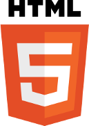

  

    In this chapter we are going to learn about HTML, the HyperText Markup Language. HTML is a markup language that web browsers use to interpret and compose text, images
    and other material into visual or audible web pages. Default characteristics for every item of HTML markup are defined in the browser.
  

  

    However, we can use CSS, Cascading Style Sheets rules, in order to style the HTML elements the way we want. In this chapter you will see a sample CSS file.
  

