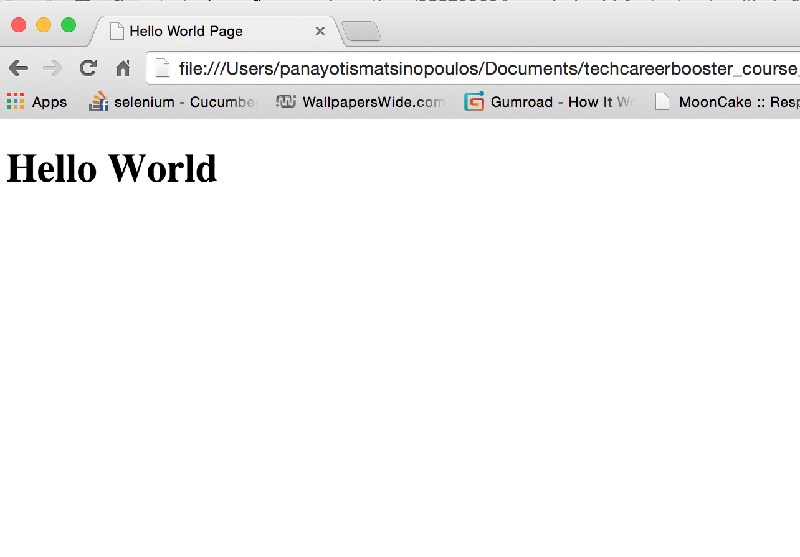

## ./images/Hello World Page

It has become a tradition in computer programming schools, when one is introduced to a new language, programming or not, 
to create a first artifact that would say hello to the world. 

> *Note:*
> You can read about this tradition [here](https://en.wikipedia.org/wiki/%22Hello,_World!%22_program)

So, let's write our first HTML page that will be displaying to the visitor, the phrase *Hello World*.

### Write the HTML code

Follow the instructions below to create your first HTML page:

1. Open the text editor<sup>[1](#texteditor)</sup>. Create a new file and save it with the name *hello-world.html*
2. Enter the following content:

> **Important:**
> Do not copy the content from this reading to your text editor. Type the content yourself. This is the only way you can
learn and become a good developer.
> Note that the filename extension needs to be `html`. This is how your operating system and your browser will recognize
this file as an HTML page.

``` html
<!DOCTYPE html>
<html>
  <head>
    <meta charset="utf-8">
    <title>./images/Hello World Page</title>
  </head>

  <body>
    <h1>Hello World</h1>
  </body>
</html>
```

### View your HTML page on your browser

Open your browser if it is not open. Select to open a file and browse to locate the file that you have just created
(*hello-world.html*). When you open it, the browser will read the code that you have written and will display that
as an HTML page. Something like the following:



**Congratulations!** You have just written your first HTML page and it has been successfully rendered by your browser. 

--------
<a name="texteditor">[1]</a>: Go back to the chapter about development environment to see what is the text editor
 that we have chosen to use to write simple text files. If you have any doubts contact your mentor.
<br/>
