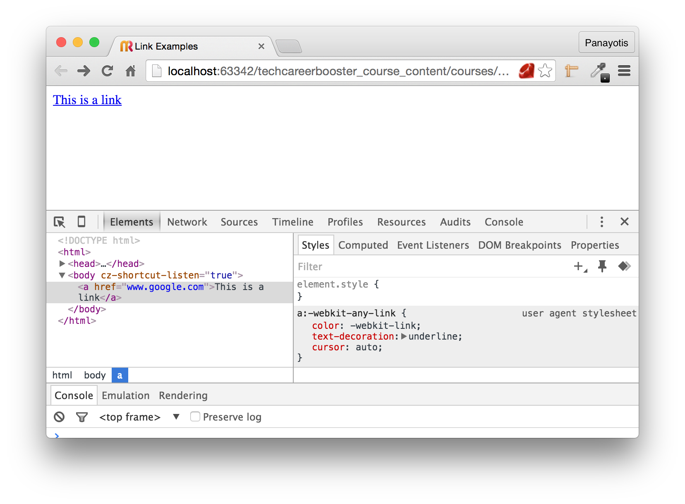
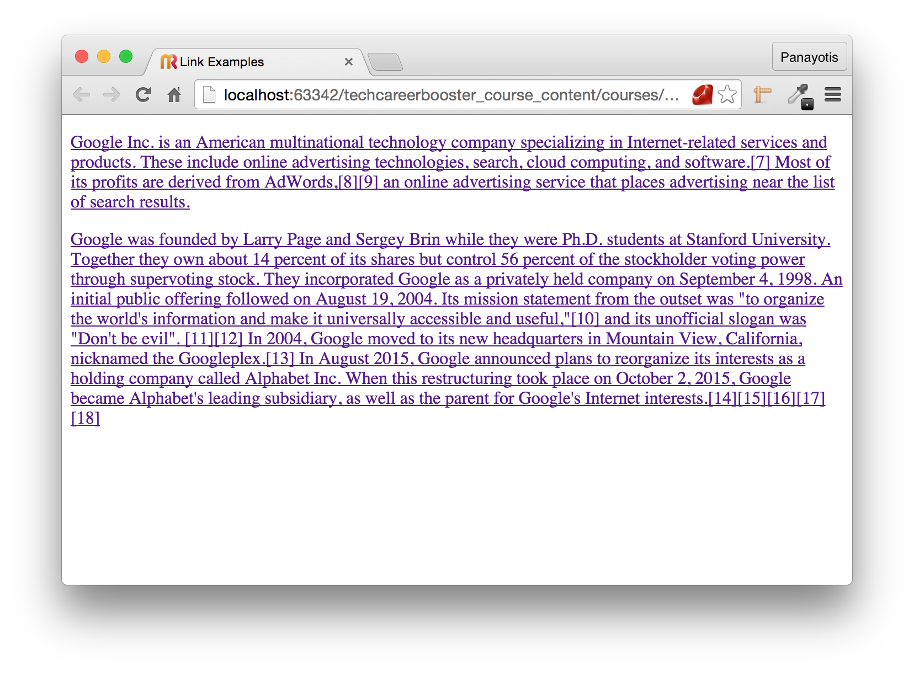
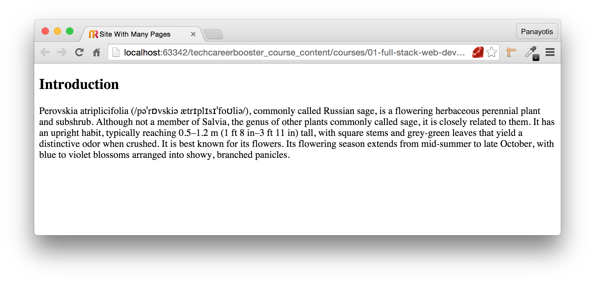
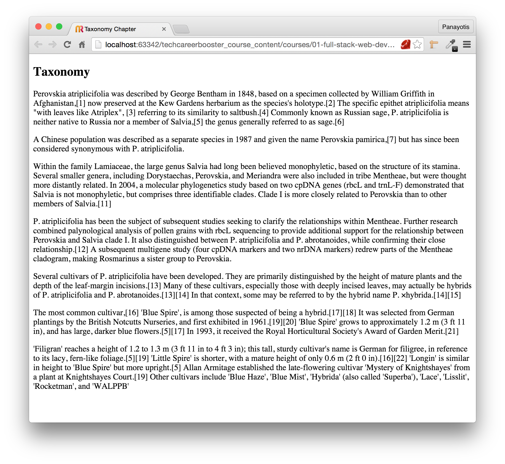
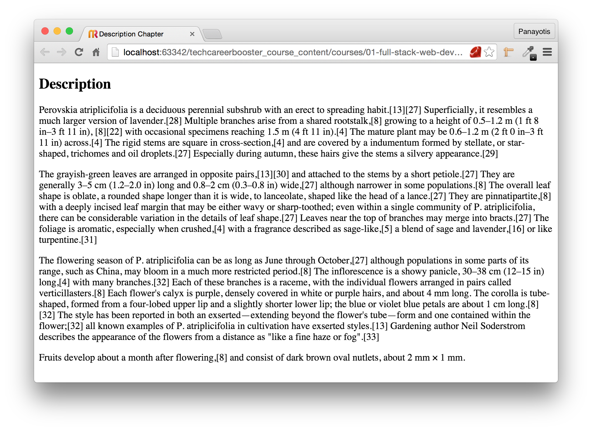
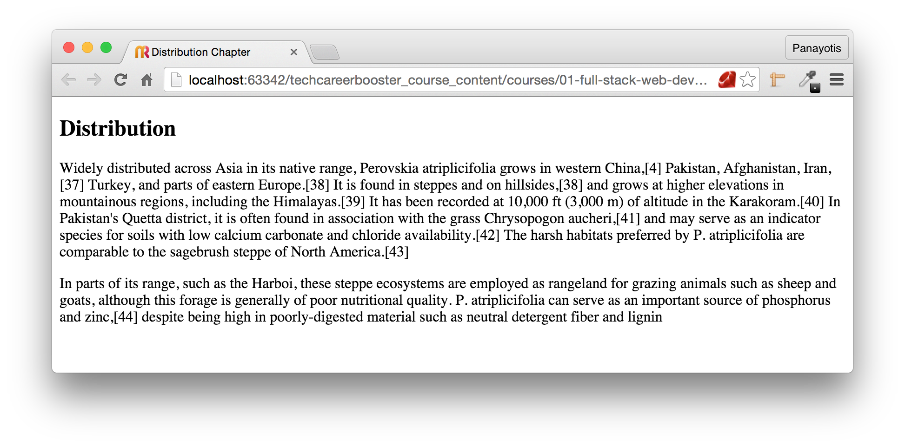
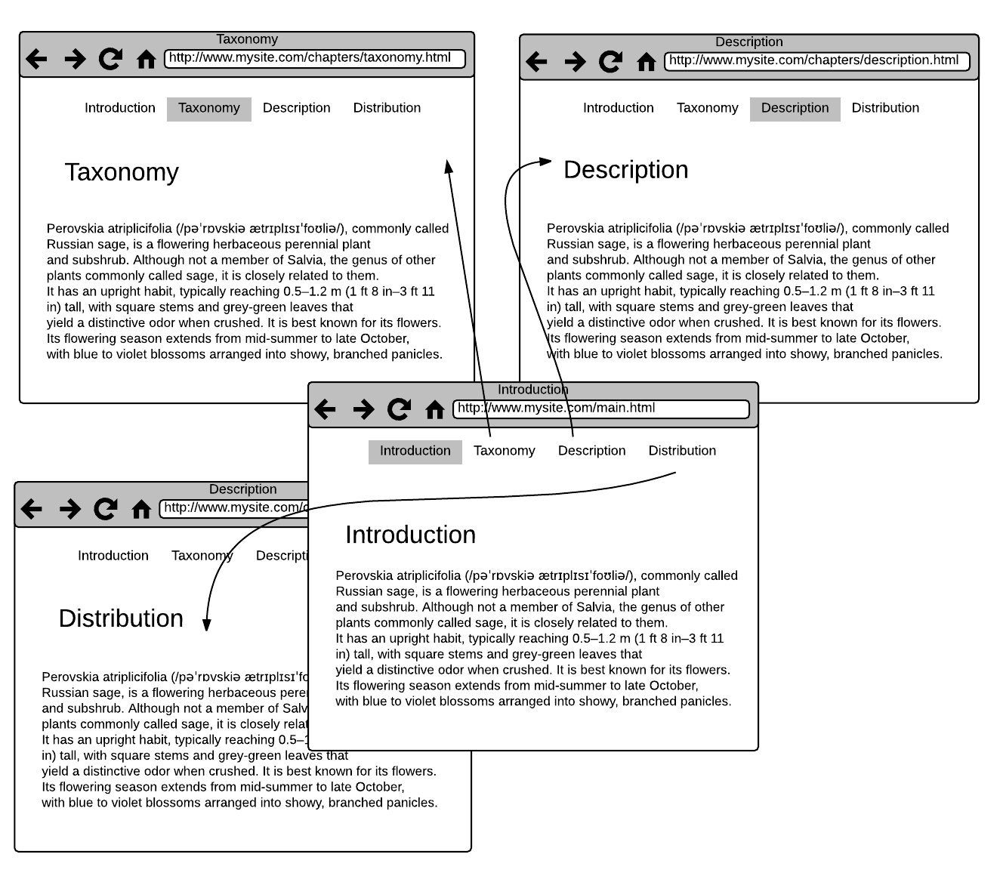
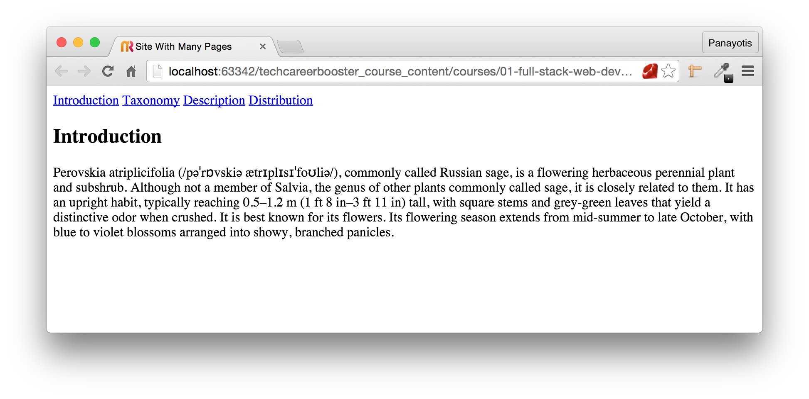

## HTML Links

We have gone through so many chapters, and still, we have not talked yet about HTML links, the tags that
give life to our pages and allow us to navigate from one page to the other, what browsing is all about.

### `<a>` tag

HTML links are created using the `<a>` (anchor) tag. Whatever we put inside the `<a>` element, as content,
becomes clickable. The mouse cursor changes shape, when we move the mouse pointer over the link, and browser
is ready to accept our left mouse button click, and travel us to the page that is the target link.

Let's start with a simple page that has an anchor element as follows:
``` html
<!DOCTYPE html>
<html>
  <head>
    <meta charset="utf-8">
    <title>Link Examples</title>
  </head>

  <body>

    <a>This is a link</a>

  </body>

</html>
```
If you save this HTML code and open the file using your browser, you will see the following page:


As you can see above, an anchor, `<a>`, without any further attribution, does not render its content as a link. If you move your mouse pointer
on top of the "This is a link" text, mouse pointer will not change shape, and if you click your left mouse button, nothing will happen.

In order to turn an anchor tag to a real link, you need to add the attribute `href` with value equal to the Web address of the page you want
the link to take reader to. Let's try to take reader to Google home page.

``` html
<!DOCTYPE html>
<html>
  <head>
    <meta charset="utf-8">
    <title>Link Examples</title>
  </head>

  <body>

    <a href="www.google.com">This is a link</a>

  </body>

</html>
```

We have added the attribute `href` with the value `www.google.com`, which is what you usually type in your browser's address when you want to visit
Google home page. Let's try that by saving and reloading the page:


Nice! Our browser, now understands that we have wrapped "This is a link" into a real anchor tag and underlines that. It also changes its color to blue.
You now understand that hyperlinks, the links that `<a>` tag creates, are styled by your browser using a default user agent stylesheet. You can see that
by inspecting the link with your developer tools.

Before we start dealing with the style of the links, let's try to click on the link that we have just created. If you do that, you will see the following:

Hmmmm. The anchor is wrong. Obviously. The reason is that proper anchor href values need to start with the *protocol* that needs the browser to use in order to
locate the target page and load it for presentation to the user.

### `http://` or `https://`

Two are the protocols that are most commonly used by a browser in order to fetch a page.

1. `http://`  for HyperText Transfer Protocol and
2. `https://` for HyperText Transfer Protocol Secure

The 2nd one is the secure version of the 1st one. Data exchanged between our browser and the server are encrypted and cannot be hacked.
It is absolutely important to use this protocol when sensitive personal data are submitted to a Web site or application. For example
a password or a credit card number. Originally, you could only see few `https` sites, but now, this protocol is becoming ubiquitous.

Hence, a proper Web address needs to specify the protocol that the browser should use in order to fetch the target page. Let's correct our HTML page above
to have `href` value that has the Google address including the protocol:
``` html
<!DOCTYPE html>
<html>
  <head>
    <meta charset="utf-8">
    <title>Link Examples</title>
  </head>

  <body>

    <a href="http://www.google.com">This is a link</a>

  </body>

</html>
```
If we reload this page, and then click on the link "This is a link", it will no longer fail. Instead, it will take you to the Google Web site.


> *Note:* Although you may have requested `http://`, lots of sites they turn the connection to be using `https://` instead, automatically.
They do that for security reasons.

### Anything a link

You can turn anything into a link. You only have to enclose it into an anchor element. Let's try the following page:
``` html
<!DOCTYPE html>
<html>
  <head>
    <meta charset="utf-8">
    <title>Link Examples</title>
  </head>

  <body>

    <a href="http://www.google.com">

      <p>
        Google Inc. is an American multinational technology company specializing in Internet-related services and products. These include online advertising
        technologies, search, cloud computing, and software.[7] Most of its profits are derived from AdWords,[8][9] an online advertising service
        that places advertising near the list of search results.
      </p>
      <p>
        Google was founded by Larry Page and Sergey Brin while they were Ph.D. students at Stanford University. Together they own about 14
        percent of its shares but control 56 percent of the stockholder voting power through supervoting stock. They incorporated Google as
        a privately held company on September 4, 1998. An initial public offering followed on August 19, 2004. Its mission statement from the
        outset was "to organize the world's information and make it universally accessible and useful,"[10] and its unofficial slogan was "Don't be evil".
        [11][12] In 2004, Google moved to its new headquarters in Mountain View, California, nicknamed the Googleplex.[13] In August 2015, Google
        announced plans to reorganize its interests as a holding company called Alphabet Inc. When this restructuring took place on October 2, 2015,
        Google became Alphabet's leading subsidiary, as well as the parent for Google's Internet interests.[14][15][16][17][18]
      </p>

    </a>

  </body>

</html>
```
If you read the above HTML code carefully, you will see that we have 2 `<p>` elements inside a single `<a>` element. If you load this on your browser,
you will see this:

Pretty clear. Browser has turned into links the content of both `<p>` elements. If you move your mouse pointer above this you will see
changing itself to a link pointer that you can click. If you do click, it will take you to the Google home page (since the href has the value
`http://www.google.com`).

### Styling the Anchor Links

Let's revert back to simpler HTML page like the following. Note that we also link to an external CSS file which is initially empty.
``` html
<!DOCTYPE html>
<html>
  <head>
    <meta charset="utf-8">
    <title>Link Examples</title>
    <link rel="stylesheet" href="stylesheets/content.css" type="text/css">
  </head>

  <body>

    <a href="http://www.google.com">

      Visit Google Home Page

    </a>

  </body>

</html>
```

When you have links, the browser tries to style them with some default colors, as follows:

* An unvisited link is underlined and blue.
* A visited link is underlined and purple.
* An active link is underlined and red.

> *Hint:* Do you know what an *active* link is. It is the link that you click on, but you do not release the mouse button. You keep it
pressed. Try and do that. It will change the color of the link to red.


What if you want to change the default color styling that browser is using for the links of your site? You can do that using CSS of course.

Let's try to change the visited links to be underlined green. Write the following CSS rule inside `stylesheets/content.css` file.
``` css
a:visited {
    color: green;
}
```
And reload your page. The result will be the following:

Now let's change both the visited and the unvisited links. We will change the CSS rules and we will also add a new link inside the HTML page,
so that we can display the unvisited links with a new color. Here is the CSS file:
``` css
body {
    font-size: 24px;
}

a:link {
    color: #702309;
}

a:visited {
    color: green;
}

a:active {
    color: darkorange;
}
```
and here is the new HTML source code:
``` html
<!DOCTYPE html>
<html>
  <head>
    <meta charset="utf-8">
    <title>Link Examples</title>
    <link rel="stylesheet" href="stylesheets/content.css" type="text/css">
  </head>

  <body>

    <a href="http://www.google.com">
      Visit Google Home Page
    </a>

    <br/>

    <a href="http://www.nationalgeographic.com">
      Visit National Geographic
    </a>

  </body>

</html>
```
Save both files and reload the page. The result will be the following:


And if you try to visit one link and hold the mouse on top of the link without releasing, you will turn the link to active, with color `darkorange`. See this here:


Sometimes, we want to change the color of the link when the mouse pointer is on top of the link but without actually clicking on the link. This is the
*hover* state. We can change the style of the link in this particular case, with the selector `a:hover`.

Let's change the style of the link while we hover with the mouse over it, as follows:

1. color to be white.
2. background color to be maroon.

In order to do that, the CSS file should be:
``` css
body {
    font-size: 24px;
}

a:link {
    color: #702309;
}

a:visited {
    color: green;
}

a:active {
    color: darkorange;
}

a:hover {
    color: white;
    background-color: maroon;
}
```
Do you see the last rule with `a:hover`? This is it. The CSS selector that is used to specify the hover state of a link.

If you reload your page with the CSS styling rules, and then move the mouse over one of the links, you will see the following:


In order to summarize the anchor styling, this table here gives an overview of the CSS selectors that one can use in order to change default colors of the links:

<table>
  <tr><th>State</th><th>Selector</th></tr>
  <tr><td>Unvisited</td><td>a:link</td></tr>
  <tr><td>Visited</td><td>a:visited</td></tr>
  <tr><td>Active</td><td>a:active</td></tr>
  <tr><td>Mouse Over/Hover</td><td>a:hover</td></tr>
</table>

> **Important**: If you want to style links irrespective of their state you select them with the tag name selector `a`. And
this is the difference between selecting links with `a` vs `a:link`. The `a:link` is used to style unvisited links. Whereas
`a` selects all links irrespective of their state.

### Style links as buttons

How can we style links like buttons? For example, how can we achieve the following effect?

If we carefully see the above picture we can identify the following:

1. The links to have a background color. Let's say that it is: `lightblue`: <span style="background-color:lightblue;">&nbsp;&nbsp;&nbsp;&nbsp;&nbsp;</span>
2. The links to have text color `white`
3. There is some free space around the content/text of the links. This is the padding. And as we see, the top and bottom padding is a
little bit smaller than the left and right padding. Let's assume `5px` for the top and bottom and `10px` for the left and right padding.
4. The unvisited and visited links still have text color being `white`.
5. The active links have a dark background color: `darkblue`: <span style="background-color:darkblue;">&nbsp;&nbsp;&nbsp;&nbsp;&nbsp;</span>
6. When the mouse goes over a link, the background color is changing to another shade of blue, not very dark. This can be `#4682B4`: <span style="background-color:#4682B4;">&nbsp;&nbsp;&nbsp;&nbsp;&nbsp;</span>
7. The text inside the links is not underlined.

In order to satisfy all these rules we are using the following CSS file:
``` css
body {
    font-size: 24px;
}

/* Style for all the links irrespective of their state */
a {
    background-color: Lightblue;
    color: white;
    padding: 5px 10px; /* this will create the space around the link text and edges of the link */
}

a:link,
a:visited {
    color: white;
    text-decoration: none; /* this will remove any decoration from the link text, like the underline style */
}

a:active {
    background-color: darkblue;
}

a:hover {
    background-color: #4682B4;
}
```
Save the above CSS file and reload your page. Do you see the links styled as required? Try to move your mouse over a link.
Does it change background color? Try to click on a link and hold your button down and move your mouse a little bit outside the
area of the link without releasing. Does it change background color to darkblue?

### Side Note - CSS comments

We would like to draw your attention on CSS comments. The previous piece of CSS code, above, uses comments
to explain the content of the CSS rules. Example:
``` css
/* Style for all the links irrespective of their state */
```

The comments are not parsed by the browser as CSS rules. They are completely ignored. But they are useful to the reader and
to the author of the rules. They function like documentation of the code.

CSS comments start with `/*` and finish with `*/`. Whatever you put in between will be considered non-CSS rule content and will
be ignored. (like the `<!--` and `-->` delimiters for HTML comments).

### Links within the same page - Bookmarks

We have learned how to create a link to another Web page. But, what if we want to link to a position of the same document.

Let's suppose that we have the following HTML page:
``` html
<!DOCTYPE html>
<html>
  <head>
    <meta charset="utf-8">
    <title>Links Within the Same Page</title>
  </head>

  <body>

    <div id="introduction">

      <h2>Introduction</h2>

      <p>
        Perovskia atriplicifolia (/pəˈrɒvskiə ætrɪplɪsɪˈfoʊliə/), commonly called Russian sage, is a flowering herbaceous perennial plant
        and subshrub. Although not a member of Salvia, the genus of other plants commonly called sage, it is closely related to them.
        It has an upright habit, typically reaching 0.5–1.2 m (1 ft 8 in–3 ft 11 in) tall, with square stems and grey-green leaves that
        yield a distinctive odor when crushed. It is best known for its flowers. Its flowering season extends from mid-summer to late October,
        with blue to violet blossoms arranged into showy, branched panicles.
      </p>

      <p>
        Native to the steppes and hills of southwestern and central Asia, it was introduced to cultivation by Vasily
        Perovsky in the 19th century. Successful over a wide range of climate and soil conditions, it has since become popular
        and widely planted. Several cultivars have been developed, differing primarily in leaf shape and overall height;
        'Blue Spire' is the most common. This variation has been widely used in gardens and landscaping. P. atriplicifolia was
        the Perennial Plant Association's 1995 Plant of the Year, and the 'Blue Spire' cultivar received the Award of Garden Merit
        from the Royal Horticultural Society.
      </p>

      <p>
        The species has a long history of use in traditional medicine in its native range, where it is employed as a treatment
        for a variety of ailments. This has led to the investigation of its phytochemistry. Its flowers can be eaten in salads or
        crushed for dyemaking, and the plant has been considered for potential use in the phytoremediation of contaminated soil.
      </p>

    </div>

    <div id="taxonomy">
      <h2>Taxonomy</h2>

      <p>
       Perovskia atriplicifolia was described by George Bentham in 1848, based on a specimen collected by William Griffith in Afghanistan,[1]
        now preserved at the Kew Gardens herbarium as the species's holotype.[2] The specific epithet atriplicifolia means "with leaves like Atriplex",
        [3] referring to its similarity to saltbush.[4] Commonly known as Russian sage, P. atriplicifolia is neither native to Russia nor a member of
        Salvia,[5] the genus generally referred to as sage.[6]
      </p>

      <p>
       A Chinese population was described as a separate species in 1987 and given the name Perovskia pamirica,[7] but has since been considered
       synonymous with P. atriplicifolia.
      </p>

      <p>
        Within the family Lamiaceae, the large genus Salvia had long been believed monophyletic, based on the structure of its stamina.
        Several smaller genera, including Dorystaechas, Perovskia, and Meriandra were also included in tribe Mentheae, but were thought
        more distantly related. In 2004, a molecular phylogenetics study based on two cpDNA genes (rbcL and trnL-F) demonstrated that
        Salvia is not monophyletic, but comprises three identifiable clades. Clade I is more closely related to Perovskia than to other
        members of Salvia.[11]
      </p>

      <p>
        P. atriplicifolia has been the subject of subsequent studies seeking to clarify the relationships within Mentheae. Further research
        combined palynological analysis of pollen grains with rbcL sequencing to provide additional support for the relationship between
        Perovskia and Salvia clade I. It also distinguished between P. atriplicifolia and P. abrotanoides, while confirming their close
        relationship.[12] A subsequent multigene study (four cpDNA markers and two nrDNA markers) redrew parts of the Mentheae cladogram,
        making Rosmarinus a sister group to Perovskia.
      </p>

      <p>
        Several cultivars of P. atriplicifolia have been developed. They are primarily distinguished by the height of mature plants and the depth
        of the leaf-margin incisions.[13] Many of these cultivars, especially those with deeply incised leaves, may actually be hybrids of P.
        atriplicifolia and P. abrotanoides.[13][14] In that context, some may be referred to by the hybrid name P. ×hybrida.[14][15]
      </p>

      <p>
        The most common cultivar,[16] 'Blue Spire', is among those suspected of being a hybrid.[17][18] It was selected from German plantings
        by the British Notcutts Nurseries, and first exhibited in 1961.[19][20] 'Blue Spire' grows to approximately 1.2 m (3 ft 11 in), and
        has large, darker blue flowers.[5][17] In 1993, it received the Royal Horticultural Society's Award of Garden Merit.[21]
      </p>

      <p>
        'Filigran' reaches a height of 1.2 to 1.3 m (3 ft 11 in to 4 ft 3 in); this tall, sturdy cultivar's name is German for filigree,
        in reference to its lacy, fern-like foliage.[5][19] 'Little Spire' is shorter, with a mature height of only 0.6 m (2 ft 0 in).[16][22]
        'Longin' is similar in height to 'Blue Spire' but more upright.[5] Allan Armitage established the late-flowering cultivar 'Mystery of
        Knightshayes' from a plant at Knightshayes Court.[19] Other cultivars include 'Blue Haze', 'Blue Mist', 'Hybrida' (also called 'Superba'),
        'Lace', 'Lisslit', 'Rocketman', and 'WALPPB'
      </p>
    </div>

    <div id="description">
      <h2>Description</h2>

      <p>
        Perovskia atriplicifolia is a deciduous perennial subshrub with an erect to spreading habit.[13][27] Superficially, it resembles a much
        larger version of lavender.[28] Multiple branches arise from a shared rootstalk,[8] growing to a height of 0.5–1.2 m (1 ft 8 in–3 ft 11 in),
        [8][22] with occasional specimens reaching 1.5 m (4 ft 11 in).[4] The mature plant may be 0.6–1.2 m (2 ft 0 in–3 ft 11 in) across.[4]
        The rigid stems are square in cross-section,[4] and are covered by a indumentum formed by stellate, or star-shaped, trichomes and oil droplets.[27]
        Especially during autumn, these hairs give the stems a silvery appearance.[29]
      </p>

      <p>
        The grayish-green leaves are arranged in opposite pairs,[13][30] and attached to the stems by a short petiole.[27] They are generally 3–5 cm
        (1.2–2.0 in) long and 0.8–2 cm (0.3–0.8 in) wide,[27] although narrower in some populations.[8] The overall leaf shape is oblate, a rounded
        shape longer than it is wide, to lanceolate, shaped like the head of a lance.[27] They are pinnatipartite,[8] with a deeply incised
        leaf margin that may be either wavy or sharp-toothed; even within a single community of P. atriplicifolia, there can be considerable
        variation in the details of leaf shape.[27] Leaves near the top of branches may merge into bracts.[27] The foliage is aromatic,
        especially when crushed,[4] with a fragrance described as sage-like,[5] a blend of sage and lavender,[16] or like turpentine.[31]
      </p>

      <p>
        The flowering season of P. atriplicifolia can be as long as June through October,[27] although populations in some parts of its range,
        such as China, may bloom in a much more restricted period.[8] The inflorescence is a showy panicle, 30–38 cm (12–15 in) long,[4] with
        many branches.[32] Each of these branches is a raceme, with the individual flowers arranged in pairs called verticillasters.[8] Each
        flower's calyx is purple, densely covered in white or purple hairs, and about 4 mm long. The corolla is tube-shaped, formed from a
        four-lobed upper lip and a slightly shorter lower lip; the blue or violet blue petals are about 1 cm long.[8][32] The style has been
        reported in both an exserted—extending beyond the flower's tube—form and one contained within the flower;[32] all known examples of P.
        atriplicifolia in cultivation have exserted styles.[13] Gardening author Neil Soderstrom describes the appearance of the flowers from a
        distance as "like a fine haze or fog".[33]
      </p>
      <p>
        Fruits develop about a month after flowering,[8] and consist of dark brown oval nutlets, about 2 mm × 1 mm.
      </p>
    </div>

    <div id="distribution">
      <h2>Distribution</h2>

      <p>
        Widely distributed across Asia in its native range, Perovskia atriplicifolia grows in western China,[4] Pakistan, Afghanistan, Iran,[37]
        Turkey, and parts of eastern Europe.[38] It is found in steppes and on hillsides,[38] and grows at higher elevations in mountainous regions,
        including the Himalayas.[39] It has been recorded at 10,000 ft (3,000 m) of altitude in the Karakoram.[40] In Pakistan's Quetta district,
        it is often found in association with the grass Chrysopogon aucheri,[41] and may serve as an indicator species for soils with low calcium
        carbonate and chloride availability.[42] The harsh habitats preferred by P. atriplicifolia are comparable to the sagebrush steppe of North America.[43]
      </p>

      <p>
        In parts of its range, such as the Harboi, these steppe ecosystems are employed as rangeland for grazing animals such as sheep and goats, although
        this forage is generally of poor nutritional quality. P. atriplicifolia can serve as an important source of phosphorus and zinc,[44] despite being
        high in poorly-digested material such as neutral detergent fiber and lignin
      </p>
    </div>


  </body>

</html>
```
If we load this page on our browser, we will see that it is a long page:

<div id="media-title-Long Page Scrolling">Long Page Scrolling</div>
<a href="https://player.vimeo.com/video/197483196"></a>

What if we wanted to build a table of contents at the beginning, that would help the user navigate within the page? Also, we would like
to allow the user to move back to the top of the page, while being at the end of each section.

<div id="media-title-Table Of Contents And Move Back to The Top">Table Of Contents And Move Back to The Top</div>
<a href="https://player.vimeo.com/video/193997275"></a>

This is the top of the page:


In order to do that, i.e. in order to create links that target points within the same page:

1. the target points need to be HTML elements of your page with an id attribute. This is called a *bookmark*.
2. each link inside the table of contents need to have an `href` attribute that will target the corresponding HTML element by id. The value of an `href` attribute
that points to another element on the same page starts with the `#` symbol.

> **Hint:** Do you remember that the CSS selector to select an element by id uses the same `#` symbol, in order to refer to the id of the element that needs to be selected?

So, the HTML fragment that corresponds to the table of contents on our example page should be:

``` html
<div id="table-of-contents">
  <a href="#introduction">Introduction</a><br/>
  <a href="#taxonomy">Taxonomy</a><br/>
  <a href="#description">Description</a><br/>
  <a href="#distribution">Distribution</a>
</div>
```
Do you see the `href` values of the links above? They have a reference that starts with the `#` symbol. The reference is the id of the corresponding HTML section.

Also, if we want to return back to the top, we can introduce, at the bottom of each section, links like the following:

``` html
<a href="#table-of-contents">Back to Top</a>
```
This link, when clicked, will jump the reading position back at the top, where the table of contents HTML element is defined.

The final HTML page code is this one:

``` html
<!DOCTYPE html>
<html>
  <head>
    <meta charset="utf-8">
    <title>Links Within the Same Page</title>
  </head>

  <body>
    <div id="table-of-contents">
      <a href="#introduction">Introduction</a><br/>
      <a href="#taxonomy">Taxonomy</a><br/>
      <a href="#description">Description</a><br/>
      <a href="#distribution">Distribution</a>
    </div>

    <div id="introduction">

      <h2>Introduction</h2>

      <p>
        Perovskia atriplicifolia (/pəˈrɒvskiə ætrɪplɪsɪˈfoʊliə/), commonly called Russian sage, is a flowering herbaceous perennial plant
        and subshrub. Although not a member of Salvia, the genus of other plants commonly called sage, it is closely related to them.
        It has an upright habit, typically reaching 0.5–1.2 m (1 ft 8 in–3 ft 11 in) tall, with square stems and grey-green leaves that
        yield a distinctive odor when crushed. It is best known for its flowers. Its flowering season extends from mid-summer to late October,
        with blue to violet blossoms arranged into showy, branched panicles.
      </p>

      <p>
        Native to the steppes and hills of southwestern and central Asia, it was introduced to cultivation by Vasily
        Perovsky in the 19th century. Successful over a wide range of climate and soil conditions, it has since become popular
        and widely planted. Several cultivars have been developed, differing primarily in leaf shape and overall height;
        'Blue Spire' is the most common. This variation has been widely used in gardens and landscaping. P. atriplicifolia was
        the Perennial Plant Association's 1995 Plant of the Year, and the 'Blue Spire' cultivar received the Award of Garden Merit
        from the Royal Horticultural Society.
      </p>

      <p>
        The species has a long history of use in traditional medicine in its native range, where it is employed as a treatment
        for a variety of ailments. This has led to the investigation of its phytochemistry. Its flowers can be eaten in salads or
        crushed for dyemaking, and the plant has been considered for potential use in the phytoremediation of contaminated soil.
      </p>

      <a href="#table-of-contents">Back To Top</a>
    </div>

    <div id="taxonomy">
      <h2>Taxonomy</h2>

      <p>
       Perovskia atriplicifolia was described by George Bentham in 1848, based on a specimen collected by William Griffith in Afghanistan,[1]
        now preserved at the Kew Gardens herbarium as the species's holotype.[2] The specific epithet atriplicifolia means "with leaves like Atriplex",
        [3] referring to its similarity to saltbush.[4] Commonly known as Russian sage, P. atriplicifolia is neither native to Russia nor a member of
        Salvia,[5] the genus generally referred to as sage.[6]
      </p>

      <p>
       A Chinese population was described as a separate species in 1987 and given the name Perovskia pamirica,[7] but has since been considered
       synonymous with P. atriplicifolia.
      </p>

      <p>
        Within the family Lamiaceae, the large genus Salvia had long been believed monophyletic, based on the structure of its stamina.
        Several smaller genera, including Dorystaechas, Perovskia, and Meriandra were also included in tribe Mentheae, but were thought
        more distantly related. In 2004, a molecular phylogenetics study based on two cpDNA genes (rbcL and trnL-F) demonstrated that
        Salvia is not monophyletic, but comprises three identifiable clades. Clade I is more closely related to Perovskia than to other
        members of Salvia.[11]
      </p>

      <p>
        P. atriplicifolia has been the subject of subsequent studies seeking to clarify the relationships within Mentheae. Further research
        combined palynological analysis of pollen grains with rbcL sequencing to provide additional support for the relationship between
        Perovskia and Salvia clade I. It also distinguished between P. atriplicifolia and P. abrotanoides, while confirming their close
        relationship.[12] A subsequent multigene study (four cpDNA markers and two nrDNA markers) redrew parts of the Mentheae cladogram,
        making Rosmarinus a sister group to Perovskia.
      </p>

      <p>
        Several cultivars of P. atriplicifolia have been developed. They are primarily distinguished by the height of mature plants and the depth
        of the leaf-margin incisions.[13] Many of these cultivars, especially those with deeply incised leaves, may actually be hybrids of P.
        atriplicifolia and P. abrotanoides.[13][14] In that context, some may be referred to by the hybrid name P. ×hybrida.[14][15]
      </p>

      <p>
        The most common cultivar,[16] 'Blue Spire', is among those suspected of being a hybrid.[17][18] It was selected from German plantings
        by the British Notcutts Nurseries, and first exhibited in 1961.[19][20] 'Blue Spire' grows to approximately 1.2 m (3 ft 11 in), and
        has large, darker blue flowers.[5][17] In 1993, it received the Royal Horticultural Society's Award of Garden Merit.[21]
      </p>

      <p>
        'Filigran' reaches a height of 1.2 to 1.3 m (3 ft 11 in to 4 ft 3 in); this tall, sturdy cultivar's name is German for filigree,
        in reference to its lacy, fern-like foliage.[5][19] 'Little Spire' is shorter, with a mature height of only 0.6 m (2 ft 0 in).[16][22]
        'Longin' is similar in height to 'Blue Spire' but more upright.[5] Allan Armitage established the late-flowering cultivar 'Mystery of
        Knightshayes' from a plant at Knightshayes Court.[19] Other cultivars include 'Blue Haze', 'Blue Mist', 'Hybrida' (also called 'Superba'),
        'Lace', 'Lisslit', 'Rocketman', and 'WALPPB'
      </p>

      <a href="#table-of-contents">Back To Top</a>
    </div>

    <div id="description">
      <h2>Description</h2>

      <p>
        Perovskia atriplicifolia is a deciduous perennial subshrub with an erect to spreading habit.[13][27] Superficially, it resembles a much
        larger version of lavender.[28] Multiple branches arise from a shared rootstalk,[8] growing to a height of 0.5–1.2 m (1 ft 8 in–3 ft 11 in),
        [8][22] with occasional specimens reaching 1.5 m (4 ft 11 in).[4] The mature plant may be 0.6–1.2 m (2 ft 0 in–3 ft 11 in) across.[4]
        The rigid stems are square in cross-section,[4] and are covered by a indumentum formed by stellate, or star-shaped, trichomes and oil droplets.[27]
        Especially during autumn, these hairs give the stems a silvery appearance.[29]
      </p>

      <p>
        The grayish-green leaves are arranged in opposite pairs,[13][30] and attached to the stems by a short petiole.[27] They are generally 3–5 cm
        (1.2–2.0 in) long and 0.8–2 cm (0.3–0.8 in) wide,[27] although narrower in some populations.[8] The overall leaf shape is oblate, a rounded
        shape longer than it is wide, to lanceolate, shaped like the head of a lance.[27] They are pinnatipartite,[8] with a deeply incised
        leaf margin that may be either wavy or sharp-toothed; even within a single community of P. atriplicifolia, there can be considerable
        variation in the details of leaf shape.[27] Leaves near the top of branches may merge into bracts.[27] The foliage is aromatic,
        especially when crushed,[4] with a fragrance described as sage-like,[5] a blend of sage and lavender,[16] or like turpentine.[31]
      </p>

      <p>
        The flowering season of P. atriplicifolia can be as long as June through October,[27] although populations in some parts of its range,
        such as China, may bloom in a much more restricted period.[8] The inflorescence is a showy panicle, 30–38 cm (12–15 in) long,[4] with
        many branches.[32] Each of these branches is a raceme, with the individual flowers arranged in pairs called verticillasters.[8] Each
        flower's calyx is purple, densely covered in white or purple hairs, and about 4 mm long. The corolla is tube-shaped, formed from a
        four-lobed upper lip and a slightly shorter lower lip; the blue or violet blue petals are about 1 cm long.[8][32] The style has been
        reported in both an exserted—extending beyond the flower's tube—form and one contained within the flower;[32] all known examples of P.
        atriplicifolia in cultivation have exserted styles.[13] Gardening author Neil Soderstrom describes the appearance of the flowers from a
        distance as "like a fine haze or fog".[33]
      </p>
      <p>
        Fruits develop about a month after flowering,[8] and consist of dark brown oval nutlets, about 2 mm × 1 mm.
      </p>

      <a href="#table-of-contents">Back To Top</a>
    </div>

    <div id="distribution">
      <h2>Distribution</h2>

      <p>
        Widely distributed across Asia in its native range, Perovskia atriplicifolia grows in western China,[4] Pakistan, Afghanistan, Iran,[37]
        Turkey, and parts of eastern Europe.[38] It is found in steppes and on hillsides,[38] and grows at higher elevations in mountainous regions,
        including the Himalayas.[39] It has been recorded at 10,000 ft (3,000 m) of altitude in the Karakoram.[40] In Pakistan's Quetta district,
        it is often found in association with the grass Chrysopogon aucheri,[41] and may serve as an indicator species for soils with low calcium
        carbonate and chloride availability.[42] The harsh habitats preferred by P. atriplicifolia are comparable to the sagebrush steppe of North America.[43]
      </p>

      <p>
        In parts of its range, such as the Harboi, these steppe ecosystems are employed as rangeland for grazing animals such as sheep and goats, although
        this forage is generally of poor nutritional quality. P. atriplicifolia can serve as an important source of phosphorus and zinc,[44] despite being
        high in poorly-digested material such as neutral detergent fiber and lignin
      </p>

      <a href="#table-of-contents">Back To Top</a>
    </div>


  </body>

</html>
```

### Links to Other Pages within Same Site

So far, we have seen

1. Links to external pages, i.e. pages that exist on other sites. Like the `<a href="http://www.google.com/">Visit Google Site</a>`.
2. Links within the same page, like `<a href="#introduction">Introduction</a>`.

We can have links within the same site but different page. Let's see an example in order to explain that. Note that this example
is going to have 4 pages, a.k.a. our site is going to have 4 pages, 4 HTML files:

1. main.html
2. taxonomy.html
3. description.html
4. distribution.html

The `main.html` file will have the *Introduction* section.

The `taxonomy.html` file will have the *Taxonomy* section.

The `description.html` file will have the *Description* section.

The `distribution.html` file will have the *Distribution* section.

Not only that, we will organize the last 3 pages (taxonomy, description and distribution) into their own folder, named "chapters".

Let's start with the main page, the content of which can be the following:
``` html
<!DOCTYPE html>
<html>
  <head>
    <meta charset="utf-8">
    <title>Site With Many Pages</title>
  </head>

  <body>

    <div id="introduction">

      <h2>Introduction</h2>

      <p>
        Perovskia atriplicifolia (/pəˈrɒvskiə ætrɪplɪsɪˈfoʊliə/), commonly called Russian sage, is a flowering herbaceous perennial plant
        and subshrub. Although not a member of Salvia, the genus of other plants commonly called sage, it is closely related to them.
        It has an upright habit, typically reaching 0.5–1.2 m (1 ft 8 in–3 ft 11 in) tall, with square stems and grey-green leaves that
        yield a distinctive odor when crushed. It is best known for its flowers. Its flowering season extends from mid-summer to late October,
        with blue to violet blossoms arranged into showy, branched panicles.
      </p>

    </div>

  </body>
</html>
```
Note that we have not yet created the part that will allow us to go to other pages. Save this file with the name "main.html".

Now. Go ahead and create the first chapter page, the "taxonomy.html". Save the following content inside the folder "chapters/taxonomy.html".
``` html
<!DOCTYPE html>
<html>
  <head>
    <meta charset="utf-8">
    <title>Taxonomy Chapter</title>
  </head>

  <body>

    <div id="taxonomy">
      <h2>Taxonomy</h2>

      <p>
        Perovskia atriplicifolia was described by George Bentham in 1848, based on a specimen collected by William Griffith in Afghanistan,[1]
        now preserved at the Kew Gardens herbarium as the species's holotype.[2] The specific epithet atriplicifolia means "with leaves like Atriplex",
        [3] referring to its similarity to saltbush.[4] Commonly known as Russian sage, P. atriplicifolia is neither native to Russia nor a member of
        Salvia,[5] the genus generally referred to as sage.[6]
      </p>

      <p>
        A Chinese population was described as a separate species in 1987 and given the name Perovskia pamirica,[7] but has since been considered
        synonymous with P. atriplicifolia.
      </p>

      <p>
        Within the family Lamiaceae, the large genus Salvia had long been believed monophyletic, based on the structure of its stamina.
        Several smaller genera, including Dorystaechas, Perovskia, and Meriandra were also included in tribe Mentheae, but were thought
        more distantly related. In 2004, a molecular phylogenetics study based on two cpDNA genes (rbcL and trnL-F) demonstrated that
        Salvia is not monophyletic, but comprises three identifiable clades. Clade I is more closely related to Perovskia than to other
        members of Salvia.[11]
      </p>

      <p>
        P. atriplicifolia has been the subject of subsequent studies seeking to clarify the relationships within Mentheae. Further research
        combined palynological analysis of pollen grains with rbcL sequencing to provide additional support for the relationship between
        Perovskia and Salvia clade I. It also distinguished between P. atriplicifolia and P. abrotanoides, while confirming their close
        relationship.[12] A subsequent multigene study (four cpDNA markers and two nrDNA markers) redrew parts of the Mentheae cladogram,
        making Rosmarinus a sister group to Perovskia.
      </p>

      <p>
        Several cultivars of P. atriplicifolia have been developed. They are primarily distinguished by the height of mature plants and the depth
        of the leaf-margin incisions.[13] Many of these cultivars, especially those with deeply incised leaves, may actually be hybrids of P.
        atriplicifolia and P. abrotanoides.[13][14] In that context, some may be referred to by the hybrid name P. ×hybrida.[14][15]
      </p>

      <p>
        The most common cultivar,[16] 'Blue Spire', is among those suspected of being a hybrid.[17][18] It was selected from German plantings
        by the British Notcutts Nurseries, and first exhibited in 1961.[19][20] 'Blue Spire' grows to approximately 1.2 m (3 ft 11 in), and
        has large, darker blue flowers.[5][17] In 1993, it received the Royal Horticultural Society's Award of Garden Merit.[21]
      </p>

      <p>
        'Filigran' reaches a height of 1.2 to 1.3 m (3 ft 11 in to 4 ft 3 in); this tall, sturdy cultivar's name is German for filigree,
        in reference to its lacy, fern-like foliage.[5][19] 'Little Spire' is shorter, with a mature height of only 0.6 m (2 ft 0 in).[16][22]
        'Longin' is similar in height to 'Blue Spire' but more upright.[5] Allan Armitage established the late-flowering cultivar 'Mystery of
        Knightshayes' from a plant at Knightshayes Court.[19] Other cultivars include 'Blue Haze', 'Blue Mist', 'Hybrida' (also called 'Superba'),
        'Lace', 'Lisslit', 'Rocketman', and 'WALPPB'
      </p>

    </div>

 </body>

</html>
```

Note that we have not put, yet, any links to navigate to other pages.

Similar to the taxonomy chapter page, create the following page and save it inside the file `chapters/description.html`
``` html
<!DOCTYPE html>
<html>
  <head>
    <meta charset="utf-8">
    <title>Description Chapter</title>
  </head>

  <body>

    <div id="description">
      <h2>Description</h2>

      <p>
        Perovskia atriplicifolia is a deciduous perennial subshrub with an erect to spreading habit.[13][27] Superficially, it resembles a much
        larger version of lavender.[28] Multiple branches arise from a shared rootstalk,[8] growing to a height of 0.5–1.2 m (1 ft 8 in–3 ft 11 in),
        [8][22] with occasional specimens reaching 1.5 m (4 ft 11 in).[4] The mature plant may be 0.6–1.2 m (2 ft 0 in–3 ft 11 in) across.[4]
        The rigid stems are square in cross-section,[4] and are covered by a indumentum formed by stellate, or star-shaped, trichomes and oil droplets.[27]
        Especially during autumn, these hairs give the stems a silvery appearance.[29]
      </p>

      <p>
        The grayish-green leaves are arranged in opposite pairs,[13][30] and attached to the stems by a short petiole.[27] They are generally 3–5 cm
        (1.2–2.0 in) long and 0.8–2 cm (0.3–0.8 in) wide,[27] although narrower in some populations.[8] The overall leaf shape is oblate, a rounded
        shape longer than it is wide, to lanceolate, shaped like the head of a lance.[27] They are pinnatipartite,[8] with a deeply incised
        leaf margin that may be either wavy or sharp-toothed; even within a single community of P. atriplicifolia, there can be considerable
        variation in the details of leaf shape.[27] Leaves near the top of branches may merge into bracts.[27] The foliage is aromatic,
        especially when crushed,[4] with a fragrance described as sage-like,[5] a blend of sage and lavender,[16] or like turpentine.[31]
      </p>

      <p>
        The flowering season of P. atriplicifolia can be as long as June through October,[27] although populations in some parts of its range,
        such as China, may bloom in a much more restricted period.[8] The inflorescence is a showy panicle, 30–38 cm (12–15 in) long,[4] with
        many branches.[32] Each of these branches is a raceme, with the individual flowers arranged in pairs called verticillasters.[8] Each
        flower's calyx is purple, densely covered in white or purple hairs, and about 4 mm long. The corolla is tube-shaped, formed from a
        four-lobed upper lip and a slightly shorter lower lip; the blue or violet blue petals are about 1 cm long.[8][32] The style has been
        reported in both an exserted—extending beyond the flower's tube—form and one contained within the flower;[32] all known examples of P.
        atriplicifolia in cultivation have exserted styles.[13] Gardening author Neil Soderstrom describes the appearance of the flowers from a
        distance as "like a fine haze or fog".[33]
      </p>
      <p>
        Fruits develop about a month after flowering,[8] and consist of dark brown oval nutlets, about 2 mm × 1 mm.
      </p>

    </div>

  </body>

</html>
```
Like before, we have not put yet any links to navigate to other pages.

Finally, we create the file `chapters/distribution.html` with the following content:
``` html
<!DOCTYPE html>
<html>
  <head>
    <meta charset="utf-8">
    <title>Distribution Chapter</title>
  </head>

  <body>

    <div id="distribution">
      <h2>Distribution</h2>

      <p>
        Widely distributed across Asia in its native range, Perovskia atriplicifolia grows in western China,[4] Pakistan, Afghanistan, Iran,[37]
        Turkey, and parts of eastern Europe.[38] It is found in steppes and on hillsides,[38] and grows at higher elevations in mountainous regions,
        including the Himalayas.[39] It has been recorded at 10,000 ft (3,000 m) of altitude in the Karakoram.[40] In Pakistan's Quetta district,
        it is often found in association with the grass Chrysopogon aucheri,[41] and may serve as an indicator species for soils with low calcium
        carbonate and chloride availability.[42] The harsh habitats preferred by P. atriplicifolia are comparable to the sagebrush steppe of North America.[43]
      </p>

      <p>
        In parts of its range, such as the Harboi, these steppe ecosystems are employed as rangeland for grazing animals such as sheep and goats, although
        this forage is generally of poor nutritional quality. P. atriplicifolia can serve as an important source of phosphorus and zinc,[44] despite being
        high in poorly-digested material such as neutral detergent fiber and lignin
      </p>
    </div>

  </body>

</html>
```
You can open each one of the above files using your browser. You will see their content but there is not going to be any connection between the pages:








This is another view of what we want to achieve:

As you can see above, we want a horizontal list of links that would allow us to go from one page to the other. Also, on each page, we need
to have the current page link highlighted so that the user knows what page he is in.

Let's add the links on the top of the main, introduction page. The code for the top navigation menu will be:

``` html
<div id="navigation">
  <a href="main.html">Introduction</a>
  <a href="chapters/taxonomy.html">Taxonomy</a>
  <a href="chapters/description.html">Description</a>
  <a href="chapters/distribution.html">Distribution</a>
</div>
```

and the whole `main.html` page will be:

``` html
<!DOCTYPE html>
<html>
  <head>
    <meta charset="utf-8">
    <title>Site With Many Pages</title>
  </head>

  <body>

    <div id="navigation">
      <a href="main.html">Introduction</a>
      <a href="chapters/taxonomy.html">Taxonomy</a>
      <a href="chapters/description.html">Description</a>
      <a href="chapters/distribution.html">Distribution</a>
    </div>

    <div id="introduction">
      <h2>Introduction</h2>

      <p>
        Perovskia atriplicifolia (/pəˈrɒvskiə ætrɪplɪsɪˈfoʊliə/), commonly called Russian sage, is a flowering herbaceous perennial plant
        and subshrub. Although not a member of Salvia, the genus of other plants commonly called sage, it is closely related to them.
        It has an upright habit, typically reaching 0.5–1.2 m (1 ft 8 in–3 ft 11 in) tall, with square stems and grey-green leaves that
        yield a distinctive odor when crushed. It is best known for its flowers. Its flowering season extends from mid-summer to late October,
        with blue to violet blossoms arranged into showy, branched panicles.
      </p>

    </div>

  </body>
</html>
```
If we save `main.html` and we reload it, it will look like this:


You can try clicking the links on "Taxonomy", "Description" and "Distribution". You will see that it will take you to the other pages of the site.
The whole work is done with the *relative* links such as:

``` html
<a href="chapters/taxonomy.html">Taxonomy</a>
```

As you can see a *relative* link has an `href` value that does not start from `http://` or `https://`. If neither of them is there, browser assumes that
the `href` refers to a page on the same site like the page currently loaded. Note also that, since the target page (`chapters/taxonomy.html`) does not belong
to the same folder like the current page (`main.html`) the `href` needs to prefix the target page file name (`taxonomy.html`) with the path from current page,
which in our case is `chapters`.

One can now assume, that we can copy / paste the navigation links HTML fragment, and reuse it as is inside the other three pages, the ones that reside inside
the chapters folder. Let's try that with the taxonomy page. Add the same navigation links code at the top of the taxonomy page, as in the following:
``` html
<!DOCTYPE html>
<html>
  <head>
    <meta charset="utf-8">
    <title>Taxonomy Chapter</title>
  </head>

  <body>

    <div id="navigation">
      <a href="main.html">Introduction</a>
      <a href="chapters/taxonomy.html">Taxonomy</a>
      <a href="chapters/description.html">Description</a>
      <a href="chapters/distribution.html">Distribution</a>
    </div>

    <div id="taxonomy">
      <h2>Taxonomy</h2>

      <p>
        Perovskia atriplicifolia was described by George Bentham in 1848, based on a specimen collected by William Griffith in Afghanistan,[1]
        now preserved at the Kew Gardens herbarium as the species's holotype.[2] The specific epithet atriplicifolia means "with leaves like Atriplex",
        [3] referring to its similarity to saltbush.[4] Commonly known as Russian sage, P. atriplicifolia is neither native to Russia nor a member of
        Salvia,[5] the genus generally referred to as sage.[6]
      </p>

      <p>
        A Chinese population was described as a separate species in 1987 and given the name Perovskia pamirica,[7] but has since been considered
        synonymous with P. atriplicifolia.
      </p>

      <p>
        Within the family Lamiaceae, the large genus Salvia had long been believed monophyletic, based on the structure of its stamina.
        Several smaller genera, including Dorystaechas, Perovskia, and Meriandra were also included in tribe Mentheae, but were thought
        more distantly related. In 2004, a molecular phylogenetics study based on two cpDNA genes (rbcL and trnL-F) demonstrated that
        Salvia is not monophyletic, but comprises three identifiable clades. Clade I is more closely related to Perovskia than to other
        members of Salvia.[11]
      </p>

      <p>
        P. atriplicifolia has been the subject of subsequent studies seeking to clarify the relationships within Mentheae. Further research
        combined palynological analysis of pollen grains with rbcL sequencing to provide additional support for the relationship between
        Perovskia and Salvia clade I. It also distinguished between P. atriplicifolia and P. abrotanoides, while confirming their close
        relationship.[12] A subsequent multigene study (four cpDNA markers and two nrDNA markers) redrew parts of the Mentheae cladogram,
        making Rosmarinus a sister group to Perovskia.
      </p>

      <p>
        Several cultivars of P. atriplicifolia have been developed. They are primarily distinguished by the height of mature plants and the depth
        of the leaf-margin incisions.[13] Many of these cultivars, especially those with deeply incised leaves, may actually be hybrids of P.
        atriplicifolia and P. abrotanoides.[13][14] In that context, some may be referred to by the hybrid name P. ×hybrida.[14][15]
      </p>

      <p>
        The most common cultivar,[16] 'Blue Spire', is among those suspected of being a hybrid.[17][18] It was selected from German plantings
        by the British Notcutts Nurseries, and first exhibited in 1961.[19][20] 'Blue Spire' grows to approximately 1.2 m (3 ft 11 in), and
        has large, darker blue flowers.[5][17] In 1993, it received the Royal Horticultural Society's Award of Garden Merit.[21]
      </p>

      <p>
        'Filigran' reaches a height of 1.2 to 1.3 m (3 ft 11 in to 4 ft 3 in); this tall, sturdy cultivar's name is German for filigree,
        in reference to its lacy, fern-like foliage.[5][19] 'Little Spire' is shorter, with a mature height of only 0.6 m (2 ft 0 in).[16][22]
        'Longin' is similar in height to 'Blue Spire' but more upright.[5] Allan Armitage established the late-flowering cultivar 'Mystery of
        Knightshayes' from a plant at Knightshayes Court.[19] Other cultivars include 'Blue Haze', 'Blue Mist', 'Hybrida' (also called 'Superba'),
        'Lace', 'Lisslit', 'Rocketman', and 'WALPPB'
      </p>

    </div>

  </body>

</html>
```

If we save and reload this page, we will see this:


This looks correct. The taxonomy page has been loaded. But what happens if you click the "Introduction" link? Does it take you to the `main.html` page with the
`Introduction` header?

No. It doesn't. This is because the `Introduction` anchor has the `href` value that is not valid inside the `chapters/taxonomy.html` page. It has the value `main.html`.
But there is no file `main.html` inside the current page folder, i.e. `chapters` folder. The `main.html` file, resides in the parent folder of the `chapters` folder.
Hence, inside the `chapters/taxonomy.html` file, the `href` link for `Introduction` needs to have the following HTML code:

``` html
<a href="../main.html">Introduction</a>
```

This is because the `main.html` file *lives* inside the parent (`..`) folder of the current page. Take into account again that, when we have taxonomy page loaded,
the actual file loaded is `chapters/taxonomy.html`. And the `main.html` file exists in its parent folder.

Try to change that and reload the taxonomy page. Then try to click to Introduction link. Does it take you back to the introduction page?

Yes! It does!

Now, click the Taxonomy link again to navigate / reload the taxonomy page.

Then, try to click on the Taxonomy link. Is everything ok?

No! It's not!

This is because the Taxonomy link inside the `chapters/taxonomy.html` file is wrong. It is correct if it were inside `main.html`, but inside `chapters/taxonomy.html` is wrong.
Its `href` value is `chapters/taxonomy.html`. When we click this wrong link, browser is trying to find a folder with name "chapters" inside the folder where the current
page is. But the current page is "chapters/taxonomy.html" and there is no other folder "chapters" inside the "chapters" folder.

Since, Taxonomy link it needs to take us inside the same page as the current one, we can correct the `href` value as follows:

``` html
<a href="taxonomy.html">Taxonomy</a>
```
If you do the above change inside the `chapters/taxonomy.html` file and reload and then try to visit Taxonomy link again, it will work as expected.

Great. Introduction and Taxonomy links inside the taxonomy page are now working fine. What about the Description link. If you click on that, you will see that
it fails. The problem is that its `href` attribute has value equal to `chapters/description.html`. There isn't folder `chapters` relative to the current
page (`chapters/taxonomy.html`) and that is the reason we have this failure. File `description.html` lives on the same folder as the `taxonomy.html` and hence
we only have to define its name, without the folder `chapters` (which is used to refer to a file only with regards to root folder of the project).

For the same reasons, the link to Distribution fails too.

Correct both Description and Distribution links (inside taxonomy.html page) as follows:

``` html
<a href="description.html">Description</a>
<a href="distribution.html">Distribution</a>
```
If you do this correction and reload the taxonomy page, you will see that now all links are working perfectly. They take you to the page that is defined
by the link.

We need to add the navigation links HTML fragment to the other two pages too: a) `chapters/description.html` and b) `chapters/distribution.html`. This should be

``` html
<div id="navigation">
  <a href="../main.html">Introduction</a>
  <a href="taxonomy.html">Taxonomy</a>
  <a href="description.html">Description</a>
  <a href="distribution.html">Distribution</a>
</div>
```
being the same like the HTML fragment we are using for `chapters/taxonomy.html`.

This is not a surprise. Do you understand why? The `chapters/description.html` and `chapters/distribution.html` have the same relative position with the
`chapters/taxonomy.html`. Hence, links to pages should be the same.

### Styling the links on navigation bar

We have managed to create our 4 pages web site and we have links on top that would allow us to travel from one page to the other.
However, according to the mockups, which are our target here, we need to style the links of the navigation bar as follows:

1. All links irrespective of their state (link, visited, active, except hover one...see below) should have the same style: no underline, let's say maroon color.
2. The links should change background color and text color on hover effect. Their background color should become `darkblue` and their text color should be white.
3. The link that corresponds to current page should have background color maroon and text color white.

So:

1. When current page is "main.html", we highlight the Introduction link
2. When current page is "chapters/taxonomy.html", we highlight the Taxonomy link
3. When current page is "chapters/description.html", we highlight the Description link
4. When current page is "chapters/distribution.html", we highlight the Distribution link

Let's try to transfer the above requirements to CSS rules:

``` css
a {
    text-decoration: none;
    color: maroon;
}

a:hover {
    background-color: darkblue;
}

.current-page-link {
    background-color: maroon;
    color: white;
}
```
Save this file to `stylesheets/main.css` and then create a reference like this:
``` html
<link rel="stylesheet" href="stylesheets/main.css" type="text/css">
```
inside the `<head>` section of **main.html** page.

Also, make sure that the Introduction link inside the `main.html` page has the class `current-page-link`. This
will make sure that link stand out from the others, indicating what is the current page visitor is in. Here it is the
final version of the `main.html` page:

``` html
<!DOCTYPE html>
<html>
  <head>
    <meta charset="utf-8">
    <title>Site With Many Pages</title>
    <link rel="stylesheet" href="stylesheets/main.css" type="text/css">
  </head>

  <body>

    <div id="navigation">
      <a href="main.html" class="current-page-link">Introduction</a>
      <a href="chapters/taxonomy.html">Taxonomy</a>
      <a href="chapters/description.html">Description</a>
      <a href="chapters/distribution.html">Distribution</a>
    </div>

    <div id="introduction">
      <h2>Introduction</h2>

      <p>
        Perovskia atriplicifolia (/pəˈrɒvskiə ætrɪplɪsɪˈfoʊliə/), commonly called Russian sage, is a flowering herbaceous perennial plant
        and subshrub. Although not a member of Salvia, the genus of other plants commonly called sage, it is closely related to them.
        It has an upright habit, typically reaching 0.5–1.2 m (1 ft 8 in–3 ft 11 in) tall, with square stems and grey-green leaves that
        yield a distinctive odor when crushed. It is best known for its flowers. Its flowering season extends from mid-summer to late October,
        with blue to violet blossoms arranged into showy, branched panicles.
      </p>

    </div>

  </body>
</html>
```

After the above changes, if you reload the `main.html` page, you will see the links styled exactly as we have requested.

Now, if you click to travel to another page, for example to taxonomy page, you will see that the style of the links is the default one and not
the one we have on introduction page. This is because, the taxonomy file does not load the CSS file with the CSS rules.

So, `chapters/taxonomy.html` needs to reference the `stylesheets/main.css` file from within its `<head>` section.

The correct link is this:

``` html
<link rel="stylesheet" href="../stylesheets/main.css" type="text/css">
```
Do you see the `..` that is used to go to the parent folder of the current page folder?

Also, don't forget to make the Taxonomy link the one that has the class `current-page-link` now.

The final version of the `chapters/taxonomy.html` file should be:
``` html
<!DOCTYPE html>
<html>
  <head>
    <meta charset="utf-8">
    <title>Taxonomy Chapter</title>
    <link rel="stylesheet" href="../stylesheets/main.css" type="text/css">
  </head>

  <body>

    <div id="navigation">
      <a href="../main.html">Introduction</a>
      <a href="taxonomy.html" class="current-page-link">Taxonomy</a>
      <a href="description.html">Description</a>
      <a href="distribution.html">Distribution</a>
    </div>

    <div id="taxonomy">
      <h2>Taxonomy</h2>

      <p>
        Perovskia atriplicifolia was described by George Bentham in 1848, based on a specimen collected by William Griffith in Afghanistan,[1]
        now preserved at the Kew Gardens herbarium as the species's holotype.[2] The specific epithet atriplicifolia means "with leaves like Atriplex",
        [3] referring to its similarity to saltbush.[4] Commonly known as Russian sage, P. atriplicifolia is neither native to Russia nor a member of
        Salvia,[5] the genus generally referred to as sage.[6]
      </p>

      <p>
        A Chinese population was described as a separate species in 1987 and given the name Perovskia pamirica,[7] but has since been considered
        synonymous with P. atriplicifolia.
      </p>

      <p>
        Within the family Lamiaceae, the large genus Salvia had long been believed monophyletic, based on the structure of its stamina.
        Several smaller genera, including Dorystaechas, Perovskia, and Meriandra were also included in tribe Mentheae, but were thought
        more distantly related. In 2004, a molecular phylogenetics study based on two cpDNA genes (rbcL and trnL-F) demonstrated that
        Salvia is not monophyletic, but comprises three identifiable clades. Clade I is more closely related to Perovskia than to other
        members of Salvia.[11]
      </p>

      <p>
        P. atriplicifolia has been the subject of subsequent studies seeking to clarify the relationships within Mentheae. Further research
        combined palynological analysis of pollen grains with rbcL sequencing to provide additional support for the relationship between
        Perovskia and Salvia clade I. It also distinguished between P. atriplicifolia and P. abrotanoides, while confirming their close
        relationship.[12] A subsequent multigene study (four cpDNA markers and two nrDNA markers) redrew parts of the Mentheae cladogram,
        making Rosmarinus a sister group to Perovskia.
      </p>

      <p>
        Several cultivars of P. atriplicifolia have been developed. They are primarily distinguished by the height of mature plants and the depth
        of the leaf-margin incisions.[13] Many of these cultivars, especially those with deeply incised leaves, may actually be hybrids of P.
        atriplicifolia and P. abrotanoides.[13][14] In that context, some may be referred to by the hybrid name P. ×hybrida.[14][15]
      </p>

      <p>
        The most common cultivar,[16] 'Blue Spire', is among those suspected of being a hybrid.[17][18] It was selected from German plantings
        by the British Notcutts Nurseries, and first exhibited in 1961.[19][20] 'Blue Spire' grows to approximately 1.2 m (3 ft 11 in), and
        has large, darker blue flowers.[5][17] In 1993, it received the Royal Horticultural Society's Award of Garden Merit.[21]
      </p>

      <p>
        'Filigran' reaches a height of 1.2 to 1.3 m (3 ft 11 in to 4 ft 3 in); this tall, sturdy cultivar's name is German for filigree,
        in reference to its lacy, fern-like foliage.[5][19] 'Little Spire' is shorter, with a mature height of only 0.6 m (2 ft 0 in).[16][22]
        'Longin' is similar in height to 'Blue Spire' but more upright.[5] Allan Armitage established the late-flowering cultivar 'Mystery of
        Knightshayes' from a plant at Knightshayes Court.[19] Other cultivars include 'Blue Haze', 'Blue Mist', 'Hybrida' (also called 'Superba'),
        'Lace', 'Lisslit', 'Rocketman', and 'WALPPB'
      </p>

    </div>

  </body>

</html>
```

`chapters/description.html` and `chapters/distribution.html` need to have the correct reference to the CSS file in their `<head>` section too.
``` html
<link rel="stylesheet" href="../stylesheets/main.css" type="text/css">
```

This is exactly the same like the one used inside `chapters/taxonomy.html`.

The final version of the `chapters/description.html` should be:

``` html
<!DOCTYPE html>
<html>
  <head>
    <meta charset="utf-8">
    <title>Description Chapter</title>
    <link rel="stylesheet" href="../stylesheets/main.css" type="text/css">
  </head>

  <body>
    <div id="navigation">
      <a href="../main.html">Introduction</a>
      <a href="taxonomy.html">Taxonomy</a>
      <a href="description.html" class="current-page-link">Description</a>
      <a href="distribution.html">Distribution</a>
    </div>

    <div id="description">
      <h2>Description</h2>

      <p>
        Perovskia atriplicifolia is a deciduous perennial subshrub with an erect to spreading habit.[13][27] Superficially, it resembles a much
        larger version of lavender.[28] Multiple branches arise from a shared rootstalk,[8] growing to a height of 0.5–1.2 m (1 ft 8 in–3 ft 11 in),
        [8][22] with occasional specimens reaching 1.5 m (4 ft 11 in).[4] The mature plant may be 0.6–1.2 m (2 ft 0 in–3 ft 11 in) across.[4]
        The rigid stems are square in cross-section,[4] and are covered by a indumentum formed by stellate, or star-shaped, trichomes and oil droplets.[27]
        Especially during autumn, these hairs give the stems a silvery appearance.[29]
      </p>

      <p>
        The grayish-green leaves are arranged in opposite pairs,[13][30] and attached to the stems by a short petiole.[27] They are generally 3–5 cm
        (1.2–2.0 in) long and 0.8–2 cm (0.3–0.8 in) wide,[27] although narrower in some populations.[8] The overall leaf shape is oblate, a rounded
        shape longer than it is wide, to lanceolate, shaped like the head of a lance.[27] They are pinnatipartite,[8] with a deeply incised
        leaf margin that may be either wavy or sharp-toothed; even within a single community of P. atriplicifolia, there can be considerable
        variation in the details of leaf shape.[27] Leaves near the top of branches may merge into bracts.[27] The foliage is aromatic,
        especially when crushed,[4] with a fragrance described as sage-like,[5] a blend of sage and lavender,[16] or like turpentine.[31]
      </p>

      <p>
        The flowering season of P. atriplicifolia can be as long as June through October,[27] although populations in some parts of its range,
        such as China, may bloom in a much more restricted period.[8] The inflorescence is a showy panicle, 30–38 cm (12–15 in) long,[4] with
        many branches.[32] Each of these branches is a raceme, with the individual flowers arranged in pairs called verticillasters.[8] Each
        flower's calyx is purple, densely covered in white or purple hairs, and about 4 mm long. The corolla is tube-shaped, formed from a
        four-lobed upper lip and a slightly shorter lower lip; the blue or violet blue petals are about 1 cm long.[8][32] The style has been
        reported in both an exserted—extending beyond the flower's tube—form and one contained within the flower;[32] all known examples of P.
        atriplicifolia in cultivation have exserted styles.[13] Gardening author Neil Soderstrom describes the appearance of the flowers from a
        distance as "like a fine haze or fog".[33]
      </p>
      <p>
        Fruits develop about a month after flowering,[8] and consist of dark brown oval nutlets, about 2 mm × 1 mm.
      </p>

    </div>

  </body>

</html>
```

And the final version of the `chapters/distribution.html` is:

``` html
<!DOCTYPE html>
<html>
  <head>
    <meta charset="utf-8">
    <title>Distribution Chapter</title>
    <link rel="stylesheet" href="../stylesheets/main.css" type="text/css">
  </head>

  <body>
    <div id="navigation">
      <a href="../main.html">Introduction</a>
      <a href="taxonomy.html">Taxonomy</a>
      <a href="description.html">Description</a>
      <a href="distribution.html" class="current-page-link">Distribution</a>
    </div>

    <div id="distribution">
      <h2>Distribution</h2>

      <p>
        Widely distributed across Asia in its native range, Perovskia atriplicifolia grows in western China,[4] Pakistan, Afghanistan, Iran,[37]
        Turkey, and parts of eastern Europe.[38] It is found in steppes and on hillsides,[38] and grows at higher elevations in mountainous regions,
        including the Himalayas.[39] It has been recorded at 10,000 ft (3,000 m) of altitude in the Karakoram.[40] In Pakistan's Quetta district,
        it is often found in association with the grass Chrysopogon aucheri,[41] and may serve as an indicator species for soils with low calcium
        carbonate and chloride availability.[42] The harsh habitats preferred by P. atriplicifolia are comparable to the sagebrush steppe of North America.[43]
      </p>

      <p>
        In parts of its range, such as the Harboi, these steppe ecosystems are employed as rangeland for grazing animals such as sheep and goats, although
        this forage is generally of poor nutritional quality. P. atriplicifolia can serve as an important source of phosphorus and zinc,[44] despite being
        high in poorly-digested material such as neutral detergent fiber and lignin
      </p>
    </div>

  </body>

</html>
```

Saving all that content above and reload your pages, you will be able to start linking on the navigation bar from one page to another page,
and the navigation links will all have the same style fulfilling the styling requirements that we have set above.

One thing that we can do to improve the style a little bit more, is to give some padding on the links, so that the current page link is displayed better.

``` css
a {
    text-decoration: none;
    color: maroon;
    padding: 10px 20px;
}

a:hover {
    background-color: darkblue;
    color: white;
}

.current-page-link {
    background-color: maroon;
    color: white;
}
```

We have only added some `padding` for the links. Now they look much better:


