## Images

Besides text, the first simplest visual element is an image. Images will make our site more attractive.
Images can be drawings, or photos.

### Image Files

Images are digitally stored as files. There are various different formats that are used to store an image:

1. PNG
2. JPG
3. BMP
4. GIF
5. TIFF
6. ICO
7. SVG

and more.

In the context of web development, the most popular formats are:

1. PNG, which is basically used for small images that we want to make sure are of top quality. Also, PNG support transparent color,
which is very useful.
2. JPG, which is basically used for large image files. It has very good compression, although with some
loss in quality. But this loss in quality is not enough to be easily perceived by the human eye. So,
they are ideal for Web sites photos.
3. ICO, which are used to store small icons images. They can be used as favicons, the image that is displayed
by the browser next to the tab title.

If you want to learn more about the different file formats, you can google that. One nice answer is given [here](http://stackoverflow.com/a/7752936/658469).

In Summary: For big photo images, prefer JPG. For small prefer PNG. In any case that you want transparent color, you will have to
use PNG format.

### `` tag

The `` tag is used to place an image in an HTML page. Let's try that one here:

``` html
<!DOCTYPE html>
<html>
  <head>
    <meta charset="utf-8">
    <title>A Page with an Image</title>
  </head>

  <body>

    

  </body>

</html>

```

Save the above page into a file named `index.html` and load the file on your browser. You will see the following result:

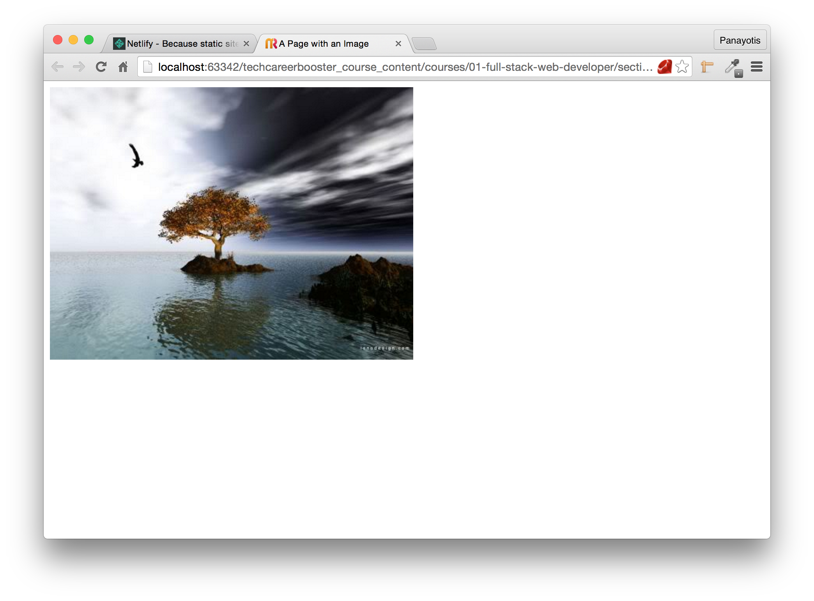

If you inspect the img you will see that this is an `inline` element. This is very important. Text before and text after image are printed adjacent to the image.

### The `src` attribute

The `src` attribute is like the `href` on `link` elements in `head` sections, or like the `href` in anchor elements. It says where the image file exists. In the
previous example, it has the value `http://www.goodlightscraps.com/content/nature/nature-images-86.jpg`. It means that it is hosted inside another server (`www.goodlightscraps.com`)
and we are asking the browser to fetch it using the protocol `http`. The actual path inside that remote server is `content/nature/nature-images-86.jpg`.

Image files can reside in folders inside our site, or in remote servers. When local, on our site, we just mention the relative path to the image file. Like we did with CSS files.
If on remote servers, we can access them using `http` or `https`.

> **Important:** If our site is served using SSL (`https` protocol) then it's important that all the content of the site, HTML pages, CSS files, JavaScript files, images and other,
to be served either from our site (hence served with same protocol `https`) or from another server that also serves these assets with the same protocol, `https` and not `http`. Otherwise,
the user browser will issue warnings to end user. That our secure site includes access to non-secure resources. These warnings might prevent user from continuing navigation
to our site.

We will talk about locally stored images later on. For now, let's continue with images that live on other remote servers.

### The `alt` and the `title` attributes

The `alt` and the `title` attribute accompany the image and they function as follows:

1. `alt` should always contain a descriptive text of the image.
    1. It is used by screen reading software to announce the existence of the image and what is its content.
    2. It is displayed when user has disabled the display of images.
    3. It is displayed when the browser cannot fetch, for any reason, the image.
2. `title` is used to give a descriptive text to the image and it is displayed, as a tooltip, when we mouse over
the image.

This is how the title is displayed when you mouse over the image that is referenced by the HTML page we just built.

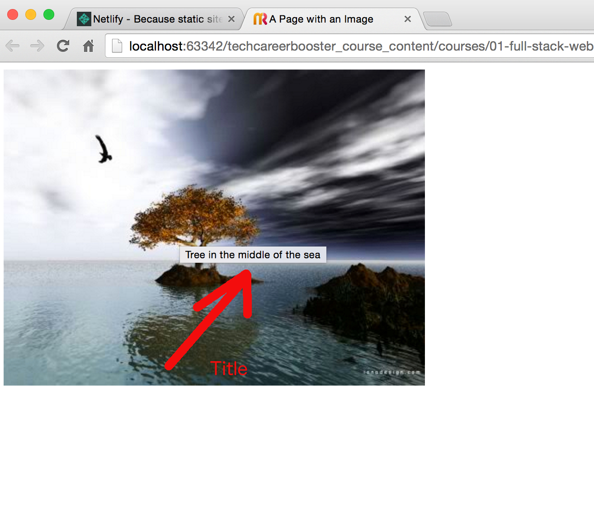

> *Information:* Screen reading software is used by visually impaired people that are using computers. It is used
to announce to user every element of the screen, so that the user can navigate and use the computer.

### Image size

You already know that image size is calculated in pixels. Browser, when displaying an image, it will display it in its original image size.
Try with the last HTML page that we developed. Inspect the image element with the developer tools. You will see the size of the image being 466px x 350px.
The width comes always first.

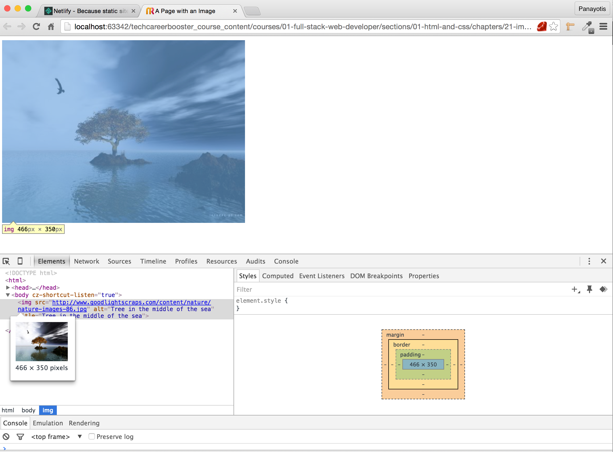

The size that you see above, is the original size of the image. (You can verify that if you download the image and inspect its size).

Let's try another HTML file that references a really large image:

``` html
<!DOCTYPE html>
<html>
  <head>
    <meta charset="utf-8">
    <title>A Page with an Image</title>
  </head>

  <body>

    

  </body>

</html>
```
If you save this file as an `index.html` file and load the page on your browser you will see this:


As you can see, the image cannot fit into the browser window. And if you inspect the image with developer tools, you will see something like this:

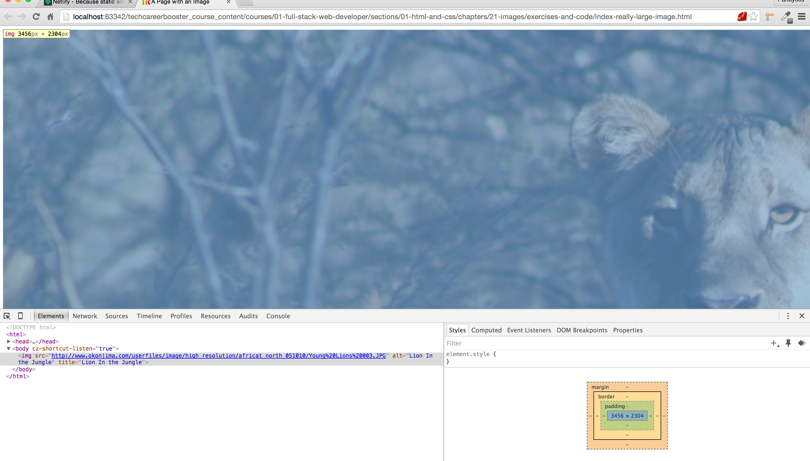

The image is huge: 3456px X 2304px.

#### `width` and `height` attributes

You can use the `width` and `height` attributes in order to ask the browser to resize the image. You can either specify one of the two dimensions, and
browser will calculate automatically the other, keeping the aspect ratio of the original sizes (width / height), or you can specify both dimensions.

Let's try by specifying the `width` attribute only:

``` html
<!DOCTYPE html>
<html>
  <head>
    <meta charset="utf-8">
    <title>A Page with an Image</title>
  </head>

  <body>

    

  </body>

</html>
```

We have set the `width` attribute to have the value `400`. This means 400px. If you reload your page, it will look like this:


Having set the width attribute to `400` we ask the browser to reset the width of the original image to `400px` and recalculate the height accordingly,
so that it can keep the aspect ratio of the original image. So, height should be 2304 * 400 / 3456 = 266,667 or 267 to round on nearest integer. Let's
prove that by inspecting the new image element using the developer tools. We should see the image size draw to be 400px X 267 px.

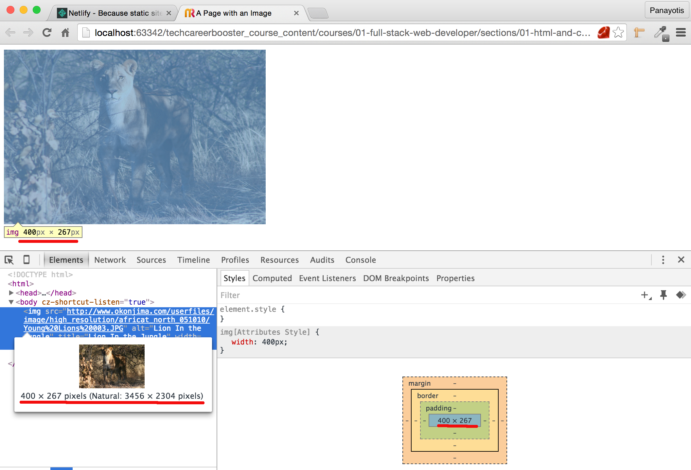

As you can see in the above picture, developer tools give you both the original size of the image and the one calculated after the resize (due to the width setting).
(make sure you mouse over the "img" element and over the link inside that in the Elements area on the developer tools). Also, you can see that the browser
correctly calculated the height of the image, given the 400px width.

Of course, we can certainly set both `width` and `height`. And we can also "destroy" the aspect ratio of the image. Look at the following example:

``` html
<!DOCTYPE html>
<html>
  <head>
    <meta charset="utf-8">
    <title>A Page with an Image</title>
  </head>

  <body>

    

  </body>

</html>
```
Save this file and load it on your browser. You will see something like this:

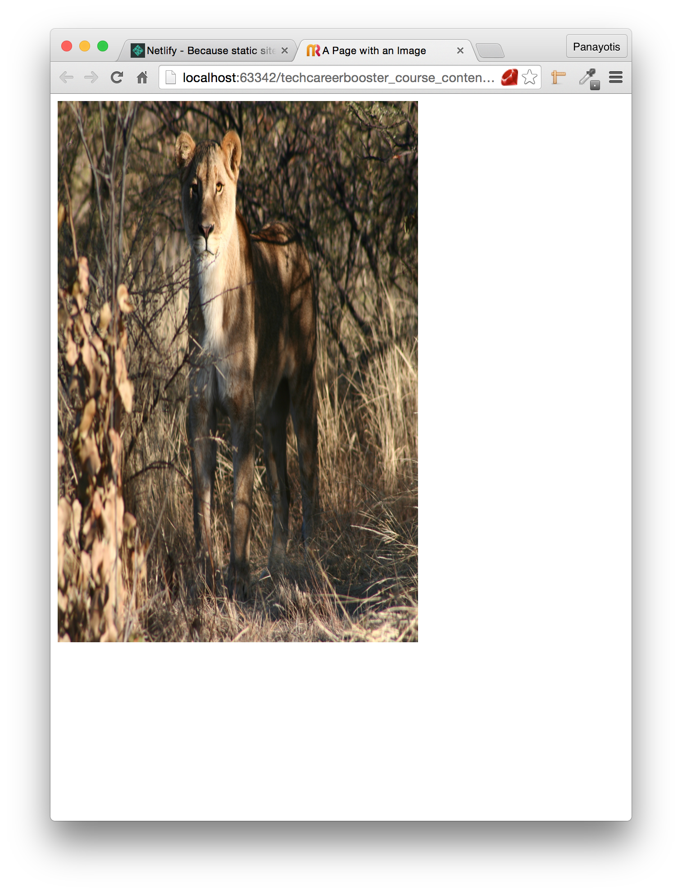

As you can see, the resizing that we did (`width` equal to 400px and `height` equal to 600px) "destroyed" the aspect ratio of the original image. And the image does not
look properly. Or it may be what you really wanted to do, case in which it does look "ok".

#### Styling using the `style` attribute

Another way you can specify the `width` and/or `height` of an image, is to use the `style` attribute (which is an attribute that can be used on any HTML element) and
give it a value that would determine the new `width` and `height` of the image.

Let's take the previous example, and instead of using the `width` and `height` attributes, we will use the `style` attribute:

``` html
<!DOCTYPE html>
<html>
  <head>
    <meta charset="utf-8">
    <title>A Page with an Image</title>
  </head>

  <body>

    

  </body>

</html>
```

If you load this page on your browser, it will be exactly the same as before, when we used the `width` and `height` attributes with the same values.

So, what's the preferred way to do that? It's the second one with the `style` attribute. And in fact, we prefer this to exist inside a CSS file rather than
as an attribute of the `img` element.

### Images as Links

We have learned about anchors (`<a>`) and about images (``). We have also learned that we can turn anything into a link. This includes images of course.

Let's try to create the following simple page:

``` html
<!DOCTYPE html>
<html>
  <head>
    <meta charset="utf-8">
    <title>A Page with an Image</title>
    <link rel="stylesheet" href="stylesheets/main.css" type="text/css">
  </head>

  <body>

    <a href="https://en.wikipedia.org/wiki/Lion">
      
    </a>

  </body>

</html>
```
In the above code, you can see how we have included an `` element inside a `<a>` element.

Save the above HTML content to an image with name `index.html`. Also, save the following CSS rule inside a file `stylesheets/main.css`:

``` css
#lion {
    width: 400px;
}
```

If you load this page on your browser, you will see the following:

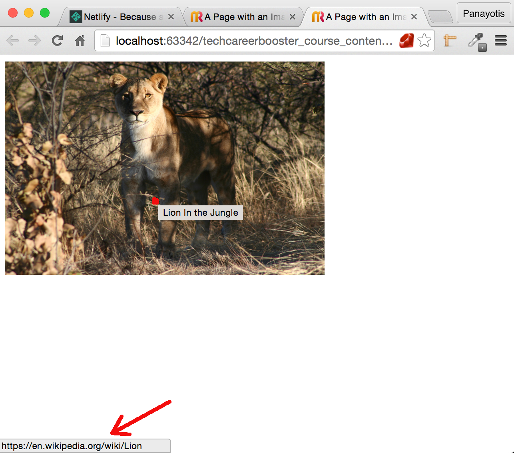

As you can see from the picture above, when you move your mouse over the image, the mouse pointer changes shape to the standard anchor/link mouse shape (a hand)
and the status bar of your browser displays the target Web address.

### Text Around Images

We have already said that `` tag is an inline element. Text before the tag and text after the tag are placed in adjacent positions. But images are big if compared
to text left and right to them. How can we make the text be placed naturally and nice next to images?

Let's try to implement the page that you see here:

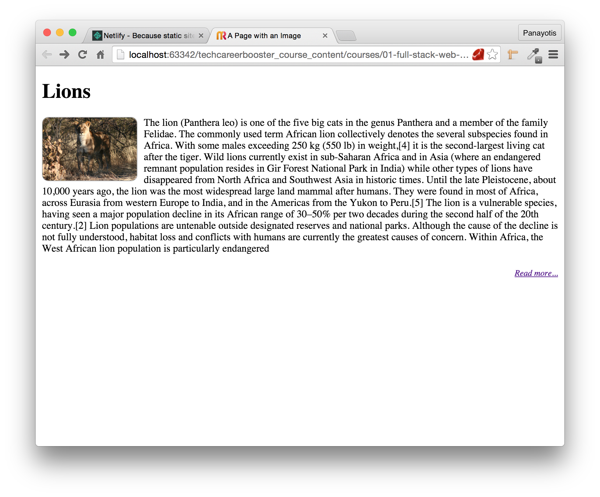

The important things that you need to pay attention to are:

1. The image stands on the left and the text goes around it.
2. The image has a border around it with dark gray color.
3. The image border is rounding at the borders.

Also, we will implement the next things on this page:

1. The image will be a link to the lions page on Wikipedia.
2. The "Read more..." will be a link to lions page on Wikipedia.
3. When the mouse goes over the image, we will change the image opacity / transparency so that the user perceives that it is a link and that he can click on it
to visit the corresponding target appearing at the browser status bar.

<div id="media-title-video-This is how the page should be when we move the mouse around and click on links">This is how the page should be when we move the mouse around and click on links</div>
<a href="https://player.vimeo.com/video/194001164"></a>

Let's start. We will first put the HTML content in place:

``` html
<!DOCTYPE html>
<html>
  <head>
    <meta charset="utf-8">
    <title>A Page with an Image</title>
    <link rel="stylesheet" href="stylesheets/main.css" type="text/css">
  </head>

  <body>
    <h1>Lions</h1>
    <p>
      <a href="https://en.wikipedia.org/wiki/Lion">
        
      </a>

      The lion (Panthera leo) is one of the five big cats in the genus Panthera and a member of the family Felidae. The commonly used term African
      lion collectively denotes the several subspecies found in Africa. With some males exceeding 250 kg (550 lb) in weight,[4] it is the second-largest
      living cat after the tiger. Wild lions currently exist in sub-Saharan Africa and in Asia (where an endangered remnant population resides in Gir Forest
      National Park in India) while other types of lions have disappeared from North Africa and Southwest Asia in historic times. Until the late Pleistocene,
      about 10,000 years ago, the lion was the most widespread large land mammal after humans. They were found in most of Africa, across Eurasia from western
      Europe to India, and in the Americas from the Yukon to Peru.[5] The lion is a vulnerable species, having seen a major population decline in its African
      range of 30–50% per two decades during the second half of the 20th century.[2] Lion populations are untenable outside designated reserves and national parks.
      Although the cause of the decline is not fully understood, habitat loss and conflicts with humans are currently the greatest causes of concern. Within Africa,
      the West African lion population is particularly endangered
    </p>

    <p>
      <a href="https://en.wikipedia.org/wiki/Lion"><em><small>Read more...</small></em></a>
    </p>

  </body>

</html>
```

Create the above HTML content and save it into a file named `index.html`. Create also the file `stylesheets/main.css`. To start with, add the following rules
inside it:

``` css
* {
    box-sizing: border-box;
}

body {
    margin: 0 10px 0 10px; /* only give a left and right margin */
}

#lion {
    width: 150px;
}
```

If you save both files and load this page on a browser, you will see something like this:


The problem above is that the text does not start at the top of the image. But it starts at the bottom. There is one easy fix to that. We
only have to add the `float` property with value `left` to the image element. This will make the image float to the left, i.e. positioned to
the first top left available space. Next element will flow around it. So, make the following change. On the image related CSS rule add the
`float: left;` rule. So, our CSS should be:

``` css
* {
    box-sizing: border-box;
}

body {
    margin: 0 10px 0 10px; /* only give a left and right margin */
}

#lion {
    width: 150px;
    float: left;
}
```
Save and reload your page. You will the following:

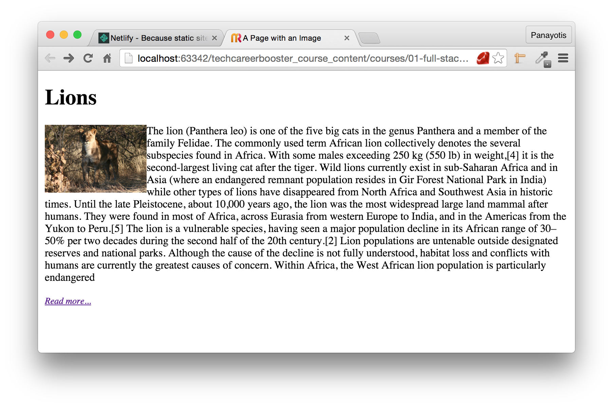

Much better. We are close to the final result. The image stays on the correct position and the text flows around it. Things that we need to correct here to reach
the final result are:

1. Text to the right of the image should not be that close to the image boundary. We can fix that by introducing a little bit of right margin to the image.
2. The "Read more..." link should be aligned to the right. We can do that by introducing the class `text-right` with the correct rule and assign this class to the 2nd `<p>`
element that contains the "Read more..." link.
3. We need to add an image border. We can do that with the `border` property.
4. We need to make the image have rounded corners. This is done with the property `border-radius`. This is a new property for you. We will give more explanations later on.
5. We need to make the image be a little bit more transparent when we move the mouse over it. This is done with setting the property `opacity`. Details, later on.

Here is the final CSS rule file:

``` css
* {
    box-sizing: border-box;
}

body {
    margin: 0 10px 0 10px;
}

#lion {
    width: 150px;
    float: left;
    margin-right: 10px;
    border: 1px solid darkgray;
    border-radius: 10px;
}

/* Here is how we apply a CSS rule when the mouse goes over the element with id "lion", which is the id
   of our  element. */
#lion:hover {
    opacity: 0.8;
}

.text-right {
    text-align: right;
}
```

Don't forget to add the class `text-right` to the 2nd `<p>` element inside the HTML content.

Save all the files (`index.html` and `stylesheets/main.css`) and reload your page. You will see exactly what we had as our final target.
Move the mouse over the image. You will see it losing a little bit of its opacity (hence becoming a little bit more transparent). Also, you will
see the dark gray border around the image and its border corners being rounded.

Let's give some more details for the new CSS rules and properties that we have introduced above:

1. `#lion:hover`. This is the CSS selector that applies CSS rules when we move the mouse over the element with id `lion`, a.k.a. over the image in
our HTML page.
2. `opacity`. Takes values from `0.0` up to `1.0`. `0.0` means without any opacity, hence being completely transparent and `1.0` with full opacity, hence
being without any transparency. When an image starts being transparent, that means that it reveals the colors that are behind it coming in forward.
In our example, the image is placed on top of a white page, i.e. when you increase its transparency you see the colors becoming more white.
Try to set this property to various values from 0.0 up to 1.0 and play with that in order to understand how it works. **Note:** If you want to support
IE 8 or earlier, you may need to also add the property `filter` with value  `alpha(opacity=80);`. In that case, your CSS rule whould have been:

    ``` css
    #lion:hover {
      opacity: 0.8;
      filter: alpha(opacity=80); /* support of opacity for IE8 or earlier */
    }
    ```
`opacity`, when used in `filter` property, takes values from 0 to 100 and represents a percentage.

3. `border-radius`. This is used to make the border of an element having rounded corners. It is the shorthand property for `border-top-left-radius`,
`border-top-right-radius`, `border-bottom-right-radius` and `border-bottom-left-radius`.
    1. When you only set one value, you actually set equal value to all of the 4 corners.
    2. When you set two values, first value is for top-left and bottom-right corners, and second value is for top-right and bottom-left corners.
    3. When you set three values, first value is for top-left, second value is for top-right and bottom-left, third value is for bottom-right.
    4. When you set four values, first value is for top-left, second value is for top-right, third value is for bottom-right and fourth value is for bottom-left.

Try, for example, to set the `border-radius` property of the `#lion` rule to be `border-radius: 30px 10px;`. If you do that, you will see the following result:

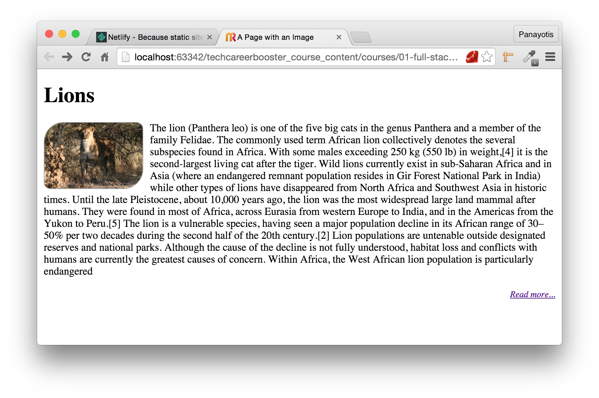

Do you see the difference between top-left and top-right corners? Top-left and bottom-right have the same corner size (30px), and they differ from
top-right and bottom-left which have 10px corner size.

### Images and line height

As we have said before, images are inline elements. If you put text and then and image and then some text, these will appear one next to each other, like if image was part of the text:

Write the following HTML page:

``` html
<!DOCTYPE html>
<html>
  <head>
    <meta charset="utf-8">
    <link rel="stylesheet" href="stylesheets/main.css" type="">
    <title>A Page with Text and Image</title>
  </head>

  <body>
    <div>
      This is a phrase left to an image.This is a phrase right to the image.
    </div>
  </body>

</html>
```

Save this file as `index.html` and then create the CSS file `stylesheets/main.css` that is referenced by this file:

``` CSS
* {
    box-sizing: border-box;
}

body {
    margin: 0 20px;
    padding: 0;
    font-size: 28px;
}

div {
    background-color: #FFE4B5;
}

div, img {
    margin: 0;
    padding: 0;
}
```

This CSS file above, does nothing more than removing margins and padding that might affect our discussion here. And make the font-size a little bit larger
in order to be able to see easier the line heights. We have also given a background color to the containing / parent `<div>` in order to make sure that we
visually identify the space that the text and image occupy.

If you load this page on your browser, you should see something like this:

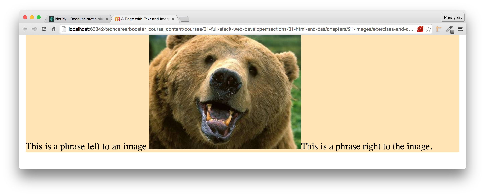

If you look carefully, you will see that the image bottom side, does not align with the bottom side of the container. It aligns with the baseline of the text.
There is still free space below. The free space below, spans, not only below the image, but below the whole div content (text + image). What is this space?
It is the space for the descender characters. We have talked about that in
<a href="#"
   data-type="content-navigation"
   data-target-course="full-stack-web-developer"
   data-target-section="html-and-css"
   data-target-chapter="css-box-model"
   data-target-bookmark="line-height">
    chapter 16
</a>. And, now, we encounter it again. But, here we want to stress the fact that the browser, treats the position of the image as if it were
a character without descender portion, and places it on the same line height like the baseline of the text.

Here is the baseline marked with red color:
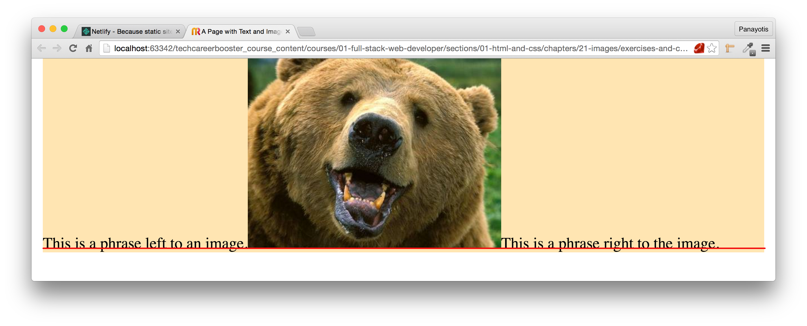

The general rule here is that images are inline elements and inline elements are positioned so that their bottom aligns with the text baseline. The text baseline
is a line that is used by browser to position text and it is there **even if there is not actual text inside**. In other words, when the browser encounters inline
elements, even if they are not actual text, it uses an internal calculation to calculate the **line height** that should be used to accommodate the inline elements.
This line height is calculated so that the final value is enough to hold the inline elements and any characters that might appear next to them, including of course
the ascenders and descenders characters.

Let's do the following experiment. On the previous page, we are going to remove the texts left and right to the image. We will only leave the image inside the div.
Here we are:

``` html
<!DOCTYPE html>
<html>
  <head>
    <meta charset="utf-8">
    <link rel="stylesheet" href="stylesheets/main.css" type="">
    <title>A Page with Text and Image</title>
  </head>

  <body>
    <div>
      
    </div>
  </body>

</html>
```

Make sure you save the above, and reload it on your browser. What you will see is the following:


Do you see the extra space below the image. This is exactly what we said earlier. This is not margin. This is not padding. It is that image, as inline element, is treated like text and the browser reserves enough
space at the bottom to display the descender characters.

#### Solving the extra space "problem"

Sometimes, the extra space below of the inline element might be a problem. For example, in the previous page, we want to display the image, without the extra space below.
What can we do? We have a series of solutions that we can apply. They will all work on this particular case, but some of them might not be working in another context.
That's why you need to know all of them and pick up the one that best suits your needs on the particular context you enounter this "problem" in.

1. *Solution 1:* Set the `display` property of the `img` to `block`.
2. *Solution 2:* Set the `line-height` property of the containing `div` to 0;
3. *Solution 3:* Set the `vertical-align` property of the `img` tag to `top` (sometimes `top` will not work; try also one of `bottom`, `baseline`, `middle`, `text-bottom`)
4. *Solution 4:* Set the `font-size` of the `div` to 0.

For example, try the first solution:
``` css
* {
    box-sizing: border-box;
}

body {
    margin: 0 20px;
    padding: 0;
    font-size: 28px;
}

div {
    background-color: #FFE4B5;
}

div, img {
    margin: 0;
    padding: 0;
}

img {
    display: block;
}
```
If you save this and reload your page, you should see the following:

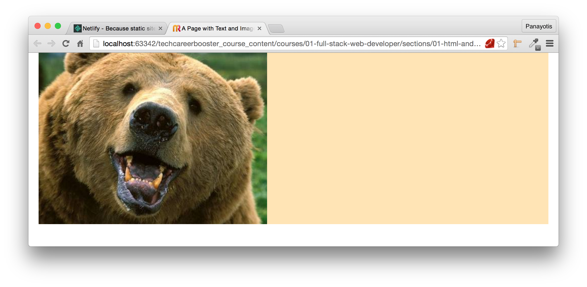

Problem solved! The image bottom is aligned to the div bottom.

### Using images stored on our site

In the previous examples, we referenced some images that existed in remote servers, not from our site. If we want to use images from our site,
we first need to save them locally, where the pages of our site are.

Usually, we save the images of our site inside a folder named "images". Let's do that.

Download the next two images:

1. https://dvirfixler.files.wordpress.com/2014/03/stunning-photography-of-wild-animals-11.jpg
2. http://images6.fanpop.com/image/photos/34300000/Big-Cats-wild-animals-34365429-900-599.jpg

and save them locally inside the folder "images" in the root of your site. Name the first image "animal1.jpg" and the second image "animal2.jpg".
In other words, you need to have something like that in your file system:

```
-[images]
    |
    |- animal1.jpg
    |- animal2.jpg
```

Next create the HTML file with the following content:

``` html
<!DOCTYPE html>
<html>
  <head>
    <meta charset="utf-8">
    <title>A Page with Local Images</title>
    <link rel="stylesheet" href="stylesheets/main.css" type="text/css">
  </head>

  <body>

    <h1 class="text-center">Wild Animals</h1>

    <div id="left-column" class="column">
      
    </div>

    <div id="right-column" class="column">
      
    </div>

  </body>

</html>
```
Save this file with the name `index.html`.

Then create the CSS file with the following content:

```
/* Use border-box model for box sizing. Hence, width and height take into account padding and borders. */
* {
    box-sizing: border-box;
}

/* Remove any body margin */
body {
    margin: 0;
}

/* Make all images of the same size */
img {
    width:  420px;
    height: 350px;
}

/* Make all columns of the same size, 50% of their container */
.column {
    width: 50%;
}

/* Left column should float left but with text alignment right */
#left-column {
    float: left;
    text-align: right;
}

/* Right column should float left, with text alignment left - which is the default */
#right-column {
    float: left;
}

/* Helper class to center text */
.text-center {
    text-align: center;
}
```

Save this content to file `stylesheets/main.css`.

Before proceeding, read carefully the CSS comments and make sure you understand the CSS rules that we are using.

Hence, your files and folders should be like this:

```
-[images]
    |
    |- animal1.jpg
    |- animal2.jpg
-[stylesheets]
    |
    |- main.css
- index.html
```

Do you see how the HTML page content references the images that reside on the same site, inside the folder "images"?

``` html
...

...

```

Load the `index.html` page on your browser. You should see something like this:
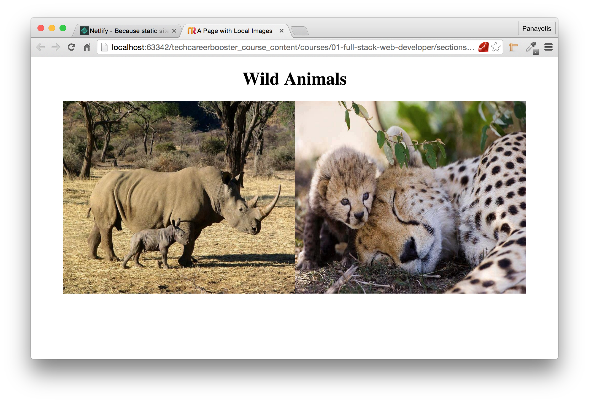
