## Image Backgrounds

We have learned how to introduce images to our site, turn them to links and possibly put text around them.
However, there are cases in which we want the image to be used as a background. Look at this site here for
example:


As you can see in the above picture (you can [visit the real site too if you click here](http://www.pamediakopes.gr/gb/)), there is an image that has other elements covering
parts of its area. Hence, the image is on the background, whereas the elements are on the foreground.

Let's start little by little, with the basics.

## Image as a `body` background

We are going to use this image here:
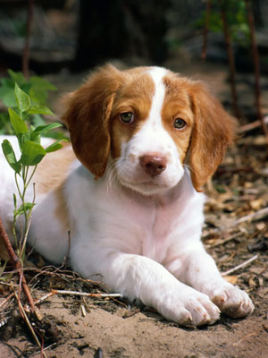

to cover the whole page on our site. Note, however, that the image is of fixed size, and this, in particular, is a small image. It has width 300px and height 400px.

When you want to cover the whole page, window, with an image, one first idea might be to use the image as a background of the `body` element.

Let's do that:
``` html
<!DOCTYPE html>
<html>
  <head>
    <meta charset="utf-8">
    <title>Image as a body background</title>
    <link rel="stylesheet" href="stylesheets/main.css" type="text/css">
  </head>
  <body>

  </body>
</html>
```

A very simple web page. Actually, it does not have content on the body. However, it does use a stylesheet file. Create the following CSS file:

``` css
body {
  background-image: url("../images/cute-medium-sized-dog.jpg");
}
```

As you can see, the CSS is very simple. It is using the `background-image` CSS property to specify the image that should be used for background cover on the
particular element, i.e. the `body` element.

> *Important:* If you haven't done that already, download the image `cute-medium-sized-dog.jpg` from the images of the current chapter. Save the image
inside the folder "images" on the root folder of your project.

One of the values that the `background-image` property takes is the call to `url` function with argument the path to the image file. Note that we are using a relative
path. If you see the file structure:

```
-[images]
     |
     |- cute-medium-sized-dog.jpg
-[stylesheets]
     |
     |- main.css
- index.html
```
you will see that in order for the `main.css` file to reference a file inside the `images` dir, needs to travel one directory up (`..`) and then go inside `images` directory.

If you correctly create the above files and then load the `index.html` page on your browser, you will see the following result:


As you can see, due to the fact that the image is small, it is repeated horizontally and vertically, in order to cover the whole body area.

## Let's Be More Accurate

In the "CSS Box Model" chapter we have learned that the `body` background properties propagate to `html`, if `html` does not specify its own background properties.
And actually, from `html` it propagates to canvas, to the whole browser drawing area.

This is what has happened for our page above too. 

If you inspect, with developer tools, the `body` element, you will see that it does not have a height:

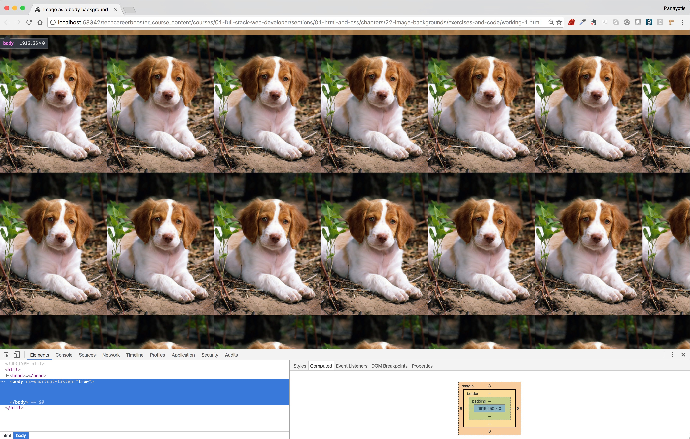

And the `html` has a very small height:

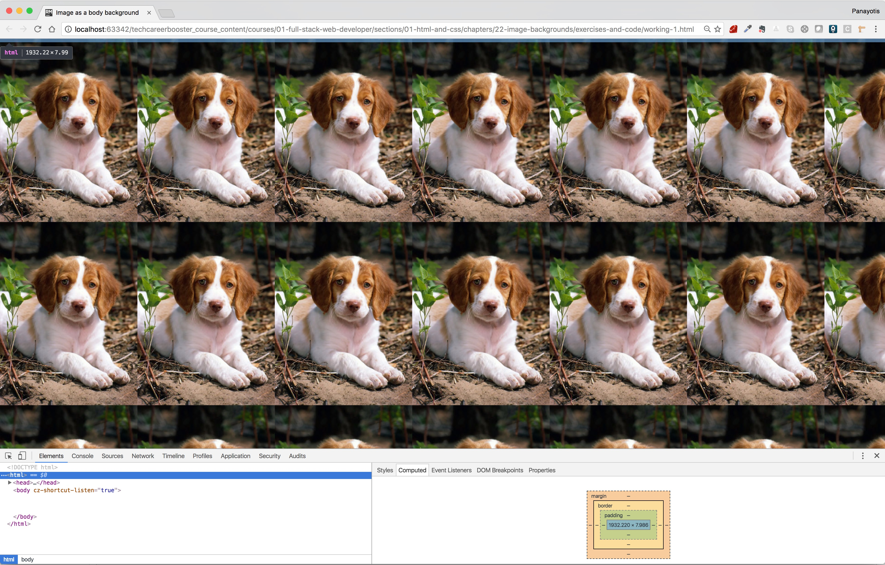

However, you can see that the small image runs from left to right and top to bottom and covers the whole drawing area, the canvas area. 

Do we want to have the background properties propagate to the parent element and then to canvas? We could work with that, but maybe it is a good
idea if we could stop the background properties from propagation and have them work on the `body` element only. One reason this might be
good for is in order to have more accurate control on the styling of our page.

## How To Stop Propagation

How can we stop propagation? We have to make sure that `html` has its own background properties. We can use, for example a one pixel image:
Try the following CSS for your page:

``` css
html {
    background-image: url('../images/one-pixel.png');
}

body {
    background-image: url("../images/cute-medium-sized-dog.jpg");
}
```

If you reload your page on your browser, you will see this:

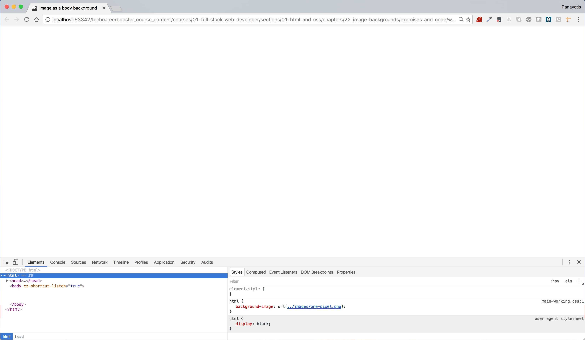

What we have done was to set the `background-image` property on the `html` to a 1 pixel white image. Alternatively, we could have used the `background-color` property.
Let's do that:

``` css
html {
    background-color: White;
}

body {
    background-image: url("../images/cute-medium-sized-dog.jpg");
}
```

## Body Without Content is Not Displayed

Why do we see the page now being white and we don't see the `body` background image? Because, `body` does not have any content. Hence, its height is 0, and,
consequently, the background image is not drawn.

## Adding Content to Body

We are now going to add some content to `body` so that browser draws it clearly on page. Let's change the HTML of our page to:

``` html
<!DOCTYPE html>
<html>
  <head>
    <meta charset="utf-8">
    <title>Image as a body background</title>
    <link rel="stylesheet" href="stylesheets/main.css" type="text/css">
  </head>
  <body>
    <div id="main-header">Happy dogs</div>
  </body>
</html>
```

If you save the above and reload the page on your browser, you will see something like this:


The `body` has enough height to draw its content, the new `div` with id `main-header`. But, of course, this is not enough to clearly display the whole image background.

## Make `body` High Enough

Which means that in order for the image background to cover the whole area again, under the control of the `body` element, we need to make the `body` have enough 
`height`. 

Let's make our CSS as follows:

``` css
html {
    height: 100%;
    background-color: white;
}

body {
    min-height: 100%;
    background-image: url("../images/cute-medium-sized-dog.jpg");
}
```

What we did? We set the `height` for `html` to `100%` so that it covers the whole canvas area. And we set the `body` `min-height` to be `100%` too. These two
make the `body` height be at least equal to the height of the `html` element. 

Question: Why do I have to set `min-height` to `body` and not `height` ? It is because the `min-height` will make sure that the background properties work ok,
in the case in which the `body` content is long enough to require the user to scroll down in order to see the whole content. Visit these two pages here and scroll
to see the difference.

1. [Page with body min-height 100%](http://writer-horse-38288.netlify.com/) 
1. [Page with body height 100%](http://embalmer-cow-52376.netlify.com/)

Having done that, if we reload the page on our browser, we will see this:

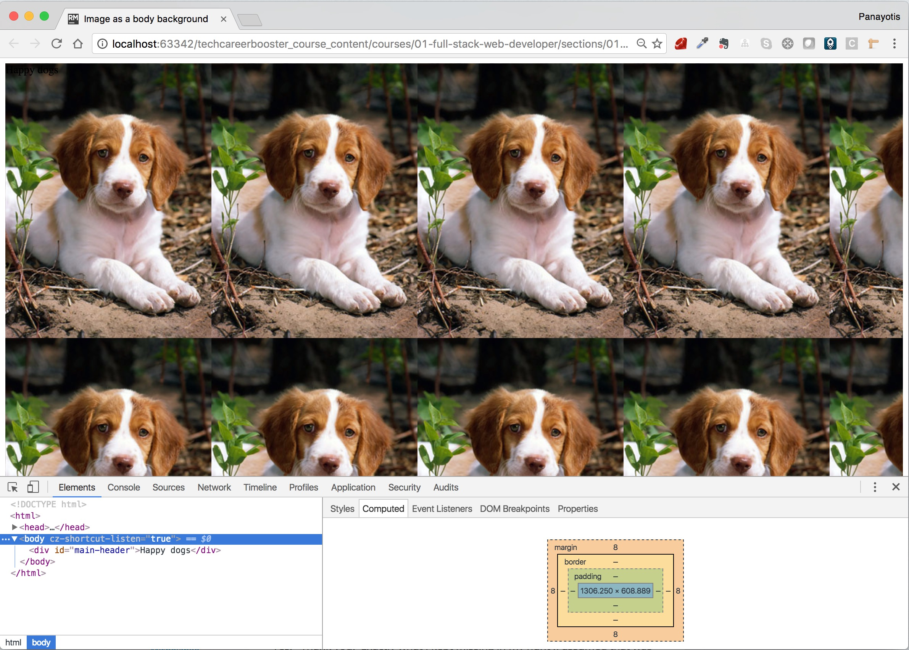

## Remove Margin

But, there is a small detail we need to take care of. The `body` has the default margin. You can see that 8 pixels margin around it. Let's remove that.

``` css
html {
    height: 100%;
    background-color: white;
}

body {
    min-height: 100%;
    background-image: url("../images/cute-medium-sized-dog.jpg");
    margin: 0;
}
```

If you save and reload the page on your browser, you will get this:

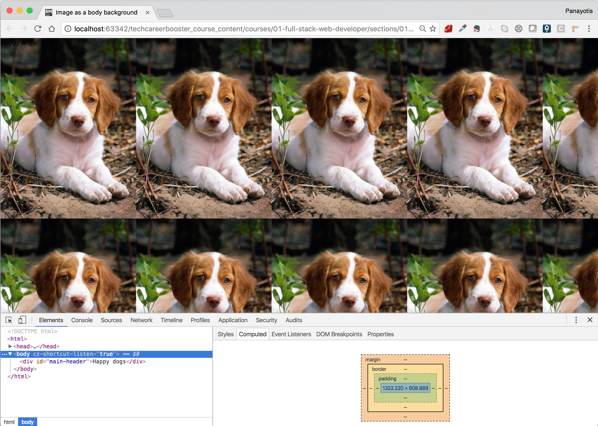

## Where is The Happy Dogs Text?

It's black and you cannot easily see them. Let's change the CSS to have them be easier to see:

``` css
html {
    height: 100%;
    background-color: White;
}
body {
    min-height: 100%;
    background-image: url("../images/cute-medium-sized-dog.jpg");
    margin: 0;
}

#main-header {
    color: White;
    font-size: 50px;
    text-align: center;
    padding-top: 200px;
}
```

If you save those files and reload your `index.html` page, you will see this:


As you can see, the "Happy Dogs" text has been put on top of the image(s). Image(s) work as a background.

## One Image to Cover Whole Page

How can we have one image only, covering the whole page. Can we have one instance of the dog image covering the whole viewport?
Let's try the following change in our CSS rules:
``` css
html {
    height: 100%;
    background-color: White;
}
body {
    min-height: 100%;
    background-image: url("../images/cute-medium-sized-dog.jpg");
    background-repeat: no-repeat;
    margin: 0;
}

#main-header {
    color: White;
    font-size: 50px;
    text-align: center;
    padding-top: 200px;
}
```
We have used the property `background-repeat` with value `no-repeat`. Let's save that and reload the page. What you will see is this:


As you can see, the `background-repeat` with value `no-repeat` instructs the browser to not repeat the image. The property `background-repeat` takes
the values:

1. `repeat`, which is the default value and repeats the image both horizontally and vertically.
2. `repeat-x`, which repeats the image horizontally.
3. `repeat-y`, which repeats the image vertically.
4. `no-repeat`, which does not repeat the image.

Ok. Cool. We have done 1 step to have only one instance of the image. But hold on. Where is the text. It's there, but you cannot see that because
it is white and it is on the center of the page. If you shrink your browser window, you will see it.

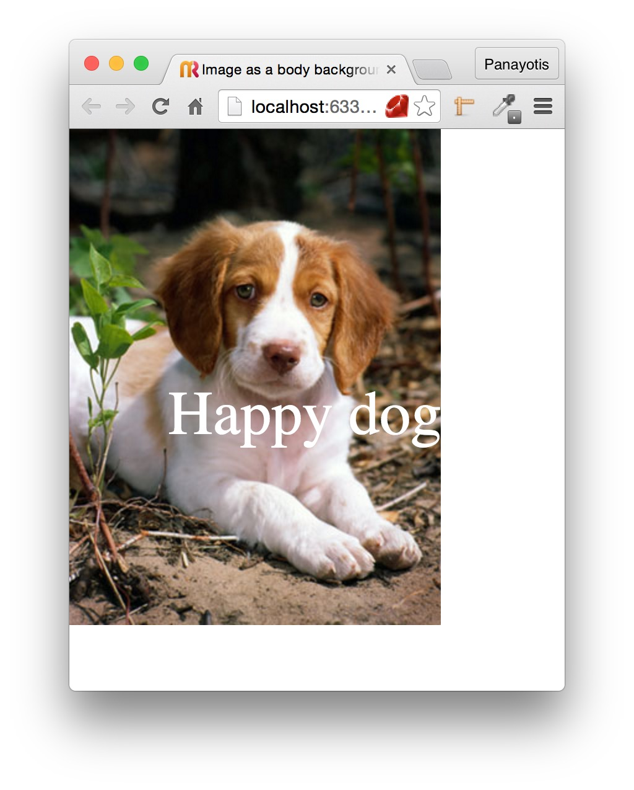

## Center Image

The next step is to ask the browser to bring the image in the center of the window. Let's amend our CSS as follows:

``` css
html {
    height: 100%;
    background-color: White;
}
body {
    min-height: 100%;
    background-image: url("../images/cute-medium-sized-dog.jpg");
    background-repeat: no-repeat;
    background-position: center;
    margin: 0;
}

#main-header {
    color: White;
    font-size: 50px;
    text-align: center;
    padding-top: 200px;
}
```
If you save and reload the page, you will see this:

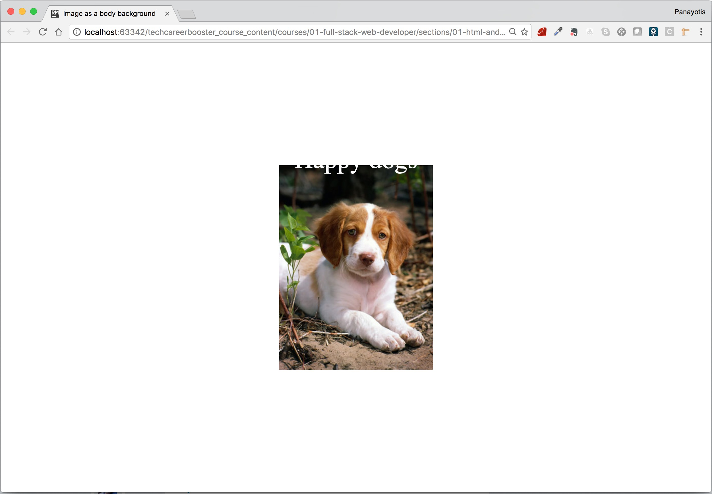

We have used the `background-position` property with the value `center`. This property is used to position the background image. Do a google search to
find out what are the possible values this property can take. For our purpose here, the `center` value positions the image on the center of its containing
element.

## Cover The Whole Body

Almost perfect! One thing that we have to do now is to make sure that the background image covers the whole browser window. Let's use the following CSS content:
``` css
html {
    height: 100%;
    background-color: White;
}
body {
    min-height: 100%;
    background-image: url("../images/cute-medium-sized-dog.jpg");
    background-repeat: no-repeat;
    background-position: center;
    background-size: cover;
    margin: 0;
}

#main-header {
    color: White;
    font-size: 50px;
    text-align: center;
    padding-top: 200px;
}
```
If you save and reload your page, you will see the following:


Fantastic! The background image covers the whole browser window as we initially wanted it to be. This has been achieved with the CSS property `background-size`. The `cover` value
instructs the browser to scale the background image to be as large as possible, so that it covers the whole body area.

## Adding Text On the Page

Now, let's suppose that our page has enough content to expand below the bottom edge of our browser window. Let's assume that our HTML page is now this:

``` html
<!DOCTYPE html>
<html>
  <head>
    <meta charset="utf-8">
    <title>Image as a body background</title>
    <link rel="stylesheet" href="stylesheets/main.css" type="text/css">
  </head>
  <body>
    <div id="main-header">Happy dogs</div>
    <p>
      Lorem ipsum dolor sit amet, consectetur adipiscing elit, sed do eiusmod tempor incididunt ut labore et dolore magna aliqua. Ut enim ad minim veniam, quis nostrud exercitation ullamco laboris nisi ut aliquip ex ea commodo consequat. Duis aute irure dolor in reprehenderit in voluptate velit esse cillum dolore eu fugiat nulla pariatur. Excepteur sint occaecat cupidatat non proident, sunt in culpa qui officia deserunt mollit anim id est laborum.
    </p>
    <p>
      Lorem ipsum dolor sit amet, consectetur adipiscing elit, sed do eiusmod tempor incididunt ut labore et dolore magna aliqua. Ut enim ad minim veniam, quis nostrud exercitation ullamco laboris nisi ut aliquip ex ea commodo consequat. Duis aute irure dolor in reprehenderit in voluptate velit esse cillum dolore eu fugiat nulla pariatur. Excepteur sint occaecat cupidatat non proident, sunt in culpa qui officia deserunt mollit anim id est laborum.
    </p>
    <p>
      Lorem ipsum dolor sit amet, consectetur adipiscing elit, sed do eiusmod tempor incididunt ut labore et dolore magna aliqua. Ut enim ad minim veniam, quis nostrud exercitation ullamco laboris nisi ut aliquip ex ea commodo consequat. Duis aute irure dolor in reprehenderit in voluptate velit esse cillum dolore eu fugiat nulla pariatur. Excepteur sint occaecat cupidatat non proident, sunt in culpa qui officia deserunt mollit anim id est laborum.
    </p>
    <p>
      Lorem ipsum dolor sit amet, consectetur adipiscing elit, sed do eiusmod tempor incididunt ut labore et dolore magna aliqua. Ut enim ad minim veniam, quis nostrud exercitation ullamco laboris nisi ut aliquip ex ea commodo consequat. Duis aute irure dolor in reprehenderit in voluptate velit esse cillum dolore eu fugiat nulla pariatur. Excepteur sint occaecat cupidatat non proident, sunt in culpa qui officia deserunt mollit anim id est laborum.
    </p>
    <p>
      Lorem ipsum dolor sit amet, consectetur adipiscing elit, sed do eiusmod tempor incididunt ut labore et dolore magna aliqua. Ut enim ad minim veniam, quis nostrud exercitation ullamco laboris nisi ut aliquip ex ea commodo consequat. Duis aute irure dolor in reprehenderit in voluptate velit esse cillum dolore eu fugiat nulla pariatur. Excepteur sint occaecat cupidatat non proident, sunt in culpa qui officia deserunt mollit anim id est laborum.
    </p>
    <p>
      Lorem ipsum dolor sit amet, consectetur adipiscing elit, sed do eiusmod tempor incididunt ut labore et dolore magna aliqua. Ut enim ad minim veniam, quis nostrud exercitation ullamco laboris nisi ut aliquip ex ea commodo consequat. Duis aute irure dolor in reprehenderit in voluptate velit esse cillum dolore eu fugiat nulla pariatur. Excepteur sint occaecat cupidatat non proident, sunt in culpa qui officia deserunt mollit anim id est laborum.
    </p>
  </body>
</html>
```

with the following `stylesheets/main.css` file:

``` css
html {
    height: 100%;
    background-color: White;
}
body {
    min-height: 100%;
    background-image: url("../images/cute-medium-sized-dog.jpg");
    background-repeat: no-repeat;
    background-position: center;
    background-size: cover;
    margin: 0;
}

#main-header {
    color: White;
    font-size: 50px;
    text-align: center;
    padding-top: 200px;
}

p {
    padding: 30px 20px;
    font-size: 18pt;
    color: White;
}
```

What we have done was to add some text inside `p` elements and then style the `p` elements.

Now, the page is longer than the browser window. We need to scroll to see the content that expands at the bottom of the page.
This, unfortunately, makes the background image scroll too:

<div id="media-title-video-Scrolling of the background image-page-with-background-image-scrolling.mp4">Scrolling of the background image</div>
<a href="https://player.vimeo.com/video/197613159"></a>           

## Make the Image Fixed

So, how can we have the image fixed and not scrolling when we scroll the content of the page? We need to use another CSS property, which is called `background-attachment`. 
Here it is how:

``` css
html {
    height: 100%;
    background-color: White;
}
body {
    min-height: 100%;
    background-image: url("../images/cute-medium-sized-dog.jpg");
    background-repeat: no-repeat;
    background-position: center;
    background-size: cover;
    background-attachment: fixed;
    margin: 0;
}

#main-header {
    color: White;
    font-size: 50px;
    text-align: center;
    padding-top: 200px;
}

p {
    padding: 30px 20px;
    font-size: 18pt;
    color: White;
}
```

The `background-attachment` with value `fixed` instructs the browser to keep the background image on fixed position and not to scroll it with the HTML page content scrolling.
If you reload your page and try to scroll down, you will see the image staying still. Very nice!

<div id="media-title-video-Video showing scrolling of text with image fixed">Video showing scrolling of text with image fixed</div>
<a href="https://player.vimeo.com/video/197615530"></a>

### Use A Big Image

We have managed to use a background image for our site, but the image that we used is small with regards to our browser window size. This makes the image, being enlarged
by the browser, look fuzzy. And this phenomenon, is worse when you enlarge your browser window.

In order to have the image be looking crispy and with high quality, nowadays, when the displays have high resolution and the browser windows
large dimensions, you need to use high quality background images with increased width and height sizes. Try something that is bigger than 2000 x 1500. Let's see that
with the image `nice-looking-dog.jpg`, which is a high resolution image. Change the `background-image` CSS property to point to that image and reload your page.

This is what you will finally see:

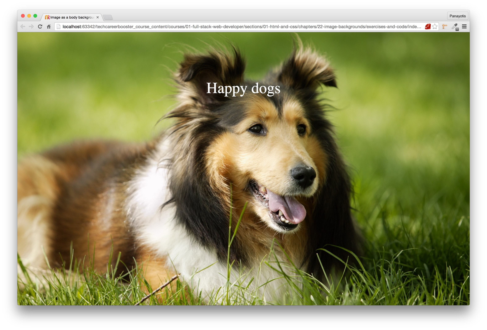


### Background Images on Parts of Page

We have created a nice background image for the whole page of our site. But how can we attach background images to parts of the site?

Let's suppose that we want to create the following site. Watch the screenshots and the video:


As you can see above, we have enhanced the site that we originally built, so that it has 2 parts of the page covered with other background image and some text inside.

<div id="media-title-video-How the site displays its content when we scroll from top to bottom">How the site displays its content when we scroll from top to bottom</div>
<a href="https://player.vimeo.com/video/194001812"></a>

So, let's try to build this site now.

First we need to deal with the "Happy Dogs" header title. It needs to be at the top of the page. So, our HTML content is like this:

``` html
<!DOCTYPE html>
<html>
  <head>
    <meta charset="utf-8">
    <title>Image as a body background</title>
    <link rel="stylesheet" href="stylesheets/main.css" type="text/css">
  </head>
  <body>
    <div id="main-header">Happy Dogs</div>
  </body>
</html>
```

And the CSS content is:

``` css
html {
    height: 100%;
    background-color: White;
}
body {
    min-height: 100%;
    background-image: url("../images/nice-looking-dog.jpg");
    background-repeat: no-repeat;
    background-attachment: fixed;
    background-position: center;
    background-size: cover;
    margin: 0;
}

#main-header {
    color: White;
    font-size: 50px;
    text-align: center;
    padding: 30px;
    background-color: rgba(0, 0, 0, 0.2);
}
```

The important stuff on the CSS is that:

1. We have created an empty area around the text, using `padding: 30px`.
2. We have set the background color of the `div` to be black but with a lot of transparency (80%, i.e. 20% opacity - 0.2). This makes the text be easier to read and at the same time
allows the image behind, to be visible. Creates the nice background blur effect behind the text and in between the background image.

Let's see the result:


Next step is to create the "Dog Training" container. Before we see the actual HTML, let's make some notes here:

* This container does not start exactly below the "Happy Dogs" container. How can we achieve this gap? We can introduce
a bottom margin to "Happy Dogs" container.
* The "Dog Training" container has its own background image. It is the file "dog-training.jpg" inside the images of the chapter.
* The "Dog Training" background image:
    * Does not repeat
    * Covers the size of its container
    * Will scroll as the page scrolls

Let's see how we can introduce the "Dog Training" container with these properties. Here is the HTML:

``` html
<!DOCTYPE html>
<html>
  <head>
    <meta charset="utf-8">
    <title>Image as a body background</title>
    <link rel="stylesheet" href="stylesheets/main.css" type="text/css">
  </head>
  <body>
    <div id="main-header">Happy Dogs</div>

    <div id="dog-training">
      <h1>Dog Training</h1>
      <p>Dog training is the application of behavior analysis which uses the environmental events of antecedents and consequences to modify
        the behavior of a dog, either for it to assist in specific activities or undertake particular tasks, or for it to participate effectively
        in contemporary domestic life. While training dogs for specific roles dates back to Roman times at least, the training of dogs to be
        compatible household pets developed with suburbanization in the 1950s.
      </p>

      <p>
        A dog learns from every interaction it has with its environment.[1] This can be through classical conditioning, where
        it forms an association between two stimuli; non-associative learning, where its behavior is modified through habituation
        or sensitisation; and operant conditioning, where it forms an association between an antecedent and its consequence.[2]
      </p>

      <p>
        There are a variety of established methods of animals training, each with its adherents and critics. Some of the better
        known dog training procedures include the Koehler method, clicker training, dominance-based training, negative reinforcement
        and relationship-based training. The common characteristics of successful methods are knowing the animal's attributes and
        personality, accurate timing of reinforcement and/or punishment and consistent communication.
      <p>
    </div>
  </body>
</html>
```

As you can inspect in the HTML code above, we have only added the `div` with the necessary HTML content. Nothing special here. Let's see, though,
the CSS content:


``` css
html {
    height: 100%;
    background-color: White;
}
body {
    min-height: 100%;
    background-image: url("../images/nice-looking-dog.jpg");
    background-repeat: no-repeat;
    background-attachment: fixed;
    background-position: center;
    background-size: cover;
    margin: 0;
}

#main-header {
    color: White;
    font-size: 50px;
    text-align: center;
    padding: 30px;
    margin-bottom: 150px;
    background-color: rgba(0, 0, 0, 0.2);
}

#dog-training {
    background-image: url("../images/dog-training.jpg");
    background-repeat: no-repeat;
    background-size: cover;
    font-size: 28px;
    padding: 10px 30px;
    color: white;
}
```

The additions here are the following:

1. We have added the `margin-bottom: 150px;` for the "Happy Dogs" container. This will create the gap between the top "Happy Dogs" container and the bottom "Dog Training"
container.
2. We have added rules for the "Dog Training" container.
    1. Rules for the background image.
    2. Rules for the font size.
    3. Rules for padding.
    4. Rules for text color.

Let's save all files and reload the page. Here is what we see:

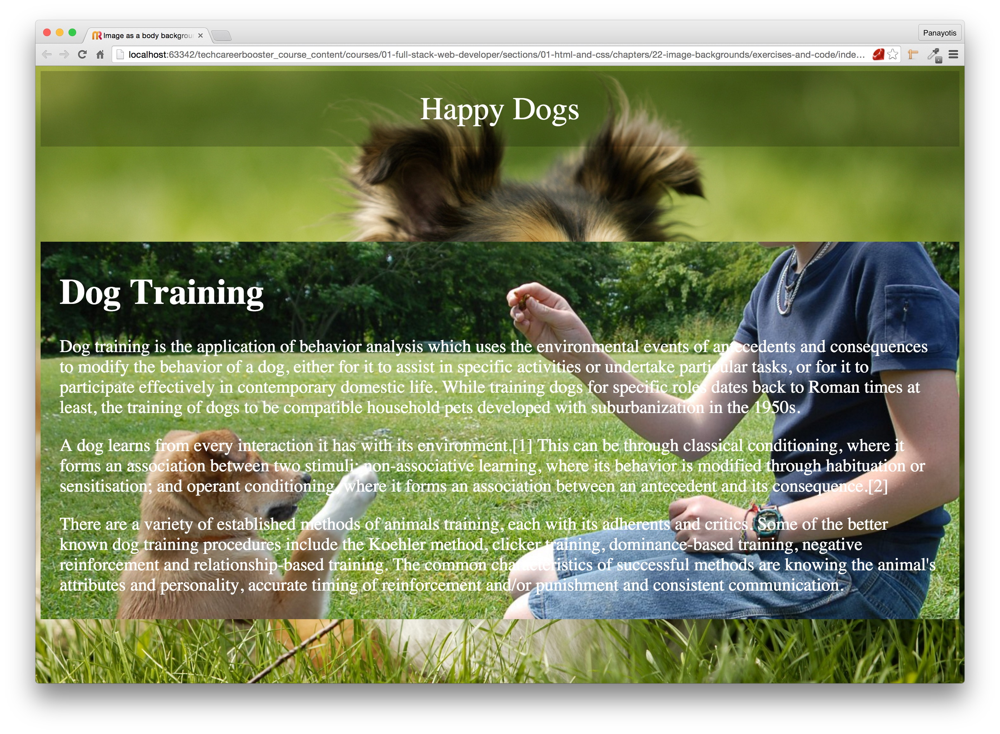

Nice! "Dog Training" container has been introduced and it is now as required. The next container, the "Dog Breeds" one, is a container that has similar
properties to the ones of "Dog Training". The difference is only the background image used.

Let's introduce the HTML content first. Our HTML page now should have the following code:

``` HTML
<!DOCTYPE html>
<html>
  <head>
    <meta charset="utf-8">
    <title>Image as a body background</title>
    <link rel="stylesheet" href="stylesheets/main.css" type="text/css">
  </head>
  <body>
    <div id="main-header">Happy Dogs</div>

    <div id="dog-training">
      <h1>Dog Training</h1>
      <p>Dog training is the application of behavior analysis which uses the environmental events of antecedents and consequences to modify
        the behavior of a dog, either for it to assist in specific activities or undertake particular tasks, or for it to participate effectively
        in contemporary domestic life. While training dogs for specific roles dates back to Roman times at least, the training of dogs to be
        compatible household pets developed with suburbanization in the 1950s.
      </p>

      <p>
        A dog learns from every interaction it has with its environment.[1] This can be through classical conditioning, where
        it forms an association between two stimuli; non-associative learning, where its behavior is modified through habituation
        or sensitisation; and operant conditioning, where it forms an association between an antecedent and its consequence.[2]
      </p>

      <p>
        There are a variety of established methods of animals training, each with its adherents and critics. Some of the better
        known dog training procedures include the Koehler method, clicker training, dominance-based training, negative reinforcement
        and relationship-based training. The common characteristics of successful methods are knowing the animal's attributes and
        personality, accurate timing of reinforcement and/or punishment and consistent communication.
      <p>
    </div>

    <div id="dog-breeds">
      <h1>Dog Breeds</h1>
      <p>Dog breeds are dogs that have relatively uniform physical characteristics developed under controlled conditions by humans,
        with breeding animals selected for phenotypic traits such as size, coat color, structure, and behavior.[1] The Fédération Cynologique
        Internationale recognizes over 400 pure dog breeds.
      </p>

      <p>
        Other uses of the term breed when referring to dogs may include pure breeds, cross-breeds, mixed breeds and natural breeds.
      </p>

      <p>
        Archaeology has revealed dog remains of various sizes but there does not appear to have been distinctive breeds until 3,000-4,000 years ago
        when greyhound-type dogs were depicted on pottery and paintings in Egypt and Western Asia. Mastiff-type dogs were kept for guarding and hunting,
        and short-legged dogs were also bred. By Roman times, most of the breed-types known today were well-defined and their qualities and functions recorded.
        Dog breeds proliferated in Europe during the Middle Ages 700 years ago.[2] Most modern dog breeds are the products of the controlled breeding practices
        of the Victorian era (1830-1900),[3][4] and the accurate documenting of pedigrees with the establishment of the English Kennel Club in 1873 in imitation
        of other stud book registries for cattle and horses.
      <p>
    </div>
  </body>
</html>
```

The only new thing here is the new `div` for the "Dog Breeds" container. How can we style this? We can style it with similar properties like the ones
for "Dog Training", but referencing the image file `dog-breeds.jpg`. Here is the CSS fragment.

``` css
#dog-breeds {
    background-image: url("../images/dog-breeds.jpg");
    background-repeat: no-repeat;
    background-size: cover;
    font-size: 28px;
    padding: 10px 30px;
    color: white;
}
```
Add the above to the CSS file, save and reload your page. You will see a page that is almost what we really wanted. The problems are actually 2:

1. The "Dog Breeds" container starts exactly below the "Dog Training" container. What we wanted was to have another gap in between the two containers.
2. The "Dog Breeds" container bottom aligns a little bit above the bottom of the page. What we wanted was to have another closing gap at the bottom, below the "Dog Breeds"
container.

Let's solve the 1st problem. We will add a bottom margin to the "Dog Training" container:

Hence, the CSS content can be specified as follows:

``` css
html {
    height: 100%;
    background-color: White;
}
body {
    min-height: 100%;
    background-image: url("../images/nice-looking-dog.jpg");
    background-repeat: no-repeat;
    background-attachment: fixed;
    background-position: center;
    background-size: cover;
    margin: 0;
}

#main-header {
    color: White;
    font-size: 50px;
    text-align: center;
    padding: 30px;
    background-color: rgba(0, 0, 0, 0.2);
    margin-bottom: 150px;
}
#dog-training {
    background-image: url("../images/dog-training.jpg");
    background-repeat: no-repeat;
    background-size: cover;
    font-size: 28px;
    padding: 10px 30px;
    color: white;
    margin-bottom: 150px;
}

#dog-breeds {
    background-image: url("../images/dog-breeds.jpg");
    background-repeat: no-repeat;
    background-size: cover;
    font-size: 28px;
    padding: 10px 30px;
    color: white;
}
```

If you save the above CSS file and reload your page, you will see that "Dog Breeds" does not start immediately after "Dog Training" container. There is a gap of 150px.

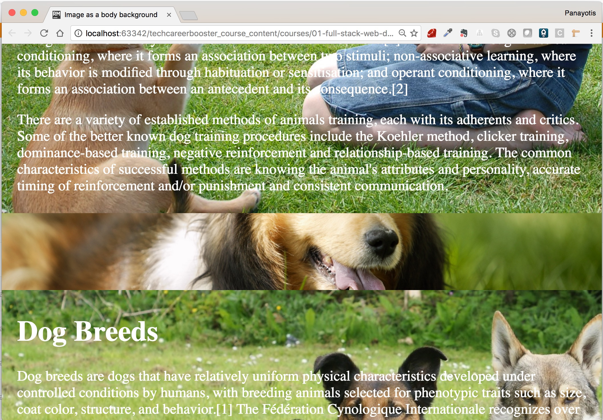

However, we still have to solve 2nd problem. We want to have a gap between the bottom edge of the "Dog Breeds" container and the bottom of the page.

## Bottom Margin Will Not Work

If you try to add a bottom margin to `#dog-breeds` container, e.g. `margin-bottom: 150px;` like we have for the `#dog-training` container, then
you will see that the margin is added, but extends below the bottom edge of the `body` element.

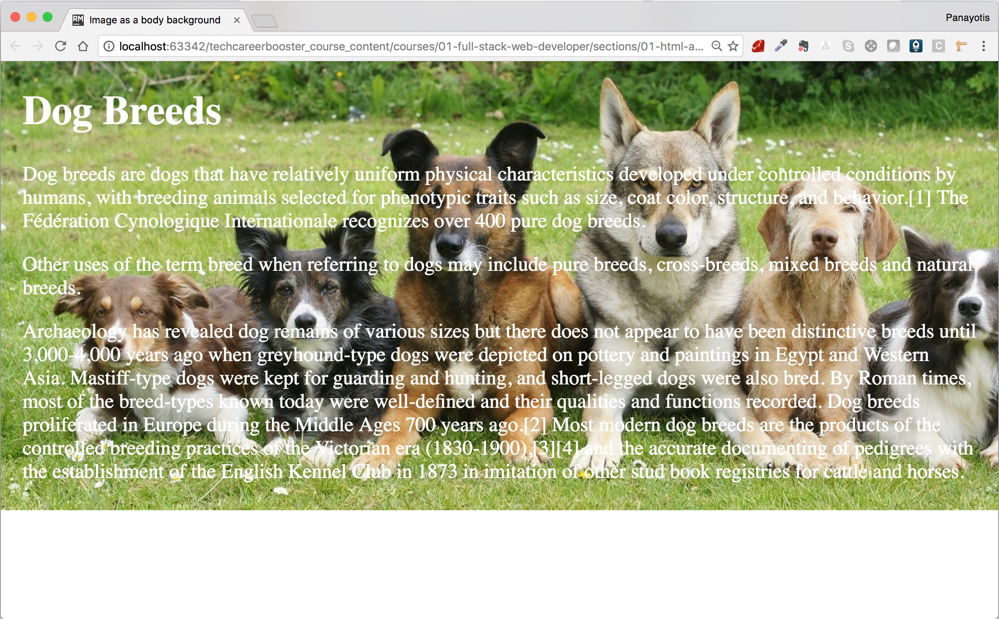

> *Note:* Why bottom margin is a problem? See later on.

## A Blank Div Will Do
 
However, if we add a div with a blank space in it and height equal to the number of pixels we want the bottom gap to be, problem is solved. Here is the CSS:

``` css
html {
    height: 100%;
    background-color: White;
}
body {
    min-height: 100%;
    background-image: url("../images/nice-looking-dog.jpg");
    background-repeat: no-repeat;
    background-attachment: fixed;
    background-position: center;
    background-size: cover;
    margin: 0;
}

#main-header {
    color: White;
    font-size: 50px;
    text-align: center;
    padding: 30px;
    background-color: rgba(0, 0, 0, 0.2);
    margin-bottom: 150px;
}
#dog-training {
    background-image: url("../images/dog-training.jpg");
    background-repeat: no-repeat;
    background-size: cover;
    font-size: 28px;
    padding: 10px 30px;
    color: white;
    margin-bottom: 150px;
}

#dog-breeds {
    background-image: url("../images/dog-breeds.jpg");
    background-repeat: no-repeat;
    background-size: cover;
    font-size: 28px;
    padding: 10px 30px;
    color: white;
}

#bottom-gap {
    height: 150px;
}
```

And here is the HTML:

``` html
<!DOCTYPE html>
<html>
  <head>
    <meta charset="utf-8">
    <title>Image as a body background</title>
    <link rel="stylesheet" href="stylesheets/main.css" type="text/css">
  </head>
  <body>
    <div id="main-header">Happy Dogs</div>

    <div id="dog-training">
      <h1>Dog Training</h1>
      <p>Dog training is the application of behavior analysis which uses the environmental events of antecedents and consequences to modify
        the behavior of a dog, either for it to assist in specific activities or undertake particular tasks, or for it to participate effectively
        in contemporary domestic life. While training dogs for specific roles dates back to Roman times at least, the training of dogs to be
        compatible household pets developed with suburbanization in the 1950s.
      </p>

      <p>
        A dog learns from every interaction it has with its environment.[1] This can be through classical conditioning, where
        it forms an association between two stimuli; non-associative learning, where its behavior is modified through habituation
        or sensitisation; and operant conditioning, where it forms an association between an antecedent and its consequence.[2]
      </p>

      <p>
        There are a variety of established methods of animals training, each with its adherents and critics. Some of the better
        known dog training procedures include the Koehler method, clicker training, dominance-based training, negative reinforcement
        and relationship-based training. The common characteristics of successful methods are knowing the animal's attributes and
        personality, accurate timing of reinforcement and/or punishment and consistent communication.
      <p>
    </div>

    <div id="dog-breeds">
      <h1>Dog Breeds</h1>
      <p>Dog breeds are dogs that have relatively uniform physical characteristics developed under controlled conditions by humans,
        with breeding animals selected for phenotypic traits such as size, coat color, structure, and behavior.[1] The Fédération Cynologique
        Internationale recognizes over 400 pure dog breeds.
      </p>

      <p>
        Other uses of the term breed when referring to dogs may include pure breeds, cross-breeds, mixed breeds and natural breeds.
      </p>

      <p>
        Archaeology has revealed dog remains of various sizes but there does not appear to have been distinctive breeds until 3,000-4,000 years ago
        when greyhound-type dogs were depicted on pottery and paintings in Egypt and Western Asia. Mastiff-type dogs were kept for guarding and hunting,
        and short-legged dogs were also bred. By Roman times, most of the breed-types known today were well-defined and their qualities and functions recorded.
        Dog breeds proliferated in Europe during the Middle Ages 700 years ago.[2] Most modern dog breeds are the products of the controlled breeding practices
        of the Victorian era (1830-1900),[3][4] and the accurate documenting of pedigrees with the establishment of the English Kennel Club in 1873 in imitation
        of other stud book registries for cattle and horses.
      <p>
    </div>
    
    <div id="bottom-gap">
      &nbsp;
    </div>
  </body>
</html>
```

If you save the above CSS file and reload your page, you will see that you finally have the result that you wanted from the beginning. The HTML page is ready.

## Why Bottom Margin Didn't Work?

This is because margins of a contained `div` are not taken into account when calculating the height of the container block element (i.e. of the `body` in our case)
unless there is a `div` next to them that would occupy part of the contained area of the container. In other words, on our case, the bottom margin of the last
`div` is not take into account to calculate the necessary `body` height, and hence, scrolling at the bottom, we can see the white gap created (i.e. the
background image is not used to draw that area).

Having said that, another approach to the requirement to have a bottom gap, below the "Dog Breeds" container would have been the following:
 
1. Add the bottom margin of 150px to the "Dog Breeds" container and
2. Add the `#bottom-gap` container with the blank inside, but without attaching CSS rule to that for its height:

Here is the CSS:

``` css
html {
    height: 100%;
    background-color: White;
}
body {
    min-height: 100%;
    background-image: url("../images/nice-looking-dog.jpg");
    background-repeat: no-repeat;
    background-attachment: fixed;
    background-position: center;
    background-size: cover;
    margin: 0;
}

#main-header {
    color: White;
    font-size: 50px;
    text-align: center;
    padding: 30px;
    background-color: rgba(0, 0, 0, 0.2);
    margin-bottom: 150px;
}
#dog-training {
    background-image: url("../images/dog-training.jpg");
    background-repeat: no-repeat;
    background-size: cover;
    font-size: 28px;
    padding: 10px 30px;
    color: white;
    margin-bottom: 150px;
}

#dog-breeds {
    background-image: url("../images/dog-breeds.jpg");
    background-repeat: no-repeat;
    background-size: cover;
    font-size: 28px;
    padding: 10px 30px;
    color: white;
    margin-bottom: 150px;
} 
```

The HTML remains the same like before.

## Move Background to HTML instead

Another alternative, would have been to move the background image at the `html` level rather than the `body` level. Do you want to try that?

> **Important**: CSS is an old technology that evolves over time, now being in CSS3. The same problem can be solved with different techniques.
This chapter presents some of the techniques. It is 100% sure, that you will learn more the more you practice and study front-end development. 

## DRYing our Code

Did we finish? **No**. The fact that the result is the one that we want, does not mean that we have done good job. We need to take care of our code too.
Our code needs to be clean and with as few repetitions as possible.

> **Important:** You need to be DRY with your code. This is a general rule that, if followed, creates a code base that it is easy to maintain.
DRY stands for **D**on't **R**epeat **Y**ourself. It essentially advice you to avoid code repetitions as a code reuse method. Code should not be
reused by copying/pasting techniques, but should be reused with the help of the tools that the language you write the code to provides you with.
We will repeat this advice many times within the course and you will learn which tools are helping you to DRY your code.

Our CSS file contains a lot of repetition that we need to eliminate. Here is what we mean:

1. `dog-training` and `dog-breeds` containers have all their CSS properties in common, except from the background image. Hence, we need to find a way to
specify the common properties only once.
2. `dog-training`, `dog-breeds` and `main-header` containers have all a bottom margin of `150px` height. We need to find a way to specify this only once.

Here is the final DRYed CSS code:
``` css
html {
    height: 100%;
    background-color: White;
}
body {
    min-height: 100%;
    background-image: url("../images/nice-looking-dog.jpg");
    background-repeat: no-repeat;
    background-attachment: fixed;
    background-position: center;
    background-size: cover;
    margin: 0;
}

.block-element {
    margin-bottom: 150px;
}

#main-header {
    color: White;
    font-size: 50px;
    text-align: center;
    padding: 30px;
    background-color: rgba(0, 0, 0, 0.2);
}

#dog-training {
    background-image: url("../images/dog-training.jpg");
}

#dog-breeds {
    background-image: url("../images/dog-breeds.jpg");
}

#dog-training, #dog-breeds {
    background-repeat: no-repeat;
    background-size: cover;
    font-size: 28px;
    padding: 10px 30px;
    color: white;
}
```

As you can see above

1. We specify one class with name `.block-element` that can be used for the 3 containers that require the same bottom margin.
2. We have specified only once the CSS properties for `dog-training` and `dog-breeds` that are common to both of them.

Don't forget to use the class `.block-element` inside your HTML content. It needs to be applied to all 3 containers.

### Background Size

Here, we would like to draw your attention to the fact that the value `cover` for `background-size` crops the image.

Let's see an example. Look at the following page:
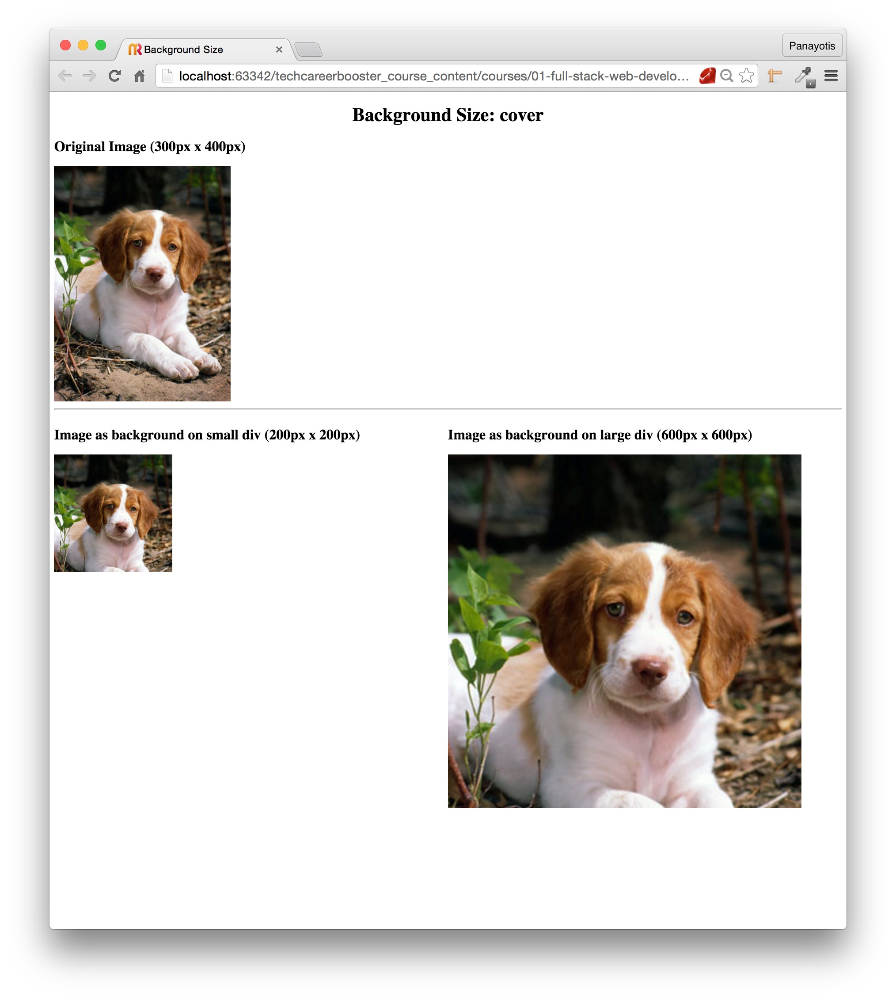

The above page shows how a background image is applied with value `cover` for its background-size property. It is used as a background to the two bottom divs. Above, you see
the original image. As you can see, the bottom images are cropped. The legs of the dog are not visible any more. This is because we have used the value `cover` for the
`background-size` property.

If you want the div to contain the whole image, you will need to use the value `100% 100%;` for the background-size property. The first `100%` is for the width of the
image and the second one is for the height. With these values, we are asking the browser to make sure that the dimensions of the image drawn are equal to the div it is attached to.

This is the result of the previous page, but with `background-size: 100% 100%;` used (instead of `background-size: cover`).

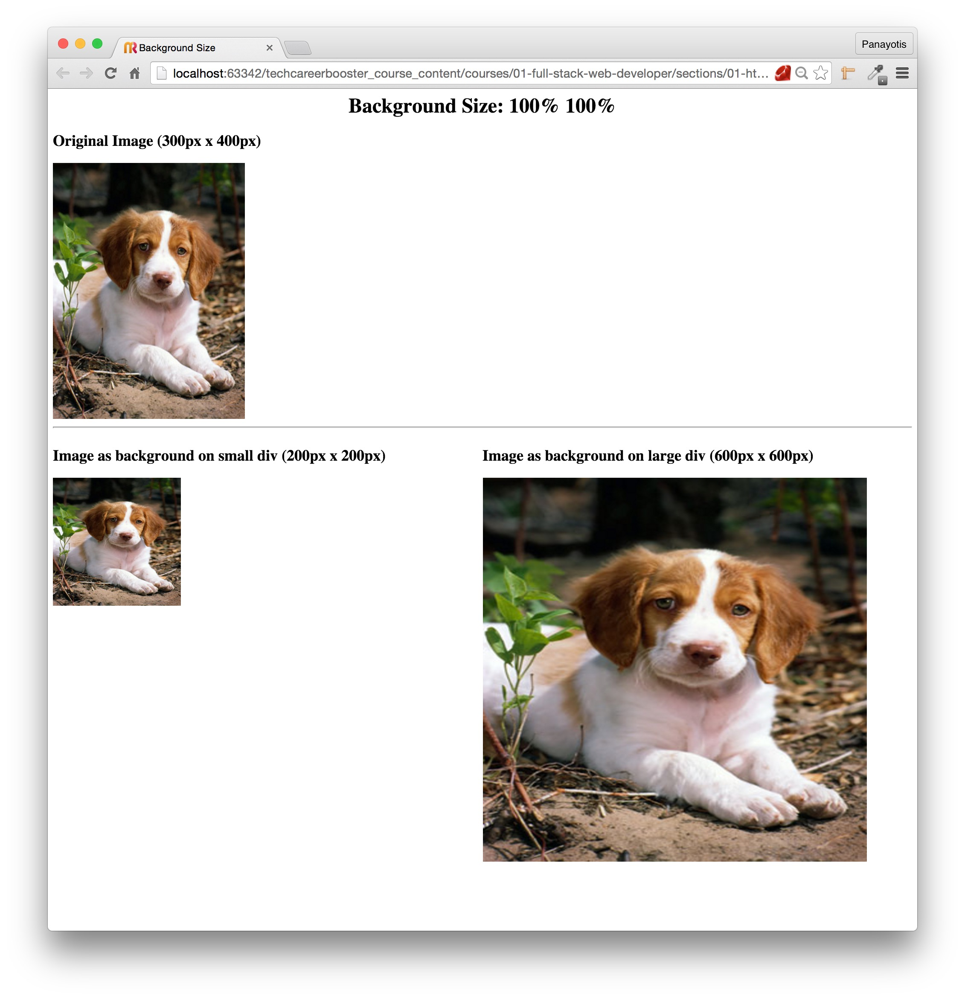

As you can see above, the images on the bottom divs are not cropped, if compared to the original image. However, they are stretched. This is because the containers are
square (200 x 200 and 600 x 600) whereas the original image is a portrait image with width less than height.

Hence, if you decide to use `background-size: 100% 100%;` make sure that your divs have size which is analogous to the original image, so that the aspect ratio (width size / height size)
is reserved. Otherwise, your images will not look good (unless this is what you want in the first place).

For the sake of completeness, we are giving you here the source code of the above two pages:

HTML for cover case:

``` html
<!DOCTYPE html>
<html>
  <head>
    <meta charset="utf-8">
    <title>Background Size</title>
    <link rel="stylesheet" href="stylesheets/main.css" type="text/css">
  </head>

  <body>
    <h1>Background Size: cover</h1>
    <h2>Original Image (300px x 400px)</h2>
    <div>
      
    </div>

    <hr/>

    <div id="left-column" class="column">
      <h2>Image as background on small div (200px x 200px)</h2>

      <div id="small-div" class="image-background">
      </div>
    </div>

    <div id="right-column" class="column">
      <h2>Image as background on large div (600px x 600px)</h2>
      <div id="large-div" class="image-background">
      </div>
    </div>

  </body>
</html>
```

CSS for cover case:

``` css
body {
    height: 1300px;
}

.column {
    width: 50%;
    float: left;
}

h1 {
    text-align: center;
}

.image-background {
    background-repeat: no-repeat;
    background-position: top left;
    background-size: cover;
}

#small-div {
    width: 200px;
    height: 200px;
    background-image: url("../images/cute-medium-sized-dog.jpg");
}

#large-div {
    width: 600px;
    height: 600px;
    background-image: url("../images/cute-medium-sized-dog.jpg");
}
```

HTML for 100% 100% case:

``` html
<!DOCTYPE html>
<html>
  <head>
    <meta charset="utf-8">
    <title>Background 100% 100%</title>
    <link rel="stylesheet" href="stylesheets/main.css" type="text/css">
  </head>

  <body>
    <h1>Background Size: 100% 100%</h1>
    <h2>Original Image (300px x 400px)</h2>
    <div>
      
    </div>

    <hr/>

    <div id="left-column" class="column">
      <h2>Image as background on small div (200px x 200px)</h2>

      <div id="small-div" class="image-background">
      </div>
    </div>

    <div id="right-column" class="column">
      <h2>Image as background on large div (600px x 600px)</h2>
      <div id="large-div" class="image-background">
      </div>
    </div>

  </body>
</html>
````

CSS for 100% 100% case:

``` css
body {
    height: 1300px;
}

.column {
    width: 50%;
    float: left;
}

h1 {
    text-align: center;
}

.image-background {
    background-repeat: no-repeat;
    background-position: top left;
    background-size: 100% 100%;
}

#small-div {
    width: 200px;
    height: 200px;
    background-image: url("../images/cute-medium-sized-dog.jpg");
}

#large-div {
    width: 600px;
    height: 600px;
    background-image: url("../images/cute-medium-sized-dog.jpg");
}
```

### Background Color

Having used all the `background-x` properties here, I would like to tell you that you can specify the CSS property `background-color` alongside the
`background-image` property. This is done if we want the browser to fall back to background color if cannot load the background image.

### `background` shorthand property

You will often see CSS code using the `background` property instead of the specific `background-x` properties that we have learned above.
The `background` property is used as a shorthand, to specify the values for all the following `background-x` properties and in this order:

1. `background-color`
1. `background-image`
1. `background-repeat`
1. `background-attachment`
1. `background-position`

So, the following two CSS fragments are equivalent:

``` css
body {
    background-color: maroon;
    background-image: url("../images/architecture-body-background-image.jpg");
    background-repeat: no-repeat;
    background-attachment: fixed;
    background-position: center;
    background-size: cover;
}
```

and

``` css
body {
    background: maroon url("../images/architecture-body-background-image.jpg") no-repeat fixed center;
    background-size: cover;
}
```

**Note** that `background-size` is not part of the `background` shorthand property and needs to be specified separately.

Note also that, when using the `background` shorthand, you do not have to specify values for all the properties, as long as the ones specified are in the correct order:

* **C**olor
* **I**mage
* **R**epeat
* **A**ttachment
* **P**osition

Try to memorize this acronym: **C** **I** **R** **A** **P**. It will help you remember the order of the `background-x` properties inside the `background` shorthand.

Also, when you specify the background properties separately, try to put them in the same order, like this:

``` css
body {
    background-color: maroon;
    background-image: url("../images/architecture-body-background-image.jpg");
    background-repeat: no-repeat;
    background-attachment: fixed;
    background-position: center;
    background-size: cover;
}
```
and not like this:

``` css
body {
    background-color: maroon;
    background-position: center;
    background-repeat: no-repeat;
    background-attachment: fixed;
    background-image: url("../images/architecture-body-background-image.jpg");
    background-size: cover;
}
```

