Until now, we have learned how to place HTML elements on our page, but we didn't have too much freedom with regards to
where exactly on the page we could place our elements.

### Inline Elements

The elements are positioned one next to the other, when they are
siblings, and one inside the other when they have containing-contained (parent-child) relationship.

Look at the following HTML code. Write it, save it to a file and load the page:

``` html
<!DOCTYPE html>
<html>
  <head>
    <meta charset="utf-8">
    <title>Elements One Next to Each Other</title>
  </head>

  <body>

    <a href="https://www.google.com">Google</a>
    <strong>This is a strong phrase. </strong>
    <a href="https://www.nationalgeographic.com">National Geographic</a>

  </body>

</html>
```

If you load this page on your browser, you will see this:

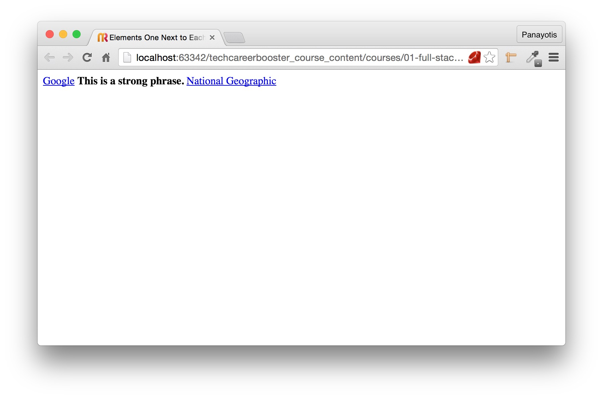

As you can see, browser starts to draw elements, from top left, one by one, putting the 3 inline elements that this page includes, one next to the other. If there is enough space
for all of them to be printed on the same line, they will. Otherwise, there is going to be a wrapping and ending part of the line will be printed below the starting part of it.

Try for example the following:

``` html
<!DOCTYPE html>
<html>
  <head>
    <meta charset="utf-8">
    <title>Elements One Next to Each Other - With ./images/Wrapping</title>
  </head>

  <body>

    <a href="https://www.google.com">Google</a>
    <strong>This is a strong phrase. </strong>
    <a href="https://www.nationalgeographic.com">National Geographic</a>
    <a href="https://www.animalplanet.com">Animal Planet</a>
    <em>This is an emphasized phrase. </em>
    <a href="http://www.fiba.com/">FIBA - International Basketball Federation</a>

  </body>

</html>
```
If you reload this on your browser, you will see this:
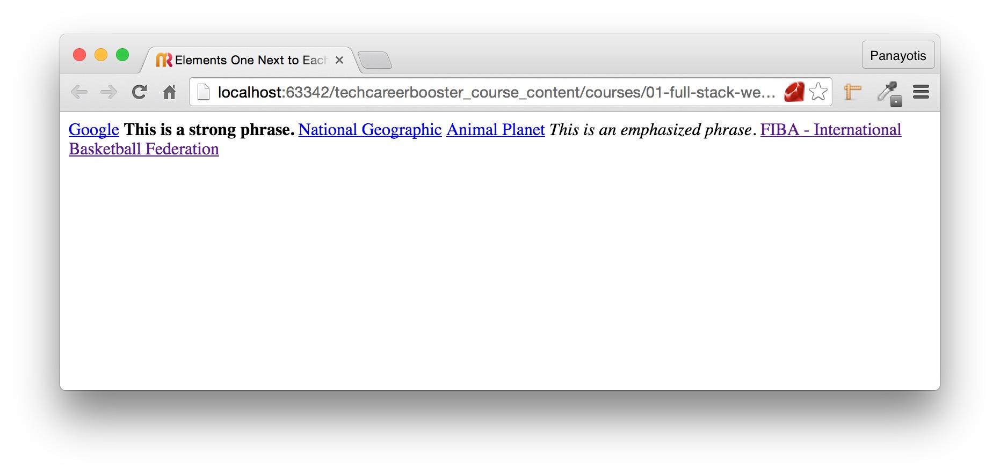

As you can see above (make sure your browser window is quite narrow), when there is not much space, there is a wrapping of text to the next line.

But still, the elements are drawn one after the other, exactly in the order they appear inside the HTML document.

### Block Elements

Block elements is one way we can start controlling, little-by-little, the position an HTML element is drawn on the page. Still, with limited capabilities, the
block element is drawn on a completely new line, occupies the whole available width and any other HTML element before that or after that are drawn on different lines.
So, a block element occupies the whole line without any other element left or right to it.

Let's put a block element in between the existing inline elements, on our last HTML page:

``` html
<!DOCTYPE html>
<html>
  <head>
    <meta charset="utf-8">
    <title>Elements One Next to Each Other - Block Elements</title>
  </head>

  <body>

    <a href="https://www.google.com">Google</a>
    <strong>This is a strong phrase. </strong>
    <a href="https://www.nationalgeographic.com">National Geographic</a>
    <p>
      Michael Jeffrey Jordan (born February 17, 1963), also known by his initials, MJ,[1] is an American former professional basketball player.
      He is also a businessman, and principal owner and chairman of the Charlotte Hornets. Jordan played 15 seasons in the National Basketball
      Association (NBA) for the Chicago Bulls and Washington Wizards. His biography on the NBA website states: "By acclamation, Michael Jordan
      is the greatest basketball player of all time."[2] Jordan was one of the most effectively marketed athletes of his generation and was
      considered instrumental in popularizing the NBA around the world in the 1980s and 1990s
    </p>
    <a href="https://www.animalplanet.com">Animal Planet</a>
    <em>This is an emphasized phrase. </em>
    <a href="http://www.fiba.com/">FIBA - International Basketball Federation</a>

  </body>

</html>
```

If you save and load this page on your browser, you will see something like this:


We have added a `<p>` element, which is a block element and you can see how the block element stays "alone", with a blank line before and after it to separate it from their
siblings.

### Float Property

Besides the `block` elements, another tool that we have learned to help us position elements on the canvas, the drawing area, is the `float` property. With `float: left;`, the
element occupies the first top left position available. With `float: right;`, occupies the first top right position available. We have seen that, when we tried to put text around
an image, like in the following HTML example:

``` html
<!DOCTYPE html>
<html>
  <head>
    <meta charset="utf-8">
    <title>Elements One Next to Each Other - Float Image</title>
    <link rel="stylesheet" href="stylesheets/main.css" type="text/css">
  </head>

  <body>

    <a href="https://www.google.com">Google</a>
    <strong>This is a strong phrase. </strong>
    <a href="https://www.nationalgeographic.com">National Geographic</a>
    <p>
       Michael Jeffrey Jordan (born February 17, 1963), also known by his initials, MJ,[1] is an American former professional basketball player.
      He is also a businessman, and principal owner and chairman of the Charlotte Hornets. Jordan played 15 seasons in the National Basketball
      Association (NBA) for the Chicago Bulls and Washington Wizards. His biography on the NBA website states: "By acclamation, Michael Jordan
      is the greatest basketball player of all time."[2] Jordan was one of the most effectively marketed athletes of his generation and was
      considered instrumental in popularizing the NBA around the world in the 1980s and 1990s
    </p>
    <a href="https://www.animalplanet.com">Animal Planet</a>
    <em>This is an emphasized phrase. </em>
    <a href="http://www.fiba.com/">FIBA - International Basketball Federation</a>

  </body>

</html>
```
with CSS:

``` css
img {
    float: left;
    padding: 0 10px;
    width: 80px;
}
```

If you save the above files and reload your page, you will see something like that:

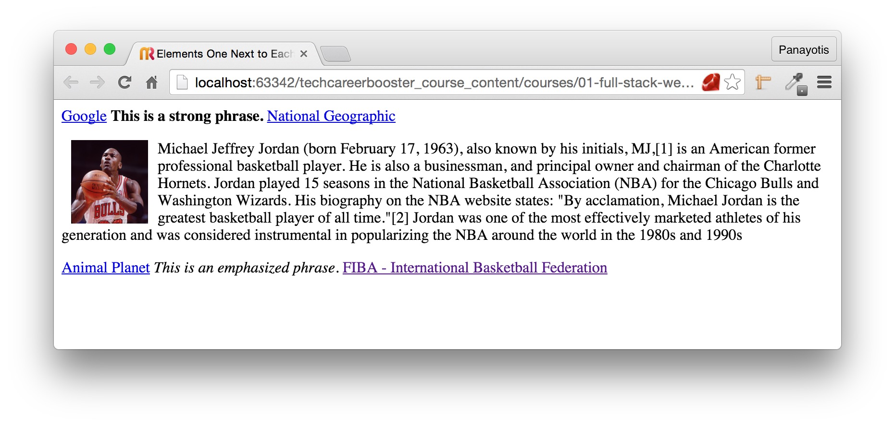

### Clear Property

We have also learned about the `clear` property. Elements next to a floating element will float around it. If we want to stop that, then we use the `clear` property. So, with `clear:left;` we prevent any floating element exist to the
left of the element this property applies to.

See the following example:

``` html
<!DOCTYPE html>
<html>
  <head>
    <meta charset="utf-8">
    <title>Float and Clear Example</title>
    <link rel="stylesheet" href="stylesheets/main.css" type="text/css">
  </head>

  <body>

    <div id="left-column" class="column">
      Left Column
    </div>

    <div id="right-column" class="column">
      Right Column
    </div>

    <div id="footer">
      Footer
    </div>

  </body>

</html>
```
with CSS:
``` css
.column {
    width: 20%;
    background-color: Maroon;
    color: white;
}

#left-column {
    float: left;
}

#right-column {
    float: right;
}

#footer {
    background-color: #5F5F5F;
    color: White;
    clear: left;
}
```

If you save those files and reload your page you will see this:


As you can see from the CSS, the left column floats left, the right column floats right and footer is on new line because it has `clear: left;` which prevents any floating element
left to itself. Try to remove the `clear: left;` property rule and reload your page. What you will see?
Note that, `clear` can take the value `right` and the value `both`, which refers to both sides of an element.

And that was the summary of the tools that we have learned until now, about influencing the position of elements on our page.

1. block vs inline elements
2. float and clear properties

The position of the elements on the HTML canvas is affected also by the CSS property with name `position`. By default, the value of this property is `static`. Static
position means that the element will be positioned next to the previous one, as we described above.

### Positioning Relative to Browser Window

Sometimes, we want to be able to position an element to a position relative to the browser window. For example, let's suppose that we want to create a bottom fixed footer like
this:


When you resize this page, the footer always stays at the bottom. Watch the following video to understand what we mean:

<div id="media-title-video-Footer is fixed to the bottom">Footer is fixed to the bottom</div>
<a href="https://player.vimeo.com/video/194009024"></a>
           
Let's see how we can achieve this. First we write the HTML content:

``` html
<!DOCTYPE html>
<html>
  <head>
    <meta charset="utf-8">
    <title>Bottom Fixed Footer</title>
    <link rel="stylesheet" href="stylesheets/main.css" type="text/css">
  </head>

  <body>

    <div id="footer">
      &copy; 2016 Tech Career Booster - <a href="#">About</a> - <a href="#">Contact</a>
    </div>

  </body>

</html>
```

And let's start with a simple CSS file (`stylesheets/main.css`):

``` css
* {
    box-sizing: border-box;
}

body {
    margin: 0;
}

#footer {
    text-align: center;
    background-color: Maroon;
    color: White;
    padding: 10px 0;
}

a {
    text-decoration: none;
    color: inherit;
}
```

If you save these files and load your page, you will see this:


As you can see, our footer appears on top of the browser window. This is expected, as we said earlier. The elements are drawn from top left to right, in the order they appear
inside the HTML content.

In order to ask browser to draw the element on specific position relative to the browser window, you need to use the `position` property with value `fixed`.

Let's do that. In CSS file, in `#footer` selector, we add `position: fixed;`.

```
* {
    box-sizing: border-box;
}

body {
    margin: 0;
}

#footer {
    text-align: center;
    background-color: Maroon;
    color: White;
    padding: 10px 0;
    position: fixed;
}

a {
    text-decoration: none;
    color: inherit;
}
```

If we save the file and reload the page, we will see this:

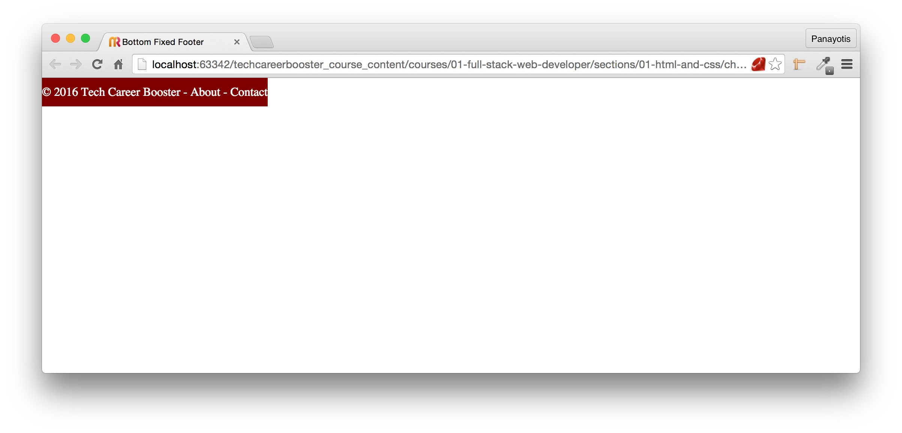

Hmmmmmm. Something strange has happened when we set the `position: fixed;` property to our div. For some reason, it does not occupy the whole available width. But it occupies only the
width necessary to host its content. Before we deal with the width of our footer, we will first deal with its actual position.

#### `bottom` property

Now it is drawn on the top left of the browser window.
What we want is to be drawn at the bottom of the browser window. We will use the `bottom` property. Add the property `bottom` with value `0` for the footer element.

Our CSS becomes:

``` css
* {
    box-sizing: border-box;
}

body {
    margin: 0;
}

#footer {
    text-align: center;
    background-color: Maroon;
    color: White;
    padding: 10px 0;
    position: fixed;
    bottom: 0;
}

a {
    text-decoration: none;
    color: inherit;
}
```

And if you reload the page, you will see this:

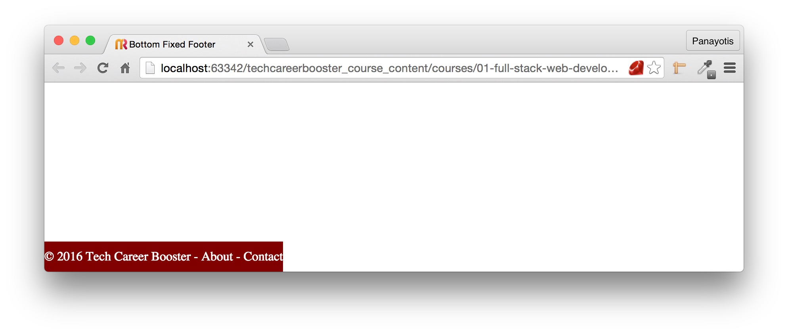

Nice. The `bottom` property worked. It specifies the bottom margin distance from the bottom side of the browser window. For example, if you set that to `100px`, and reload
your page, you will see that:

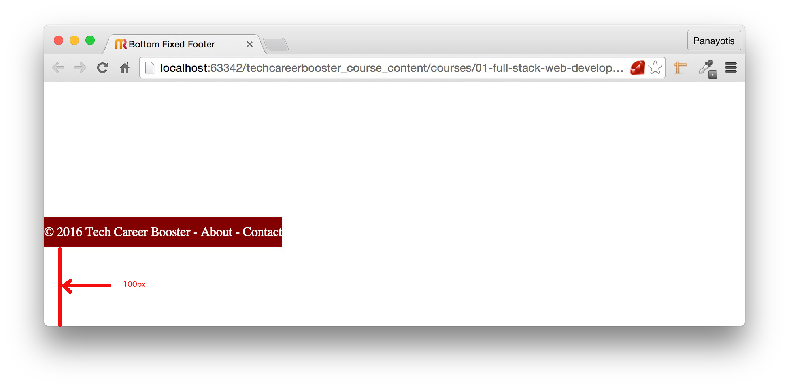

As you can see, there is a distance of the bottom margin of the footer box equal to 100px from the bottom side of the browser window.

Now, let's revert this value back to `0`, since we want our footer to be at the very bottom of the browser window.

What we have to fix now, is the width of the element. The problem with the width started when we specified the `position` property to `fixed`. This is because positioned blocked
elements do not occupy the whole width. They occupy the width necessary to host their content. Unless we specify the width explicitly. On our particular case, we want the
element to occupy the whole width of the element it is using to position itself relative to. Hence, if we specify the width to be 100%, then we make sure that the footer element
will have the width equal to the width of the browser window.

Let's do that. Have your CSS rules be as follows:

``` css
* {
    box-sizing: border-box;
}
body {
    margin: 0;
}

#footer {
    text-align: center;
    background-color: Maroon;
    color: White;
    padding: 10px 0;
    position: fixed;
    bottom: 0;
    width: 100%;
}

a {
    text-decoration: none;
    color: inherit;
}
```

Basically, we have only added one more rule for the footer element. The one that sets its width to 100% value. If you save this file
and reload your page, you will see this:


which is exactly what we wanted to achieve. If you resize your browser, you will see that the footer stays always at the bottom.

Besides this property, i.e. footer staying always at the bottom, you will see also that the footer is not covered by other content of the HTML page, but it stays on the foreground.
Let's try to amend our HTML page content:

``` html
<!DOCTYPE html>
<html>
  <head>
    <meta charset="utf-8">
    <title>Bottom Fixed Footer</title>
    <link rel="stylesheet" href="stylesheets/main.css" type="text/css">
  </head>

  <body>

    <div id="footer">
      &copy; 2016 Tech Career Booster - <a href="#">About</a> - <a href="#">Contact</a>
    </div>


    <div id="main-content">
      <p>Kilimanjaro rises approximately 4,877 metres (16,001 ft) from its southern base in the plains near the municipality of Moshi to its summit height of 5,895 metres
        (19,341 ft).[2] Kilimanjaro is the highest volcano outside South America.[7]
      </p>

      <p>
      Kilimanjaro is a large stratovolcano and is composed of three distinct volcanic cones: Kibo, the highest; Mawenzi at 5,149 metres (16,893 ft);[8] and Shira,
      the shortest at 4,005 metres (13,140 ft).[9] Mawenzi and Shira are extinct, while Kibo is dormant and could erupt again.[10]
      </p>

      <p>
      Uhuru Peak is the highest summit on Kibo's crater rim. The Tanzania National Parks Authority, a governmental agency,[1] and the United Nations Educational,
      Scientific and Cultural Organization[2] list the height of Uhuru Peak as 5,895 m (19,341 ft). That height is based on a British Ordnance Survey in 1952.[11] Since
      then, the height has been measured as 5,892 metres (19,331 ft) in 1999, 5,891 metres (19,327 ft) in 2008, and 5,888 metres (19,318 ft) in 2014.[11]
      </p>

      <p>
      The interior of the volcanic edifice is poorly known, given the lack of large scale erosion that could have exposed the interiors of the volcano.[12]
      </p>

      <p>
      Eruptive activity at the Shira centre commenced about 2.5 million years ago, with the last important phase occurring about 1.9 million years ago, just before
      the northern part of the edifice collapsed.[10] Shira is topped by a broad plateau at 3,800 metres (12,500 ft), which may be a filled caldera. The remnant caldera
      rim has been degraded deeply by erosion. Before the caldera formed and erosion began, Shira might have been between 16,000 feet (4,900 m) and 17,000 feet (5,200 m)
      high. It is mostly composed of basic lavas with some pyroclastics. The formation of the caldera was accompanied by lava emanating from ring fractures, but there was
      no large scale explosive activity. Two cones formed subsequently, the phonolitic one at the northwest end of the ridge and the doleritic "Platzkegel" in the caldera centre.[10][12][13]
      </p>

      <p>
      Both Mawenzi and Kibo began erupting about 1 million years ago.[10] They are separared by the "Saddle Plateau" at 4,400 metres (14,400 ft) elevation.[14]:3
      </p>

      <p>
      The youngest dated rocks at Mawenzi are about 448,000 years old.[10] Mawenzi forms a horseshoe shaped ridge with pinnacles and ridges opening to the northeast which
      has a tower like shape resulting from deep erosion and a mafic dyke swarm. Several large cirques cut into the ring, the largest of these sits on top of the Great
      Barranco gorge. Also notable are the Ost and West Barrancos on the northeastern side of the mountain. Most of the eastern side of the mountain has been removed by
      erosion. Mawenzi has a subsidiary peak named Neumann Tower (4,425 metres (14,518 ft)).[10][12][13]
      </p>

      <p>
      Kibo is the largest cone and is more than 15 miles (24 km) wide at the "Saddle Plateau" altitude. The last activity here has been dated to between 150,000
      and 200,000 years ago and created the current Kibo summit crater. Kibo still has gas-emitting fumaroles in the crater.[10][12][13] Kibo is capped by an
      almost symmetrical cone with escarpments rising 180 metres (590 ft) to 200 metres (660 ft) on the south side. These escarpments define a 2.5-kilometre-wide (1.6 mi)
      caldera[15] caused by the collapse of the summit. Within this caldera is the Inner Cone and within the crater of the Inner Cone is the Reusch Crater, which
      the Tanganyika government in 1954 named after Gustav Otto Richard Reusch upon his climbing the mountain for the 25th time (out of 65 attempts during his lifetime).[16][17]
      The Ash Pit, 350 metres (1,150 ft) deep, lies within the Reusch Crater.[18] About 100,000 years ago, part of Kibo's crater rim collapsed, creating the area known as
      the Western Breach and the Great Barranco.[19]
      </p>
    </div>

  </body>

</html>
```
And the CSS file with a rule for `main-content` to have `font-size` equal to `18px`.

If you save the above and reload your page, you will see this:


As you can see above, the footer stays at the bottom, even if it is defined in the HTML content first. Also, you will encounter the footer covers the last part of the
main text. Try to scroll and see whether you are able to view the last part of the text. You will not be able to view it. Watch this video here that demonstrates that:

<div id="media-title-video-How footer covers last part of main text">How footer covers last part of main text</div>
<a href="https://player.vimeo.com/video/194009357"></a>
           
What you can do in order to make sure that the main content is not covered by the footer? You need to make sure that there is enough margin at the bottom of your `body` element,
which is the container for anything you put there. Enough margin means enough for the content to finish before the footer starts.

First, you need to measure the height of the footer. Use the developer tools to do that.

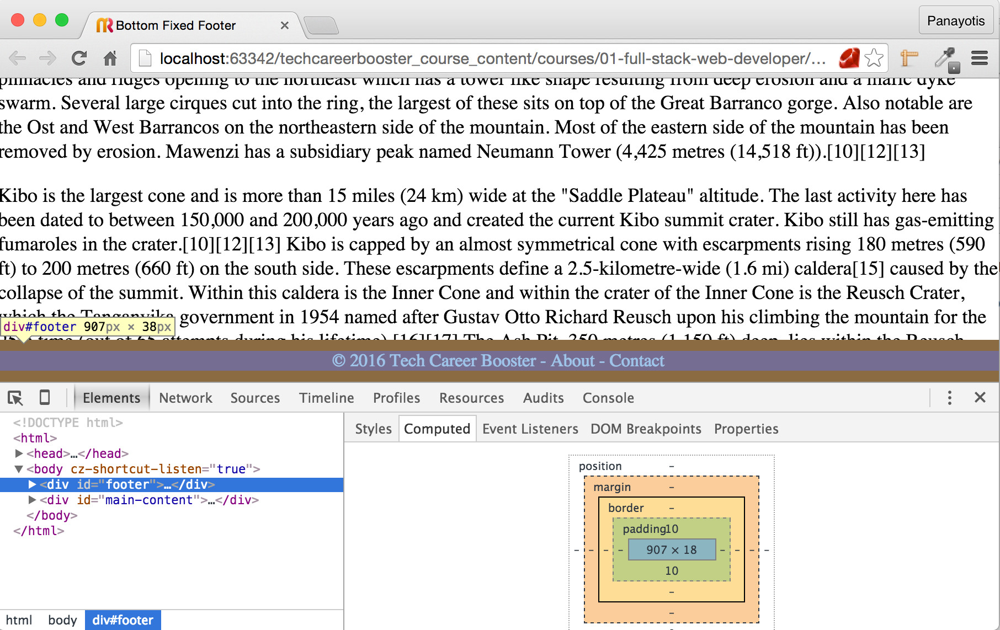

As you can see, the footer height is 38px. (10 for padding top, 10 for padding bottom and 18 for the actual content height). So, if you pick up a bottom margin for the `body` equal
to that number, then you are good to see the whole content of your page. It will not be covered by the footer.

Let's add the CSS rule:

``` css
* {
    box-sizing: border-box;
}
body {
    margin: 0 0 38px;
}

#footer {
    text-align: center;
    background-color: Maroon;
    color: White;
    padding: 10px 0;
    position: fixed;
    bottom: 0;
    width: 100%;
}

a {
    text-decoration: none;
    color: inherit;
}

#main-content {
    font-size: 18px;
}
```

As you can see above, we have changed the `margin` value for `body` so that the margin bottom has the value `38px`. Let's save that and reload the page.

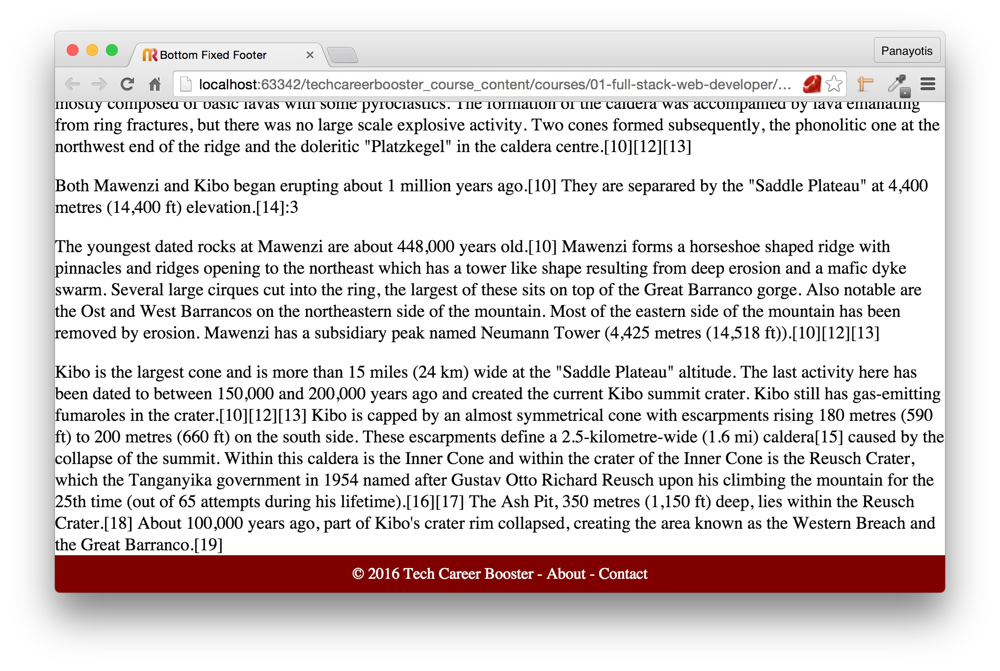

If you reload your page and scroll at the bottom, you will, now, be able to see the last part of the content, which was previously hidden by the footer. Now, the footer does
not hide it anymore, because the `body` element, which contains the main content, now has a `margin-bottom` equal to the value of the height of the footer.

#### `top`, `left`, `right`

Except from the `bottom` property, we can use the `top`, `left` and `right` properties to specify the exact position of the element we want to position on our page.

##### `top`

The `top` is used to set the position of an element by specifying the position of its top margin relative to the top margin of the browser window.

Let's enhance our last HTML page in order to include a top navigation bar. This is the sample page that we want to build:


This page has a top and bottom navigation, bar. When the user scrolls to visit the bottom of the content, both bars remain on their position. Also, the
start and bottom of text are not hidden by the nav bars respectively. There is also one more property: when we click on the top nav bar links the text
scrolls automatically at that position.

Watch this video in order to understand how this page works:

<div id="media-title-video-Page with top and bottom nav bar">Page with top and bottom nav bar</div>
<a href="https://player.vimeo.com/video/194010525"></a>

Let's start with the HTML having the top navigation bar content:

``` html
<!DOCTYPE html>
<html>
  <head>
    <meta charset="utf-8">
    <title>Fixed Footer & Header</title>
    <link rel="stylesheet" href="stylesheets/main.css" type="text/css">
  </head>

  <body>
    <div id="header">
      <a href="#start">Top</a>
      <a href="#uhuru-peak">Uhuru Peak</a>
      <a href="#shira">Shira</a>
      <a href="#mawenzi">Mawenzi</a>
      <a href="#kibo">Kibo</a>
    </div>

    <div id="footer">
      &copy; 2016 Tech Career Booster - <a href="#">About</a> - <a href="#">Contact</a>
    </div>


    <div id="main-content">
      <p id="start" class="bookmark"><strong>Kilimanjaro</strong> rises approximately 4,877 metres (16,001 ft) from its southern base in the plains near the municipality of Moshi to its summit height of 5,895 metres
        (19,341 ft).[2] Kilimanjaro is the highest volcano outside South America.[7]
      </p>

      <p>
      Kilimanjaro is a large stratovolcano and is composed of three distinct volcanic cones: Kibo, the highest; Mawenzi at 5,149 metres (16,893 ft);[8] and Shira,
      the shortest at 4,005 metres (13,140 ft).[9] Mawenzi and Shira are extinct, while Kibo is dormant and could erupt again.[10]
      </p>

      <p id="uhuru-peak" class="bookmark">
      <strong>Uhuru Peak</strong> is the highest summit on Kibo's crater rim. The Tanzania National Parks Authority, a governmental agency,[1] and the United Nations Educational,
      Scientific and Cultural Organization[2] list the height of Uhuru Peak as 5,895 m (19,341 ft). That height is based on a British Ordnance Survey in 1952.[11] Since
      then, the height has been measured as 5,892 metres (19,331 ft) in 1999, 5,891 metres (19,327 ft) in 2008, and 5,888 metres (19,318 ft) in 2014.[11]
      </p>

      <p>
      The interior of the volcanic edifice is poorly known, given the lack of large scale erosion that could have exposed the interiors of the volcano.[12]
      </p>

      <p id="shira" class="bookmark">
      Eruptive activity at the <strong>Shira</strong> centre commenced about 2.5 million years ago, with the last important phase occurring about 1.9 million years ago, just before
      the northern part of the edifice collapsed.[10] Shira is topped by a broad plateau at 3,800 metres (12,500 ft), which may be a filled caldera. The remnant caldera
      rim has been degraded deeply by erosion. Before the caldera formed and erosion began, Shira might have been between 16,000 feet (4,900 m) and 17,000 feet (5,200 m)
      high. It is mostly composed of basic lavas with some pyroclastics. The formation of the caldera was accompanied by lava emanating from ring fractures, but there was
      no large scale explosive activity. Two cones formed subsequently, the phonolitic one at the northwest end of the ridge and the doleritic "Platzkegel" in the caldera centre.[10][12][13]
      </p>

      <p>
      Both Mawenzi and Kibo began erupting about 1 million years ago.[10] They are separared by the "Saddle Plateau" at 4,400 metres (14,400 ft) elevation.[14]:3
      </p>

      <p id="mawenzi" class="bookmark">
      The youngest dated rocks at <strong>Mawenzi</strong> are about 448,000 years old.[10] Mawenzi forms a horseshoe shaped ridge with pinnacles and ridges opening to the northeast which
      has a tower like shape resulting from deep erosion and a mafic dyke swarm. Several large cirques cut into the ring, the largest of these sits on top of the Great
      Barranco gorge. Also notable are the Ost and West Barrancos on the northeastern side of the mountain. Most of the eastern side of the mountain has been removed by
      erosion. Mawenzi has a subsidiary peak named Neumann Tower (4,425 metres (14,518 ft)).[10][12][13]
      </p>

      <p id="kibo" class="bookmark">
      <strong>Kibo</strong> is the largest cone and is more than 15 miles (24 km) wide at the "Saddle Plateau" altitude. The last activity here has been dated to between 150,000
      and 200,000 years ago and created the current Kibo summit crater. Kibo still has gas-emitting fumaroles in the crater.[10][12][13] Kibo is capped by an
      almost symmetrical cone with escarpments rising 180 metres (590 ft) to 200 metres (660 ft) on the south side. These escarpments define a 2.5-kilometre-wide (1.6 mi)
      caldera[15] caused by the collapse of the summit. Within this caldera is the Inner Cone and within the crater of the Inner Cone is the Reusch Crater, which
      the Tanganyika government in 1954 named after Gustav Otto Richard Reusch upon his climbing the mountain for the 25th time (out of 65 attempts during his lifetime).[16][17]
      The Ash Pit, 350 metres (1,150 ft) deep, lies within the Reusch Crater.[18] About 100,000 years ago, part of Kibo's crater rim collapsed, creating the area known as
      the Western Breach and the Great Barranco.[19]
      </p>
    </div>

  </body>

</html>
```

The differences, if compared to the previous HTML page content, are:

1. We have the div with id `header` that has the 4 links that function as page navigation links.
2. Each link on the top navigation bar is a link to a bookmark, position inside the same page itself.
3. Inside the `main-content` div, there are the corresponding menu link targets. The targets are `p` elements
 with the correct `id` value (`start`, `uhuru-peak`, `shira`, `mawenzi`, `kibo`).
4. Besides the `id` attribute, the `p` elements that are targets of the links, they have a class `bookmark` that will
be used to style them. See later on about this.

Update your CSS file to be as follows:

``` css
* {
    box-sizing: border-box;
}

body {
    margin: 38px 0 38px;
}

#footer {
    text-align: center;
    background-color: Maroon;
    color: White;
    padding: 10px 0;
    position: fixed;
    bottom: 0;
    width: 100%;
}

a {
    text-decoration: none;
    color: inherit;
}

#main-content {
    font-size: 18px;
}

#header {
    background-color: darkblue;
    color: white;
    padding: 10px 0;
    text-align: center;
    position: fixed;
    top: 0;
    width: 100%;
}

#header a {
    padding: 10px 10px;
    text-transform: uppercase;
    letter-spacing: 4px;
}

#header a:hover {
    background-color: white;
    color: darkblue;
}
```

Things to note here are the following:

1. We have added a top margin to `body` element like we have for bottom. It is `38px` height and it will serve the same purpose like the one bottom does. Will allow the start part of
the text to be visible and not hidden by the top navigation bar.
2. The `#header` CSS selector applies rules for the top navigation bar. They are almost the same like the ones for the `#footer` except from the colors that we are using. Note that
it is important here to specify the `top` property with value `0`. If it is not specified, then it has the default value `auto`, and in that case, the browser automatically
calculates the position of the element. The automatic position is not always the best and depends on other parts of the HTML content. Hence, if you omit the `top: 0;` setting,
you will see that the top nav bar is not placed at the top.
3. We have some styling for the header anchor links. See the `text-transform` property, which is used to make all characters of the links uppercase. Also, see the `letter-spacing` property
which is used to allow for same space in between the characters of the words of the links.

If you save the above files and load your page, you will see this:


which is what we want as a result. There is only one problem, that you will encounter if you click on the links on the top navigation bar. The page scrolls to the target
positions (`p`) but, the start of each `p`, is actually hidden behind the top navigation bar.

In order to solve that problem, we need to do the following:

1. Each `p` that is a target of a top navigation link, needs its content appear a little bit below (38px, which is the height of the top nav bar) from the top edge of the `p` block. This can be done
if we set `padding-top` equal to `38px`. Then...
2. The actual `p` top edge needs to be brought down to recover for the extra space that previous condition (`padding-top`) creates. This is done with a negative `margin-top`
equal to the value of `padding-top`, i.e. `-38px`.

Let's add, first, the `padding-top` with value `38px` and see what will happen. We will set this rule with the selector `.bookmark`, since our target `p` have this class attached.

Set your CSS to the following:

``` css
* {
    box-sizing: border-box;
}
body {
    margin: 38px 0 38px;
}

#footer {
    text-align: center;
    background-color: Maroon;
    color: White;
    padding: 10px 0;
    position: fixed;
    bottom: 0;
    width: 100%;
}

a {
    text-decoration: none;
    color: inherit;
}

#main-content {
    font-size: 18px;
}

#header {
    background-color: darkblue;
    color: white;
    padding: 10px 0;
    text-align: center;
    position: fixed;
    top: 0;
    width: 100%;
}

#header a {
    padding: 10px 10px;
    text-transform: uppercase;
    letter-spacing: 4px;
}

#header a:hover {
    background-color: white;
    color: darkblue;
}

.bookmark {
    padding-top: 38px;
 }
```

Save the file and reload the page. Then try to navigate to the 2nd anchor, for example:


As you can see, now, anchors on top navigation bar scroll to the correct position. And the start of the corresponding target paragraph is not hidden by the top navigation bar.
The `padding-top: 38px;` has solved the problem. However, it has created another one. Can you see that, now, not all paragraphs have the same blank space in between?

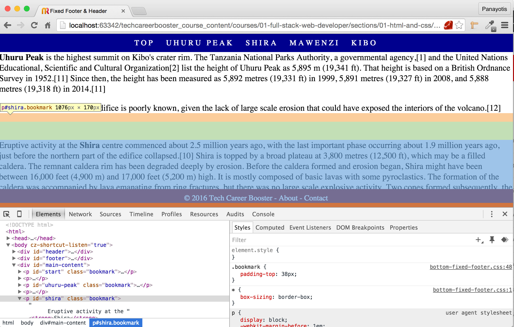

The fact that we have added `padding-top: 38px;` to some of the pargraphs (the `p` with class `bookmark`), has created this discrepancy.
This is the space that we want to decrease back to its original value. Equal to the space we have to the other `p` elements in the documents.

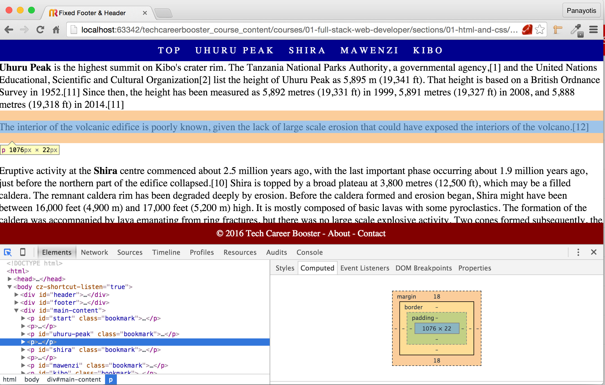

We want all the `p` elements, `bookmark` and not, to have equal space in between. We will do that by setting the `margin-top` of the `bookmark` `p` to
a negative value, `-38px`.

Hence, the CSS now has as follows:

``` css
* {
    box-sizing: border-box;
}
body {
    margin: 38px 0 38px;
}

#footer {
    text-align: center;
    background-color: Maroon;
    color: White;
    padding: 10px 0;
    position: fixed;
    bottom: 0;
    width: 100%;
}

a {
    text-decoration: none;
    color: inherit;
}

#main-content {
    font-size: 18px;
}

#header {
    background-color: darkblue;
    color: white;
    padding: 10px 0;
    text-align: center;
    position: fixed;
    top: 0;
    width: 100%;
}

#header a {
    padding: 10px 10px;
    text-transform: uppercase;
    letter-spacing: 4px;
}

#header a:hover {
    background-color: white;
    color: darkblue;
}

.bookmark {
    padding-top: 38px;
    margin-top: -38px;
}
```

If you save the above CSS and reload your page, you will see that the space between the paragraphs has been recovered:

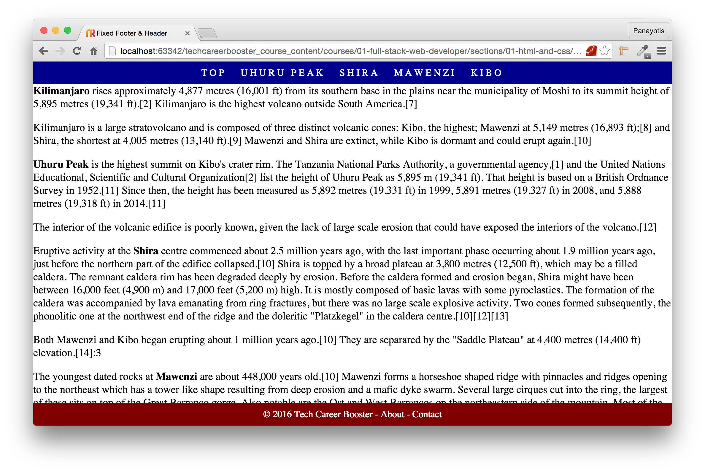

##### `left`

We have seen how we can use `bottom` and `top` to position elements relative to the browser window bottom and top sides. Similarly, we can use the property `left` to
position an element relative to the left side of the browser window.

Let's suppose that we want to create the following page:


As you can see above, there is an image to the left of the text. If you scroll or resize the browser window, the image stays on the same position.
Watch this video to understand what I mean:

<div id="media-title-video-A left positioned image, fixed when scrolling">A left positioned image, fixed when scrolling</div>
<a href="https://player.vimeo.com/video/194012209"></a>

This page is not much different to the previous one that we have created. Starting from the HTML, we only have to include the part of the image. Here is the full new HTML content:

``` html
<!DOCTYPE html>
<html>
  <head>
    <meta charset="utf-8">
    <title>Fixed Footer & Header</title>
    <link rel="stylesheet" href="stylesheets/main.css" type="text/css">
  </head>

  <body>
    <div id="header">
      <a href="#start">Top</a>
      <a href="#uhuru-peak">Uhuru Peak</a>
      <a href="#shira">Shira</a>
      <a href="#mawenzi">Mawenzi</a>
      <a href="#kibo">Kibo</a>
    </div>

    <div id="footer">
      &copy; 2016 Tech Career Booster - <a href="#">About</a> - <a href="#">Contact</a>
    </div>


    <div id="main-content">
      <p id="start" class="bookmark"><strong>Kilimanjaro</strong> rises approximately 4,877 metres (16,001 ft) from its southern base in the plains near the municipality of Moshi to its summit height of 5,895 metres
        (19,341 ft).[2] Kilimanjaro is the highest volcano outside South America.[7]
      </p>

      <p>
      Kilimanjaro is a large stratovolcano and is composed of three distinct volcanic cones: Kibo, the highest; Mawenzi at 5,149 metres (16,893 ft);[8] and Shira,
      the shortest at 4,005 metres (13,140 ft).[9] Mawenzi and Shira are extinct, while Kibo is dormant and could erupt again.[10]
      </p>

      <p id="uhuru-peak" class="bookmark">
      <strong>Uhuru Peak</strong> is the highest summit on Kibo's crater rim. The Tanzania National Parks Authority, a governmental agency,[1] and the United Nations Educational,
      Scientific and Cultural Organization[2] list the height of Uhuru Peak as 5,895 m (19,341 ft). That height is based on a British Ordnance Survey in 1952.[11] Since
      then, the height has been measured as 5,892 metres (19,331 ft) in 1999, 5,891 metres (19,327 ft) in 2008, and 5,888 metres (19,318 ft) in 2014.[11]
      </p>

      <p>
      The interior of the volcanic edifice is poorly known, given the lack of large scale erosion that could have exposed the interiors of the volcano.[12]
      </p>

      <p id="shira" class="bookmark">
      Eruptive activity at the <strong>Shira</strong> centre commenced about 2.5 million years ago, with the last important phase occurring about 1.9 million years ago, just before
      the northern part of the edifice collapsed.[10] Shira is topped by a broad plateau at 3,800 metres (12,500 ft), which may be a filled caldera. The remnant caldera
      rim has been degraded deeply by erosion. Before the caldera formed and erosion began, Shira might have been between 16,000 feet (4,900 m) and 17,000 feet (5,200 m)
      high. It is mostly composed of basic lavas with some pyroclastics. The formation of the caldera was accompanied by lava emanating from ring fractures, but there was
      no large scale explosive activity. Two cones formed subsequently, the phonolitic one at the northwest end of the ridge and the doleritic "Platzkegel" in the caldera centre.[10][12][13]
      </p>

      <p>
      Both Mawenzi and Kibo began erupting about 1 million years ago.[10] They are separared by the "Saddle Plateau" at 4,400 metres (14,400 ft) elevation.[14]:3
      </p>

      <p id="mawenzi" class="bookmark">
      The youngest dated rocks at <strong>Mawenzi</strong> are about 448,000 years old.[10] Mawenzi forms a horseshoe shaped ridge with pinnacles and ridges opening to the northeast which
      has a tower like shape resulting from deep erosion and a mafic dyke swarm. Several large cirques cut into the ring, the largest of these sits on top of the Great
      Barranco gorge. Also notable are the Ost and West Barrancos on the northeastern side of the mountain. Most of the eastern side of the mountain has been removed by
      erosion. Mawenzi has a subsidiary peak named Neumann Tower (4,425 metres (14,518 ft)).[10][12][13]
      </p>

      <p id="kibo" class="bookmark">
      <strong>Kibo</strong> is the largest cone and is more than 15 miles (24 km) wide at the "Saddle Plateau" altitude. The last activity here has been dated to between 150,000
      and 200,000 years ago and created the current Kibo summit crater. Kibo still has gas-emitting fumaroles in the crater.[10][12][13] Kibo is capped by an
      almost symmetrical cone with escarpments rising 180 metres (590 ft) to 200 metres (660 ft) on the south side. These escarpments define a 2.5-kilometre-wide (1.6 mi)
      caldera[15] caused by the collapse of the summit. Within this caldera is the Inner Cone and within the crater of the Inner Cone is the Reusch Crater, which
      the Tanganyika government in 1954 named after Gustav Otto Richard Reusch upon his climbing the mountain for the 25th time (out of 65 attempts during his lifetime).[16][17]
      The Ash Pit, 350 metres (1,150 ft) deep, lies within the Reusch Crater.[18] About 100,000 years ago, part of Kibo's crater rim collapsed, creating the area known as
      the Western Breach and the Great Barranco.[19]
      </p>
    </div>

    <div id="k-image">
      
    </div>
  </body>

</html>
```

We have only added one more div at the bottom of the HTML content, before the closing `body` tag. It is the `div` that holds a reference to an image. The image is the file
`images/kilimanjaro.jpg` that exists inside the images folder of this chapter.

In order to position the image div on the left side of the content, we had to bring the content a little bit to the right. Here is the final CSS file:

``` css
* {
    box-sizing: border-box;
}
body {
    margin: 38px 0 38px;
}

#footer {
    text-align: center;
    background-color: Maroon;
    color: White;
    padding: 10px 0;
    position: fixed;
    bottom: 0;
    width: 100%;
}

a {
    text-decoration: none;
    color: inherit;
}

#main-content {
    font-size: 18px;
    margin-left: 135px;
}

#header {
    background-color: darkblue;
    color: white;
    padding: 10px 0;
    text-align: center;
    position: fixed;
    top: 0;
    width: 100%;
}

#header a {
    padding: 10px 10px;
    text-transform: uppercase;
    letter-spacing: 4px;
}

#header a:hover {
    background-color: white;
    color: darkblue;
}

.bookmark {
    padding-top: 38px;
    margin-top: -38px;
}

#k-image {
    position: fixed;
    top: 65px;
    left: 10px;
    padding: 5px 5px;
    border: 1px solid black;
    line-height: 0;
}
```

We have done the following enhancements with regards to the previous one, in order to achieve the final desired result:

1. we have set a left margin for the div that contains the main content (`margin-left: 135px;`)
2. we have set the rules for the div that contains the image.
    1. `position: fixed;` so that we can fix the position of the div relative to browser window.
    2. `top: 65px;` to make sure it is drawn a little bit below the top edge of the window.
    3. `left: 10px;` to make sure that it is drawn a little bit next to the left side of the window, but not exactly at the left side.
    4. `line-height: 0;` to make sure that the image does not have extra space below that. (See the chapter "CSS Box Model", on the line height part).

Nice! Save and load your page and you will see how we have managed to create the page that we had initially planned.

##### `right`

I assume that you now understand what the `right` property does. It positions the element relative to the right edge of the browser window.

> **Important:** Statically positioned elements, i.e. those that have `position` equal to `static` or they do not have any `position` value,
hence using the default one which is `static`, are not affected by the positional properties `top`, `bottom`, `left` or `right`.

### Positioning Element Relative To Their Normal Position

Some times, we want to position an element on specific position, using `top`, `bottom`, `left` and `right` properties, but relative to their normal
position and not relative to the browser window. In order to do that, we need to set the `position` property to have the value `relative`.

Let's suppose that we want to implement the following HTML page:


As you can see above:

1. The page has a series of paragraphs with the same style all of them.
2. The content of the page has some free space on the left and on the right.
3. The first character of each paragraph stands out to the left. The left side of the content of the page has enough
room for the first characters of each paragraph to be drawn inside it.

Since, the content has paragraphs, let's start with them. We will create, first, an HTML page that has the paragraphs with the text:

``` html
<!DOCTYPE html>
<html>
  <head>
    <meta charset="utf-8">
    <title>Relative Example</title>
    <link rel="stylesheet" href="stylesheets/main.css" type="text/css">
  </head>

  <body>

    <p>
      Barcelona (/bɑrsəˈloʊnə/, Catalan: [bəɾsəˈlonə], Spanish: [barθeˈlona]) is the capital city of the autonomous community of Catalonia in Spain and Spain's second most
      populated city, with a population of 1.6 million[5] within its administrative limits. Its urban area extends beyond the administrative city limits with a population
      of around 4.7 million people, being the sixth-most populous urban area in the European Union after Paris, London, Madrid, the Ruhr area, and Milan.[3] It is the largest
      metropolis on the Mediterranean Sea, located on the coast between the mouths of the rivers Llobregat and Besòs, and bounded to the west by the Serra de Collserola mountain
      range, the tallest peak of which is 512 metres (1,680 ft) high.
    </p>

    <p>
      Founded as a Roman city, in the Middle Ages Barcelona became the capital of the County of Barcelona. After merging with the Kingdom of Aragon, Barcelona continued to be an
      important city in the Crown of Aragon as an economical and administrative center of this Crown and the capital of the Principality of Catalonia. Besieged several times during
      its history, Barcelona has a rich cultural heritage and is today an important cultural center and a major tourist destination. Particularly renowned are the architectural works
      of Antoni Gaudí and Lluís Domènech i Montaner, which have been designated UNESCO World Heritage Sites. The headquarters of the Union for the Mediterranean is located in
      Barcelona. The city is known for hosting the 1992 Summer Olympics as well as world-class conferences and expositions and also many international sport tournaments.
    </p>

    <p>
      The origin of the earliest settlement at the site of present-day Barcelona is unclear. Around the actual neighborhood of Raval have been found remains of an early
      settlement, including different tombs and a hut from 5.500 BC. The founding of Barcelona is the subject of two different legends. The first attributes the
      founding of the city to the mythological Hercules. The second legend attributes the foundation of the city directly to the historical Carthaginian Hamilcar Barca,
      father of Hannibal, who named the city Barcino after his family in the Third century BC.
    </p>
  </body>

</html>
```

We start with a very simple CSS:

``` css
* {
    box-sizing: border-box;
    margin: 0;
    padding: 0;
}
```

which basically starts with some sensitive defaults. We will enhance the rules further down the implementation.

If you save the above files and reload your page, you will see this:

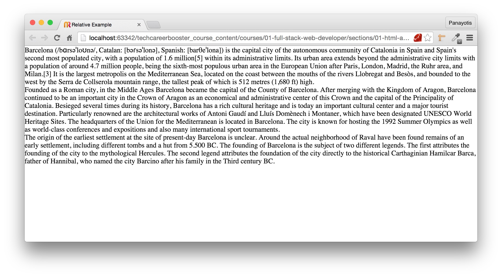

As you can see, the paragraphs are one next to each other and there is no space left and right to the page content.

My approach here would be first to style the first character of each paragraph. This is because I want to see how the rest of the content will be affected.
So, how can I style part of my text? We have learned that we can do that using the `span` element.

Here is the new HTML content:

``` html
<!DOCTYPE html>
<html>
  <head>
    <meta charset="utf-8">
    <title>Relative Example</title>
    <link rel="stylesheet" href="stylesheets/main.css" type="text/css">
  </head>

  <body>

    <p>
      <span class="starting-paragraph-character">B</span>arcelona (/bɑrsəˈloʊnə/, Catalan: [bəɾsəˈlonə], Spanish: [barθeˈlona]) is the capital city of the autonomous community of Catalonia in Spain and Spain's second most
      populated city, with a population of 1.6 million[5] within its administrative limits. Its urban area extends beyond the administrative city limits with a population
      of around 4.7 million people, being the sixth-most populous urban area in the European Union after Paris, London, Madrid, the Ruhr area, and Milan.[3] It is the largest
      metropolis on the Mediterranean Sea, located on the coast between the mouths of the rivers Llobregat and Besòs, and bounded to the west by the Serra de Collserola mountain
      range, the tallest peak of which is 512 metres (1,680 ft) high.
    </p>

    <p>
      <span class="starting-paragraph-character">F</span>ounded as a Roman city, in the Middle Ages Barcelona became the capital of the County of Barcelona. After merging with the Kingdom of Aragon, Barcelona continued to be an
      important city in the Crown of Aragon as an economical and administrative center of this Crown and the capital of the Principality of Catalonia. Besieged several times during
      its history, Barcelona has a rich cultural heritage and is today an important cultural center and a major tourist destination. Particularly renowned are the architectural works
      of Antoni Gaudí and Lluís Domènech i Montaner, which have been designated UNESCO World Heritage Sites. The headquarters of the Union for the Mediterranean is located in
      Barcelona. The city is known for hosting the 1992 Summer Olympics as well as world-class conferences and expositions and also many international sport tournaments.
    </p>

    <p>
      <span class="starting-paragraph-character">T</span>he origin of the earliest settlement at the site of present-day Barcelona is unclear. Around the actual neighborhood of Raval have been found remains of an early
      settlement, including different tombs and a hut from 5.500 BC. The founding of Barcelona is the subject of two different legends. The first attributes the
      founding of the city to the mythological Hercules. The second legend attributes the foundation of the city directly to the historical Carthaginian Hamilcar Barca,
      father of Hannibal, who named the city Barcino after his family in the Third century BC.
    </p>
  </body>

</html>
```

As you can see above, I have wrapped the first character of each paragraph with a `span` and I have given that `span` a class that I can later on use to style them all together.
If you save the above content and reload your page, you will not see any particular change. Because the span does not affect the HTML layout or style by itself.

Let's add a CSS rule that will make those characters stand out. Let's try with setting the font size to 40px.

``` css
* {
    box-sizing: border-box;
    margin: 0;
    padding: 0;
}

.starting-paragraph-character {
    font-size: 40px;
}
```

If you save this and reload your page, you will see this:

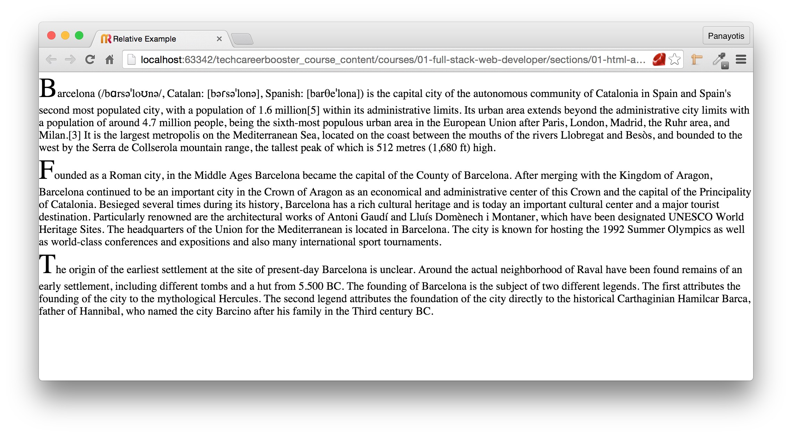

Things are getting better. The fact that we have increased the font size now makes the paragraphs stand out from each other.

Let's now create the left space and the right space. The left space will be used to position the first character of each paragraph. Well, that's easy. We just increase the
left and right margin of the `body` element.

``` css
* {
    box-sizing: border-box;
    margin: 0;
    padding: 0;
}

body {
    margin: 0 20px 0 50px;
}

.starting-paragraph-character {
    font-size: 40px;
}
```
As you can see above, we just gave a margin left equal to `50px` and a margin right equal to `20px`. The left margin is enough to hold the `40px` size of the first
character of each paragraph. Let's save this file and reload our page. We will see this:

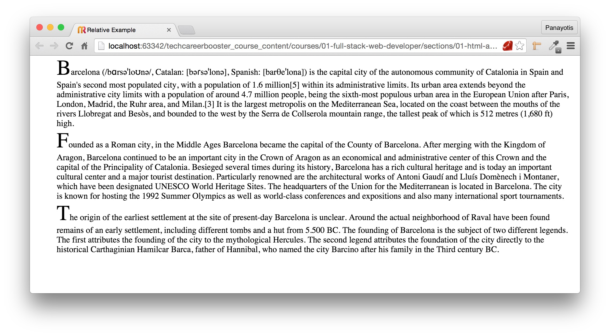

Now, we will move the first character of each paragraph to the left of its current position. This is where the `position` property with value `relative` will come handy. What we
want to do is to position the character some distance to the left of its current position.

*Moving to the left* means a negative distance value. We will try `-30px` for the `left` property.
Let's do that. Enhance your CSS as follows:
``` css
* {
    box-sizing: border-box;
    margin: 0;
    padding: 0;
}

body {
    margin: 0 20px 0 50px;
}

.starting-paragraph-character {
    font-size: 40px;
    position: relative;
    left: -30px;
}
```
We have added the `position: relative;` and `left: -30px;` CSS rules. Let's save that and reload our page. The result will be:
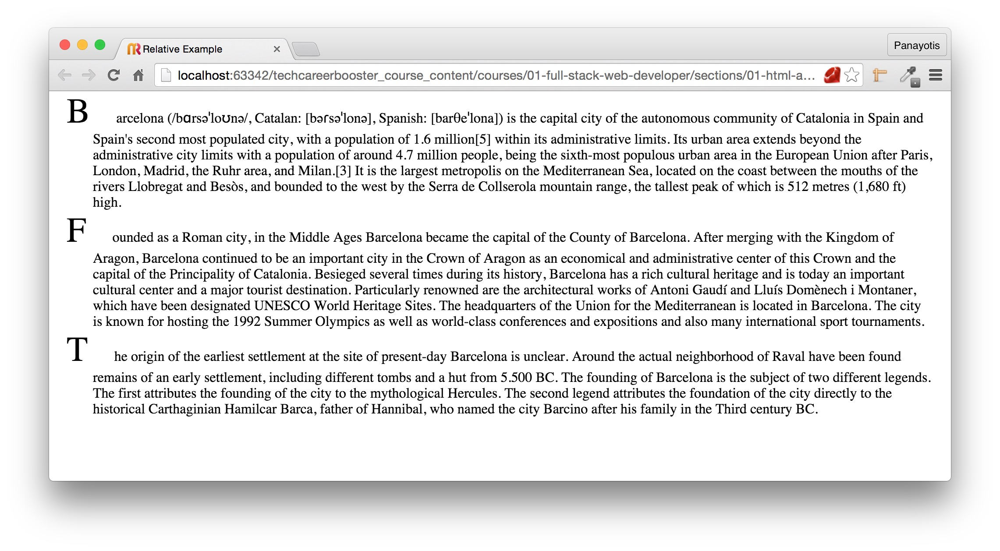

It worked. The `left` position is relative to the actual position the character would have been. It does not refer to the left side of the browser window.
And this is because of the `position: relative;`

However, the current implementation has some problems:

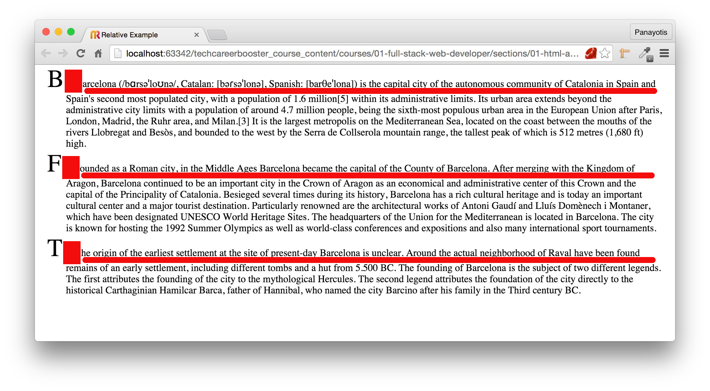

As you can see in the above picture, the originally occupied first character space is not reused. Also, the distance between the first and second line of each paragraph is bigger
than the distance between the rest of the lines.

One way we can remedy these two problems is to remove the first character from the `p` element and put it before that. Let's try that:

``` html
<!DOCTYPE html>
<html>
  <head>
    <meta charset="utf-8">
    <title>Relative Example</title>
    <link rel="stylesheet" href="stylesheets/main.css" type="text/css">
  </head>

  <body>

    <span class="starting-paragraph-character">B</span>
    <p>
      arcelona (/bɑrsəˈloʊnə/, Catalan: [bəɾsəˈlonə], Spanish: [barθeˈlona]) is the capital city of the autonomous community of Catalonia in Spain and Spain's second most
      populated city, with a population of 1.6 million[5] within its administrative limits. Its urban area extends beyond the administrative city limits with a population
      of around 4.7 million people, being the sixth-most populous urban area in the European Union after Paris, London, Madrid, the Ruhr area, and Milan.[3] It is the largest
      metropolis on the Mediterranean Sea, located on the coast between the mouths of the rivers Llobregat and Besòs, and bounded to the west by the Serra de Collserola mountain
      range, the tallest peak of which is 512 metres (1,680 ft) high.
    </p>

    <span class="starting-paragraph-character">F</span>
    <p>
      ounded as a Roman city, in the Middle Ages Barcelona became the capital of the County of Barcelona. After merging with the Kingdom of Aragon, Barcelona continued to be an
      important city in the Crown of Aragon as an economical and administrative center of this Crown and the capital of the Principality of Catalonia. Besieged several times during
      its history, Barcelona has a rich cultural heritage and is today an important cultural center and a major tourist destination. Particularly renowned are the architectural works
      of Antoni Gaudí and Lluís Domènech i Montaner, which have been designated UNESCO World Heritage Sites. The headquarters of the Union for the Mediterranean is located in
      Barcelona. The city is known for hosting the 1992 Summer Olympics as well as world-class conferences and expositions and also many international sport tournaments.
    </p>

    <span class="starting-paragraph-character">T</span>
    <p>
      he origin of the earliest settlement at the site of present-day Barcelona is unclear. Around the actual neighborhood of Raval have been found remains of an early
      settlement, including different tombs and a hut from 5.500 BC. The founding of Barcelona is the subject of two different legends. The first attributes the
      founding of the city to the mythological Hercules. The second legend attributes the foundation of the city directly to the historical Carthaginian Hamilcar Barca,
      father of Hannibal, who named the city Barcino after his family in the Third century BC.
    </p>
  </body>

</html>
```

Without doing any change on our CSS file, let's save the above HTML content and reload our page. We will see this:
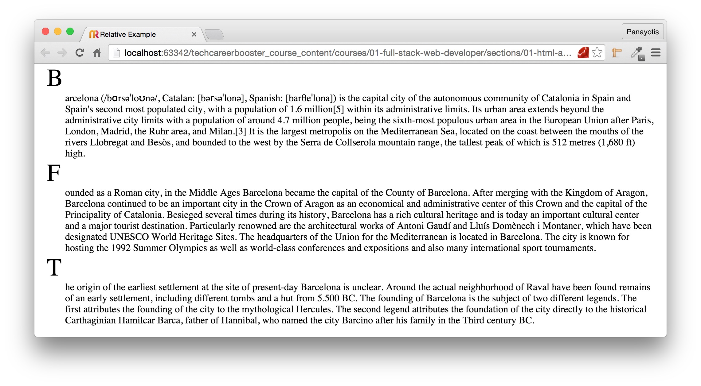

Ok. Good. The lines of the paragraph are now displayed ok. The problem is that the character has moved above the level of the paragraph. What we can do is to change its top
position. Bring it down so that it stands on the level we want. Let's do that:

``` css
* {
    box-sizing: border-box;
    margin: 0;
    padding: 0;
}

body {
    margin: 0 20px 0 50px;
}

.starting-paragraph-character {
    font-size: 40px;
    position: relative;
    left: -30px;
    top: 30px;
}
```
We have added the `30px` `top` property. This will bring the character down to the level we want. Let's save that and reload the page:


There is one more problem left to solve. There is a lot of white space above the paragraphs:


This is because of the first character original position. There are some alternatives that we can use to solve that. Let's try one. We will wrap both the character and the
paragraph into their own div so that we can manipulate them as a group:

``` html
<!DOCTYPE html>
<html>
  <head>
    <meta charset="utf-8">
    <title>Relative Example</title>
    <link rel="stylesheet" href="stylesheets/main.css" type="text/css">
  </head>

  <body>

    <div class="paragraph-container">
      <span class="starting-paragraph-character">B</span>
      <p>
        arcelona (/bɑrsəˈloʊnə/, Catalan: [bəɾsəˈlonə], Spanish: [barθeˈlona]) is the capital city of the autonomous community of Catalonia in Spain and Spain's second most
        populated city, with a population of 1.6 million[5] within its administrative limits. Its urban area extends beyond the administrative city limits with a population
        of around 4.7 million people, being the sixth-most populous urban area in the European Union after Paris, London, Madrid, the Ruhr area, and Milan.[3] It is the largest
        metropolis on the Mediterranean Sea, located on the coast between the mouths of the rivers Llobregat and Besòs, and bounded to the west by the Serra de Collserola mountain
        range, the tallest peak of which is 512 metres (1,680 ft) high.
      </p>
    </div>

    <div class="paragraph-container">
      <span class="starting-paragraph-character">F</span>
      <p>
        ounded as a Roman city, in the Middle Ages Barcelona became the capital of the County of Barcelona. After merging with the Kingdom of Aragon, Barcelona continued to be an
        important city in the Crown of Aragon as an economical and administrative center of this Crown and the capital of the Principality of Catalonia. Besieged several times during
        its history, Barcelona has a rich cultural heritage and is today an important cultural center and a major tourist destination. Particularly renowned are the architectural works
        of Antoni Gaudí and Lluís Domènech i Montaner, which have been designated UNESCO World Heritage Sites. The headquarters of the Union for the Mediterranean is located in
        Barcelona. The city is known for hosting the 1992 Summer Olympics as well as world-class conferences and expositions and also many international sport tournaments.
      </p>
    </div>

    <div class="paragraph-container">
      <span class="starting-paragraph-character">T</span>
      <p>
        he origin of the earliest settlement at the site of present-day Barcelona is unclear. Around the actual neighborhood of Raval have been found remains of an early
        settlement, including different tombs and a hut from 5.500 BC. The founding of Barcelona is the subject of two different legends. The first attributes the
        founding of the city to the mythological Hercules. The second legend attributes the foundation of the city directly to the historical Carthaginian Hamilcar Barca,
        father of Hannibal, who named the city Barcino after his family in the Third century BC.
      </p>
    </div>
  </body>

</html>
```

As you can see above, we have grouped characters and their corresponding paragraphs into groups, using a `div`. Each group now has the class `paragraph-container` which we
can use to style. Actually, we will remove some of the top margin by applying a negative value. Here is our CSS:

``` css
* {
    box-sizing: border-box;
    margin: 0;
    padding: 0;
}

body {
    margin: 0 20px 10px 50px;
}

.paragraph-container {
    margin-top: -30px;
}

.starting-paragraph-character {
    position: relative;
    font-size: 40px;
    left: -30px;
    top: 30px;
}
```

As you can see we have added the `margin-top: -30px;` for each group with class `.paragraph-container`. If we save the CSS and reload our page, we will see this:
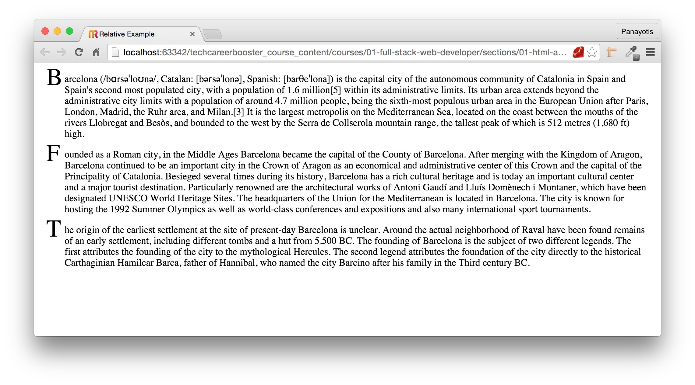

Well Done! We have managed to bring the HTML page to match our original planned page.

### Positioning Elements Relative To Other Element

We have learned how to use `top`, `bottom`, `left` and `right` in order to

* position elements relative to the browser window (`position` with value `fixed`)
* position elements relative to their normal position (`position` with value `relative`)

We also know that the default value of `position` is `static`, case in which the `top`, `bottom`, `left` and `right` are not taken into account.

There is one more case that will be useful to us: `position` with value `absolute`. This is used when we want to position an element using
the positional properties (`top`, `bottom`, `left` and `right`) but relative to the parent/ancestor element box edges. So, when the positioned
element always stays in specific position with regards to another (parent/ancestor) element.

Let's try an example. Assume that we want to implement the following page:


As you can see, there is one tag with the place name at the bottom right of each picture. And, you can understand that this tag, we want to always
be displayed at the same position, bottom-right, relative to the parent/ancestor image container.

Let's start with the main HTML content that has the containers for the images.

``` html
<!DOCTYPE html>
<html>
  <head>
    <meta charset="utf-8">
    <title>Absolute Example</title>
    <link rel="stylesheet" href="stylesheets/main.css" type="text/css">
  </head>

  <body>

    <div id="left-column" class="column">

    </div>

    <div id="right-column" class="column">

    </div>


  </body>

</html>
```

This is very simple. It has one div for the left column and one div for the right column. We only have to apply some CSS rules, including the background image:

``` css
* {
    box-sizing: border-box;
    margin: 0;
    padding: 0;
}

.column {
    width: 50%;
    height: 500px;
    background-repeat: no-repeat;
    background-attachment: scroll;
    background-position: center;
    background-size: cover;
}

#left-column {
    float: left;
    background-image: url("../images/sarakiniko-water.jpg");
}

#right-column {
    float: right;
    background-image: url("../images/zakinthos-ship-wreck.jpg");
}
```

Everything this CSS file includes, we have already learned about.

Save those files and load your page into your browser. The result that you will see is the following:

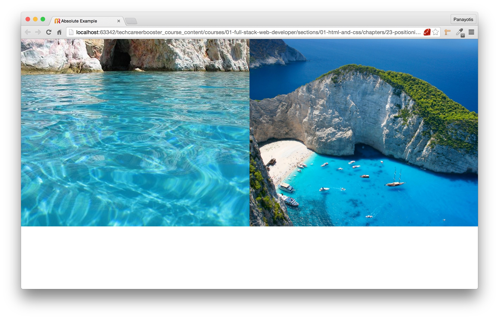

Now, let's put the tags, but without actually caring about their position. We will only care about their color styling. Here is the HTML with the tags:

``` html
<!DOCTYPE html>
<html>
  <head>
    <meta charset="utf-8">
    <title>Absolute Example</title>
    <link rel="stylesheet" href="stylesheets/main.css" type="text/css">
  </head>

  <body>

    <div id="left-column" class="column">
      <span class="tag">
        Milos - Sarakiniko
      </span>
    </div>

    <div id="right-column" class="column">
      <span class="tag">
        Zakinthos - Shipwreck
      </span>
    </div>

  </body>

</html>
```
As you can see, we have added the tags as simple `span` elements with a class `tag` that will help us style them.

Let's do the basic styling. Amend the CSS file so that it looks like this:

``` css
* {
    box-sizing: border-box;
    margin: 0;
    padding: 0;
}

.column {
    width: 50%;
    height: 500px;
    background-repeat: no-repeat;
    background-attachment: scroll;
    background-position: center;
    background-size: cover;
}

#left-column {
    float: left;
    background-image: url("../images/sarakiniko-water.jpg");
}

#right-column {
    float: right;
    background-image: url("../images/zakinthos-ship-wreck.jpg");
}

.tag {
    background-color: darkblue;
    color: white;
    font-size: 24px;
    padding: 5px 10px;
    border-radius: 10px 0 0 10px;
}
```
If you save and reload your page, you will see that tags are correctly styled, as we want them, but they are not positioned at the required position.
They are positioned at their normal position. At top left corner of their container:

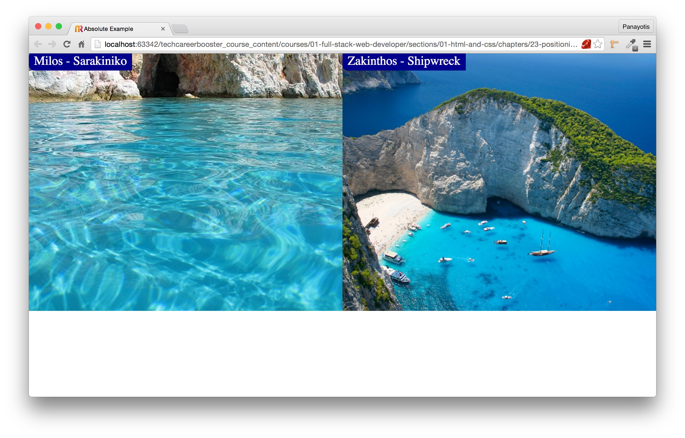

So, the last task is to position the tags at their correct position. Which is the correct position?

* Their right edge needs to be on the right edge of the parent image container.
* Their bottom edge needs to be some distance above the bottom edge of their parent image container.

In order to achieve that:

Since their position depends on the edges of their parent containers, parent container needs to have `position` property with value `relative`, and their own `position` property
needs to have the value `absolute`.

Having said that, here is the final CSS content:
``` css
* {
    box-sizing: border-box;
    margin: 0;
    padding: 0;
}

.column {
     position: relative;
     width: 50%;
     height: 500px;
     background-repeat: no-repeat;
     background-attachment: scroll;
     background-position: center;
     background-size: cover;
}

#left-column {
     float: left;
     background-image: url("../images/sarakiniko-water.jpg");
}

#right-column {
     float: right;
     background-image: url("../images/zakinthos-ship-wreck.jpg");
}

.tag {
     position: absolute;
     right: 0;
     bottom: 25px;
     background-color: darkblue;
     color: white;
     font-size: 24px;
     padding: 5px 10px;
     border-radius: 10px 0 0 10px;
}
```
If you save this file and reload your page, you will see that you will finally have the desired result. If you try to resize your browser window, you will
also see that the tags stay fixed on their positions, relative to the image container.

> **Important Note:**
>
> (1) If you want to use `position: absolute;` in order to position an element relative to its parent element, then the parent element needs to have
`position` with one of the values: `fixed`, `relative`, `absolute`. In other words, it cannot have the value `static` (or not value, which corresponds to `static`), i.e.
it has to be non-statically positioned.
>
> (2) When you use `position: absolute;` the element is not, simply, positioned relative to its parent, but, in fact, it is positioned relative to its first/nearest non-statically
positioned parent. So, if you have the following HTML fragment:
``` html
<div id="parent-1">
  <div id="child-1-parent-2">
    <div id="child-2">
    </div>
  </div>
</div>
```
you can use `position: absolute;` on `child-1-parent-2` as long as `parent-1` is non-statically positioned. Also, you can use `position: absolute;` for element `child-2`
as long as `child-1-parent-2` is non-statically positioned. If `child-1-parent-2` is statically positioned, you can still use `position: absolute;` for element `child-2`
as long as `parent-1` is non-statically positioned. In other words, when you have an absolute positioned element, its position is relative to the edges of its first non-statically
positioned parent element.
>
> (3) `body`, by default, has `static` position value.
>
> (4) If an absolute position element does not have a non-static positioned parent, then its position is relative to `body`. Even if `body`, by default is not a positioned element.

### Positioned Elements

We have learned how to position elements on the page, out of the normal page flow, using the `top`, `bottom`, `left` and `right` properties.

* With `position: fixed;` we position elements relative to the browser window edges.
* With `position: relative;` we position elements relative to their normal position.
* With `position: absolute;` we position elements relative to their first non-statically positioned parent edges.

Elements that are using one of `fixed`, `relative` or `absolute` position values, they can be referred to as *positioned elements*.

### `z-index`

Besides positioning elements on the plane (horizontally with `left` and `right`: x-axis, and / or vertically with `top` and `bottom`: y-axis),
there is one more property that can be used to position an element on the z-axis, i.e. its stack order. `z-index` is the property that is used to
specify the stack order of elements. Elements with lower `z-index` value are moved to the background. Elements with higher `z-index` value are
moved to the foreground. Note that `z-index` is only applicable to positioned elements.

Let's start with the following case:

``` html
<!DOCTYPE html>
<html>
  <head>
    <meta charset="utf-8">
    <title>Z-Index</title>
    <link rel="stylesheet" href="stylesheets/main.css" type="text/css">
  </head>

  <body>

    <div id="one">
      one
    </div>

    <div id="two">
      two
    </div>


  </body>

</html>
```

with the following CSS file:
``` css
* {
    box-sizing: border-box;
    margin: 0;
    padding: 0;
}

#one {
    position: absolute;
    top: 10px;
    left: 10px;
    width: 200px;
    height: 200px;
    background-color: green;
    border: 1px solid black;
    padding: 10px 10px;
}

#two {
    position: absolute;
    top: 40px;
    left: 40px;
    width: 200px;
    height: 200px;
    background-color: red;
    border: 1px solid blue;
    padding: 10px 10px;
}
```
We have absolute positioned elements but we are not using any `z-index` property yet. These are going to be put on the page in the order we define them in the HTML document.
Note that these divs are siblings and not one inside the other.

If you save and load this page on your browser, it will be displayed as follows:


How can we make the div `two` appear behind div `one`. We only have to assign a positive `z-index` value to div `one`. Try to assign `z-index: 1;`:
The new CSS file becomes:

``` css
* {
    box-sizing: border-box;
    margin: 0;
    padding: 0;
}

#one {
    position: absolute;
    top: 10px;
    left: 10px;
    width: 200px;
    height: 200px;
    background-color: green;
    border: 1px solid black;
    padding: 10px 10px;
    z-index: 1;
}

#two {
    position: absolute;
    top: 40px;
    left: 40px;
    width: 200px;
    height: 200px;
    background-color: red;
    border: 1px solid blue;
    padding: 10px 10px;
}
```
If you save and load your page again, you will see this:


Note that we could have achieved the same effect if we had set the `z-index` to a negative value for the `two` div. Try that if you want: Remove the positive value `z-index` from div `one` and
set `z-index` to `-1` for the div `two`. You will have the same result. Won't you?

Ooooh. Now that we have `one` being on the foreground and `two` being on the background, we cannot see the text inside the `two` div. But I guess that you already know how to fix that.
Let's change our HTML content as follows:

``` html
<!DOCTYPE html>
<html>
  <head>
    <meta charset="utf-8">
    <title>Z-Index</title>
    <link rel="stylesheet" href="stylesheets/main.css" type="text/css">
  </head>

  <body>

    <div id="one">
      one
    </div>

    <div id="two">
      <span>two</span>
    </div>


  </body>

</html>
```
We have wrapped the word `two` inside a span so that we can set its position. Let's do that in the CSS:

``` css
* {
    box-sizing: border-box;
    margin: 0;
    padding: 0;
}

#one {
    position: absolute;
    top: 10px;
    left: 10px;
    width: 200px;
    height: 200px;
    background-color: green;
    border: 1px solid black;
    padding: 10px 10px;
    z-index: 1;
}

#two {
    position: absolute;
    top: 40px;
    left: 40px;
    width: 200px;
    height: 200px;
    background-color: red;
    border: 1px solid blue;
    padding: 10px 10px;
}

#two span {
    position: absolute;
    bottom: 10px;
    right: 10px;
}
```

Do you see the rules for `#two span`. They position the text to the bottom right corner of the div. Save and reload the page. You should now see the
word `two` appearing at the bottom right corner.

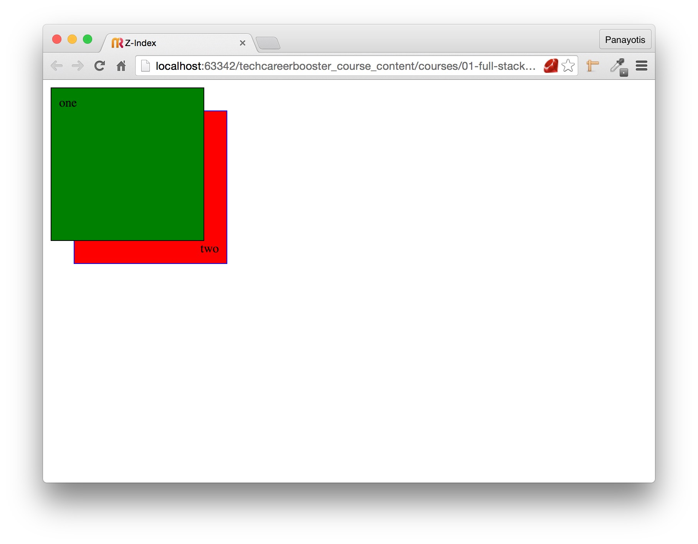

We will actually change the text of the divs to also display their z-index. Let's do that:

``` html
<!DOCTYPE html>
<html>
  <head>
    <meta charset="utf-8">
    <title>Z-Index</title>
    <link rel="stylesheet" href="stylesheets/z-index.css" type="text/css">
  </head>

  <body>

    <div id="one">
      one: z-index: 1
    </div>

    <div id="two">
      <span>two: z-index: auto</span>
    </div>

  </body>

</html>
```

which gives this:

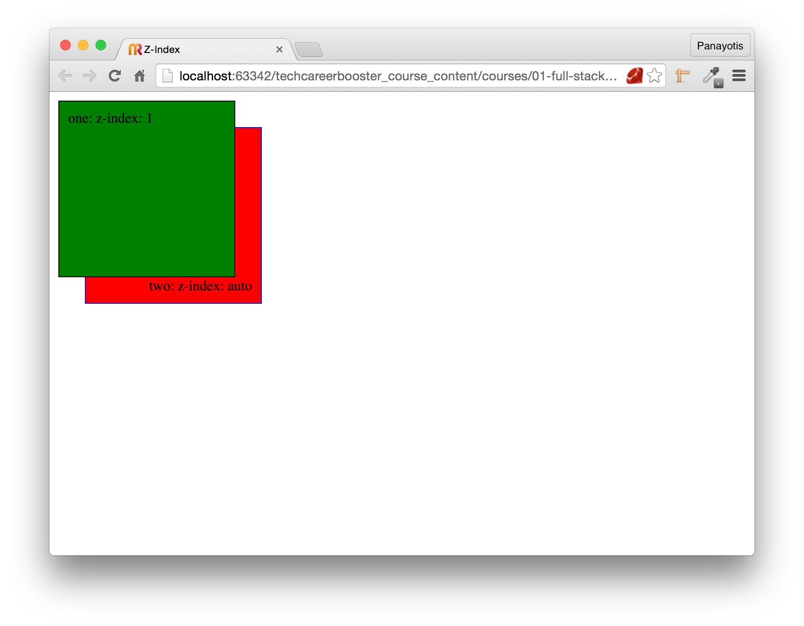

Let's add one more div, `two-one` as child of the `two` div. Give that an `absolute` position too, without `z-index`.

``` html
<!DOCTYPE html>
<html>
  <head>
    <meta charset="utf-8">
    <title>Z-Index</title>
    <link rel="stylesheet" href="stylesheets/main.css" type="text/css">
  </head>

  <body>

    <div id="one">
      one: z-index: 1
    </div>

    <div id="two">
      <span>two: z-index: auto</span>
      <div id="two-one">
        <span>three: z-index: auto</span>
      </div>
    </div>

  </body>

</html>
```

with the next CSS:

``` css
* {
    box-sizing: border-box;
    margin: 0;
    padding: 0;
}

#one {
    position: absolute;
    top: 10px;
    left: 10px;
    width: 200px;
    height: 200px;
    background-color: green;
    border: 1px solid black;
    padding: 10px 10px;
    z-index: 1;
}

#two {
    position: absolute;
    top: 40px;
    left: 40px;
    width: 200px;
    height: 200px;
    background-color: red;
    border: 1px solid blue;
    padding: 10px 10px;
}

#two span {
    position: absolute;
    bottom: 10px;
    right: 10px;
}

#two-one {
    position: absolute;
    background-color: yellow;
    border: 1px solid blue;
    width: 400px;
    height: 100px;
}
```
If you save and reload the page, you will see this:
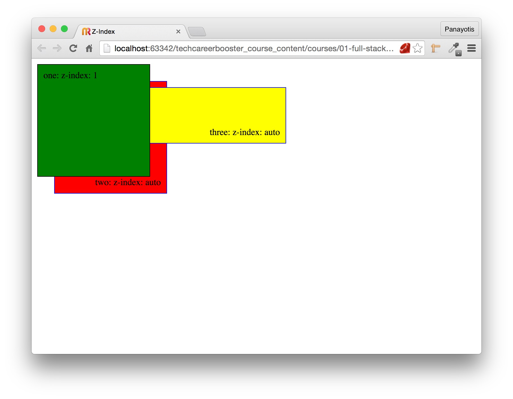

As you can see above, the `two-one` div, which is child of `two` is drawn after the `two` and behind the `one` div. That is expected. The `two-one` does not specify any
`z-index` value. So, it will be drawn behind the `one` which does. It is on the same stack level with `two` because that one does not specify any `z-index` value too.

How, can we bring `two-one` on the foreground? Just set a `z-index` positive value, greater than or equal to the `z-index` of the `one` div.
``` css
* {
    box-sizing: border-box;
    margin: 0;
    padding: 0;
}

#one {
    position: absolute;
    top: 10px;
    left: 10px;
    width: 200px;
    height: 200px;
    background-color: green;
    border: 1px solid black;
    padding: 10px 10px;
    z-index: 1;
}

#two {
    position: absolute;
    top: 40px;
    left: 40px;
    width: 200px;
    height: 200px;
    background-color: red;
    border: 1px solid blue;
    padding: 10px 10px;
}

#two span {
    position: absolute;
    bottom: 10px;
    right: 10px;
}

#two-one {
    position: absolute;
    background-color: yellow;
    border: 1px solid blue;
    width: 400px;
    height: 100px;
    z-index: 1;
}
```
On the previous CSS, we have added the `z-index` property with value `1` for the `two-one` div. Also, change the HTML content so that it has the correct text
for the `two-one` div:
``` html
<!DOCTYPE html>
<html>
  <head>
    <meta charset="utf-8">
    <title>Z-Index</title>
    <link rel="stylesheet" href="stylesheets/main.css" type="text/css">
  </head>

  <body>

    <div id="one">
      one: z-index: 1
    </div>

    <div id="two">
      <span>two: z-index: auto</span>
      <div id="two-one">
        <span>three: z-index: 1</span>
      </div>
    </div>

  </body>

</html>
```
If you save both the above files and reload, you will see this:

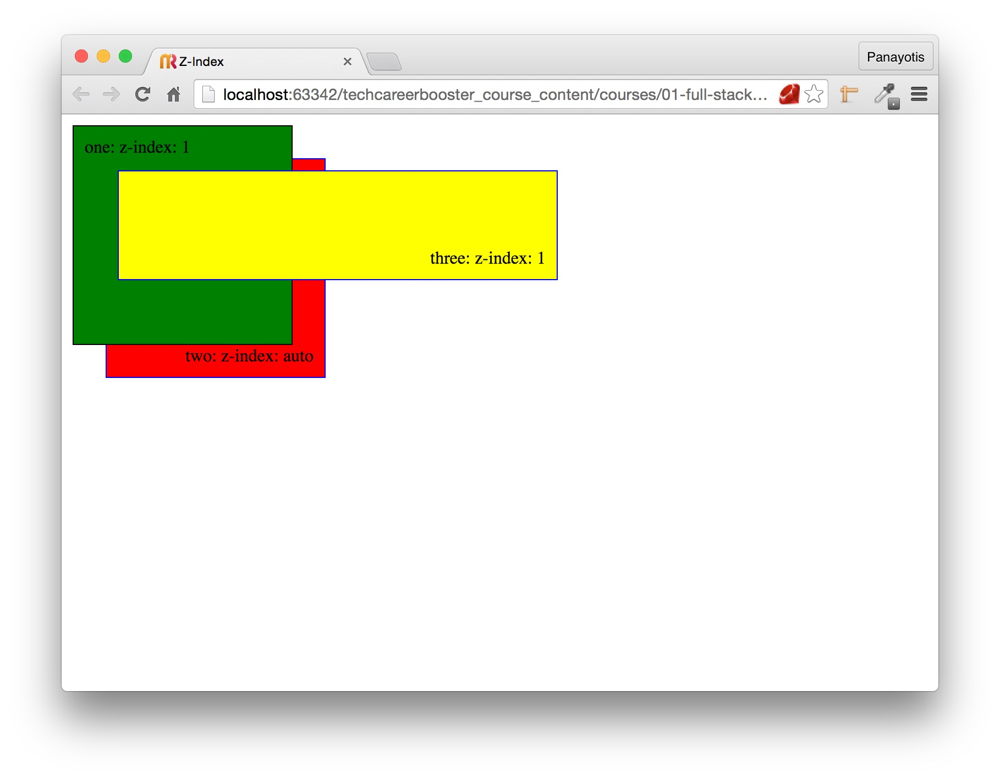

That was pretty straightforward. However, with `z-index` there is a small detail that you need to be aware of. Whenever you set the `z-index` of an element to a value
different from `auto` then you create a new *stack context* (or `z-index` context). Inside that new stack context, are going to be stacked
both the particular element plus all of its child elements.

Let's set the `z-index` value of the div `two` to value `0`. Here is the new HTML (to depict the new value for it):
``` html
<!DOCTYPE html>
<html>
  <head>
    <meta charset="utf-8">
    <title>Z-Index</title>
    <link rel="stylesheet" href="stylesheets/main.css" type="text/css">
  </head>

  <body>

    <div id="one">
      one: z-index: 1
    </div>

    <div id="two">
      <span>two: z-index: 0</span>
      <div id="two-one">
        <span>three: z-index: 1</span>
      </div>
    </div>

  </body>

</html>
```
And the CSS file:
``` css
* {
    box-sizing: border-box;
    margin: 0;
    padding: 0;
}

#one {
    position: absolute;
    top: 10px;
    left: 10px;
    width: 200px;
    height: 200px;
    background-color: green;
    border: 1px solid black;
    padding: 10px 10px;
    z-index: 1;
}

#two {
    position: absolute;
    top: 40px;
    left: 40px;
    width: 200px;
    height: 200px;
    background-color: red;
    border: 1px solid blue;
    padding: 10px 10px;
    z-index: 0;
}

#two span {
    position: absolute;
    bottom: 10px;
    right: 10px;
}

#two-one {
    position: absolute;
    background-color: yellow;
    border: 1px solid blue;
    width: 400px;
    height: 100px;
    z-index: 1;
}
```
If you save these files and reload the page, you will see this:


As you can see, the div `two-one` is now drawn behind div `one`. This is because now div `two` and div `two-one` form a new and isolated stack context. You can understand that
even more, if you change the `z-index` of the `two-one` div, from `1`, to `2`. Let's do that:

The HTML:
``` html
<!DOCTYPE html>
<html>
  <head>
    <meta charset="utf-8">
    <title>Z-Index</title>
    <link rel="stylesheet" href="stylesheets/main.css" type="text/css">
  </head>

  <body>

    <div id="one">
      one: z-index: 1
    </div>

    <div id="two">
      <span>two: z-index: 0</span>
      <div id="two-one">
        <span>three: z-index: 2</span>
      </div>
    </div>

  </body>

</html>
```
and the CSS:
``` css
* {
    box-sizing: border-box;
    margin: 0;
    padding: 0;
}

#one {
    position: absolute;
    top: 10px;
    left: 10px;
    width: 200px;
    height: 200px;
    background-color: green;
    border: 1px solid black;
    padding: 10px 10px;
    z-index: 1;
}

#two {
    position: absolute;
    top: 40px;
    left: 40px;
    width: 200px;
    height: 200px;
    background-color: red;
    border: 1px solid blue;
    padding: 10px 10px;
    z-index: 0;
}

#two span {
    position: absolute;
    bottom: 10px;
    right: 10px;
}

#two-one {
    position: absolute;
    background-color: yellow;
    border: 1px solid blue;
    width: 400px;
    height: 100px;
    z-index: 2;
}
```
If you save those files and reload the page, you will see this:


Do you see that? Even if the `two-one` div has higher `z-index` value if compared to div `one`, it is still behind it, because they do not belong to the same stack context. No matter
how much you increase the `z-index` value of `two-one`, it will still be behind `one` div. Its stack level, position, is only affected by the elements and stack level positions of the
elements of its parent, div `two`, i.e. of its own stack context. The only way to bring `two-one` div in front of the `one` div again, is either by removing the `z-index` value
from the `two` div, or setting the `two` div `z-index` value to a value greater than or equal to `1`. In that latter case, both `two` and `two-one` will be brought in front of the
`one` div, as a group.

Finally, one might ask:

*What is the stacking order when, inside the same stack context, except from the positioned elements with specific `z-index` values, we also
have elements that are not positioned elements and hence, they do not have a `z-index` property applicable?*

In other words, what happens if we have, inside the same stack context:

* positioned elements with `z-index` set, and
* block elements and
* inline elements and
* float elements

The stacking order in that case is the following:


The above diagram explains the order in which elements are drawn. For example:

* The float elements are drawn in front of the block elements and they are both drawn in front of the negative z-index elements.
* The background and borders are always drawn behind all other elements.


