We have learned a lot about how we can style our HTML pages, and it is about time to return back to core HTML and
continue learning about more HTML tags. In this chapter, we introduce one of the most important tags in HTML. It is
the `form` tag which is used to collect input from the user.

> **Important:** This chapter deals with the `form` tag without taking into account the actual processing of the
data that we collect from the users. Posting data to the server and further processing will be dealt with in later
chapters.

Let's start. Assume that we want to ask our users to key in their address details. We will build the following
HTML page:


On this video, you can see the form being used by a user:

<div id="media-title-video-filling-in-address-details-form.mp4-How the Address Details Form is being filled in by the user">How the Address Details Form is being filled in by the user</div>
<a href="https://player.vimeo.com/video/194146120"></a>


As you can see from above, there are 4 fields that the user has to fill in with free text and 1 field that the user is being asked to select one of the possible values.

### `input` of `type="text"`

The first 4 fields, for first name, last name, address and zip code, are being constructed using the HTML tag `input`. There are different types of `input` HTML tags,
and each one of them has a different value for the tag attribute with name `type`. The ones that we are using here, they are all `input` tags of `type` with value `text`.
Later on, we are going to learn about other types of `input` tags.

This one here:
``` css
<input type="text"/>
```
declares an input field that allows the user to key in free text. The free text that the user can type in is limited in 1 line only. As you can see the `input` HTML tag does
not have any HTML content. That is why we are using the shorthand notation to close it (`/>`).

Try this HTML code:

``` css
<!DOCTYPE html>
<html>
  <head>
    <meta charset="utf-8">
    <title>A basic input example</title>
  </head>

  <body>
    <input type="text"/>
  </body>
</html>
```

If you save the above HTML code into an html file and load it on your browser, you will see this:

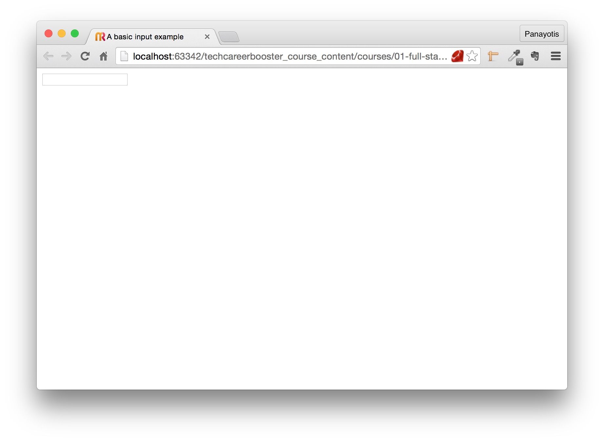

You will be able to click inside the box area of this input field and type in anything that you like. The fact that we have defined the `type` of the `input` to be `text` allows
us to use this input like that.

### `label`

The problem with this input field, is that, if presented alone, does not prompt the user about the data that they have to key in. Will that be the first name? Will that be
the last name? Will that be something else? In order to help user understand what we are expecting as input, we traditionally use labels. The labels are constructed with the
`label` tag. This is very simple. You define the tag and you set as its HTML content the exact content that you want to use as a prompt to the user.

Let's add our first label to the above HTML page.

``` html
<!DOCTYPE html>
<html>
  <head>
    <meta charset="utf-8">
    <title>A basic input example</title>
  </head>

  <body>
    <label>First Name:</label>
    <input type="text"/>
  </body>
</html>
```
If you save the above HTML code and reload your page, you will see this:


Now, the user of our Web page, knows that on the first field he has to type in his first name.

Let's add the other 3 fields on the form. They will be added using the same technique that we did for the first name. Pretty easy.

Here is the HTML code:
``` html
<!DOCTYPE html>
<html>
  <head>
    <meta charset="utf-8">
    <title>A basic input example</title>
  </head>

  <body>
    <label>First Name:</label>
    <input type="text"/>

    <label>Last Name:</label>
    <input type="text">

    <label>Address:</label>
    <input type="text">

    <label>Zip Code:</label>
    <input type="text">
  </body>
</html>
```
If you save the above code and reload the page, you will see this:

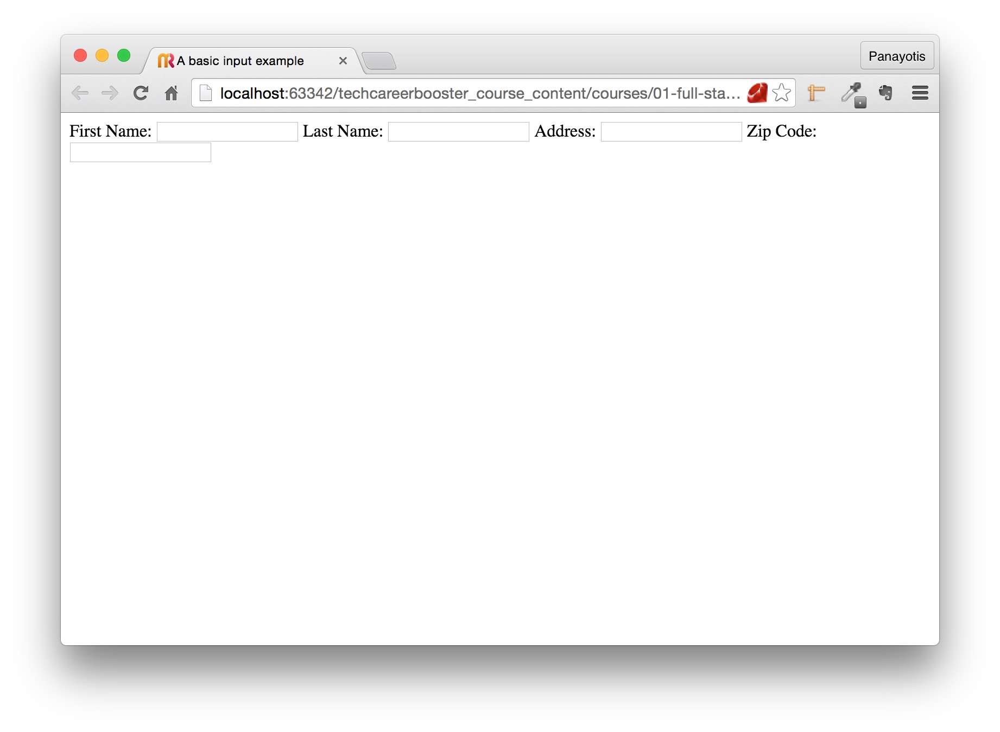

Don't worry about the style. All the labels and inputs have been put one next to the other. This is because both the `label` and the `input` HTML tags are inline elements. In fact
the `label` tags are `inline` elements and the `input` tags are `inline-block` elements. We will later on introduce CSS to our page in order to make it look much better than
it does now.

### `select`

The next input that we want to ask user to key in, is their country. For the country, we do not allow the user to type in anything that he likes, but we want him to choose one
from a specific list of values. We call this UI element a `select box`, a `single-select box`. You may hear about that as `drop down select box` or `drop down select list` or
`drop down list` too.

One input HTML tag that we can use to accomplish this is the `select` HTML tag.

The `select` tag is a container of options. The options need to be given using the `option` tag.

Here is an example of a select box created using `select` and `option` tags. It contains 2 options for the user to choose.

``` html
<select>
  <option>Male</option>
  <option>Female</option>
</select>
```
You can clearly see the `select` element starting with the opening tag `<select>` and ending with the closing tag `</select>`. Inside it, its content is another HTML
fragment, which is composed of a series of `option` elements. Each `option` element has HTML content, which are the options presented to the user in order for them to
choose what they prefer.

On our address page example, we want to list all the countries in alphabetical order. Let's do that:

Here is how our HTML page content turns to be, after we add all the countries as options to the select box. Note that we also use a label to help user understand what
this list is about.

```
<!DOCTYPE html>
<html>
  <head>
    <meta charset="utf-8">
    <title>A basic input example</title>
  </head>

  <body>
    <label>First Name:</label>
    <input type="text"/>

    <label>Last Name:</label>
    <input type="text">

    <label>Address:</label>
    <input type="text">

    <label>Zip Code:</label>
    <input type="text">

    <label>Country:</label>
    <select>
      <option>Afghanistan</option>
      <option>Åland Islands</option>
      <option>Albania</option>
      <option>Algeria</option>
      <option>American Samoa</option>
      <option>Andorra</option>
      <option>Angola</option>
      <option>Anguilla</option>
      <option>Antarctica</option>
      <option>Antigua and Barbuda</option>
      <option>Argentina</option>
      <option>Armenia</option>
      <option>Aruba</option>
      <option>Australia</option>
      <option>Austria</option>
      <option>Azerbaijan</option>
      <option>Bahamas</option>
      <option>Bahrain</option>
      <option>Bangladesh</option>
      <option>Barbados</option>
      <option>Belarus</option>
      <option>Belgium</option>
      <option>Belize</option>
      <option>Benin</option>
      <option>Bermuda</option>
      <option>Bhutan</option>
      <option>Bolivia, Plurinational State of</option>
      <option>Bonaire, Sint Eustatius and Saba</option>
      <option>Bosnia and Herzegovina</option>
      <option>Botswana</option>
      <option>Bouvet Island</option>
      <option>Brazil</option>
      <option>British Indian Ocean Territory</option>
      <option>Brunei Darussalam</option>
      <option>Bulgaria</option>
      <option>Burkina Faso</option>
      <option>Burundi</option>
      <option>Cambodia</option>
      <option>Cameroon</option>
      <option>Canada</option>
      <option>Cape Verde</option>
      <option>Cayman Islands</option>
      <option>Central African Republic</option>
      <option>Chad</option>
      <option>Chile</option>
      <option>China</option>
      <option>Christmas Island</option>
      <option>Cocos (Keeling) Islands</option>
      <option>Colombia</option>
      <option>Comoros</option>
      <option>Congo</option>
      <option>Congo, the Democratic Republic of the</option>
      <option>Cook Islands</option>
      <option>Costa Rica</option>
      <option>Côte d'Ivoire</option>
      <option>Croatia</option>
      <option>Cuba</option>
      <option>Curaçao</option>
      <option>Cyprus</option>
      <option>Czech Republic</option>
      <option>Denmark</option>
      <option>Djibouti</option>
      <option>Dominica</option>
      <option>Dominican Republic</option>
      <option>Ecuador</option>
      <option>Egypt</option>
      <option>El Salvador</option>
      <option>Equatorial Guinea</option>
      <option>Eritrea</option>
      <option>Estonia</option>
      <option>Ethiopia</option>
      <option>Falkland Islands (Malvinas)</option>
      <option>Faroe Islands</option>
      <option>Fiji</option>
      <option>Finland</option>
      <option>France</option>
      <option>French Guiana</option>
      <option>French Polynesia</option>
      <option>French Southern Territories</option>
      <option>Gabon</option>
      <option>Gambia</option>
      <option>Georgia</option>
      <option>Germany</option>
      <option>Ghana</option>
      <option>Gibraltar</option>
      <option>Greece</option>
      <option>Greenland</option>
      <option>Grenada</option>
      <option>Guadeloupe</option>
      <option>Guam</option>
      <option>Guatemala</option>
      <option>Guernsey</option>
      <option>Guinea</option>
      <option>Guinea-Bissau</option>
      <option>Guyana</option>
      <option>Haiti</option>
      <option>Heard Island and McDonald Islands</option>
      <option>Holy See (Vatican City State)</option>
      <option>Honduras</option>
      <option>Hong Kong</option>
      <option>Hungary</option>
      <option>Iceland</option>
      <option>India</option>
      <option>Indonesia</option>
      <option>Iran, Islamic Republic of</option>
      <option>Iraq</option>
      <option>Ireland</option>
      <option>Isle of Man</option>
      <option>Israel</option>
      <option>Italy</option>
      <option>Jamaica</option>
      <option>Japan</option>
      <option>Jersey</option>
      <option>Jordan</option>
      <option>Kazakhstan</option>
      <option>Kenya</option>
      <option>Kiribati</option>
      <option>Korea, Democratic People's Republic of</option>
      <option>Korea, Republic of</option>
      <option>Kuwait</option>
      <option>Kyrgyzstan</option>
      <option>Lao People's Democratic Republic</option>
      <option>Latvia</option>
      <option>Lebanon</option>
      <option>Lesotho</option>
      <option>Liberia</option>
      <option>Libya</option>
      <option>Liechtenstein</option>
      <option>Lithuania</option>
      <option>Luxembourg</option>
      <option>Macao</option>
      <option>Macedonia, the former Yugoslav Republic of</option>
      <option>Madagascar</option>
      <option>Malawi</option>
      <option>Malaysia</option>
      <option>Maldives</option>
      <option>Mali</option>
      <option>Malta</option>
      <option>Marshall Islands</option>
      <option>Martinique</option>
      <option>Mauritania</option>
      <option>Mauritius</option>
      <option>Mayotte</option>
      <option>Mexico</option>
      <option>Micronesia, Federated States of</option>
      <option>Moldova, Republic of</option>
      <option>Monaco</option>
      <option>Mongolia</option>
      <option>Montenegro</option>
      <option>Montserrat</option>
      <option>Morocco</option>
      <option>Mozambique</option>
      <option>Myanmar</option>
      <option>Namibia</option>
      <option>Nauru</option>
      <option>Nepal</option>
      <option>Netherlands</option>
      <option>New Caledonia</option>
      <option>New Zealand</option>
      <option>Nicaragua</option>
      <option>Niger</option>
      <option>Nigeria</option>
      <option>Niue</option>
      <option>Norfolk Island</option>
      <option>Northern Mariana Islands</option>
      <option>Norway</option>
      <option>Oman</option>
      <option>Pakistan</option>
      <option>Palau</option>
      <option>Palestinian Territory, Occupied</option>
      <option>Panama</option>
      <option>Papua New Guinea</option>
      <option>Paraguay</option>
      <option>Peru</option>
      <option>Philippines</option>
      <option>Pitcairn</option>
      <option>Poland</option>
      <option>Portugal</option>
      <option>Puerto Rico</option>
      <option>Qatar</option>
      <option>Réunion</option>
      <option>Romania</option>
      <option>Russian Federation</option>
      <option>Rwanda</option>
      <option>Saint Barthélemy</option>
      <option>Saint Helena, Ascension and Tristan da Cunha</option>
      <option>Saint Kitts and Nevis</option>
      <option>Saint Lucia</option>
      <option>Saint Martin (French part)</option>
      <option>Saint Pierre and Miquelon</option>
      <option>Saint Vincent and the Grenadines</option>
      <option>Samoa</option>
      <option>San Marino</option>
      <option>Sao Tome and Principe</option>
      <option>Saudi Arabia</option>
      <option>Senegal</option>
      <option>Serbia</option>
      <option>Seychelles</option>
      <option>Sierra Leone</option>
      <option>Singapore</option>
      <option>Sint Maarten (Dutch part)</option>
      <option>Slovakia</option>
      <option>Slovenia</option>
      <option>Solomon Islands</option>
      <option>Somalia</option>
      <option>South Africa</option>
      <option>South Georgia and the South Sandwich Islands</option>
      <option>South Sudan</option>
      <option>Spain</option>
      <option>Sri Lanka</option>
      <option>Sudan</option>
      <option>Suriname</option>
      <option>Svalbard and Jan Mayen</option>
      <option>Swaziland</option>
      <option>Sweden</option>
      <option>Switzerland</option>
      <option>Syrian Arab Republic</option>
      <option>Taiwan, Province of China</option>
      <option>Tajikistan</option>
      <option>Tanzania, United Republic of</option>
      <option>Thailand</option>
      <option>Timor-Leste</option>
      <option>Togo</option>
      <option>Tokelau</option>
      <option>Tonga</option>
      <option>Trinidad and Tobago</option>
      <option>Tunisia</option>
      <option>Turkey</option>
      <option>Turkmenistan</option>
      <option>Turks and Caicos Islands</option>
      <option>Tuvalu</option>
      <option>Uganda</option>
      <option>Ukraine</option>
      <option>United Arab Emirates</option>
      <option>United Kingdom</option>
      <option>United States</option>
      <option>United States Minor Outlying Islands</option>
      <option>Uruguay</option>
      <option>Uzbekistan</option>
      <option>Vanuatu</option>
      <option>Venezuela, Bolivarian Republic of</option>
      <option>Viet Nam</option>
      <option>Virgin Islands, British</option>
      <option>Virgin Islands, U.S.</option>
      <option>Wallis and Futuna</option>
      <option>Western Sahara</option>
      <option>Yemen</option>
      <option>Zambia</option>
      <option>Zimbabwe</option>
    </select>
  </body>
</html>
```
If you save the above HTML content and reload your page, you will see this:

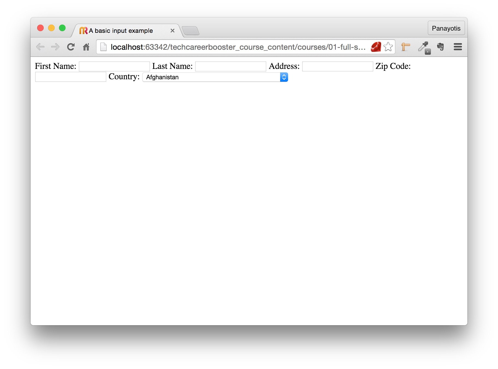

### `input` of `type=submit`

What is missing from our form is a way for the user to tell the browser, the Web page, that they have finished filling in the form and that they are ready to submit the
data to the Web page, to the Web application or Web site. In order to do that we need a UI control like a button:


Such buttons are created, again, with the HTML element `input`, but the `type` attribute needs to have the value `submit`. Try to add the following after the end of the select
box for countries:

``` html
  <input type="submit"/>
```

If you save and load the page you will see this:

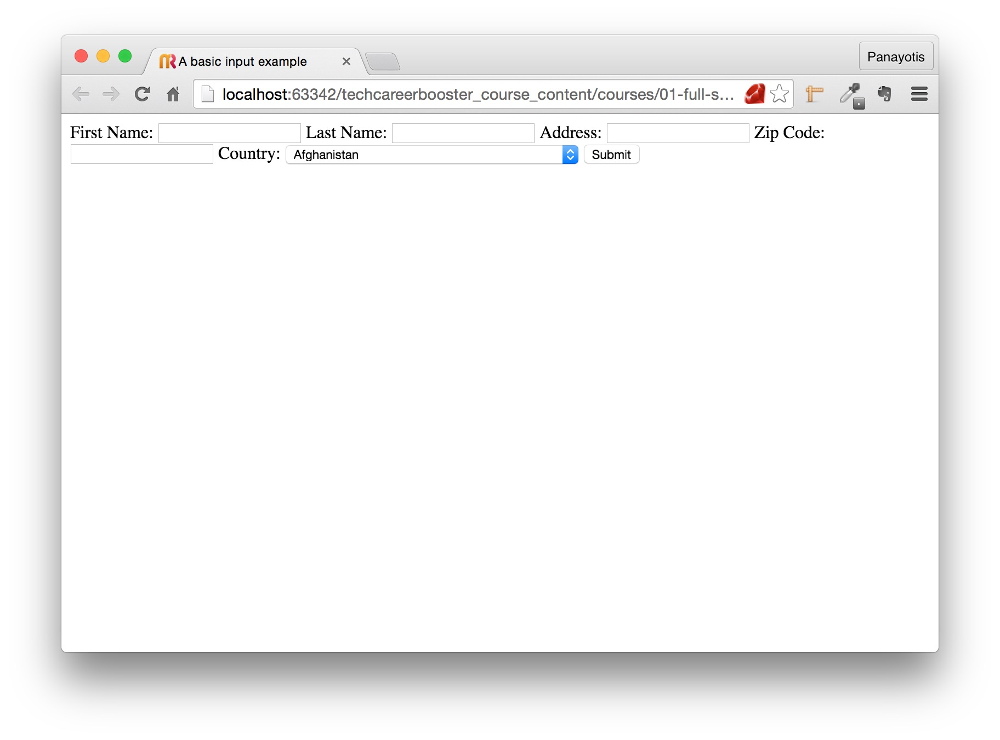

This is the Chrome version. If you load the same page on Firefox (43.0.2), you will see this:


As you can see above, the label on top of the button is different when the page is loaded on Firefox. And, if you try other brower brand, you may be presented with a different
label.

In order to make sure that the same label is printed on top of the button, irrespective of the browser brand, you need to use the attribute `value` on the `input` element
and give it the value equal to the label text that you want to use. Hence, one correct option for our `submit` type `input` is the following:

``` html
<input type="submit" value="Submit"/>
```
If you do this, then, even on Firefox, the button will have the label `Submit`.

Hence, our HTML page currently has the following content:

> *Note:* In order to keep the HTML source code below, as small as possible, we will not repeat here the whole list of the countries. Your actual
page needs to have all the countries in the list.

``` html
<!DOCTYPE html>
<html>
  <head>
    <meta charset="utf-8">
    <title>A basic input example</title>
  </head>

  <body>
    <label>First Name:</label>
    <input type="text"/>

    <label>Last Name:</label>
    <input type="text">

    <label>Address:</label>
    <input type="text">

    <label>Zip Code:</label>
    <input type="text">

    <label>Country:</label>
    <select>
      <option>Afghanistan</option>
        <!-- rest of the countries go here -->
      <option>Zimbabwe</option>
    </select>

    <input type="submit" value="Submit"/>

  </body>
</html>
```

Again. Dont' worry about the styling of the page. We will fix that now. In order to improve our styling, we will wrap every label and input pair
into a div and we will assign on each group the class `input-group`. The fact that we are using divs, will make each label and input pair to be on their
own line. Here is the new HTML content:

``` html
<!DOCTYPE html>
<html>
  <head>
    <meta charset="utf-8">
    <title>A basic input example</title>
    <link rel="stylesheet" href="stylesheets/main.css" type="text/css">
  </head>

  <body>
    <div class="input-group">
      <label>First Name:</label>
      <input type="text"/>
    </div>

    <div class="input-group">
      <label>Last Name:</label>
      <input type="text">
    </div>

    <div class="input-group">
      <label>Address:</label>
      <input type="text">
    </div>

    <div class="input-group">
      <label>Zip Code:</label>
      <input type="text">
    </div>

    <div class="input-group">
      <label>Country:</label>
      <select>
        <option>Afghanistan</option>
        <!-- rest of the countries go here -->
        <option>Zimbabwe</option>
      </select>
    </div>

    <div class="input-group">
      <input type="submit" value="Submit"/>
    </div>

  </body>
</html>
```
We also need to define the CSS rules for the class `input-group`. Let's create a new file with CSS rules and make sure that our HTML page references it.

Here is the content of our CSS file:

``` css
* {
    box-sizing: border-box;
    padding: 0;
    margin: 0;
}

html {
    font-size: 62.5%;
}

body {
    font-size: 1.6rem;
    margin-top: 10px;
    text-align: center;
}

.input-group {
    font-size: 1.4rem;
    margin-bottom: 5px;
}
```
If you save both files and reload the page, you will see this:
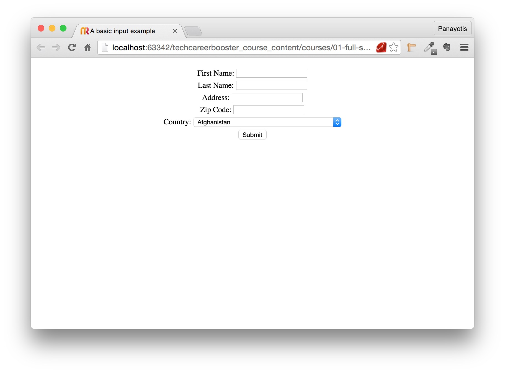

Things are getting better. We will leave it like that, for the time being. We will improve later.

Although the form seems to be complete and allows any user to key in their address details, in fact, there are some required properties that are missing. These are
necessary in order for the form to function as expected.

Here we go:

### `form`

All the input elements that we use to collect information from the user need to be grouped into an HTML `form` element. The `form` element is a block level element.
Only the input elements that are inside the `<form>` tag are actually used as useful data collected by the user.

Hence, the HTML code needs to be like that:

``` html
<!DOCTYPE html>
<html>
  <head>
    <meta charset="utf-8">
    <title>A basic input example</title>
    <link rel="stylesheet" href="stylesheets/main.css" type="text/css">
  </head>

  <body>
    <form>
      <div class="input-group">
        <label>First Name:</label>
        <input type="text"/>
      </div>

      <div class="input-group">
        <label>Last Name:</label>
        <input type="text">
      </div>

      <div class="input-group">
        <label>Address:</label>
        <input type="text">
      </div>

      <div class="input-group">
        <label>Zip Code:</label>
        <input type="text">
      </div>

      <div class="input-group">
        <label>Country:</label>
        <select>
          <option>Afghanistan</option>
          <!-- rest of the countries go here -->
          <option>Zimbabwe</option>
        </select>
      </div>

      <div class="input-group">
        <input type="submit" value="Submit"/>
      </div>

    </form>
  </body>
</html>
```

### Input elements' ID

It is a very good practice that all the input elements have a distinct `id` value. The `id` values are useful to link input controls to their corresponding label too. More about
this later on.

Hence, let's give a unique id on all of our input elements:

``` html
<!DOCTYPE html>
<html>
  <head>
    <meta charset="utf-8">
    <title>A basic input example</title>
    <link rel="stylesheet" href="stylesheets/main.css" type="text/css">
  </head>

  <body>
    <h2>Enter your address details:</h2>
    <form>
      <div class="input-group">
        <label>First Name:</label>
        <input type="text" id="first-name"/>
      </div>

      <div class="input-group">
        <label>Last Name:</label>
        <input type="text" id="last-name">
      </div>

      <div class="input-group">
        <label>Address:</label>
        <input type="text" id="address">
      </div>

      <div class="input-group">
        <label>Zip Code:</label>
        <input type="text" id="zip-code">
      </div>

      <div class="input-group last">
        <label>Country:</label>
        <select id="country">
          <option>Afghanistan</option>
          <!-- rest of countries go here -->
          <option>Zimbabwe</option>
        </select>
      </div>

      <div class="input-group">
        <input type="submit" value="Submit" id="address-details-form-submit-button"/>
      </div>

    </form>
  </body>
</html>
```
Note that we have added the heading on top of the form.

Let's save the above content and load the page on our browser. You will see the following:
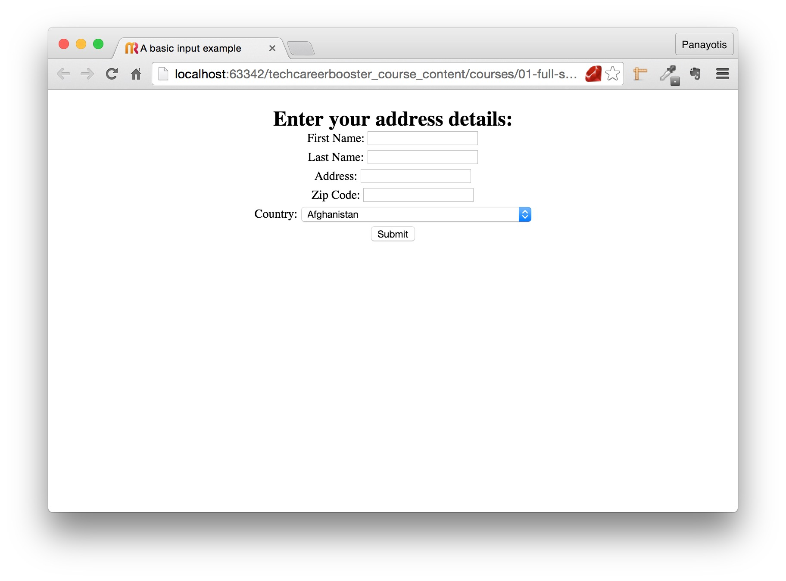


It's about time to apply some more styling. Change the CSS file content to be as follows:

``` css
* {
    box-sizing: border-box;
    padding: 0;
    margin: 0;
}

html {
    font-size: 62.5%;
}

body {
    font-size: 1.6rem;
    margin-top: 10px;
    text-align: center;
}

h2 {
    margin-bottom: 20px;
}

form {
    width: 350px;
    margin: 0 auto;
}

.input-group {
    font-size: 1.4rem;
    margin-bottom: 5px;
}

input, select {
    width: 200px;
}

label {
    display: inline-block;
    text-align: right;
    width: 67px;
}

.input-group.last {
    margin-bottom: 10px;
}

form input[type='submit'] {
    font-size: 1.8rem;
    background-color: Maroon;
    color: White;
}

form input[type='submit']:hover {
    background-color: Black;
    cursor: pointer;
}
```
Save the file and reload the page. You will see this:

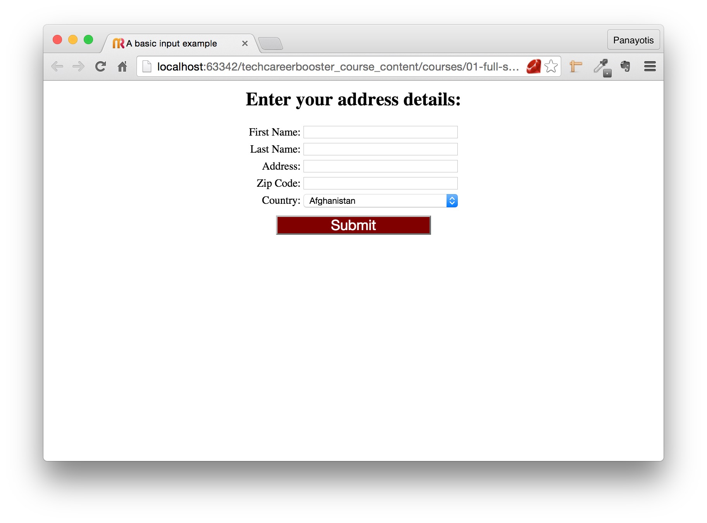

You can also move your mouse over the button. You will see how it changes color.

Let me draw your attention on some of the CSS selectors and rules that we have used:

1) Labels. They are inline elements. But we turn them to `inline-block` elements so that we can assign them specific width and text align the text inside
``` css
label {
    display: inline-block;
    text-align: right;
    width: 67px;
}
```
2) The input group for the select box has some increased bottom margin so that we make the distance to button larger.

3) Selecting elements by attribute values. You can see that we are selecting the form submit button, by selecting all the `input` elements that belong to the `form` and that they
have `type` attribute with value `submit`.
``` css
form input[type='submit']
```
And similar selector for the mouse over case (`hover`):
``` css
form input[type='submit']:hover
```
> *Note:* We could have used the submit button id as a selector (`#address-details-form-submit-button`), but we preferred to use those above now for educational reasons.

### `autofocus`

We have not finished yet with our form. There are some things that we can do to improve its functionality and the way it interacts with the user. For example, when the
page loads, we want to make sure that the cursor is ready to accept input on the first name input element. Like that:

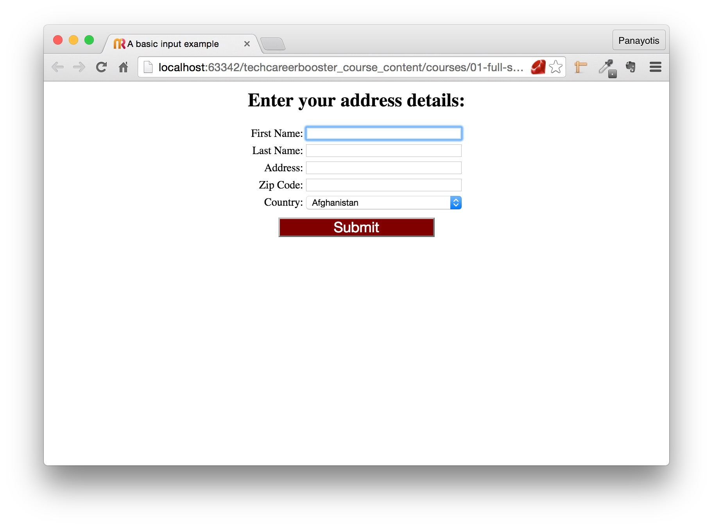

In order to achieve that, we need to use the attribute `autofocus` on the first name input element. Let's do that:

``` html
<!DOCTYPE html>
<html>
  <head>
    <meta charset="utf-8">
    <title>A basic input example</title>
    <link rel="stylesheet" href="stylesheets/main.css" type="text/css">
  </head>

  <body>
    <h2>Enter your address details:</h2>
    <form>
      <div class="input-group">
        <label>First Name:</label>
        <input type="text" id="first-name" autofocus="autofocus"/>
      </div>

      <div class="input-group">
        <label>Last Name:</label>
        <input type="text" id="last-name">
      </div>

      <div class="input-group">
        <label>Address:</label>
        <input type="text" id="address">
      </div>

      <div class="input-group">
        <label>Zip Code:</label>
        <input type="text" id="zip-code">
      </div>

      <div class="input-group last">
        <label>Country:</label>
        <select id="country">
          <option>Afghanistan</option>
          <!-- rest of countries go here -->
          <option>Zimbabwe</option>
        </select>
      </div>

      <div class="input-group">
        <input type="submit" value="Submit" id="address-details-form-submit-button"/>
      </div>

    </form>
  </body>
</html>
```

Save the above file and reload your page. Do you see that the cursor is blinking inside the first name text input element? This is thanks to the `autofocus` attribute
set on the first name input element.

> *Note:* `autofocus` is one of the examples of attributes that do not have to have a value. They are called `boolean HTML element attributes`.
This means that we can use the attribute without actually giving any value to it. The existence of the attribute switches corresponding property of the HTML tag
on, renders it true, and the absence of it sets its value to its default value (true or false, depending on attribute). Like that:
``` css
<input type="text" id="first-name" autofocus/>
```
There are other attributes like this. You can either use it with a value (equal to the name of the attribute) like we did in the main HTML content, or you can use it only
with its name. The presence of `autofocus` means that `autofocus` is switched on/true. The absence of `autofocus` means that `autofocus` is switched off/false.

### `label` `for` attribute

One other important feature of the form is that allows the user to click on a label in order to set the input focus on the corresponding input control. Hence, if the
user clicks on the label `Last Name:`, then the input focus moves automatically to the last name input element. In order for this feature to be enabled, we use the
attribute `for` on each one of the labels and we set its value to be equal to the `id` value of the corresponding input element.

Here is the case for the first name:

``` html
<label for="first-name">First Name:</label>
<input type="text" id="first-name" autofocus="autofocus"/>
```
Do you see the `for` attribute on the `label` tag? It has the value `first-name` which is equal to the value of the `id` on the input element for the first name.
This makes the two elements, `label` and `input` to be working together, with the functional feature that we have explained above. When user clicks on `First Name:` label,
the focus moves to the input element for first name.

Let's do the label attribution with `for` on all labels:

``` html
<!DOCTYPE html>
<html>
  <head>
    <meta charset="utf-8">
    <title>A basic input example</title>
    <link rel="stylesheet" href="stylesheets/main.css" type="text/css">
  </head>

  <body>
    <h2>Enter your address details:</h2>
    <form>
      <div class="input-group">
        <label for="first-name">First Name:</label>
        <input type="text" id="first-name" autofocus="autofocus"/>
      </div>

      <div class="input-group">
        <label for="last-name">Last Name:</label>
        <input type="text" id="last-name">
      </div>

      <div class="input-group">
        <label for="address">Address:</label>
        <input type="text" id="address">
      </div>

      <div class="input-group">
        <label for="zip-code">Zip Code:</label>
        <input type="text" id="zip-code">
      </div>

      <div class="input-group last">
        <label for="country">Country:</label>
        <select id="country">
          <option>Afghanistan</option>
          <!-- rest of countries go here -->
          <option>Zimbabwe</option>
        </select>
      </div>

      <div class="input-group">
        <input type="submit" value="Submit" id="address-details-form-submit-button"/>
      </div>

    </form>
  </body>
</html>
```

If you save the above and reload your page, then try to click on the labels. Do you see the focus changing position according to which label you click?

Here is also a video that demonstrates that:

<div id="media-title-video-clicking-on-labels-moves-focus-to-corresponding-input.mp4-Clicking on label moves focus on corresponding input">Clicking on label moves focus on corresponding input</div>
<a href="https://player.vimeo.com/video/194145917"></a>

### `required`

Some times, we need to make sure that the user does not forget to fill in some of the required information. For example, on our address details field, we might
consider all the information important and required to be filled in. In that case, we can use the `required` attribute (without value or with value equal to its name -
this is another example of a boolean HTML element attribute, like the `autofocus` we saw earlier).

Let's put the required attribute on all of our input elements (excluding button of course):

``` html
<!DOCTYPE html>
<html>
  <head>
    <meta charset="utf-8">
    <title>A basic input example</title>
    <link rel="stylesheet" href="stylesheets/main.css" type="text/css">
  </head>

  <body>
    <h2>Enter your address details:</h2>
    <form>
      <div class="input-group">
        <label for="first-name">First Name:</label>
        <input type="text" id="first-name" autofocus="autofocus" required="required"/>
      </div>

      <div class="input-group">
        <label for="last-name">Last Name:</label>
        <input type="text" id="last-name" required="required">
      </div>

      <div class="input-group">
        <label for="address">Address:</label>
        <input type="text" id="address" required="required">
      </div>

      <div class="input-group">
        <label for="zip-code">Zip Code:</label>
        <input type="text" id="zip-code" required="required">
      </div>

      <div class="input-group last">
        <label for="country">Country:</label>
        <select id="country" required="required">
          <option>Afghanistan</option>
          <!-- rest of countries go here -->
          <option>Zimbabwe</option>
        </select>
      </div>

      <div class="input-group">
        <input type="submit" value="Submit" id="address-details-form-submit-button"/>
      </div>

    </form>
  </body>
</html>

```
If you save and load this page again, you will not see any difference until you hit the submit button with one (or more) of the fields not filled in.

See how this works on Chrome browser.

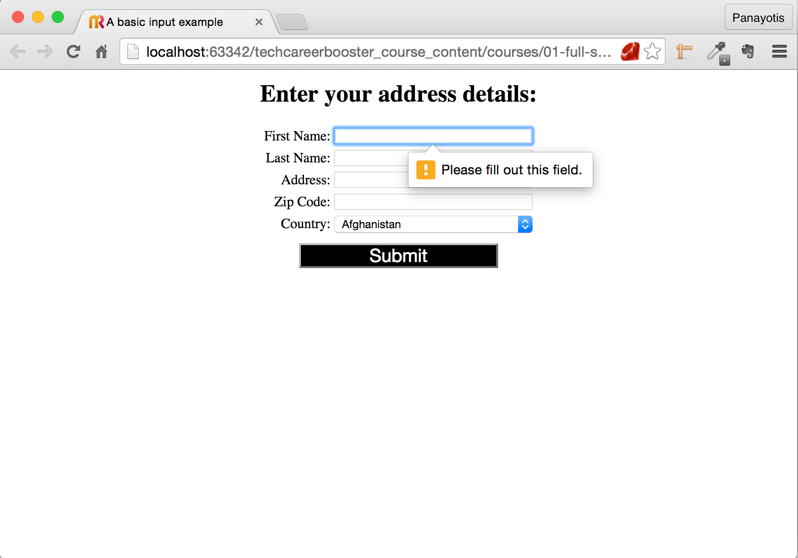

As you can see, when user is trying to submit the form without having filled in the first name, the form is not submitted and a warning balloon is popped up
exactly below the input field.

> **Important:** This functionality is not supported by all browsers. In JavaScript lessons you will learn how you can accomplish the same functionality using JavaScript
and, eventually, having this feature working on all browsers.

### Sign Up Form

We continue our journey to HTML forms with another example. A sign up form. We will build the following form:


There are some properties to this form that worth noting here:

1. The labels for the required fields (email and password) have an extra `(*)` to indicate that the corresponding inputs are required.
2. If you submit the form without having a proper email set in the email field, you will see that there is a balloon prompting you to enter a correct email address.
3. If you start typing on the password box, you will see that it does not display the characters that you type. It displays black bullets instead.
4. There is a new UI control, the checkbox, which is used to ask the user their confirmation to receive a newsletter or not.

Let's see this form in action:

<div id="media-title-video-sign-up-form-in-action.mp4-The Sign Up Form in Action">The Sign Up Form in Action</div>
<a href="https://player.vimeo.com/video/194095713"></a>
           
In order to implement the above form we will need the following:

For first name and last name the things that we need are already known:
``` html
<div class="input-group">
  <label for="first-name">First Name:</label>
  <input type="text" id="first-name" autofocus="autofocus"/>
</div>

<div class="input-group">
  <label for="last-name">Last Name:</label>
  <input type="text" id="last-name"/>
</div>
```

### `input` with `type` `email`

The email case is exactly the same as the 2 previous ones, except from the fact that we are using the `type` attribute with value `email`. This gives the correct semantics
to the input and also allows the browser to display a warning balloon when the actual value that we have typed in does not look to be an email address. The browser does a
validation check on the value to make sure that the value includes the character `@`.

Hence, our email input will be:

``` html
<div class="input-group">
  <label for="email">Email (*):</label>
  <input type="email" id="email" required="required"/>
</div>
```

### `input` with `type` `password`

The password case is also an `input` element, but it has its own value for the `type` attribute. The value is `password`. This asks the browser to make sure that it hides
the actual input and it displays black bullets for each one of the characters typed in.

The password input will be:

``` html
<div class="input-group">
  <label for="password">Password (*):</label>
  <input type="password" id="password" required="required"/>
</div>
```

### `input` with `type` `checkbox`

For the check box functionality, we are using the `input` tag with the `type` attribute set to `checkbox`. This creates a rectangle on which the user can click and
mark it as checked.

> **Important:** If you set the `required` attribute on a checkbox, then the user will be asked to check that box and switch it on. This might be the desired
behaviour, but not on our example sign up form case for the newsletter.

Hence, the checkbox input will be:

``` html
<div class="input-group">
  <input type="checkbox" id="newsletter"/>
  <label for="newsletter">Receive newsletter</label>
</div>
```

Having said all the above, we can now list the whole HTML content for our Sign Up form:

``` html
<!DOCTYPE html>
<html>
  <head>
    <meta charset="utf-8">
    <title>Sign Up Form</title>
    <link rel="stylesheet" href="stylesheets/main.css" type="text/css">
  </head>

  <body>
    <h2>Sign Up</h2>
    <form>
      <div class="input-group">
        <label for="first-name">First Name:</label>
        <input type="text" id="first-name" autofocus="autofocus"/>
      </div>

      <div class="input-group">
        <label for="last-name">Last Name:</label>
        <input type="text" id="last-name"/>
      </div>

      <div class="input-group">
        <label for="email">Email (*):</label>
        <input type="email" id="email" required="required"/>
      </div>

      <div class="input-group">
        <label for="password">Password (*):</label>
        <input type="password" id="password" required="required"/>
      </div>

      <div class="input-group">
        <input type="checkbox" id="newsletter"/>
        <label for="newsletter">Receive newsletter</label>
      </div>

      <div class="input-group">
        <input type="submit" value="Sign Up"/>
      </div>
    </form>

  </body>

</html>
```
and the corresponding CSS file is:

``` css
* {
    box-sizing: border-box;
}

html {
    font-size: 62.5%;
}

body {
    font-size: 1.6rem;
    margin-top: 1.6em;
    text-align: center;
}

.input-group {
    margin-bottom: 1.0rem;
}

label {
    display: inline-block;
    width: 13rem;
    text-align: right;
}

form input[type='submit'] {
    font-size: 1.8rem;
    background-color: Maroon;
    color: White;
}

form input[type='submit']:hover {
    background-color: Black;
    cursor: pointer;
}
```

If you save the above files and load the page on your browser, you will have the sign up form ready.

### ./images/Multiple Checkboxes

The checkbox input is quite intuitive when we want to ask user an on / off choice, yes / no, true / false. Let's see another example. We want to ask
the user to select one or more of the PlayStation games that he likes most.


The user is allowed to pick up any number of options. This is a way to offer to user a multiple-select set of options.

Let's see the HTML mark up for that:

``` html
<!DOCTYPE html>
<html>
  <head>
    <meta charset="utf-8">
    <title>Pick Up Playstation Games</title>
    <link rel="stylesheet" href="stylesheets/main.css" type="text/css">
  </head>

  <body>
    <h2>Which are your favourite PS Games?</h2>
    <form>
      <div class="input-group">
        <input type="checkbox" id="star-wars-battlefront"/>
        <label for="star-wars-battlefront">Star Wars Battlefront</label>
      </div>

      <div class="input-group">
        <input type="checkbox" id="just-cause-3"/>
        <label for="just-cause-3">Just Cause 3</label>
      </div>

      <div class="input-group">
        <input type="checkbox" id="fall-out-4"/>
        <label for="fall-out-4">Fall Out 4</label>
      </div>

      <div class="input-group">
        <input type="checkbox" id="ea-sports-fifa-16"/>
        <label for="ea-sports-fifa-16">EA SPORTS FIFA 16</label>
      </div>

      <div class="input-group">
        <input type="submit" value="Submit"/>
      </div>
    </form>

  </body>

</html>
 ```
This is pretty straightforward, if one remembers what we have learned about the checkboxes. Nothing new. The CSS that accompanies this HTML content is the following:

``` css
* {
    box-sizing: border-box;
}

html {
    font-size: 62.5%;
}

body {
    font-size: 1.6rem;
    margin-top: 1.6em;
    text-align: center;
}

.input-group {
    margin-bottom: 1.0rem;
}

label {
    display: inline-block;
    width: 170px;
    text-align: left;
}

form input[type='submit'] {
    font-size: 1.8rem;
    background-color: Maroon;
    color: White;
}

form input[type='submit']:hover {
    background-color: Black;
    cursor: pointer;
}
```
Nothing new here too.

Save the above two files and load the HTML page on your browser. You will finally have the page with the checkboxes for the user to pick up their favourite PS Games.

### ./images/Multiple Select Box

A very popular alternative to multiple checkboxes is the multiple select box. It is constructed with the `select` HTML tag that has the attribute 'multiple'. Let's see that.
We are going to build the above HTML page again, using a multiple select box. This is going to be the final result:

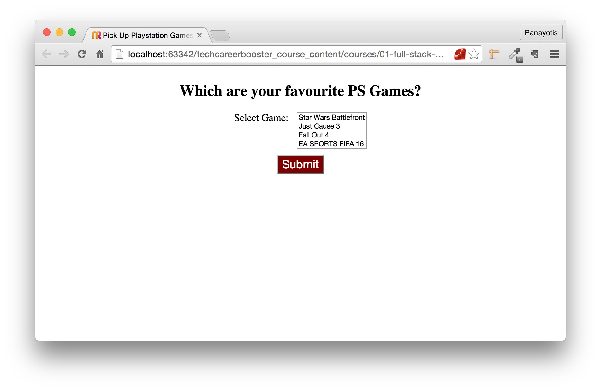

As you can see above, the multiple select box presents to user more than 1 option at once. User is able to select more than 1. See how it works here:

<div id="media-title-video-select-games-using-multiple-select-box.mp4-This is how the multiple select box works">This is how the multiple select box works</div>
<a href="https://player.vimeo.com/video/194096062"></a>

The HTML is pretty straight forward. The only new thing here is the `multiple="multiple"` attribute on the `select` element.

> *Note:* The `multiple` is another example of a boolean HTML element attribute (like `autofocus` and `required`).

``` html
<!DOCTYPE html>
<html>
  <head>
    <meta charset="utf-8">
    <title>Pick Up Playstation Games - Multi Select Box</title>
    <link rel="stylesheet" href="stylesheets/main.css" type="text/css">
  </head>

  <body>
    <h2>Which are your favourite PS Games?</h2>
    <form>
      <div class="input-group">
        <label for="star-wars-battlefront">Select Game:</label>
        <select id="star-wars-battlefront" multiple="multiple">
          <option>Star Wars Battlefront</option>
          <option>Just Cause 3</option>
          <option>Fall Out 4</option>
          <option>EA SPORTS FIFA 16</option>
        </select>
      </div>

      <div class="input-group">
        <input type="submit" value="Submit"/>
      </div>
    </form>

  </body>

</html>
```
In order to achieve the result presented on the video, the CSS that you should use is the following:

``` css
* {
    box-sizing: border-box;
}

html {
    font-size: 62.5%;
}

body {
    font-size: 1.6rem;
    margin-top: 1.6em;
    text-align: center;
}

.input-group {
    margin-bottom: 1.0rem;
}

label {
    display: inline-block;
    width: 95px;
    text-align: left;
    vertical-align: top;
}

form input[type='submit'] {
    font-size: 1.8rem;
    background-color: Maroon;
    color: White;
}

form input[type='submit']:hover {
    background-color: Black;
    cursor: pointer;
}
```
There is only thing that you should note here. It is the `vertical-align: top;` property for the `label` tag. This will allow the label to appear at the top of its container,
which is the `<div class="input-group">`. If you do not do that, it will be printed at the bottom, aligned with the bottom edge of the multiple select box.

### `input` of `type` `radio`

Another way to present user with a list of choices and ask to select one, is using the `input` elements that have `type` equal to `radio`. The point here is that the
radio buttons, as we call them, are used to allow the user to pick up only 1 option. So they function more like the way a single select box functions.

Let's see the following example:


As you can see above, the user is presented with a list of options, each one having a radio button, which the user can click. If the user clicks on an option, other selected
option is deselected.

You can see the user working with this form in the following video:

<div id="media-title-video-select-age-using-radio-buttons.mp4-Selecting Age Range Using Radio Buttons">Selecting Age Range Using Radio Buttons</div>
<a href="https://player.vimeo.com/video/194095528"></a>

The radio buttons are very simple to implement. As we said, they are `input` tag elements that have the `type` set to `radio`. So, for our example page, the first age range
can be specified as follows:

``` html
<div class="input-group">
  <input type="radio" id="age-range-0-to-18">
  <label for="age-range-0-to-18">0-18</label>
</div>
```

As you can see above, there is a corresponding label that is bound to the radio button. This is useful because, except from the fact that the label explains the option,
so that the users know what they are selecting, it also gives the users the option to click on the label (and not only on the radio button itself) in order to select it.

Let's create our HTML page with all the necessary radio buttons to represent the form with the age ranges:

``` html
<!DOCTYPE html>
<html>
  <head>
    <meta charset="utf-8">
    <title>Pick Up The Age Group</title>
    <link rel="stylesheet" href="stylesheets/main.css" type="text/css">
  </head>

  <body>
    <h2>Please, specify your age range</h2>
    <form>
      <div class="input-group">
        <input type="radio" id="age-range-0-to-18">
        <label for="age-range-0-to-18">0-18</label>
      </div>

      <div class="input-group">
        <input type="radio" id="age-range-19-to-30">
        <label for="age-range-19-to-30">19-30</label>
      </div>

      <div class="input-group">
        <input type="radio" id="age-range-31-to-45">
        <label for="age-range-31-to-45">31-45</label>
      </div>

      <div class="input-group">
        <input type="radio" id="age-range-46-to-60">
        <label for="age-range-46-to-60">46-60</label>
      </div>

      <div class="input-group">
        <input type="radio" id="age-range-61-to-80">
        <label for="age-range-61-to-80">61-80</label>
      </div>

      <div class="input-group">
        <input type="radio" id="age-range-above-80">
        <label for="age-range-above-80">&gt;80</label>
      </div>

      <div class="input-group last">
        <input type="submit" value="Submit"/>
      </div>
    </form>

  </body>

</html>
```
And the CSS file, let it be like this:
``` css
* {
    box-sizing: border-box;
    padding: 0;
    margin: 0;
}

html {
    font-size: 62.5%;
}

body {
    font-size: 1.6rem;
    margin-top: 20px;
    text-align: center;
}

h2 {
    margin-bottom: 5px;
}

.input-group {
    margin-bottom: 5px;
}

.input-group.last {
    margin-bottom: 20px;
}

label {
    display: inline-block;
    width: 41px;
    padding-left: 3px;
    text-align: left;
}
form input[type='submit'] {
    font-size: 1.8rem;
    background-color: Maroon;
    color: White;
    padding: 5px 10px;
}

form input[type='submit']:hover {
    background-color: Black;
    cursor: pointer;
}
```
If you save those two files and reload your page, you will see the page displayed correctly, as expected.

But there is a problem. When you click on a radio button, it does not deselect the previously one selected. And
allows all the options to be switched on. Which is not the requirement here and the correct way for the radio buttons
to work. As we said earlier, only 1 radio button should be selected at any time (or none).

The problem occurs because we have not told the browser that all these radio buttons should function together as a group.
If we had a way to tell that to the browser, then browser would have been smart enough to switch off a radio button when
switch on another.

In order to tell to the browser, that a set of radio buttons belong to the same group, you have to use the attribute `name`
and give it the same value for all `input` radio elements belonging to the same group. Let's try with our page. We will set the
attribute `name` on all `input` radio elements and we will set it to be with the value `age-range`.

``` html
<!DOCTYPE html>
<html>
  <head>
    <meta charset="utf-8">
    <title>Pick Up The Age Group</title>
    <link rel="stylesheet" href="stylesheets/main.css" type="text/css">
  </head>

  <body>
    <h2>Please, specify your age range</h2>
    <form>
      <div class="input-group">
        <input type="radio" id="age-range-0-to-18" name="age-range">
        <label for="age-range-0-to-18">0-18</label>
      </div>

      <div class="input-group">
        <input type="radio" id="age-range-19-to-30" name="age-range">
        <label for="age-range-19-to-30">19-30</label>
      </div>

      <div class="input-group">
        <input type="radio" id="age-range-31-to-45" name="age-range">
        <label for="age-range-31-to-45">31-45</label>
      </div>

      <div class="input-group">
        <input type="radio" id="age-range-46-to-60" name="age-range">
        <label for="age-range-46-to-60">46-60</label>
      </div>

      <div class="input-group">
        <input type="radio" id="age-range-61-to-80" name="age-range">
        <label for="age-range-61-to-80">61-80</label>
      </div>

      <div class="input-group">
        <input type="radio" id="age-range-above-80" name="age-range">
        <label for="age-range-above-80">&gt;80</label>
      </div>

      <div class="input-group last">
        <input type="submit" value="Submit"/>
      </div>
    </form>

  </body>

</html>
```

If you save the above code and reload your page, you will see that, now, the radio buttons work as expected. When the user
switches on one option, the previously selected one is automatically switched off.

### `checked` attribute

Both for checkboxes and for radio buttons, you may want an option to be switched on when the page first loads. And option
can be switched on if it has the attribute `checked` (this is a boolean HTML element attribute). Try the following HTML page:

``` html
<!DOCTYPE html>
<html>
  <head>
    <meta charset="utf-8">
    <title>Pick Up The Age Group</title>
    <link rel="stylesheet" href="stylesheets/main.css" type="text/css">
  </head>

  <body>
    <h2>Please, specify your age range</h2>
    <form>
      <div class="input-group">
        <input type="radio" id="age-range-0-to-18" name="age-range" checked="checked">
        <label for="age-range-0-to-18">0-18</label>
      </div>

      <div class="input-group">
        <input type="radio" id="age-range-19-to-30" name="age-range">
        <label for="age-range-19-to-30">19-30</label>
      </div>

      <div class="input-group">
        <input type="radio" id="age-range-31-to-45" name="age-range">
        <label for="age-range-31-to-45">31-45</label>
      </div>

      <div class="input-group">
        <input type="radio" id="age-range-46-to-60" name="age-range">
        <label for="age-range-46-to-60">46-60</label>
      </div>

      <div class="input-group">
        <input type="radio" id="age-range-61-to-80" name="age-range">
        <label for="age-range-61-to-80">61-80</label>
      </div>

      <div class="input-group">
        <input type="radio" id="age-range-above-80" name="age-range">
        <label for="age-range-above-80">&gt;80</label>
      </div>

      <div class="input-group last">
        <input type="submit" value="Submit"/>
      </div>
    </form>

  </body>

</html>
```

Do you see the `checked="checked"` on the first radio button? If you save the above content and load the page on your browser, you will see that the first age range
is preselected. Like that:

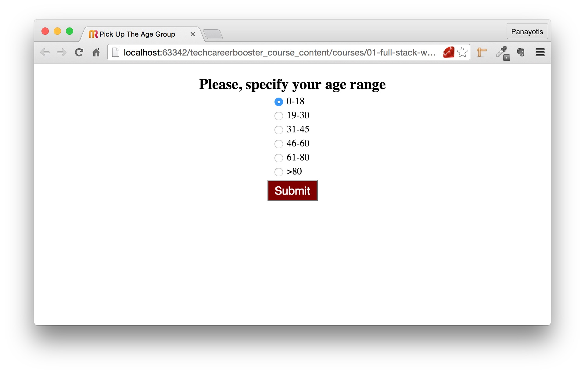

The same technique, with `checked` attribute can bee applied to checkboxes too.

### `textarea`

Let's move on to create a Contact Us form, in which we ask the user to type in their basic identity details and also give us
a message that they would like to inform us about. Here it is how it would look like:

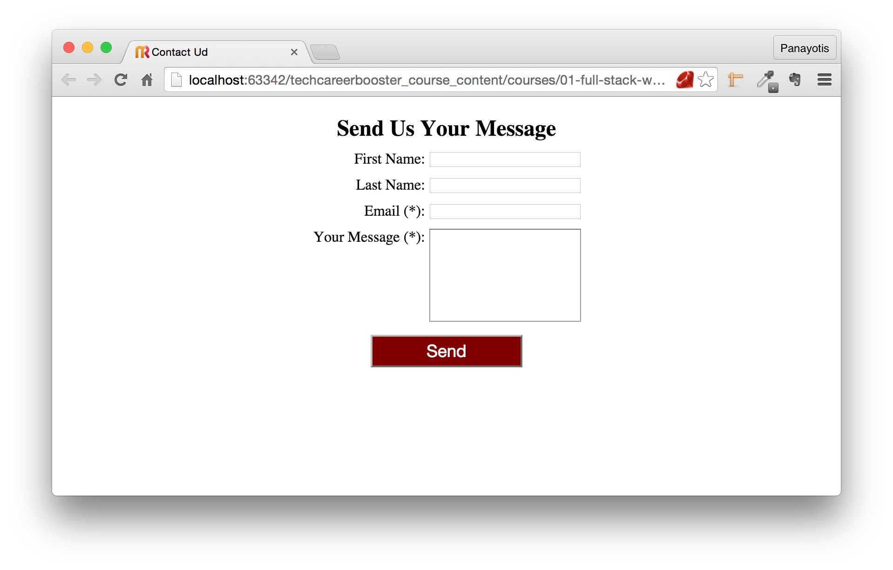

The properties of this form that we need to note here are:

1. First name and last name are not mandatory
2. The email is mandatory
3. The message is mandatory. Note that we do not use a one-line input control for the message. We want the user to be able to write multiple lines in his message.

The key to allow multiple lines on the input control for the message is the HTML element `textarea`. The `textarea` is an HTML element that has an opening (`<textarea>`)
and a closing (`</textarea>`) tag. When used, it displays a UI control on the page that allows the user to enter multiple lines.

Having said that, this is the HTML fragment that will allow us to present such a UI control for the message input:

``` html
<div class="input-group">
  <label for="message">Your Message (*):</label>
  <textarea id="message" required="required"></textarea>
</div>
```

So, `textarea`, as you can see is very simple.

Let's see the code of our HTML Contact Us form page:

``` html
<!DOCTYPE html>
<html>
  <head>
    <meta charset="utf-8">
    <title>Contact Ud</title>
    <link rel="stylesheet" href="stylesheets/main.css" type="text/css">
  </head>

  <body>
    <h2>Send Us Your Message</h2>
    <form>
      <div class="input-group">
        <label for="first-name">First Name:</label>
        <input type="text" id="first-name" autofocus="autofocus"/>
      </div>

      <div class="input-group">
        <label for="last-name">Last Name:</label>
        <input type="text" id="last-name"/>
      </div>

      <div class="input-group">
        <label for="email">Email (*):</label>
        <input type="email" id="email" required="required"/>
      </div>

      <div class="input-group">
        <label for="message">Your Message (*):</label>
        <textarea id="message" required="required"></textarea>
      </div>

      <div class="input-group">
        <input type="submit" value="Send"/>
      </div>
    </form>

  </body>

</html>
```
You can use the following CSS file content too:

``` css
* {
    box-sizing: border-box;
    padding: 0;
    margin: 0;
}

html {
    font-size: 62.5%;
}

body {
    font-size: 1.6rem;
    margin-top: 20px;
    text-align: center;
}

h2 {
    margin-bottom: 10px;
}

.input-group {
    margin-bottom: 10px;
}

label {
    display: inline-block;
    width: 121px;
    text-align: right;
    vertical-align: top;
}

input, textarea {
    width: 163px;
}

textarea {
    height: 100px;
    resize: none;
}

form input[type='submit'] {
    font-size: 1.8rem;
    background-color: Maroon;
    color: White;
    padding: 5px 10px;
}

form input[type='submit']:hover {
    background-color: Black;
    cursor: pointer;
}
```
If you save the above two files and load the HTML page on your browser, you will see the form functioning as expected.

Something that might worth noting here is the property `resize` that has been used on the `textarea` CSS rule. This now has been set to have the
value `none`. This fixes the size of the textarea UI control presented to the user. If you want the user to be able to resize the area that he
has available to type in his message, you can remove this property completely.

Finally, the height of the textarea is defined using the `height` CSS property. Another way you can define the height of a textarea is to use the
attribute `rows` on the `textarea` element. It takes the number of lines/rows the user can type in, before start scrolling and a vertical scroll bar
appears on the right hand side of the `textarea`. Hence:

``` html
<textarea rows="5"></textarea>
```
will render the `textarea` height such that the user is able to type in 5 lines of text and all being visible. The 6th line will make the text scroll and
a vertical scroll bar will appear on the right.

Similar to `rows` attribute, one can define the width of a textarea using the attribute `cols`. However, this might not be that handy, because we usually prefer
the width to be a relative size of the container of the `textarea`.

Other than that, there is nothing special with the CSS rules for this form.

### `placeholder` attribute

Sometimes, you may have seen forms like this:

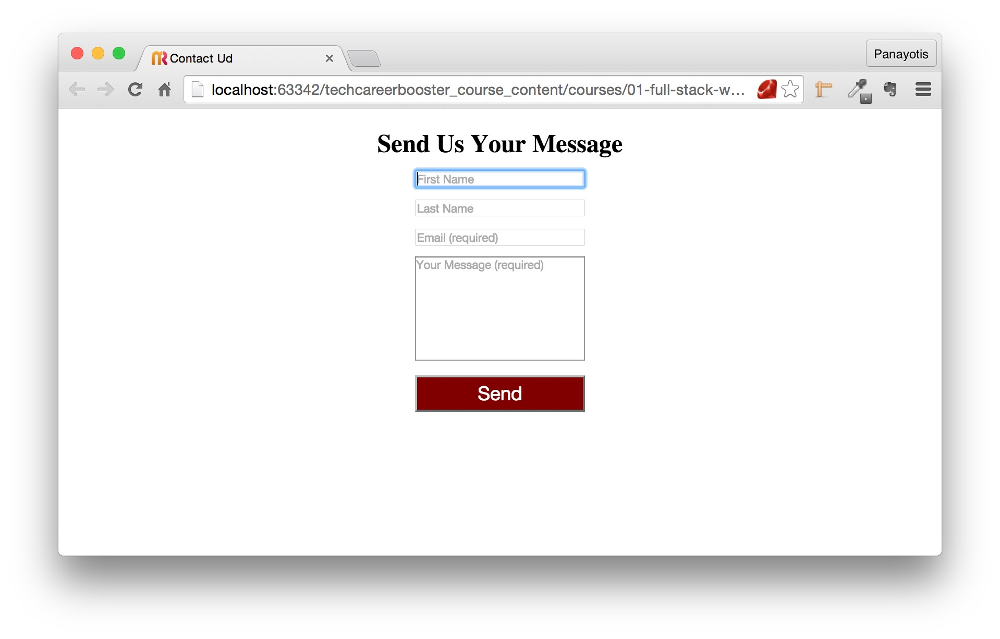

This form above, does not use labels, but it has a text inside the input element that explains to the user what he has to type in. It works like a label.
But, the behaviour here is that when the user starts typing in, the text inside the input disappears. The prompt text appears again only if the user
deletes the words that he has typed in. Watch the following video to understand what we mean:

<div id="media-title-video-contact-us-form-with-placeholders.mp4-./images/./images/Contact Us Form Without Labels">./images/./images/Contact Us Form Without Labels</div>
<a href="https://player.vimeo.com/video/194093902"></a>

This feature of the input controls is achieved with the attribute `placeholder`. It takes as value the text prompt that we want to appear inside the input control.
Let's change our HTML contact us form to work with placeholders and without labels:

``` html
<!DOCTYPE html>
<html>
  <head>
    <meta charset="utf-8">
    <title>Contact Ud</title>
    <link rel="stylesheet" href="stylesheets/main.css" type="text/css">
  </head>

  <body>
    <h2>Send Us Your Message</h2>
    <form>
      <div class="input-group">
        <input type="text" id="first-name" autofocus="autofocus" placeholder="First Name"/>
      </div>

      <div class="input-group">
        <input type="text" id="last-name" placeholder="Last Name"/>
      </div>

      <div class="input-group">
        <input type="email" id="email" required="required" placeholder="Email (required)"/>
      </div>

      <div class="input-group">
        <textarea id="message" required="required" placeholder="Your Message (required)"></textarea>
      </div>

      <div class="input-group">
        <input type="submit" value="Send"/>
      </div>
    </form>

  </body>

</html>
```
As you can see above, we have removed the labels and we have added the attribute `placeholder`. Save the above HTML code and reload the page. You will see the
contact us form working as demonstrated in the video above.

> **Important:** You need to take into account that, if the form is already filled in, and the input controls do not have labels, but only placeholders,
then the user might not know which input control corresponds to what. Look at the following form:

Can you tell which piece of information is being asked for the first input control? Is it the first name or the last name? Or something else? What about the third input control?
Is it the email or the username? Which piece of information is required? The answers to these questions can be inferred only by looking at the values that the input controls already
have. And, even in that case, we are not 100% sure about it. So, you need to think about it twice if you are to remove the labels from your input controls and rely only on the
placeholders. One good technique that you might consider is to use both a label and a placeholder. The placeholder is usually more descriptive than the label giving some
extra instructions about how the input information should be given by the user.

### `title`

Another way we can help user fill in the information of an input control is by the use of the attribute `title`. The `title` attribute takes a text, a phrase, that is presented to the
user when the user moves his mouse over the input control.

Look at the following example presented here:


On the above example, we are using titles and the screenshot is when the user moves his mouse over the message input control.

You can also watch this video to see how the mouse over works on this contact us form.

<div id="media-title-video-contact-us-form-mouse-over-demo.mp4-How the title attribute works on the contact us form">How the title attribute works on the contact us form</div>
<a href="https://player.vimeo.com/video/194092366"></a>

It's very simple to enhance our label-less form with titles. Let's do that:

``` html
<!DOCTYPE html>
<html>
  <head>
    <meta charset="utf-8">
    <title>Contact Us With Titles</title>
    <link rel="stylesheet" href="stylesheets/title.css" type="text/css">
  </head>

  <body>
    <h2>Send Us Your Message</h2>
    <form>
      <div class="input-group">
        <input type="text" id="first-name" autofocus="autofocus" placeholder="First Name" title="Type in your First Name"/>
      </div>

      <div class="input-group">
        <input type="text" id="last-name" placeholder="Last Name" title="Type in your Last Name"/>
      </div>

      <div class="input-group">
        <input type="email" id="email" required="required" placeholder="Email (required)" title="Type in your Email (required)"/>
      </div>

      <div class="input-group">
        <textarea id="message" required="required" placeholder="Your Message (required)" title="Type in your Message (required)"></textarea>
      </div>

      <div class="input-group">
        <input type="submit" value="Send"/>
      </div>
    </form>

  </body>

</html>
```
Save the above HTML file and load it on your browser. You will see that the result is one presented on the previous video. If you move your
mouse over the input controls, you can see the title popping up.

> *Note:* The `title` attribute can be used on any visual HTML element. And has the same functionality. If the user moves his mouse over the
HTML element, the title attribute value will pop up at that point, usually explaining to the user about the corresponding element.

### `autocomplete` attribute

Browser is set up to remember the values that you have previously typed in on same / similar input controls. With this list of values in its memory,
browser has the ability to suggest to you a list of values that you can choose from while filling in an input control. For example, if you have
previously filled in a form that asks for the email with the value "john_smith@gmail.com", browser will remember that, and next time you fill in the same
form email input (or other form that asks for email) will suggest to you the value "john_smith@gmail.com" so that you can select it, instead of typing it end-to-end.
This feature is called *autocomplete* and it is really helpful because it saves user from keystrokes.

You can see that feature in action here:

<div id="media-title-video-contact-us-form-autocomplete-feature-in-action.mp4-Autocomplete Feature">Autocomplete Feature</div>
<a href="https://player.vimeo.com/video/194093127"></a>

By default all the input controls have this feature on. If you want to switch it off, you have to use the attribute `autocomplete` with the value `off`. This attribute
can be set to the `form` level. In that case all the input controls of that form inherit the same level of autocompletion. You can also set it on on individual
input elements.

In the following example, we set autocompletion off for the whole form except for the email field, on which we switch it on (with the value `on`):

``` html
<!DOCTYPE html>
<html>
  <head>
    <meta charset="utf-8">
    <title>Contact Us With Titles</title>
    <link rel="stylesheet" href="stylesheets/main.css" type="text/css">
  </head>

  <body>
    <h2>Send Us Your Message</h2>
    <form autocomplete="off">
      <div class="input-group">
        <input type="text" id="first-name" autofocus="autofocus" placeholder="First Name" title="Type in your First Name"/>
      </div>

      <div class="input-group">
        <input type="text" id="last-name" placeholder="Last Name" title="Type in your Last Name"/>
      </div>

      <div class="input-group">
        <input type="email" id="email" required="required" placeholder="Email (required)" title="Type in your Email (required)" autocomplete="on"/>
      </div>

      <div class="input-group">
        <textarea id="message" required="required" placeholder="Your Message (required)" title="Type in your Message (required)"></textarea>
      </div>

      <div class="input-group">
        <input type="submit" value="Send"/>
      </div>
    </form>

  </body>

</html>
```
If you save and reload this page on your browser, when trying to fill in the first name and last name, you will not get any autocompletion help.
You will only get it for the email input control.

<div id="media-title-video-contact-us-form-with-autocompletion-only-on-email.mp4-Contact Form with Autocompletion Only on Email">Contact Form with Autocompletion Only on Email</div>
<a href="https://player.vimeo.com/video/194145996"></a>

### `input` with `type` `number`

There are cases in which we want to ask the user to give us a number. For example, we have a checkout form and there is an input control for the buyer to
key in the quantity of the product that he is purchasing. Look at the following form:


As you can see above, the quantity does not have any difference on how the input control is drawn. The difference will be obvious when you try to key in the quantity.
You will see that the input control changes to have a small handle on the right that allows you to increase or decrease the number inside the box, by clicking on the
corresponding edges of the handle. You will also experience the following:

1. You can use the up arrow key to increase the number inside the quantity field.
2. You can use the down arrow key to decrease the number inside the quantity field.
3. You can only type in numbers. If you try to type in a character that is not a number, that character will not be accepted.

Let's see that in action:

<div id="media-title-video-purchase-form-with-quantity-being-a-number.mp4-Using the Quantity Field">Using the Quantity Field</div>
<a href="https://player.vimeo.com/video/194095276"></a>

In order to achieve the above functionality, you need to use the `type` attribute with the value `number`. Let's see the HTML code of the above page.

``` html
<!DOCTYPE html>
<html>
  <head>
    <meta charset="utf-8">
    <title>Purchase Form</title>
    <link rel="stylesheet" href="stylesheets/main.css" type="text/css">
  </head>

  <body>
    <h2>Place your Order</h2>
    <form>

      <div class="input-group">
        <label for="product">Product:</label>
        <select id="product" autofocus="autofocus">
          <option>Of Mice and Men</option>
          <option>Game of Thrones</option>
          <option>Star Wars II</option>
        </select>
      </div>

      <div class="input-group">
        <label for="quantity">Quantity: </label>
        <input type="number" id="quantity" required="required"/>
      </div>

      <div class="input-group">
        <input type="submit" value="Purchase"/>
      </div>

    </form>
  </body>

</html>
```
As you can see above, for the quantity field, we are using an `input` HTML element with value `number` on its `type` attribute. Other than that, there is not anything new.

The CSS of this page is:
``` css
* {
    box-sizing: border-box;
    padding: 0;
    margin: 0;
}

html {
    font-size: 62.5%;
}

body {
    font-size: 1.6rem;
    margin-top: 20px;
    text-align: center;
}

h2 {
    margin-bottom: 10px;
}

.input-group {
    margin-bottom: 5px;
}

.input-group.last {
    margin-bottom: 10px;
}

label {
    display: inline-block;
    width: 61px;
    text-align: right;
}

input, select {
    width: 120px;
}

form input[type='submit'] {
    font-size: 1.8rem;
    background-color: Maroon;
    color: White;
    padding: 5px 10px;
}

form input[type='submit']:hover {
    background-color: Black;
    cursor: pointer;
}
```

Save the above files and load your page on your browser. You will see how the form behaves exactly as described above.

### `min` and `max` attributes

There is a problem with the quantity field on the previous purchase form. Although the user is allowed to enter only numbers,
the problem is that he can set any number that he likes. Even negative integers. We can use the `min` and `max` attributes and
specify the minimum and maximum values that the user can enter respectively.

In the example of our purchase form, we would like to assign the value `1` to the attribute `min` and the value `10` to the
attribute `max`. Hence, limiting the user to values between 1 and 10. Let's do that:

``` html
<!DOCTYPE html>
<html>
  <head>
    <meta charset="utf-8">
    <title>Purchase Form</title>
    <link rel="stylesheet" href="stylesheets/main.css" type="text/css">
  </head>

  <body>
    <h2>Place your Order</h2>
    <form>

      <div class="input-group">
        <label for="product">Product:</label>
        <select id="product" autofocus="autofocus">
          <option>Of Mice and Men</option>
          <option>Game of Thrones</option>
          <option>Star Wars II</option>
        </select>
      </div>

      <div class="input-group">
        <label for="quantity">Quantity: </label>
        <input type="number" id="quantity" required="required" min="1" max="10"/>
      </div>

      <div class="input-group">
        <input type="submit" value="Purchase"/>
      </div>

    </form>


  </body>

</html>
```
If you save the above file and reload the page, you will see that trying to set a number minimum from 1 or above 10 will not allow the user to submit the form.
Watch this video to see that in action:

<div id="media-title-video-purchase-form-with-min-and-max-values-on-quantity.mp4-How the Quantity is now limited according to min and max attributes">How the Quantity is now limited according to min and max attributes</div>
<a href="https://player.vimeo.com/video/194094868"></a>

### `step` attribute

Let's see the following purchase form now, in which the quantity represents kilos:


So, the HTML content now has as follows:

``` html
<!DOCTYPE html>
<html>
  <head>
    <meta charset="utf-8">
    <title>Purchase Form</title>
    <link rel="stylesheet" href="stylesheets/purchase.css" type="text/css">
  </head>

  <body>
    <h2>Place your Order</h2>
    <form>

      <div class="input-group">
        <label for="fruits">Fruits:</label>
        <select id="fruits" autofocus="autofocus">
          <option>Tomatoes</option>
          <option>Potatoes</option>
          <option>Apples</option>
          <option>Oranges</option>
        </select>
      </div>

      <div class="input-group">
        <label for="quantity">Quantity: </label>
        <input type="number" id="quantity" required="required" min="1" max="10" placeholder="Kilo(s)"/>
      </div>

      <div class="input-group">
        <input type="submit" value="Purchase"/>
      </div>

    </form>


  </body>

</html>
```
There is nothing different (if compared to the previous HTML page) other than the `placeholder` attribute, which explains that the quantity represents kilos.
The quantity can still be between "1" and "10" (thanks to `min` and `max` attributes).

If you save this file and load the page on your browser, you will see that there is a problem. You cannot set a value to quantity that is not an integer.
For example, you cannot purchase 2.5 kilos of potatoes. Watch this video here to understand what we mean:

<div id="media-title-video-purchase-form-without-step-on-quantity.mp4-We cannot set the value to sub-multiples (aliquots) of 1">We cannot set the value to sub-multiples (aliquots) of 1</div>
<a href="https://player.vimeo.com/video/194146352"></a>

How can we allow the `number` type `inputs` to accept decimal / float numbers? This is done with the help of the attribute `step`. This specifies the
distance from one valid number to the next valid number allowed to be keyed in in the input `number` control. The default value is "1". That's why,
only positive, negative or 0 integers are allowed. If you set the value of `step` to "0.1" for example, you will be able to set numbers like "1.2",
"1.4", e.t.c.

Let's do that for our fruits purchase form:

``` html
<!DOCTYPE html>
<html>
  <head>
    <meta charset="utf-8">
    <title>Purchase Form</title>
    <link rel="stylesheet" href="stylesheets/main.css" type="text/css">
  </head>

  <body>
    <h2>Place your Order</h2>
    <form>

      <div class="input-group">
        <label for="fruits">Fruits:</label>
        <select id="fruits" autofocus="autofocus">
          <option>Tomatoes</option>
          <option>Potatoes</option>
          <option>Apples</option>
          <option>Oranges</option>
        </select>
      </div>

      <div class="input-group">
        <label for="quantity">Quantity: </label>
        <input type="number" id="quantity" required="required" min="1" max="10" step="0.1" placeholder="Kilo(s)"/>
      </div>

      <div class="input-group">
        <input type="submit" value="Purchase"/>
      </div>
    </form>

  </body>

</html>
```
We only added the `step="0.1"` attribute value pair on the `quantity` input control. If you load the page on your browser, you will now be able to specify the `2.5` kilos
quantity and any quantity from `1` to `10` with step `0.1`.

Let's see that in action:

<div id="media-title-video-purchase-form-with-quantity-with-step-0-point-1.mp4-0.1 Step is used to allow for the value 2.5">0.1 Step is used to allow for the value 2.5</div>
<a href="https://player.vimeo.com/video/194146279"></a>
           
However, if you try to enter the value "2.25" (2 1/4 kilos) you will fail again. Because "0.25" is not a sub-multiple of "0.1". You will be warned that the nearest
value to "2.25" that you can enter is either "2.3" or "2.2".

If you want to allow any decimal number to be entered, you can set the value of the `step` attribute to `any`. Let's do that on our form:

``` html
<!DOCTYPE html>
<html>
  <head>
    <meta charset="utf-8">
    <title>Purchase Form</title>
    <link rel="stylesheet" href="stylesheets/main.css" type="text/css">
  </head>

  <body>
    <h2>Place your Order</h2>
    <form>

      <div class="input-group">
        <label for="fruits">Fruits:</label>
        <select id="fruits" autofocus="autofocus">
          <option>Tomatoes</option>
          <option>Potatoes</option>
          <option>Apples</option>
          <option>Oranges</option>
        </select>
      </div>

      <div class="input-group">
        <label for="quantity">Quantity: </label>
        <input type="number" id="quantity" required="required" min="1" max="10" step="any" placeholder="Kilo(s)"/>
      </div>

      <div class="input-group">
        <input type="submit" value="Purchase"/>
      </div>
    </form>
  </body>
</html>
```
If you save the above file and load your page again, you will be able to give any value to the quantity field, as long as it is in the range "1", "10".

Let's see that in action again:

<div id="media-title-video-purchase-form-with-quantity-step-any.mp4-We can now enter any value to Quantity">We can now enter any value to Quantity</div>
<a href="https://player.vimeo.com/video/194094362"></a>

### `input` with `type` `range`

There is another alternative UI control that can help us collect information related to a range of numbers. Instead of using the `type` with value `number`
we can use the `type` with value `range`. The `input` controls with `type` equal to `range` they are usually been drawn as a slider.

Let's suppose that we are implementing a radio listener and we need to allow the user to set the volume control. Like this:


The HTML for this page is very simple:

``` html
<!DOCTYPE html>
<html>
  <head>
    <meta charset="utf-8">
    <title>Volume Control</title>
    <link rel="stylesheet" href="stylesheets/main.css" type="text/css">
  </head>
  <body>
    <h2>Set Current Volume</h2>

    <form>
      <label for="volume">Volume</label><br/>
      Low <input type="range" id="volume" min="0" max="50" value="25"/> High<br/>
      <input type="submit" value="Set"/>
    </form>
  </body>
</html>
```
As you can see above, the `input` is of type `range`. It also has a `min` and `max` value. Also, the starting, default value is `25` and is specified by setting the value `25`
in the attribute with name `value`.

Save the above file and use this CSS:

``` css
* {
    box-sizing: border-box;
    padding: 0;
    margin: 0;
}

html {
    font-size: 62.5%;
}

body {
    font-size: 1.6rem;
    margin-top: 20px;
    text-align: center;
}

h2 {
    margin-bottom: 20px;
}

input[type="range"] {
    width: 300px;
    margin-bottom: 10px;
}

label {
    display: inline-block;
    margin-bottom: 10px;
}

form input[type='submit'] {
    font-size: 1.8rem;
    background-color: Maroon;
    color: White;
    padding: 5px 10px;
}

form input[type='submit']:hover {
    background-color: Black;
    cursor: pointer;
}
```
to see the form in action.

### `value` attribute

In the purchase form with the products and the quantity, there is a small problem with the quantity field that, when the form is loaded, the quantity
does not have any prepopulated value. We would like the value of quantity to be `1` when the form loads. How can we do that?

We can do that if we use the attribute `value` and set its value to `1`. Let's see that:

``` html
<!DOCTYPE html>
<html>
  <head>
    <meta charset="utf-8">
    <title>Purchase Form</title>
    <link rel="stylesheet" href="stylesheets/main.css" type="text/css">
  </head>

  <body>
    <h2>Place your Order</h2>
    <form>

      <div class="input-group">
        <label for="product">Product:</label>
        <select id="product" autofocus="autofocus">
          <option>Of Mice and Men</option>
          <option>Game of Thrones</option>
          <option>Star Wars II</option>
        </select>
      </div>

      <div class="input-group">
        <label for="quantity">Quantity: </label>
        <input type="number" id="quantity" required="required" min="1" max="10" value="1"/>
      </div>

      <div class="input-group">
        <input type="submit" value="Purchase"/>
      </div>
    </form>

  </body>
</html>
```

Do you see the `value="1"` on the quantity input element? If you save this and load the page, you will see that the quantity is pre-populated with the value `1`:

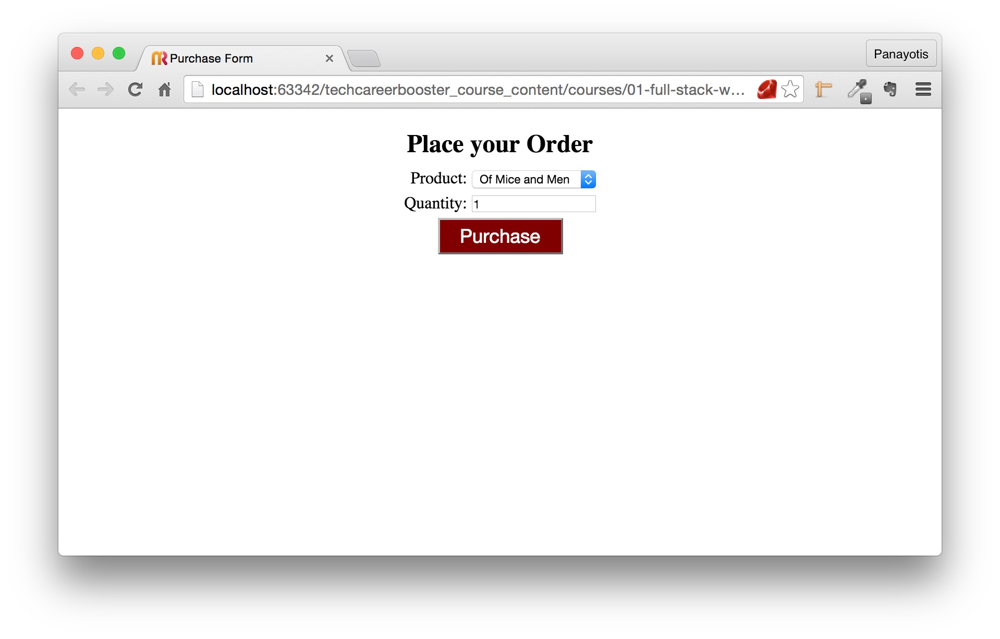

> *Question:* How would you make the value inside the quantity box appear right aligned rather than left as it is now? How would you do this?


### Grouping Selection Options

When we have a long list of options, we usually decide to present them in alphabetical order, so that it is easier for the users to select the option they prefer.
Another extra facility that we have in long list of options, is the grouping of options by a category. Let's suppose that we want to group the products on our
purchase form by their category:


Watch the following video to see this form in action:

<div id="media-title-video-grouping-options-in-product-list.mp4-Working on the Form that Groups Products">Working on the Form that Groups Products</div>
<a href="https://player.vimeo.com/video/194094619"></a>

Since we have already learned about the `select` box, adding the grouping feature on a `select` box is easy. We only have to group options inside an `optgroup` HTML element.
The `optgroup` encloses the `option` elements that are part of the group. Also, it has a `label` attribute that has the value that plays the role of the name of the group.

Hence, the following is the HTML page that groups the products in two groups/categories. The `TV Series` and the `Movies`:

``` html
<!DOCTYPE html>
<html>
  <head>
    <meta charset="utf-8">
    <title>Purchase Form</title>
    <link rel="stylesheet" href="stylesheets/main.css" type="text/css">
  </head>

  <body>
    <h2>Place your Order</h2>
    <form>

      <div class="input-group">
        <label for="product">Product:</label>
        <select id="product" autofocus="autofocus">
          <optgroup label="TV Series">
            <option>Under the Dome</option>
            <option>Game of Thrones</option>
            <option>Dexter</option>
          </optgroup>
          <optgroup label="Movies">
            <option>Star Wars I</option>
            <option>The Beauty and The Beast</option>
            <option>James Bond - Skyfall</option>
          </optgroup>
        </select>
      </div>

      <div class="input-group">
        <label for="quantity">Quantity: </label>
        <input type="number" id="quantity" required="required" min="1" max="10" value="1"/>
      </div>

      <div class="input-group">
        <input type="submit" value="Purchase"/>
      </div>
    </form>

  </body>

</html>
```

Do you see the `<optgroup>...</optgroup>` above and how it is being used? When you save this page and load it on your browser, you will see
the drop down list box presenting its options in two groups.

### `input` of `type` `color`

Sometimes we want to ask the user to specify a color. There is a handy input of type `color` that can be used for this case. See the following form:

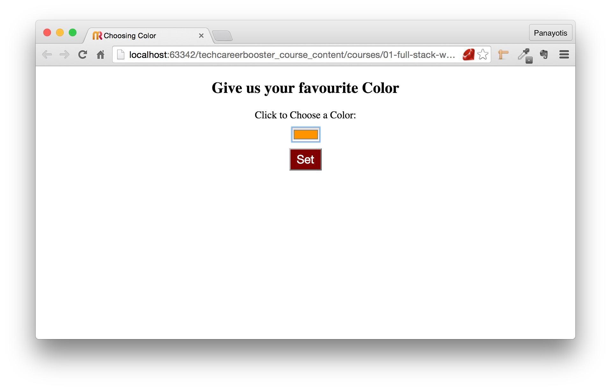

Do you see that there is a colored box in the middle? This can be clicked by the user and a color picker window will pop up to allow the user to select the color he wants.
See this form in action here:

<div id="media-title-video-choosing-color-with-color-picker.mp4-How user is using the color picker">How user is using the color picker</div>
<a href="https://player.vimeo.com/video/194145779"></a>

In order to implement this simple form, use the following HTML code:

``` html
<!DOCTYPE html>
<html>
  <head>
    <meta charset="utf-8">
    <title>Choosing Color</title>
    <link rel="stylesheet" href="stylesheets/color.css" type="text/css">
  </head>
  <body>
    <h2>Give us your favourite Color</h2>
    <form>
      <label for="color">Click to Choose a Color:</label><br/>
      <input type="color" id="color"/><br/>
      <input type="submit" value="Set"/>
    </form>
  </body>
</html>
```
with the following CSS:
``` css
* {
    box-sizing: border-box;
    padding: 0;
    margin: 0;
}

html {
    font-size: 62.5%;
}

body {
    font-size: 1.6rem;
    margin-top: 20px;
    text-align: center;
}

h2 {
    margin-bottom: 20px;
}

input[type="color"] {
    margin-bottom: 10px;
}

label {
    display: inline-block;
    margin-bottom: 10px;
}

form input[type='submit'] {
    font-size: 1.8rem;
    background-color: Maroon;
    color: White;
    padding: 5px 10px;
}

form input[type='submit']:hover {
    background-color: Black;
    cursor: pointer;
}
```
As you can see, the `input` of `type` `color` is very simple.

### `input` of `type` `date`

> *Note:* This may not be supported on all browsers. We are working here with Chrome.

We will often come across the need to ask our users for a date. For example, the following form asks for the date of birth:

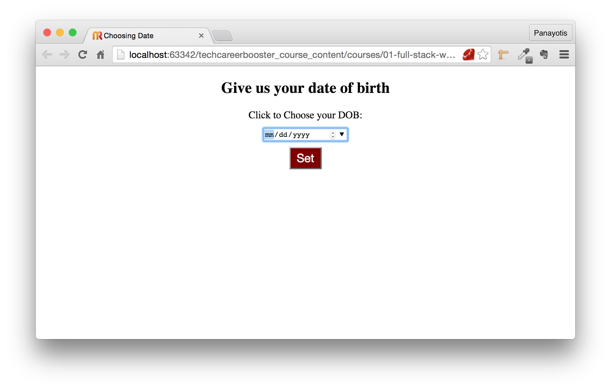

See this form in action:

<div id="media-title-video-choosing-date-of-birth.mp4-How the date picker is being used by the user">How the date picker is being used by the user</div>
<a href="https://player.vimeo.com/video/194092740"></a>

Things are very simple again. You only have to use an `input` of `type` `date`. The rest of the job is done by your browser. Your browser will display the correct input
control to ease the user when specifying their date of birth.

Here is the HTML code for this page:

``` html
<!DOCTYPE html>
<html>
  <head>
    <meta charset="utf-8">
    <title>Choosing Date</title>
    <link rel="stylesheet" href="stylesheets/main.css" type="text/css">
  </head>
  <body>
    <h2>Give us your date of birth</h2>
    <form>
      <label for="dob">Click to Choose your DOB:</label><br/>
      <input type="date" id="dob" autofocus="autofocus"/><br/>
      <input type="submit" value="Set"/>
    </form>
  </body>
</html>
```
And the corresponding CSS:
``` css
* {
    box-sizing: border-box;
    padding: 0;
    margin: 0;
}

html {
    font-size: 62.5%;
}

body {
    font-size: 1.6rem;
    margin-top: 20px;
    text-align: center;
}

h2 {
    margin-bottom: 20px;
}

input[type="date"] {
    margin-bottom: 10px;
}

label {
    display: inline-block;
    margin-bottom: 10px;
}

form input[type='submit'] {
    font-size: 1.8rem;
    background-color: Maroon;
    color: White;
    padding: 5px 10px;
}

form input[type='submit']:hover {
    background-color: Black;
    cursor: pointer;
}
```
As you can see the `input` of `type` `date` is enough.

### `input` of `type` `file`

Sometimes you want to ask the user to send a file, a document. For example, when we want the user to upload his CV. Like in the form below:


As you can see above, there is a button `Choose File` which allows the user to click and attach a file to the form. Then when the user clicks on `Upload` submit button, the form will
be submitted alongside the file attached.

Here is the HTML code for such a form:

``` html
<!DOCTYPE html>
<html>
  <head>
    <meta charset="utf-8">
    <title>Upload File</title>
    <link rel="stylesheet" href="stylesheets/main.css" type="text/css">
  </head>

  <body>
    <h2>Upload your CV</h2>
    <form>
      <label for="cv">Your CV:</label><br/>
      <input type="file" id="cv"/><br/>
      <input type="submit" value="Upload"/>
    </form>

  </body>

</html>
```

It is very simple. The `input` is of `type` `file`. Use the following CSS code:

``` css
* {
    box-sizing: border-box;
    padding: 0;
    margin: 0;
}

html {
    font-size: 62.5%;
}

body {
    font-size: 1.6rem;
    margin-top: 20px;
    text-align: center;
}

h2 {
    margin-bottom: 20px;
}

input[type="file"] {
    margin-bottom: 10px;
}

label {
    display: inline-block;
    margin-bottom: 10px;
}

form input[type='submit'] {
    font-size: 1.8rem;
    background-color: Maroon;
    color: White;
    padding: 5px 10px;
}

form input[type='submit']:hover {
    background-color: Black;
    cursor: pointer;
}
```
Save all files and load your HTML page. You will see the form as given above in the screenshot. Click on the button `Choose File` and you will be prompted to choose a file
from your local machine.

#### Grouping Form Fields

We continue this first encounter with forms using a way to visually group fields of a form. Look at the following example:


As you can see above, we have grouped the fields of the form into 2 groups. Product Details and Shipping Address. This is done with the help of two HTML tags, the `fieldset`
and the `legend`. The `fieldset` is actually used to group the fields and the `legend` is used to add the title on top left. We open the `fieldset` with the opening tag
`<fieldset>` and then we write, first, the `legend` and then the form fields that are part of the group.

Let's see the HTML code for the above page:

``` html
<!DOCTYPE html>
<html>
  <head>
    <meta charset="utf-8">
    <title>Checkout</title>
    <link rel="stylesheet" href="stylesheets/main.css" type="text/css">
  </head>

  <body>

    <h2>Place your Order</h2>
    <form>
      <fieldset>
        <legend>Product Details</legend>
        <div class="input-group">
          <label for="product">Product:</label>
          <select id="product" autofocus="autofocus">
            <option>Product...</option>
            <option>Game Of Thrones</option>
            <option>Of Mice And Men</option>
            <option>James Bond</option>
            <option>Star Wars</option>
          </select>
        </div>

        <div class="input-group">
          <label for="quantity">Quantity:</label>
          <input type="number" id="quantity" min="1" max="10" value="1"/>
        </div>

      </fieldset>

      <fieldset>
        <legend>Shipping Address</legend>
        <div class="input-group">
          <label for="address">Address:</label>
          <input type="text" id="address" placeholder="Address"/>
        </div>

        <div class="input-group">
          <label for="zip-code">Zip Code:</label>
          <input type="text" id="zip-code" placeholder="Zip Code"/>
        </div>
        <div class="input-group">
          <label for="country">Country:</label>
          <select id="country">
            <option>Country...</option>
            <option>Afghanistan</option>
            <!-- ... rest of the countries go here ... -->
            <option>Zimbabwe</option>
          </select>
          </div>
      </fieldset>

      <div class="input-group">
        <input type="submit" value="Purchase"/>
      </div>
    </form>

  </body>

</html>
```

Do you see how the `<fieldset>....</fieldset>` has been used to group the fields of the form into 2 groups? Do you see the `<legend>....</legend>` which is
exactly below the opening `<fieldset>` tag?

Note that `<fieldset>` is a block level element and hence, when used, no other element exists left or right to it.
