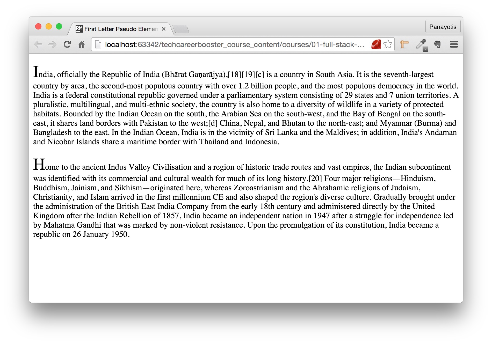
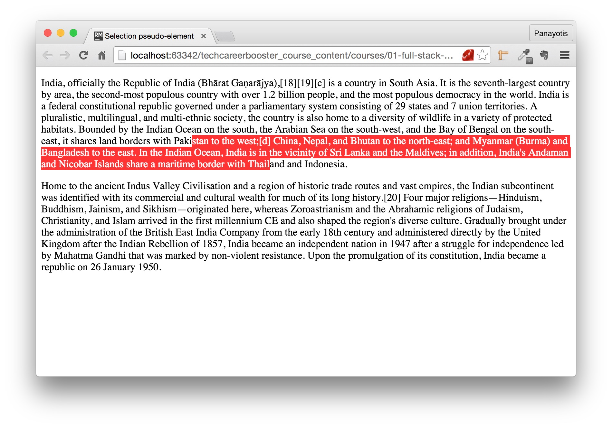

We have learned a lot of CSS selectors until now, but this chapter has the intention to teach some
of the more advanced topics on this subject.

We will deal with three categories of CSS selectors:

1. The pseudo-classes
2. The pseudo-elements
3. Other advanced CSS selectors

The pseudo-classes will allow us to style our elements based on their state or other characteristic of them.
Hence, you will be able, for example to style the even rows of a table with a different color from the odd ones.

You will also be able to change the style of an input element based on its focus state:

The pseudo-elements allow us to refer to elements that do not really exist at the source of the HTML page as distinct elements. For example, we can dynamically define an
element before the content of an anchor element. Or we can refer to the first letter of a paragraph and style it differently:

Or you can define the properties of selected parts of the page like here:

Finally, you will learn about other useful CSS selectors like:

1. `element > element`
2. `element + element`
3. `[attribute]`
4. `[attribute=value]` or `[attribute="value"]` or `[attribute='value']`
5. `[attribute~=value]` or `[attribute~="value"]` or `[attribute~='value']`
6. `[attribute*=value]` or `[attribute*="value"]` or `[attribute*='value']`
7. `[attribute|=value]` or `[attribute|="value"]` or `[attribute|='value']`
8. `[attribute^=value]` or `[attribute^="value"` or `[attribute^='value']`
9. `[attribute$=value]` or `[attribute$="value"]` or `[attribute$='value']`

