We have learned quite a few Git commands that can help us keep history of the changes of our project. Let's learn some more advanced tools and techniques.

### Check the changes that a commit has introduced

We already have 3 commits in our example project. We can see them with the following command:

```
git log
```

If we run the above, we will see the following output:

```
commit 69cf4a43a2648075e051a4688db4191ad11baff0
Author: Panayotis Matsinopoulos <Panayotis Matsinopoulos panayotis@matsinopoulos.gr>
Date:   Sat Jan 30 13:32:38 2016 +0200

    Added the h1 header

commit 36202b9dc3e38a71111d8058bbcaef672da4575c
Author: Panayotis Matsinopoulos <Panayotis Matsinopoulos panayotis@matsinopoulos.gr>
Date:   Sat Jan 30 11:38:58 2016 +0200

    Created the first version of the .gitignore file to ignore the .idea folder

commit 53e08502ce070ba522edac95ecfb124d8a88f5e6
Author: Panayotis Matsinopoulos <Panayotis Matsinopoulos panayotis@matsinopoulos.gr>
Date:   Sat Jan 30 08:36:10 2016 +0200

    First version of the index.html file
```

`git log` is good. But does not tell us which changes each commit has introduced. We can only see the comment that gives some explanation (if it is a good comment),
but does not give the exact change applied per commit.

One way you can see the changes introduced by a commit is to use the command `git show <commit hash>`. Let's try to see the changes introduced by the commit that 
corresponds to the comment `Created the first version of the .gitignore file to ignore the .idea folder`. Run the following command:

> *Note:* Replace the commit hash that you see below, with the commit hash that corresponds to your project as printed by the `git log` command.

```
git show 36202b9dc3e38a71111d8058bbcaef672da4575c
```

The output will be:

```
commit 36202b9dc3e38a71111d8058bbcaef672da4575c
Author: Panayotis Matsinopoulos <Panayotis Matsinopoulos panayotis@matsinopoulos.gr>
Date:   Sat Jan 30 11:38:58 2016 +0200

    Created the first version of the .gitignore file to ignore the .idea folder

diff --git a/.gitignore b/.gitignore
new file mode 100644
index 0000000..62c8935
--- /dev/null
+++ b/.gitignore
@@ -0,0 +1 @@
+.idea/
\ No newline at end of file
```

There it is! The `git show` command gives what the `git log` command gives too, but also, at the bottom, it prints the changes that have been introduced by the particular 
commit. 

> *Hint:* This diff command tells that the file `.gitignore` has been created with 1 line content (`.idea/`).

Try the same command with the other 2 commits from your Git history.

Note that you do not have to give the whole hash as an argument. The first 6 characters would be enough, since they usually are unique and Git knows which commit to pick up:

```
git show 36202b
```

### Adding many files to the staging area at once

Let's proceed now with two changes in our project files. 

1. We will introduce new content to the `index.html` file
2. We will also introduce a new CSS file

First make sure that the `index.html` file has the following content:

``` html
 1. <!DOCTYPE html>
 2. <html>
 3.   <head>
 4.     <meta charset="utf-8">
 5.     <meta name="viewport" content="width=device-width, initial-scale=1.0">
 6.     <link rel="stylesheet" href="stylesheets/main.css" type="text/css">
 7.     <title>Hello World</title>
 8.   </head>
 9. 
10.   <body>
11.     <h1>Git -  Version Control System</h1>
12.   </body>
13. </html>
```

As you can see above, we have added 2 lines, line 5th and 6th. We are setting the viewport properties and a reference to a CSS file. Let's create the CSS file too:

``` css
* {
    box-sizing: border-box;
    padding: 0;
    margin: 0;
}
```
This should be saved inside a new folder with name `stylesheets`.

Having created the above changes (1 edit on existing file and 1 new folder with 1 file inside), we have changed the current status of our project and we ask
Git to report that, with the `git status` command.

```
git status
```

The output is:

```
On branch master
Changes not staged for commit:
  (use "git add <file>..." to update what will be committed)
  (use "git checkout -- <file>..." to discard changes in working directory)

        modified:   index.html

Untracked files:
  (use "git add <file>..." to include in what will be committed)

        stylesheets/

no changes added to commit (use "git add" and/or "git commit -a")
```

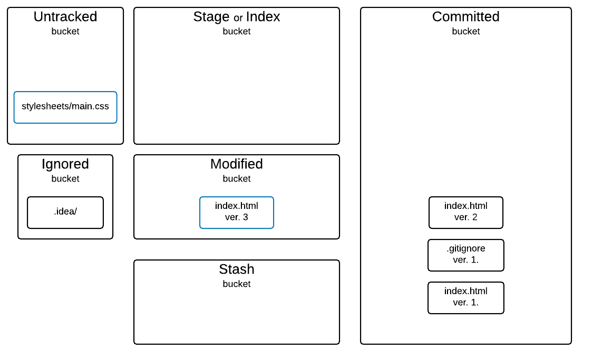

This is easily explained according to what we have learned so far. The `stylesheets/` folder exists in the untracked bucket. This is because it is a new folder that is not 
yet tracked by Git. The new version of the `index.html` file has been added to the modified unstaged bucket. 

Now, we can move these two items into the staging area separately (with the commands: `git add stylesheets` and `git add index.html`) or we can issue the following command
that pushes to staging area all the files that are eligible for such action:

```
git add .
```

The `.` is a wildcard filename specification and it actually means all the files.

If you execute the above command successfully, you will not see any output. But, if you run `git status` after that, you will get this:

```
On branch master
Changes to be committed:
  (use "git reset HEAD <file>..." to unstage)

        modified:   index.html
        new file:   stylesheets/main.css
```


This is easily explained according to what we have learned so far. It displays and verifies that both items, `index.html` and `stylesheets/main.css` have been added to the staging area.

Having all the changes inside the staging area, we can now commit them with one command. Let's do that:

```
git commit -m "Added first version of stylesheets and a reference from index"
```

Well done! If you do `git status` you will see that there is nothing pending Git action. Also, if you try to give the command `git log`, you will see at the top, the
info about the last commit that you just did.

And the picture of our project is as follows:

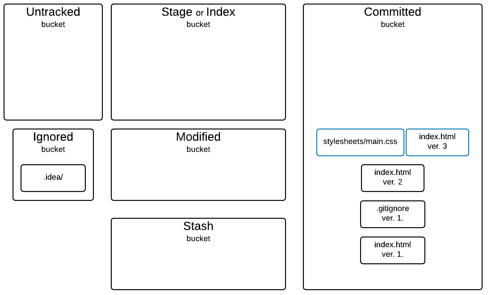

### Direct commit and by-passing of the staging area

Let's do one more change. We will update the content of the `index.html` file as follows:

``` html
 1. <!DOCTYPE html>
 2. <html>
 3.   <head>
 4.     <meta charset="utf-8">
 5.     <meta name="viewport" content="width=device-width, initial-scale=1.0">
 6.     <link rel="stylesheet" href="stylesheets/main.css" type="text/css">
 7.     <title>Hello World</title>
 8.   </head>
 9. 
10.   <body>
11.     <h1>Git -  Version Control System</h1>
12. 
13.     <p>
14.       Git has been created by the same person who created Linux, Linux Torvalds.
15.     </p>
16.   </body>
17. </html>
```
We have added the new paragraph that refers to the creator of Git.

If we do a `git status`, we will get this:

```
On branch master
Changes not staged for commit:
  (use "git add <file>..." to update what will be committed)
  (use "git checkout -- <file>..." to discard changes in working directory)

        modified:   index.html

no changes added to commit (use "git add" and/or "git commit -a")
```

Pretty clear. The `index.html` file is modified and now resides in the unstaged modified bucket. There is a command that you can use to commit this file in one shot,
without putting them into the staging area first. Try that:

```
git commit -am "Added info about git creator"
```

This will successfully return. If you now do `git status`, you will see this:

```
On branch master
nothing to commit, working directory clean
```
which means that there is nothing in the staging area. The change has been directly committed. This can be confirmed by the `git log` command too, which would return this:

```
commit cb7ecfe4b9ba34160b90af4a8866e836e8e5201f
Author: Panayotis Matsinopoulos <Panayotis Matsinopoulos panayotis@matsinopoulos.gr>
Date:   Sat Jan 30 22:22:10 2016 +0200

    Added info about git creator

commit c91cccdbeafc278caa5113d706294ded8d52e48d
Author: Panayotis Matsinopoulos <Panayotis Matsinopoulos panayotis@matsinopoulos.gr>
Date:   Sat Jan 30 18:43:59 2016 +0200

    Added first version of stylesheets and a reference from index

commit 69cf4a43a2648075e051a4688db4191ad11baff0
Author: Panayotis Matsinopoulos <Panayotis Matsinopoulos panayotis@matsinopoulos.gr>
Date:   Sat Jan 30 13:32:38 2016 +0200

    Added the h1 header

commit 36202b9dc3e38a71111d8058bbcaef672da4575c
Author: Panayotis Matsinopoulos <Panayotis Matsinopoulos panayotis@matsinopoulos.gr>
Date:   Sat Jan 30 11:38:58 2016 +0200

    Created the first version of the .gitignore file to ignore the .idea folder

commit 53e08502ce070ba522edac95ecfb124d8a88f5e6
Author: Panayotis Matsinopoulos <Panayotis Matsinopoulos panayotis@matsinopoulos.gr>
Date:   Sat Jan 30 08:36:10 2016 +0200

    First version of the index.html file
```

Do you see the first commit above? It is the one that we did with the `git commit -am` command. The `-a` stands for all and it will take all modifications that reside
inside the modified unstaged bucket and commit them to the committed directory.

Now the current picture of our project is as follows:


### Removing files

Let's add one more file to the project. We will call it `customers.html` and it will have the following content:

``` html
<!DOCTYPE html>
<html>
  <head>

  </head>
  <body>
  
  </body>
</html>
```

If you save this and you execute the command `git status`, you will see that there is new untracked file:

```
On branch master
Untracked files:
  (use "git add <file>..." to include in what will be committed)

        customers.html

nothing added to commit but untracked files present (use "git add" to track)
```

Let's try to add this file directly to the committed bucket. Execute the following command:

```
git commit -am "Added the customers.html file"
```
You will see the output:

```
On branch master
Untracked files:
        customers.html

nothing added to commit but untracked files present
```

Nothing was really committed and the file `customers.html` remains in the untracked bucket. This is because the command 
`git commit -am <commit message>` works only for tracked files.

Hence, in order to commit the `customers.html` file, we need to execute the following two commands:

```
git add .
git commit -m "Added the customers.html file"
```

Now we get the output:

```
[master fdf8fc9] Added the customers.html file
 1 file changed, 9 insertions(+)
 create mode 100644 customers.html
```

which means that there is a new commit (with hash `fdf8fc9`) created in the commit history.

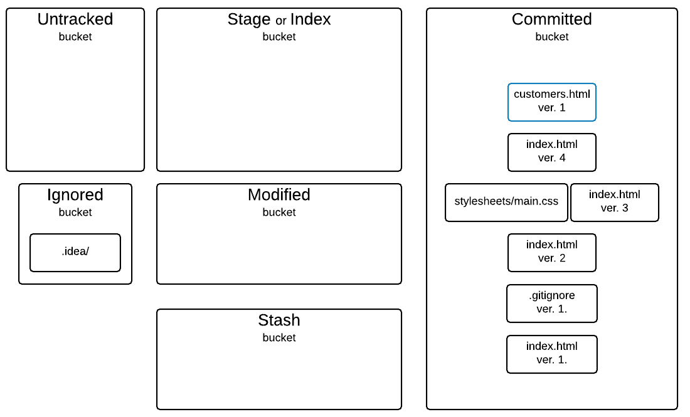

Let's assume now that we want to remove the file `customers.html` completely from the project source files. In order to remove a file, you can use the OS command `rm` to do that.

Run the following command:

```
rm customers.html
```

This command will remove the customers.html file from your file system. If you do

```
ls customers.html
```
You will get
```
ls: customers.html: No such file or directory
```
which means that the file has indeed been removed.

How does this change the `git status` for our project? Let's run the `git status` command. It will output this:

```
On branch master
Changes not staged for commit:
  (use "git add/rm <file>..." to update what will be committed)
  (use "git checkout -- <file>..." to discard changes in working directory)

        deleted:    customers.html

no changes added to commit (use "git add" and/or "git commit -a")
```

As you can see above, the file `customers.html` has been marked as `deleted` and it is still part of the `Changes not staged`. So, the change (removal of file `customers.html`)
has been done on the working directory of the project but has not been transferred to the staging area yet.


How can we recover the removed file? The command is already known. If we want to restore the latest committed version and discard the changes recorded inside the modified bucket,
we have to use the `git checkout -- <file>` command. Let's do that:

``` 
git checkout -- customers.html
```

If you do that, you will not see any output. But if you then do 

```
ls customers.html
```
you will see that the file will be found:
```
customers.html
```

Nice! This proves that when we delete a file that is being tracked by Git, we can recover it from the Git committed database.

Let's remove the file again:
```
rm customers.html
```

We are now back in the situation in which the `customers.html` file is marked as `deleted` and exists inside the `modified` bucket. We are now sure that we want to
proceed with moving this change, the removal of the file, to the staging area, so that it will be part of any commit that we might later do.

We will do that with the following command:

```
git add customers.html
```

Let's prove that the job has been done. We will run the `git status` command. When we do that, the output is:

```
On branch master
Changes to be committed:
  (use "git reset HEAD <file>..." to unstage)

        deleted:    customers.html
```

Great! The `Changes to be committed` are the changes inside the staging area. And we see that the deletion of the file `customers.html` is part of this.


Having the deletion of file `customers.html` inside the staging area, this means that we can commit this change inside the Git database, so that it will be recorded as part of the
project history changes.

Run the following command:

```
git commit -m "Removed file customers.html"
```
You will get an output like this:
```
[master 493006a] Removed file customers.html
 1 file changed, 9 deletions(-)
 delete mode 100644 customers.html
```
indicating that a new commit `493006a` has been added to the project history changes.


### Renaming a file

Now, lets suppose that we want to rename the file `stylesheets/main.css` to `stylesheets/index.css`. Doing this rename, means that we have to change the reference to this
file from the `index.html` file too. Let's do the latter first. Change the content of the `index.html` file as follows:

``` html
 1. <!DOCTYPE html>
 2. <html>
 3.   <head>
 4.     <meta charset="utf-8">
 5.     <meta name="viewport" content="width=device-width, initial-scale=1.0">
 6.     <link rel="stylesheet" href="stylesheets/index.css" type="text/css">
 7.     <title>Hello World</title>
 8.   </head>
 9. 
10.   <body>
11.     <h1>Git -  Version Control System</h1>
12. 
13.     <p>
14.       Git has been created by the same person who created Linux, Linux Torvalds.
15.     </p>
16.   </body>
17. </html>
```

We only changed line 6. The reference to the stylesheets file. Now let's do the rename. The rename of a file can be done using our operating system command `mv`. Follow the next
instructions to do it:

Being on the root folder of your project run the following command:

```
mv stylesheets/main.css stylesheets/index.css
```
If everything goes successfully, you will not see anything being output. You can check that you have done the rename successfully by trying to list the file:
```
ls stylesheets/index.css
```
If you see this:
```
stylesheets/index.css
```
then you have successfully renamed the file. 

> *Note:* You can use any other method to change the name of this file. For example, you can do the rename via the UI of your file browser program. (On OS X, this
is the `Finder` app).

Nice. We have done two changes. One, the change of the content of the file `index.html` and another one, the rename of the file `stylesheets/main.css` to `stylesheets/index.css`.
Let's see how the `git status` command reports these changes. Run `git status`. You will see something like the following:

```
On branch master
Changes not staged for commit:
  (use "git add/rm <file>..." to update what will be committed)
  (use "git checkout -- <file>..." to discard changes in working directory)

        modified:   index.html
        deleted:    stylesheets/main.css

Untracked files:
  (use "git add <file>..." to include in what will be committed)

        stylesheets/index.css

no changes added to commit (use "git add" and/or "git commit -a")
```

This output is pretty familiar to you. The change for `index.html` file appears in the block `Changes not staged`, which means it is inside the unstaged modified bucket. Nothing new here.
We have already learned about that. The new thing is about the second change. The rename of a file appears, in fact, as 2 distinct changes. First is the deletion of the original file,
i.e. the file `stylesheets/main.css`, which appears inside the unstaged modified bucket. Second change is the creation of a brand new file with the name `stylesheets/index.css`.


The above picture is familiar to us and we can now do one or more actions in order to commit those changes. For example, we can add all the changes to the staging area.
Execute the following command:

```
git add .
```

And then check the status with `git status`. It should be:

```
On branch master
Changes to be committed:
  (use "git reset HEAD <file>..." to unstage)

        modified:   index.html
        renamed:    stylesheets/main.css -> stylesheets/index.css
```

That is something new above. Although the `git status` was considering the rename as two different changes, when we put everything to staging area, it knows that it is about
a rename and presents it as one change, flagging the change with the `renamed:` flag. 


Finally, let's commit the change into the project history changes. Run the following command:

```
git commit -m "Changed the name of the CSS file"
```
you will get an output similar to this:
```
[master 4b43004] Changed the name of the CSS file
 2 files changed, 1 insertion(+), 1 deletion(-)
 rename stylesheets/{main.css => index.css} (100%)
```
which confirms the new commit in the project commit history.

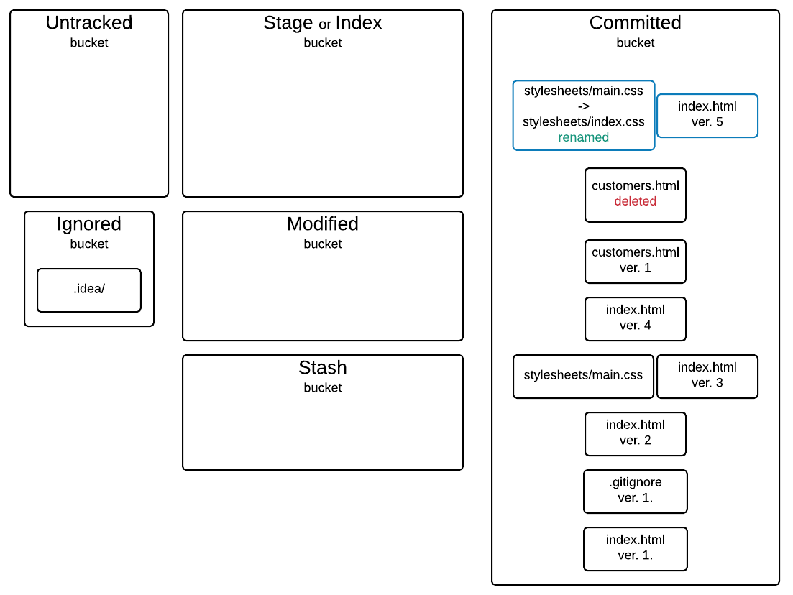

### Switching Your Work To Previous State

Let's zoom a little bit in the committed bucket. As you can see, the Git database keeps track of all the versions of our files. Commit by commit. Here is another view that has the
commit hashes to show the actual changes of the project per commit and also, to show the parent-child relationships of the commits.

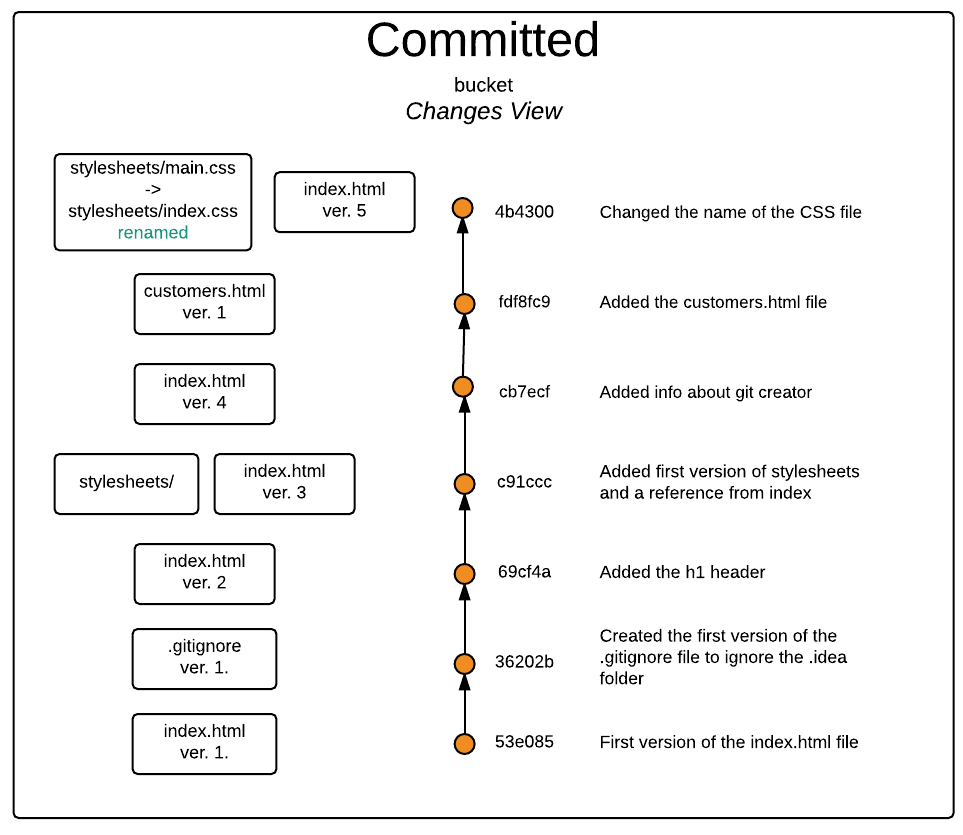

The above picture corresponds to the git log picture:

```
commit 4b43004caff819fd6bfd3db384b3a7a5cb948646
Author: Panayotis Matsinopoulos <Panayotis Matsinopoulos panayotis@matsinopoulos.gr>
Date:   Sun Jan 31 08:28:00 2016 +0200

    Changed the name of the CSS file

commit 493006a427ba27aaca7773397a2769d54ef5c385
Author: Panayotis Matsinopoulos <Panayotis Matsinopoulos panayotis@matsinopoulos.gr>
Date:   Sat Jan 30 23:57:23 2016 +0200

    Removed file customers.html

commit fdf8fc9c3b2e6f3e8ad8a9f8e339108c349eeb7e
Author: Panayotis Matsinopoulos <Panayotis Matsinopoulos panayotis@matsinopoulos.gr>
Date:   Sat Jan 30 23:07:20 2016 +0200

    Added the customers.html file

commit cb7ecfe4b9ba34160b90af4a8866e836e8e5201f
Author: Panayotis Matsinopoulos <Panayotis Matsinopoulos panayotis@matsinopoulos.gr>
Date:   Sat Jan 30 22:22:10 2016 +0200

    Added info about git creator

commit c91cccdbeafc278caa5113d706294ded8d52e48d
Author: Panayotis Matsinopoulos <Panayotis Matsinopoulos panayotis@matsinopoulos.gr>
Date:   Sat Jan 30 18:43:59 2016 +0200

    Added first version of stylesheets and a reference from index

commit 69cf4a43a2648075e051a4688db4191ad11baff0
Author: Panayotis Matsinopoulos <Panayotis Matsinopoulos panayotis@matsinopoulos.gr>
Date:   Sat Jan 30 13:32:38 2016 +0200

    Added the h1 header

commit 36202b9dc3e38a71111d8058bbcaef672da4575c
Author: Panayotis Matsinopoulos <Panayotis Matsinopoulos panayotis@matsinopoulos.gr>
Date:   Sat Jan 30 11:38:58 2016 +0200

    Created the first version of the .gitignore file to ignore the .idea folder

commit 53e08502ce070ba522edac95ecfb124d8a88f5e6
Author: Panayotis Matsinopoulos <Panayotis Matsinopoulos panayotis@matsinopoulos.gr>
Date:   Sat Jan 30 08:36:10 2016 +0200

    First version of the index.html file
```

Actually, what really happens with commits is that each commit does not only "know" the changes that have been committed. It also knows all the latest versions of all the files
in your project at the moment the commit took place. Here is another view of that statement. On each commit we see the actual version of each file, and for all files, that this
commit corresponds to.


Having said that, we can now understand, that Git gives us the ability to switch our work to a previous version of our project. This is possible because it "knows" the contents
of our project on each one of the commits that are part of projects commit history.

Let's return, for example to the version of the project that corresponds to the commit highlighted in the following picture:


That is the 2nd commit in the commit history. That commit corresponds to the project version that had 2 files, the `.gitignore` and the `index.html` file. In fact, it was the
first version of the `index.html` file. How can we switch back to this version of the project? We need to use the command `git checkout`. Run the following:

> *Note:* Replace the commit hash given below, `36202b` with the commit hash that corresponds to your 2nd commit

```
git checkout 36202b
```

You will get an output similar to this:

```
Note: checking out '36202b'.

You are in 'detached HEAD' state. You can look around, make experimental
changes and commit them, and you can discard any commits you make in this
state without impacting any branches by performing another checkout.

If you want to create a new branch to retain commits you create, you may
do so (now or later) by using -b with the checkout command again. Example:

  git checkout -b <new-branch-name>

HEAD is now at 36202b9... Created the first version of the .gitignore file to ignore the .idea folder
```

This is a lot of information. Before we explain some parts of it, just check that you have switched to the correct version of the project. 

1) You will see that there is no folder `stylesheets` any more inside your working folder. Try this:
```
ls stylesheets
```
You will get the output:
```
ls: stylesheets: No such file or directory
```
which proves that there is no such folder.

2) Inspect the content of the `index.html` file. You will see:
``` html
<!DOCTYPE html>
<html>
  <head>
    <meta charset="utf-8">
    <title>Hello World</title>
  </head>

  <body>

  </body>
</html>
```
which is the first version of the `index.html` file.

Nice! You can now see and work with that old version of the file.

Did you lose the changes that you have applied after that commit? The answer of course is a big `NO`. Git holds the whole history of your project and switching to an old version
does not make you lose the most recent changes. 

If you read carefully the output of the `git checkout` command, you will see this:

```
HEAD is now at 36202b9... Created the first version of the .gitignore file to ignore the .idea folder
```

The important part here is the word `HEAD`. The `HEAD` is a pointer that points to a commit in your project commit history. And whatever version the `HEAD` points to, it is the
version of the project that is checked out and compiles to your *working version* of the project. 

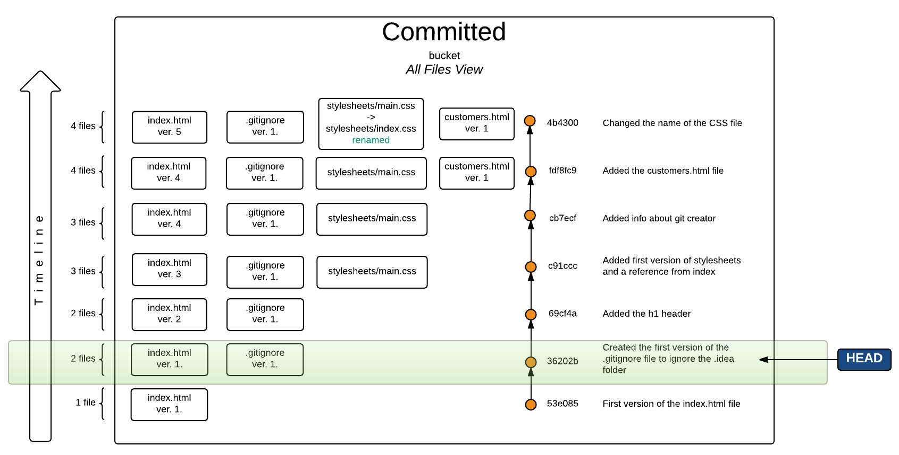

You can use the `git checkout` command to move the `HEAD` from commit to commit and change the working folder content accordingly. But you will never loose anything doing that.

Let's move now the `HEAD` back to the latest commit, in order to bring the working folder to the latest version of our project. Run the following command:

```
git checkout -
```

You will get the following output:

```
Previous HEAD position was 36202b9... Created the first version of the .gitignore file to ignore the .idea folder
Switched to branch 'master'
```

The `git checkout -` moves the `HEAD` to its previous position, to the position the `HEAD` was exactly before the last checkout command. So, it will move the `HEAD` to the latest
commit, because `HEAD`, whenever we do a new commit, takes position to point to the latest commit done. Hence, after the above `git checkout -` command, we will have this:

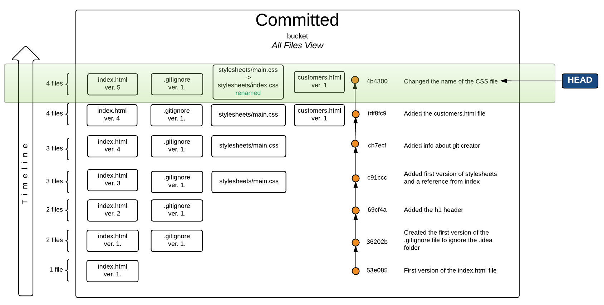

Now, you can check that you have your `stylesheets` folder back and all the other files, according to your latest project version.

> *Question:* What will happen if you run `git checkout -` again? 
> Answer: The HEAD will go back to 2nd commit. Remember: `git checkout -` takes HEAD back to were it was checked out last.

### Saving working status when changing HEAD - The stash

Now, let's do a small change in one of our files. We will change the file `index.html` to add a horizontal rule. So, the content of the new file is:

``` html
 1. <!DOCTYPE html>
 2. <html>
 3.   <head>
 4.     <meta charset="utf-8">
 5.     <meta name="viewport" content="width=device-width, initial-scale=1.0">
 6.     <link rel="stylesheet" href="stylesheets/index.css" type="text/css">
 7.     <title>Hello World</title>
 8.   </head>
 9. 
10.   <body>
11.     <h1>Git -  Version Control System</h1>
12. 
13.     <hr/>
14.     
15.     <p>
16.       Git has been created by the same person who created Linux, Linux Torvalds.
17.     </p>
18.   </body>
19. </html>
```

The change is on line 13. If you do `git status`, you will see this:

```
On branch master
Changes not staged for commit:
  (use "git add <file>..." to update what will be committed)
  (use "git checkout -- <file>..." to discard changes in working directory)

        modified:   index.html

no changes added to commit (use "git add" and/or "git commit -a")
```
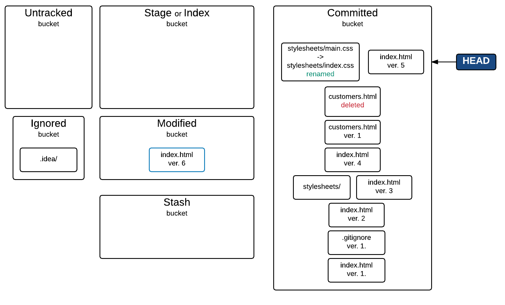

Pretty much expected. Now, let's suppose that you want to, temporarily, go back to a previous version of your project. You may want to do that in order to inspect the behaviour of
your site at that older version. Let's suppose that this older version is the one on the 2nd commit. We did that before. We should use the `git checkout <2nd commit hash>`
command in order to achieve that. Let's try that:

> *Note:* Replace the commit hash given below with the commit hash that corresponds to your own 2nd commit hash. If you don't know, run the `git log` command first and take the
commit hash from the 2nd to bottom commit reported.

```
git checkout 36202b9dc3
```

If you try the above command, you will see that the checkout will be aborted with the following message:

```
error: Your local changes to the following files would be overwritten by checkout:
        index.html
Please, commit your changes or stash them before you can switch branches.
Aborting
```

This happens because you have changes in your local working directory that you would lose if your working directory would have been switched back to the 
version it had on that 2nd commit. So, Git, protects you here and does not allow you to do that.

But, you can still do that without actually losing any of your changes. You can use the stash bucket.

Try the following command:

```
git stash
```

You will get the following output:

```
Saved working directory and index state WIP on master: 4b43004 Changed the name of the CSS file
HEAD is now at 4b43004 Changed the name of the CSS file
```
The critical information here is the following: 

1. `Saved working directory and index state`. Your working directory and the `index` have been saved into the `stash`. Note that the `index` is the other name of the staging area.
In other words, the modifications that you had in your unstaged modified bucket and the ones that you may had inside the staging area have been removed and recreated 
inside a bucket which is called stash, AND
2. `HEAD is now 4b43004 Changed the name of the CSS file`, which means that now, your working folder has the image of your project as it was on the commit with message `Changed
the name of the CSS file` with commit hash `4b43004`, which is the latest commit in your commit history.


 
Stash saves the working directory changes (unstaged modified bucket and stage bucket) so that we can checkout another version of our project without losing those changes.

Let's try to checkout now the old version, from the 2nd commit.
  
> *Note:* Make sure that you give on the next command the commit hash that corresponds to your 2nd commit from your project commit history:

```
git checkout 36202b9dc3
```  

This time, the checkout will succeed and the last line on the output will be:
  
```
HEAD is now at 36202b9... Created the first version of the .gitignore file to ignore the .idea folder
```

which proves that the checkout has now succeeded. Did we lose the changes that we had inside the `index.html` file before the checkout? No. They exist inside the
stash bucket.


Let's now return back to the latest committed version of our project. In order to go to the previously checked out version, we use the `get checkout -` command. Let's do that:

``` 
git checkout -
```

Now, if you do `git status`, you will see that your working directory is clean. The picture of our project status is this:


You can now retrieve the changes that you have saved in the stash, in order to continue your work in progress. If we want to retrieve back the last item that we have put into
the stash, we need to use the command

```
git stash pop
```

Do that please. You will get the following output:

```
On branch master
Changes not staged for commit:
  (use "git add <file>..." to update what will be committed)
  (use "git checkout -- <file>..." to discard changes in working directory)

        modified:   index.html

no changes added to commit (use "git add" and/or "git commit -a")
Dropped refs/stash@{0} (1def6174765bc85264349021e4b65f7f887b94a5)
```

which resembles the output of a `git status` command. It is what we really had saved in the stash. But now it is outside the stash, back to the unstaged modified bucket.

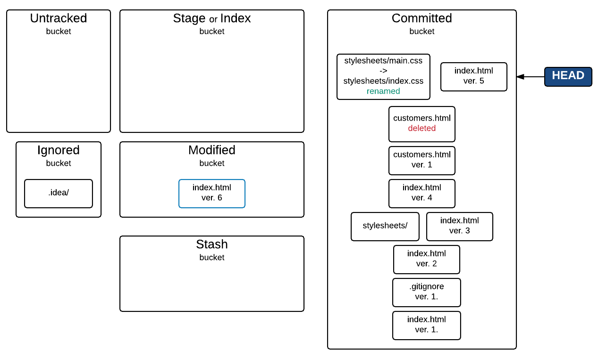
 
### Stash and Untracked Changes

Let's proceed now to create a new file in our project. This will be the file `contact.html` with some bare minimum content inside:

``` html
<!DOCTYPE html>
<html>
  <head>

  </head>

  <body>
  
  </body>
</html>
```

Create the `contact.html` file and insert the content that you see above.

Now, if you do `git status`, you will get this:

```
On branch master
Changes not staged for commit:
  (use "git add <file>..." to update what will be committed)
  (use "git checkout -- <file>..." to discard changes in working directory)

        modified:   index.html

Untracked files:
  (use "git add <file>..." to include in what will be committed)

        contact.html

no changes added to commit (use "git add" and/or "git commit -a")
```

This tells us that we have one entry inside the unstaged modified bucket, and it is about the change in the `index.html` file. Also, it tells us that we have a new untracked file,
the `contact.html`.

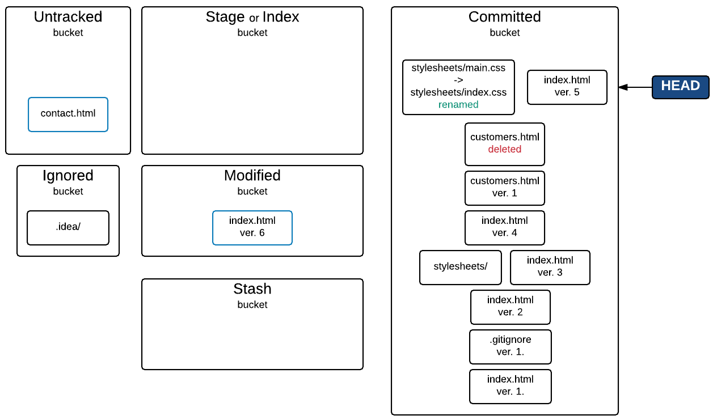

Let's suppose now that we want to do a checkout to a previous version, or for other reasons, we want to save the working state into stash. Let's try the command that we have already
learned:

```
git stash
```
This command succeeds and then if you do `git status`, you get:

```
On branch master
Untracked files:
  (use "git add <file>..." to include in what will be committed)

        contact.html

nothing added to commit but untracked files present (use "git add" to track)
```

which means that the untracked files are not moved to stash.

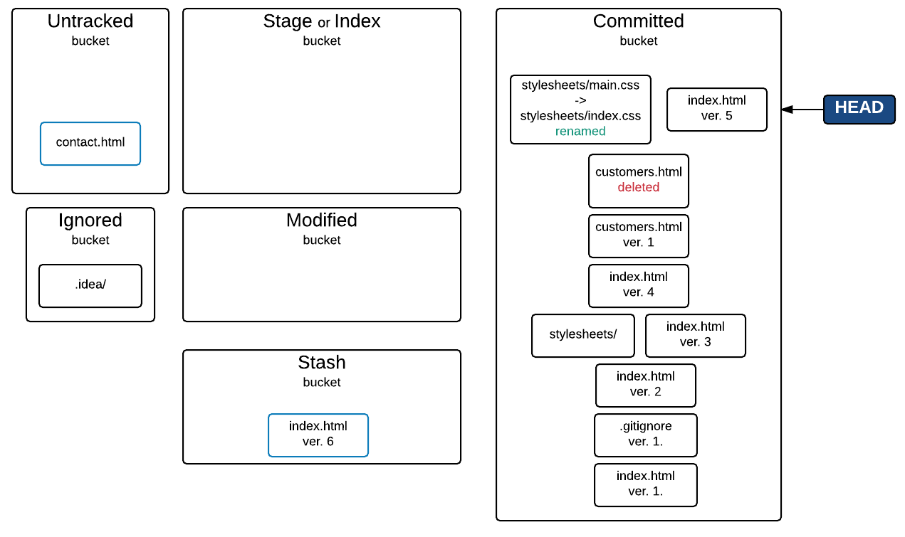

If you want to save the untracked files too, and we recommend that you do, you should be using the switch `-u` too. Let's bring the state back first:

```
git stash pop
```

Now, let's put everything back to stash using the `-u` switch too:

``` 
git stash -u
```
After that, check the status again, with `git status`. The output should be this:

```
On branch master
nothing to commit, working directory clean
```

Your working directory is clean. Where are your changes? They are inside the stash. 

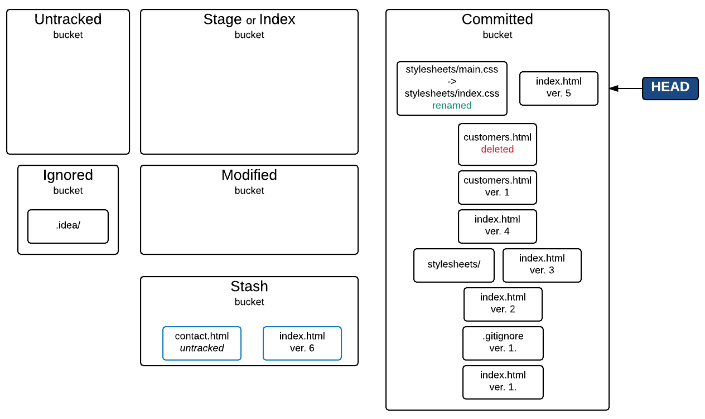


### Stash messages

How can you check what the stash contains? Try the following command:

```
git stash list
```

This prints out the following:

```
stash@{0}: WIP on master: 4b43004 Changed the name of the CSS file
```

Does not say too much. It just says that the first item in the stash (you can call many times the `git stash` command), which is identified by `stash@{0}`, it has some content
with the description `WIP on master: 4b43004 Changed the name of the CSS file`. In other words, the first item contains your WIP (Work in Progress) while your working directory was on the commit
`4b43004` with the commit message `Changed the name of the CSS file`. 

Sometimes, it is better if we specify the stash message ourselves, at the time of the stash item push, instead of just letting the stash command create the message automatically.

Let's do that. First, revert the last stash push. Run the following command:

```
git stash pop
```

This will remove the last pushed item from the stash and restore its contents in the untracked and unstaged modified buckets. We will now push them again to stash, but we will
also specify the stash message. Run the following command:

```
git stash save -u "WIP: untracked file contact.html and changes on index.html with a horizontal rule"
```

As you can see above:

1. We use the `git stash save` command, instead of just `git stash`. The `git stash` alone, it does call the `save` git stash command anyway. But if we want to give a message
for the stash item pushed/saved, then we have to explicitly add the `save` action word. 
2. We specify the stash message that will be attached to the contents that we push to the stash.

The output of the above command is something like this:

```
Saved working directory and index state On master: WIP: untracked file contact.html and changes on index.html with a horizontal rule
HEAD is now at 4b43004 Changed the name of the CSS file
```
Do you see the message that we have given? Try now the command `git stash list`. If you do, you will get this:

```
stash@{0}: On master: WIP: untracked file contact.html and changes on index.html with a horizontal rule
```
This is much more descriptive, because the message attached to the stash item explains its contents. 

> *Note:* There are commands that can tell you the exact contents of the stash, but we will not deal with them now. In a later chapter, in which we will 
use some GUI tools to Git, we will find out the content of the stash much easier.

### Multiple Stash Items

Currently, our stash has one item inside. And the working directory is clean. Let's proceed to change the file `stylesheets/index.css`. Make sure that this file has the
following content:

```
1. * {
2.     box-sizing: border-box;
3.     padding: 0;
4.     margin: 0;
5. }
6. 
7. html {
8.     font-size: 62.5%;
9. }
```

We have added lines 6 to 9. If you save and execute the command `git status`, you will see this:

```
On branch master
Changes not staged for commit:
  (use "git add <file>..." to update what will be committed)
  (use "git checkout -- <file>..." to discard changes in working directory)

        modified:   stylesheets/index.css

no changes added to commit (use "git add" and/or "git commit -a")
```

which is pretty clear and expected. The modified file `stylesheets/index.css` is flagged inside the unstaged modified bucket:

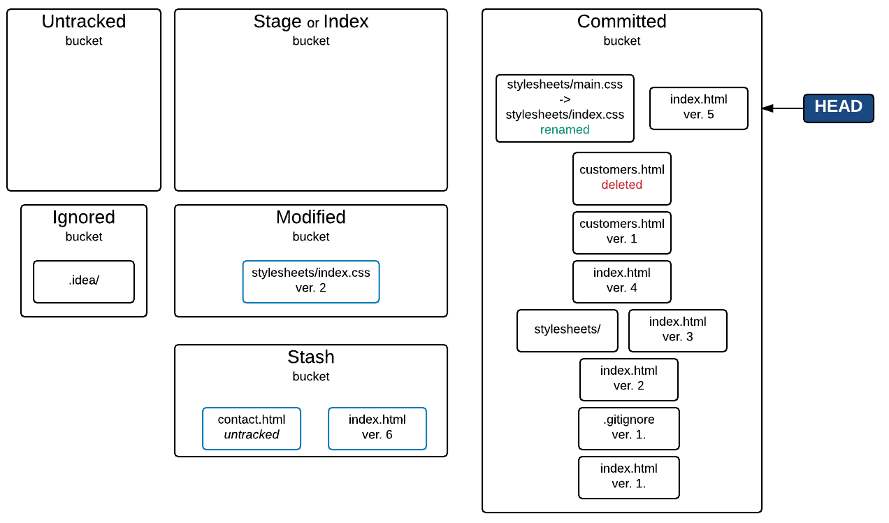

Now, if we decide that we want to save this working directory change into stash, we can, again, call the `git stash save` command. Run the following:

```
git stash save "WIP: Just added the html font size CSS rule inside the index.css file"
```

You will get the output:

```
Saved working directory and index state On master: WIP: Just added the html font size CSS rule inside the index.css file
HEAD is now at 4b43004 Changed the name of the CSS file
```

Now, your working directory is clean again, and your last change has been pushed to the stash. 

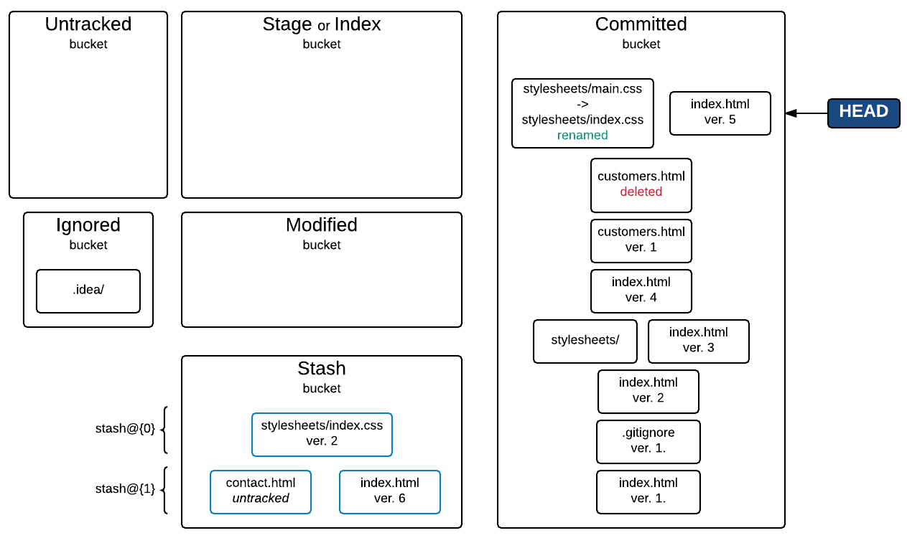

Now the stash contains 2 items. We can get a list of them with the `git stash list` command. Run the following:

```
git stash list
```

You will get this:

```
stash@{0}: On master: WIP: Just added the html font size CSS rule inside the index.css file
stash@{1}: On master: WIP: untracked file contact.html and changes on index.html with a horizontal rule
```

The most recently pushed item is on top. And has the id `stash@{0}`. The previous has the id `stash@{1}`. Every time you push a new item to the stash,
it takes the index `0`, and the existing items' index increases by 1. 

Now, if you want to put your changes back to work, the changes that you just pushed to stash, you should pop the top item out of the stash. This is done
with the `git stash pop` command.

Let's do the following:

```
git stash pop
```

You will get the following output:

```
On branch master
Changes not staged for commit:
  (use "git add <file>..." to update what will be committed)
  (use "git checkout -- <file>..." to discard changes in working directory)

        modified:   stylesheets/index.css

no changes added to commit (use "git add" and/or "git commit -a")
Dropped refs/stash@{0} (12dc20dcf8e0e8fd8d7a965960c5945ec6ae2f92)
```

As you can see, your working directory is restored with the most recent change on your `index.css` file. The item that has been popped off the stash, 
was `dropped` (as you can see from the last line in the log), and does not exist any longer in the stash. If you do `git stash list`, you will get this:

```
stash@{0}: On master: WIP: untracked file contact.html and changes on index.html with a horizontal rule
```

The stash now contains only 1 item. The previously `stash@{1}` item is now on top of the stash stack and it is indexed with `0` index (`stash@{0}`). 

> *Note:* stash works like a Stack or a LIFO (Last In First Out structure). You can read more about stacks and LIFO structures [here](https://en.wikipedia.org/wiki/Stack_(abstract_data_type)).

The picture of our project is now this:


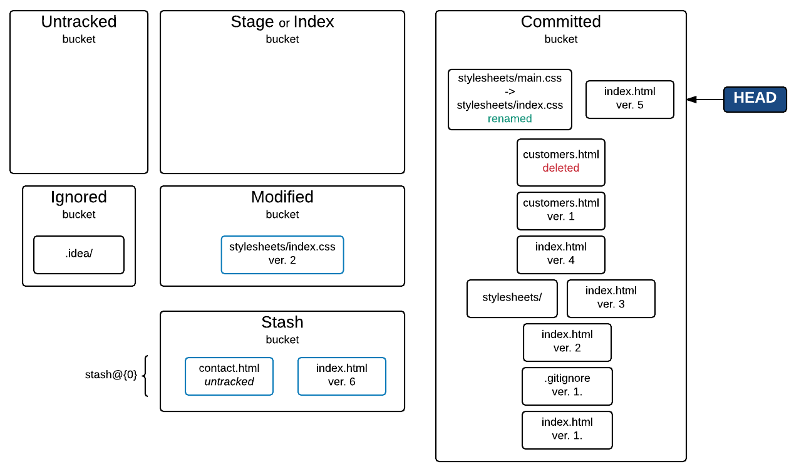


Let's pop off the last remaining-in-stash item now. Run the following command:

```
git stash pop
```

The output will be:

```
On branch master
Changes not staged for commit:
  (use "git add <file>..." to update what will be committed)
  (use "git checkout -- <file>..." to discard changes in working directory)

        modified:   index.html
        modified:   stylesheets/index.css

Untracked files:
  (use "git add <file>..." to include in what will be committed)

        contact.html

no changes added to commit (use "git add" and/or "git commit -a")
```

The status of the working directory is as expected, with the 2 modified files inside the unstaged modified bucket and the `contact.html` file in the untracked files bucket.


Closing the stash section, you need to understand that stash is a quick way to put your work in progress on the side, temporarily, and return back later to continue. For example,
you may want to fix a bug on the production version of your Web application. One quick way to put your work on a safe place and switch to your production version code is the stash.

### See the differences of all changed files

We have already learned about the `git diff <file>` command which compares the last committed version of a file to the one that exists in the working directory. You can use the 
`git diff` command without actually specifying any file. That will print the differences of all the files that have been changed. Try that:

```
git diff
```

The output that you will get is this:

```
diff --git a/index.html b/index.html
index 1653be8..3e93738 100644
--- a/index.html
+++ b/index.html
@@ -10,6 +10,8 @@
   <body>
     <h1>Git -  Version Control System</h1>
 
+    <hr/>
+
     <p>
       Git has been created by the same person who created Linux, Linux Torvalds.
     </p>
diff --git a/stylesheets/index.css b/stylesheets/index.css
index db1129d..54d95ac 100644
--- a/stylesheets/index.css
+++ b/stylesheets/index.css
@@ -2,4 +2,8 @@
     box-sizing: border-box;
     padding: 0;
     margin: 0;
+}
+
+html {
+    font-size: 62.5%;
 }
\ No newline at end of file
```

As you can see, currently, the `git diff` reports 2 changes, the ones on the unstaged modified bucket. Does not report the untracked files, because these are untracked.

> *Note:* In the next chapter we will see some useful GUI tools that will help us read the differences in a more friendly way. But it is very important that you know these
commands, anyway. They will come handy when the GUI tools might not be available.

### Amend the last commit

Now, let's remove the untracked file completely. It has served its educational role.

```
rm contact.hml
```

The status of the project now is:


Let's commit the change on the `index.html` file with the following two commands:

```
git add index.html
git commit -m "Added a horizontal rule to the index.html file"
```

> *Note:* Make a note of the new commit hash as reported by the output of the last command, or by executing the command `git log` and see what is the commit hash on top of its
output. On our case this is `850601f2fec386af62950aba60732c9a6c4d8056`.

If we execute the `git status` command, we will see this:

```
On branch master
Changes not staged for commit:
  (use "git add <file>..." to update what will be committed)
  (use "git checkout -- <file>..." to discard changes in working directory)

        modified:   stylesheets/index.css

no changes added to commit (use "git add" and/or "git commit -a")
```

which correctly reports that the only pending commit change is the one on the `stylesheets/index.css` file.

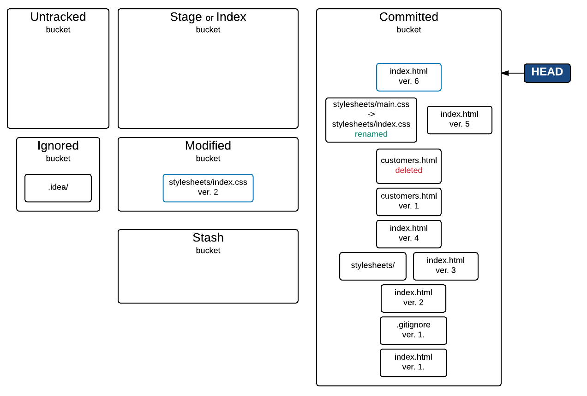

> *Note:* See how the `HEAD` pointer has moved to the latest, top, commit.

Assume, now, that the change on `stylesheets/index.css` was a change that you wanted to be committed on the same commit with the change done in the `index.html` file.
How can you amend the latest commit that you have already done to include this change too?

First, put the change inside the staging area:

```
git add stylesheets/index.css
```

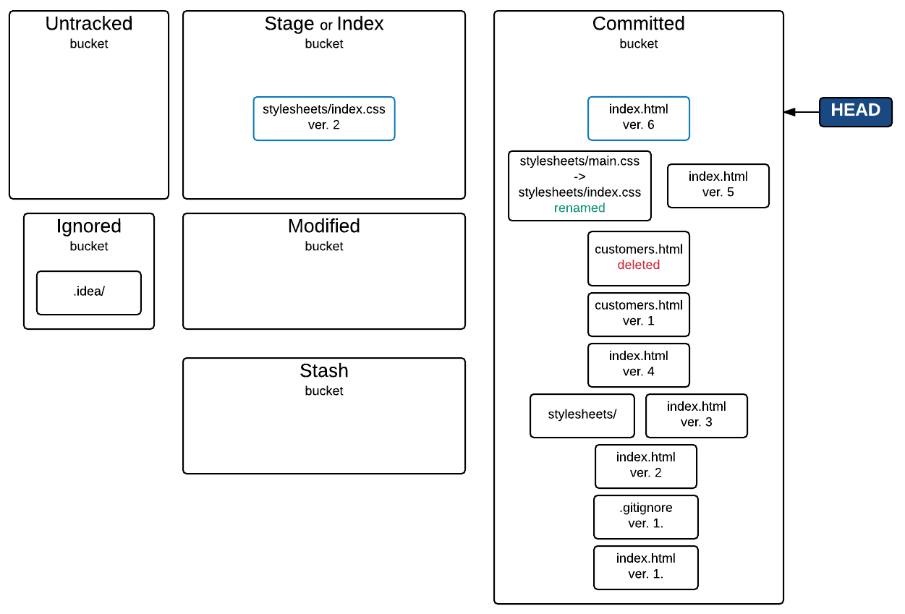

Then, instead of creating a new commit (with `git commit -m "...."`), we call the `git commit` command with the `--amend` switch:

```
git commit --amend
```

This tells Git that you are trying to amend, the content of the last commit. For that reason, Git will open an editor for you to edit the commit message that was used on the previous commit.
Change the message from `Added a horizontal rule to the index.html file` to `Added a horizontal rule to the index.html file and set the font for html inside the CSS file`. 
Save and close the editor.

You will see the command printing the known message for successful commits:

```
[master 60cc7f6] Added a horizontal rule to the index.html file and set the font for html inside the CSS file
 Date: Sun Jan 31 15:51:22 2016 +0200
 2 files changed, 6 insertions(+)
```

If you call the `git log` command, you will get at the top:

```
commit 60cc7f6db850cbaacf421bddffb5b8899f32a461
Author: Panayotis Matsinopoulos <Panayotis Matsinopoulos panayotis@matsinopoulos.gr>
Date:   Sun Jan 31 15:51:22 2016 +0200

    Added a horizontal rule to the index.html file and set the font for html inside the CSS file
```

with a new commit hash. The previous one (`850601f2fec386af62950aba60732c9a6c4d8056`) does not exist anymore. The `git commit --amend` command merged the changes of the previous
commit with the changes that were about to commit and created a brand new commit. The old commit has been discarded.


> *Hint:* the `git commit --amend` command can be used to update the message of the latest commit. You do not have to use it only if you have changes to merge to latest commit.

> *Hint:* Do not amend the latest commit, if you have pushed it to a remote repository. Unless you really know what you are doing. We will talk about remote repositories in a later
chapter of this section.

### Undoing a Commit

Let's move on with doing one more change to the `index.html` file. This is the new content:

```
 1. <!DOCTYPE html>
 2. <html>
 3.   <head>
 4.     <meta charset="utf-8">
 5.     <meta name="viewport" content="width=device-width, initial-scale=1.0">
 6.     <link rel="stylesheet" href="stylesheets/index.css" type="text/css">
 7.     <title>Hello World</title>
 8.   </head>
 9. 
10.   <body>
11.     <h1>Git -  Version Control System</h1>
12. 
13.     <hr/>
14. 
15.     <p>
16.       Git has been created by the same person who created Linux, Linux Torvalds.
17.     </p>
18. 
19.     <footer>
20.       Copyright &copy; Tech Career Booster
21.     </footer>
22.   </body>
23. </html>
```

We have added a footer note (lines 19 to 21). Obviously, if we do `git status`, we will see the `index.html` file in the unstaged modified bucket.

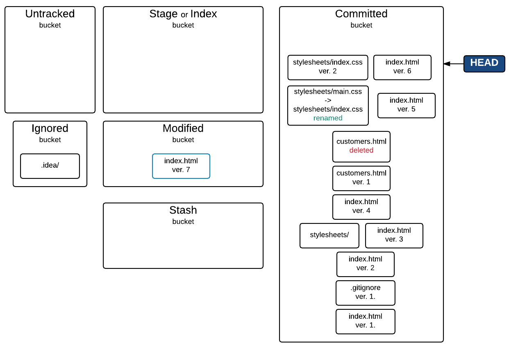

We will now proceed to direct commit. Run the following command:

```
git commit -am "Added a footer in the index.html page"
```

You will see the output:

```
[master e743077] Added a footer in the index.html page
 1 file changed, 4 insertions(+)
```

The commit (with hash `e743077`) was successfully created in the commit history of the project.

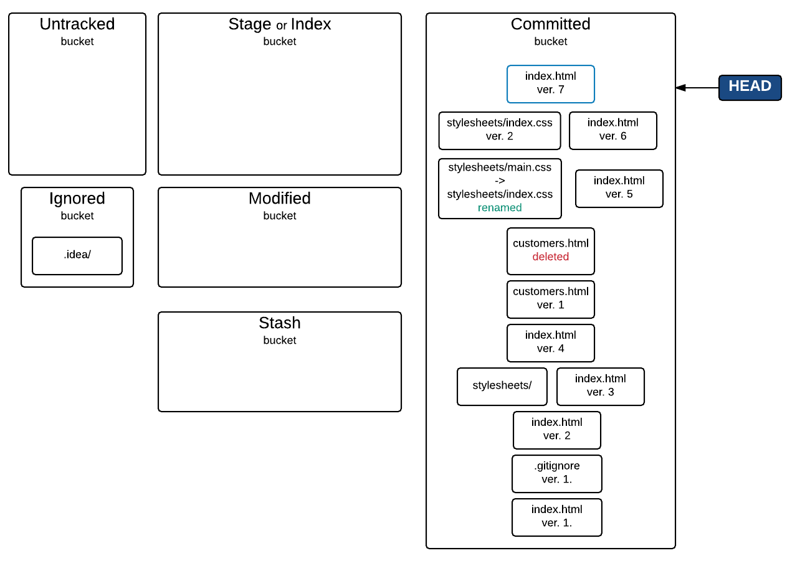
 
Now, suppose that we regret committing that change to the project commit history and that we want take that commit back. How can we do that?

If "taking that commit back" means going back to the state where you had the change (addition of footer on index.html page) still pending, 
then you can use the command `git reset HEAD^1`.

Try that:

```
git reset HEAD^1
```

If everything goes ok, you will not see any message. But, then you need to do a `git status`, which gives the following output:

```
On branch master
Changes not staged for commit:
  (use "git add <file>..." to update what will be committed)
  (use "git checkout -- <file>..." to discard changes in working directory)

        modified:   index.html

no changes added to commit (use "git add" and/or "git commit -a")
```

Perfect. The `index.html` file has been marked as changed, like it was before the commit. 
And if we do `git log`, we will see that the commit `e743077`, which was created with the last commit that we did, is not longer there, at the top of the commit history.

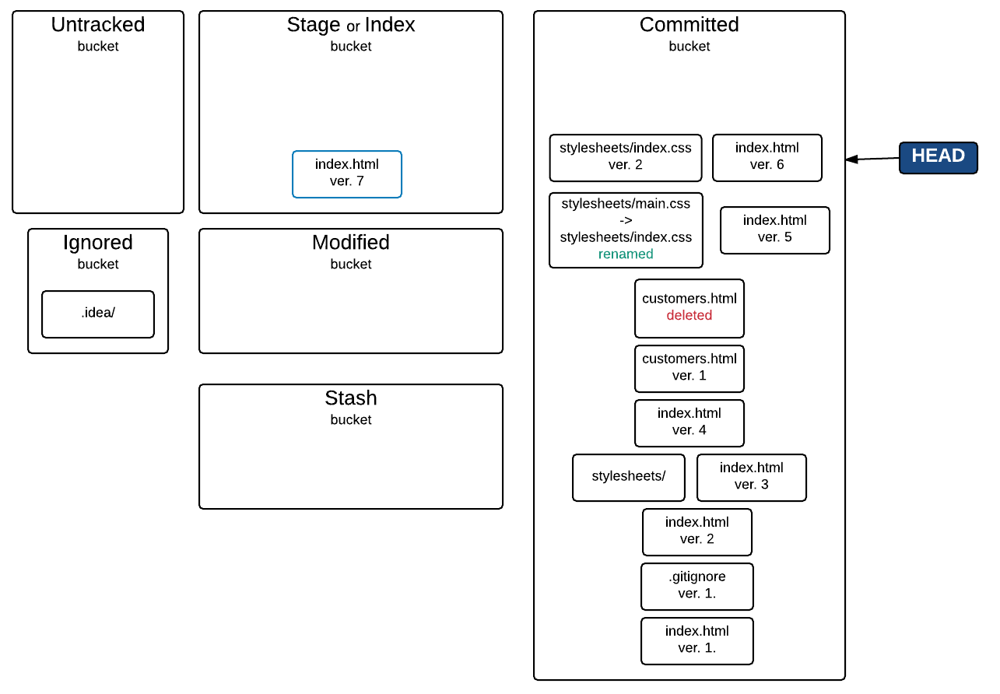

The `HEAD` has been moved to the previous commit. The `git reset HEAD` command moves the `HEAD` to a new position. With `HEAD^1` moves one position back. With `HEAD^2`, moves
it 2 positions back e.t.c. 

Let's now repeat the last commit. Run the following command:

```
git commit -am "Added a footer in the index.html page"
```

This will create a new commit in the commit history. There are cases in which we want to completely discard both the commit and the changes that it includes. This can be
done with a hard reset. Try the following:

```
git reset --hard HEAD^1
```

You will see the output:

```
HEAD is now at 850601 Added a horizontal rule to the index.html file
```

which proves that the `HEAD` has been moved 1 position back to where it was.

And if you do a `git status`, you will see that your working directory is clean. The commit with message `Added a footer in the index.html page` has been removed completely
and the changes have been lost. So, be careful when you use the hard reset command.


 
