We have learned lots of `git` commands. It is very important to become familiar with the command line and the
`git` commands that you can issue on the CLI (Command Line Interface). This is because you will, sooner or later,
be in a situation in which only CLI would be available.

Nevertheless, there are some git related GUI tools that will make your life easier and you need to be aware of them too.

### `git gui`

We are now back on your `hello_world_git` project. We can do `git status` and this will print the following output:

```
On branch master
nothing to commit, working directory clean
```

And the `git log` prints the list of our commits, in reverse chronological order, with the most recent one on top:

```
commit 4b43004caff819fd6bfd3db384b3a7a5cb948646
Author: Panayotis Matsinopoulos <Panayotis Matsinopoulos panayotis@matsinopoulos.gr>
Date:   Sun Jan 31 08:28:00 2016 +0200

    Changed the name of the CSS file

commit 493006a427ba27aaca7773397a2769d54ef5c385
Author: Panayotis Matsinopoulos <Panayotis Matsinopoulos panayotis@matsinopoulos.gr>
Date:   Sat Jan 30 23:57:23 2016 +0200

    Removed file customers.html

commit fdf8fc9c3b2e6f3e8ad8a9f8e339108c349eeb7e
Author: Panayotis Matsinopoulos <Panayotis Matsinopoulos panayotis@matsinopoulos.gr>
Date:   Sat Jan 30 23:07:20 2016 +0200

    Added the customers.html file

commit cb7ecfe4b9ba34160b90af4a8866e836e8e5201f
Author: Panayotis Matsinopoulos <Panayotis Matsinopoulos panayotis@matsinopoulos.gr>
Date:   Sat Jan 30 22:22:10 2016 +0200

    Added info about git creator

commit c91cccdbeafc278caa5113d706294ded8d52e48d
Author: Panayotis Matsinopoulos <Panayotis Matsinopoulos panayotis@matsinopoulos.gr>
Date:   Sat Jan 30 18:43:59 2016 +0200

    Added first version of stylesheets and a reference from index

commit 69cf4a43a2648075e051a4688db4191ad11baff0
Author: Panayotis Matsinopoulos <Panayotis Matsinopoulos panayotis@matsinopoulos.gr>
Date:   Sat Jan 30 13:32:38 2016 +0200

    Added the h1 header

commit 36202b9dc3e38a71111d8058bbcaef672da4575c
Author: Panayotis Matsinopoulos <Panayotis Matsinopoulos panayotis@matsinopoulos.gr>
Date:   Sat Jan 30 11:38:58 2016 +0200

    Created the first version of the .gitignore file to ignore the .idea folder

commit 53e08502ce070ba522edac95ecfb124d8a88f5e6
Author: Panayotis Matsinopoulos <Panayotis Matsinopoulos panayotis@matsinopoulos.gr>
Date:   Sat Jan 30 08:36:10 2016 +0200

    First version of the index.html file
```

One graphical user interface tool that can be used to see the current status of your project is `git gui`. Type in the following on your terminal prompt:

```
git gui 
```

You will see this:


This is what you see when you type in `git gui` on a clean working directory. Here is a short explanation of what each area is used for:


* The top left area: displays the untracked and the modified files.
* The bottom left area: displays the staged or indexed files.
* The top right area: displays the differences that are associated with the selection that you have done on the left.
Hence, if you have selected an entry on the top left area, you can see the differences this entry is ready to transfer to the
staging area. If you have selected an entry on the bottom left area, you can see the differences this entry is ready to commit.
    
Let's try an example. We are going to change the `stylesheets/index.css` file. Let it have the following content:
    
``` css
* {
    box-sizing: border-box;
    padding: 0;
    margin: 0;
}

html {
    font-size: 62.5%;
}
```

We have basically added the lines 6 - 9. If you do `git diff` you will get this:

```
diff --git a/stylesheets/index.css b/stylesheets/index.css
index db1129d..54d95ac 100644
--- a/stylesheets/index.css
+++ b/stylesheets/index.css
@@ -2,4 +2,8 @@
     box-sizing: border-box;
     padding: 0;
     margin: 0;
+}
+
+html {
+    font-size: 62.5%;
 }
\ No newline at end of file
```

In which we clearly see the differences that we have introduced.

And if you do `git status` you will get this:

```
On branch master
Changes not staged for commit:
  (use "git add <file>..." to update what will be committed)
  (use "git checkout -- <file>..." to discard changes in working directory)

        modified:   stylesheets/index.css

no changes added to commit (use "git add" and/or "git commit -a")
```

The above output informs us that the file `stylesheets/index.css` is modified and now exists in the unstaged modified bucket. How does the git gui tool represent that?
    
Go ahead and give the following command:
    
```
git gui
```

> *Hint:* If you already have git gui running, you can refresh its content without closing it and then restarting it. On Mac OS X, the refresh command is by 
using the keyboard combination : <kbd>CMD + R</kbd>

> *Hint:* I usually start git gui with the command: `git gui &` instead of just `git gui`. This will start git gui and release my terminal for me to be able to give
more commands, because it starts git gui in the background.

What `git gui` will output is the following:

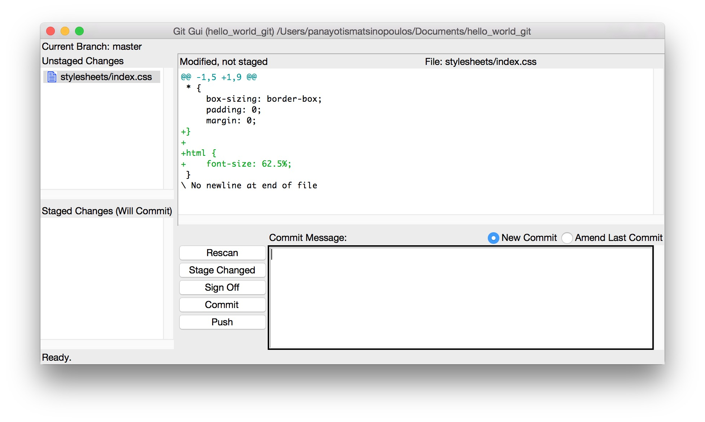

As you can see, the way git gui presents state is similar to what git status does too. But on top of that, it displays the differences too. 

Now, what you can do is that you can click on the icon of the file `stylesheets/index.css`, on the top-left area. This corresponds to the command `git add stylesheets/index.css`
and will transfer the file to the staging area.

<div id="media-title-video-click-to-add-from-modified-to-staging-area.mp4-How I add a file to staging area">How I add a file to staging area</div>
<a href="https://player.vimeo.com/video/194253181"></a>
           
After you do that, then you can execute the following command on your terminal:
           
```
git status
```

you will verify that the file has been moved to the staging area:

```
On branch master
Changes to be committed:
  (use "git reset HEAD <file>..." to unstage)

        modified:   stylesheets/index.css
```

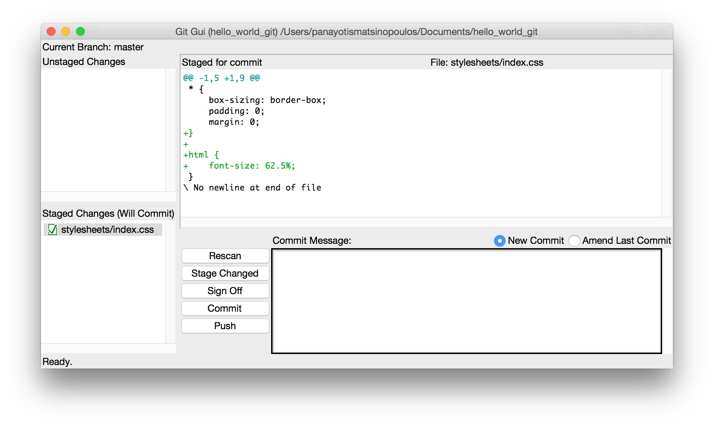

If you want to put the file back to the unstaged modified area, you only have to click on the icon of the file when it exists in the staging area:

<div id="media-title-video-click-to-move-file-back-to-unstaged-modified-area.mp4-How I put the file back to the unstaged modified bucket">How I put the file back to the unstaged modified bucket</div>
<a href="https://player.vimeo.com/video/194251922"></a>
           
The above GUI action corresponds to the `git reset HEAD stylesheets/index.css` command, which is used to unstage a tracked file back to the unstaged modified bucket.
           
Now, let's create a new file. The `about.html`. Let's put the following content inside it:
           
``` html
<!DOCTYPE html>
<html>
  <head>
    <meta charset="utf-8">
    <meta name="viewport" content="width=device-width, initial-scale=1"/>
    <title>About</title>
  </head>
  <body>

  </body>
</html>
```

Refresh (or start again) the git gui output. What you will see is the following:


           
As you can see above, the new, untracked file is displayed with a blank page icon, whereas the tracked modified file is displayed with the blue lines page icon. Other than that,
you can use git gui to treat those files as usual. Clicking on their icons moves them to the staging area and clicking them back returns them to the unstaged modified and untracked
area.

We will now try 2 commits. One per file. 

1. Bring the `about.html` file to the staging area.
2. Write the commit message, in the commit message area: `Added the about.html file`
3. Click the Commit button.
4. Bring the `stylesheets/index.css` file to the staging area.
5. Write the commit message: `Added the html font size`
6. Click the Commit button.

As in the following video:

<div id="media-title-video-doing-two-commit-using-the-git-gui.mp4-This is how I accomplish 2 commits">This is how I accomplish 2 commits</div>
<a href="https://player.vimeo.com/video/194251633"></a>

The commit action on the git gui tool corresponds to the `git commit -m "<message>"` command that one can execute on the command line.
           
Let's suppose now that we want to change the commit message of the last commit action. We should use the "Amend Last Commit" functionality of the UI.
Let's do that. We are going to change the last commit message from `Added the html font size` to `Added font size for the html element`. 
           
<div id="media-title-video-amending-the-last-commit-to-update-its-message.mp4-We have updated the last commit message">We have updated the last commit message</div>
<a href="https://player.vimeo.com/video/194252950"></a>
           
The above action corresponds to the `git commit --amend` command. As you can see, when you clicked on radio button "Amend Last Commit", git gui brought the last commit
message and its contents into the staging area. This is useful, not only to change the mesage of the last commit, but, also, to change its contents.
            
We will proceed now with a more complex change in our source code. Let's change the source code of the `index.html` file as follows:
            
``` html
<!DOCTYPE html>
<html>
  <head>
    <meta charset="utf-8">
    <meta name="viewport" content="width=device-width, initial-scale=1.0">
    <link rel="stylesheet" href="stylesheets/index.css" type="text/css">
    <title>Git - Version Control System</title>
  </head>

  <body>
    <h1>Git -  Version Control System</h1>

    <p>
      Git has been created by the same person who created Linux, Linux Torvalds.
    </p>

    <footer>
      Copyright &copy; Tech Career Booster
    </footer>
  </body>
</html>
```

If you save the above file and inspect the git gui output, you will see this:

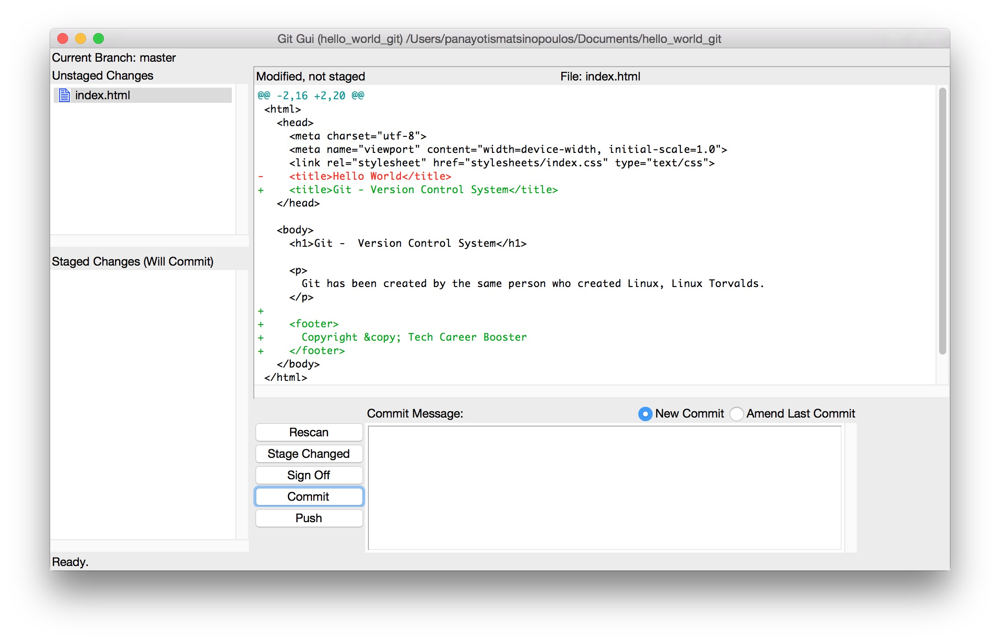

When you have the `index.html` file selected on the top left area, you can clearly see the differences, the changes that you have done on this file. If you click on the icon
of the file, all those changes will be moved to the staging area. However, there are many times that you want to create a commit that includes part of your changes. For example,
let's assume that we want the last lines added to be part of the commit, but we do not want the line removed, at the beginning of the file. We can select the lines that we want
to move to the staging area, and hence be part of the commit:

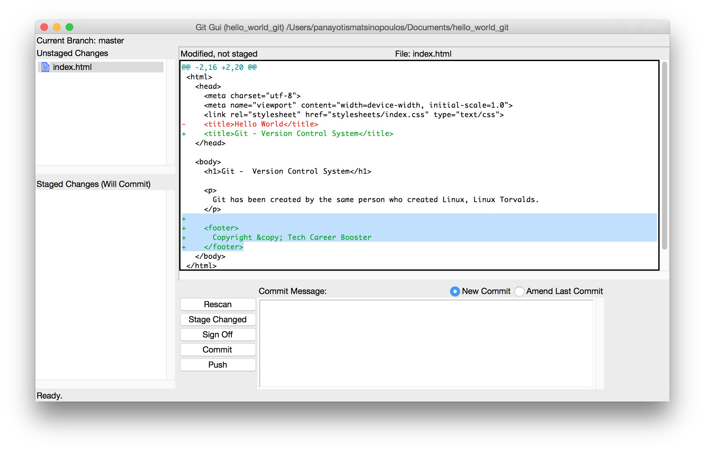

Then you can right click and bring the context menu. You select `Stage Lines For Commit` and you see that part of the file moved to the staging area, whereas the other stays
in the modified area:


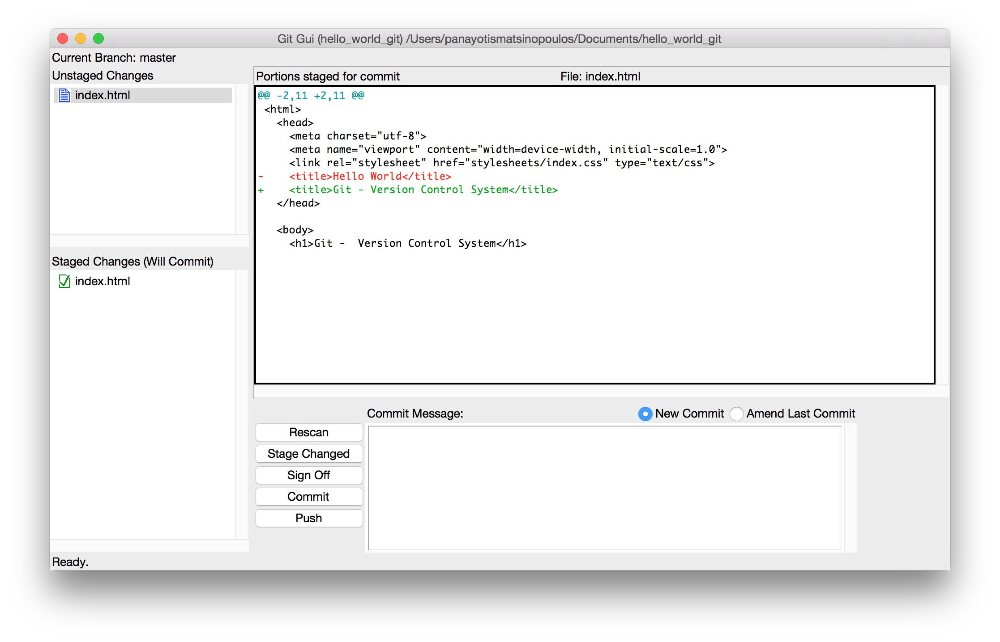

As you can see above, after the transfer of the bottom changed lines to the staging area, this changed part of the file is no longer displayed in differences area, when the
`index.html` file on the unstaged modified bucket - top left - is selected.

Whereas...

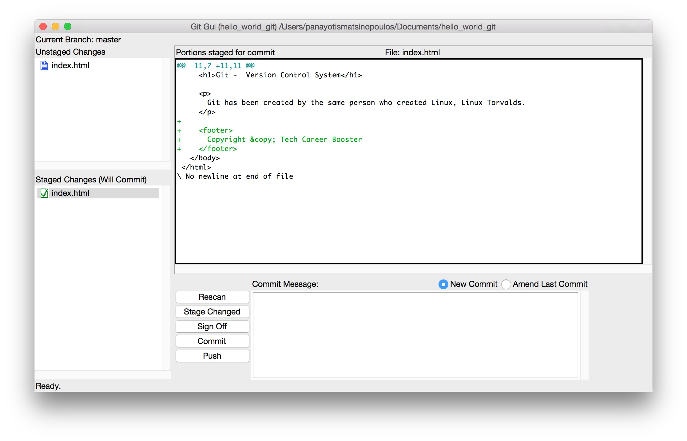

...when the staged part of the `index.html` file is selected, then one can see the changed lines on the top right, in the differences area.

We can later commit only the part that it is inside the staging area. The other part of the file that was not staged, remains with its differences inside the
unstaged modified bucket:

<div id="media-title-video-commit-part-of-the-file-changes.mp4-Commit Part of the File Changes">Commit Part of the File Changes</div>
<a href="https://player.vimeo.com/video/194250927"></a>

Now, suppose that you want to do one more change to the, already, modified `index.html` file. Here is the new content:

```
<!DOCTYPE html>
<html>
  <head>
    <meta charset="utf-8">
    <meta name="viewport" content="width=device-width, initial-scale=1.0">
    <link rel="stylesheet" href="stylesheets/index.css" type="text/css">
    <title>Git - Version Control System</title>
  </head>

  <body>
    <h1>Git -  Version Control System</h1>

    <p>
      Git has been created by the same person who created Linux, Linux Torvalds.
    </p>

    <footer>
      Copyright &copy; Tech Career Booster
    </footer>

    <script>

    </script>
  </body>
</html>
```

We have added the `script` element at the bottom. Now, if you inspect the state with the git gui, you will see this:

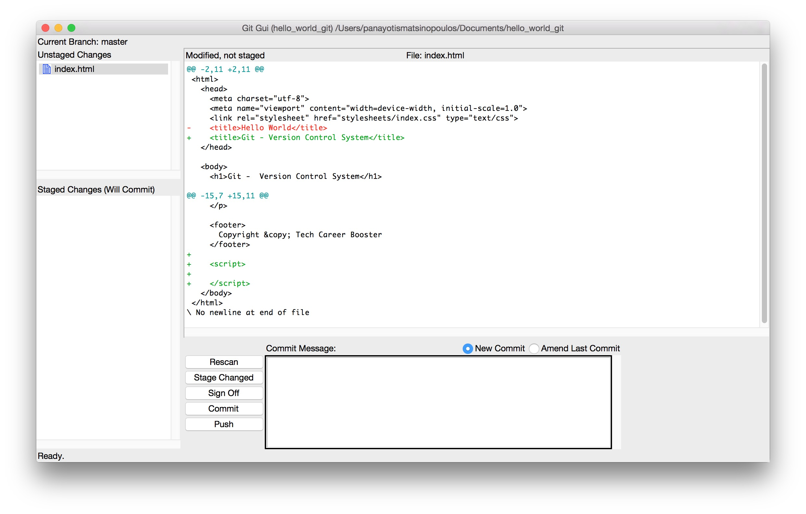

As you can see above, there are two changes now in the file. And if you look more carefully, you will see that there are actually 2 distinct areas in the differences, one
for each change. These are called `hunks`. There is one hunk for each one of the changes. The hunks are delineated with the turqoise-blue lines that start with `@@` and end with
`@@`. 

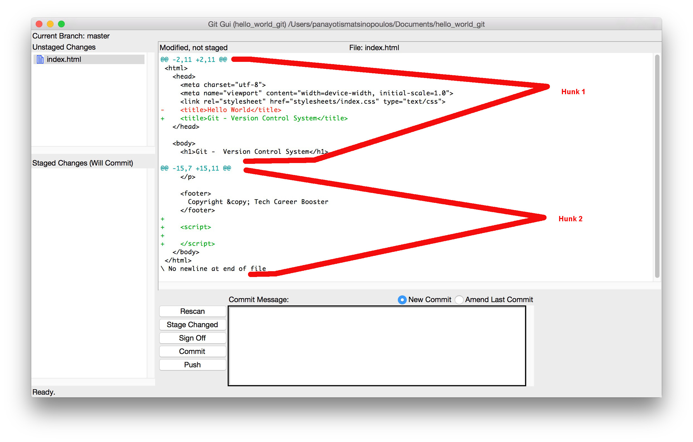

The fact that each hunk now has 1 change only is irrelevant. There might be hunks that include more than 1 change. The hunks are parts of the code that have changed, usually
of equal size in number of lines. They may contain more than a single change.

What you can do is that you can right click on a hunk and bring up the context menu, and, then, select "Select Hunk For Commit". This will bring all the changes of a hunk into
the staging area.
 
<div id="media-title-video-commit-one-hunk.mp4-Commit One Hunk">Commit One Hunk</div>
<a href="https://player.vimeo.com/video/194252051"></a>

The above video shows you how you can commit the bottom hunk. Watch it and execute the instructions on your project.

This finishes our encounter with the `git gui` tool. We will now proceed to another useful tool that shows the commit history.

### `gitk`

Another, very useful gui tool, is `gitk`. You can start it by just giving the command

```
gitk
```

at the root folder of your project.

> *Hint:* Start it on the background with `gitk &` in order to avoid blocking your terminal while `gitk` instance is running.

This is the output that you will get:


`gitk` prints the history of your commits, with the most recent on top, like `git log` does. But the graphical representation is much more easy to read. And it becomes quite
useful when your project has a long history with lots of changes and contributions from different developers.

Let's see the different areas of this user interface:

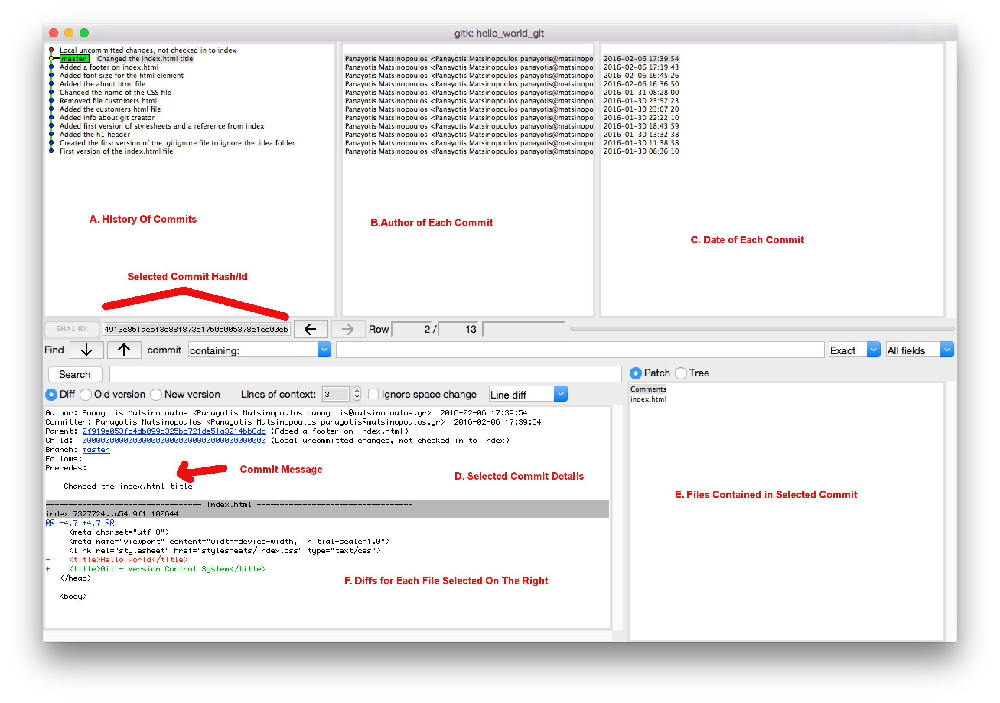

1. Area `A`. This is the history of all the commits in the project. At the bottom is the oldest one. At the top is the most recent one. You can click on any commit and see its 
details in the following areas.
2. Area `B`. This is the list of the authors. When you select a commit in area `A`, you can see the highlighted author in area `B`.
3. Area `C`. This is the exact date and time a commit has been created.
4. Area `D`. This is the area that gives some details about the commit selected:
    1. Author and Date
    2. Committer. Usually same as Author, but not necessarily. (This is an advanced topic and if you want to learn more about it, you can Google for.)
    3. Link to Parent (previous) commit with the parent commit comment.
    4. Link to Child (next) commit with the child commit comment.
    5. Details about the branch. (Branches will be covered in the next chapter.)
    6. The comment of the selected commit.
5. Area `E`. This is the list of files that are contained in the selected commit. Whenever you click on any of these files, the contents of the diff area, area `F`, 
are changed, in order to display the changes the file selected contributed to the particular commit.
6. Area `F`. This is a list with the differences / changes the commit has applied. It's an output similar to `git diff`. 
    
`gitk` is very useful to study the history of a project. Try to click on different commits and study the content that appears on all areas, especially areas `D`, `E` and `F`.

Note the red circle entry. At the top. This is not a commit. It is a node of the tree that represents the modified files, the ones inside the unstaged modified bucket.
Note that it does not contain the untracked files. The red circle contains the tracked unstaged modified files.


As you can see above, we have selected the red circle node of the tree. You can see that the pending unstaged change is the one on the index.html file. Compare that to:

1) the `git status` output, which is this:

``` 
On branch master
Changes not staged for commit:
  (use "git add <file>..." to update what will be committed)
  (use "git checkout -- <file>..." to discard changes in working directory)

        modified:   index.html

no changes added to commit (use "git add" and/or "git commit -a")
```

2) the `git gui` output, which is this:

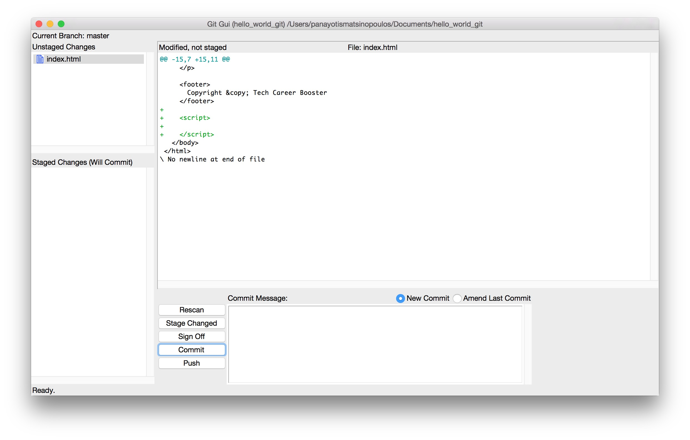

Now, let's move this change to staging and see the `gitk` tree changes. You can move the change to staging with either using `git gui` or with the `git add` command. I prefer
the second one this time:

```
git add index.html
```

Then I reload the tree inside my `gitk` instance. 

> *Hint:* <kbd>Shift + F5</kbd> keyboard shortcut does this if you are using Mac OS X. Check the command on the menu "File -> Reload" 
to see what is the shortcut on your case.

The output of `gitk` after the transfer of the change to the staging area is as follows:

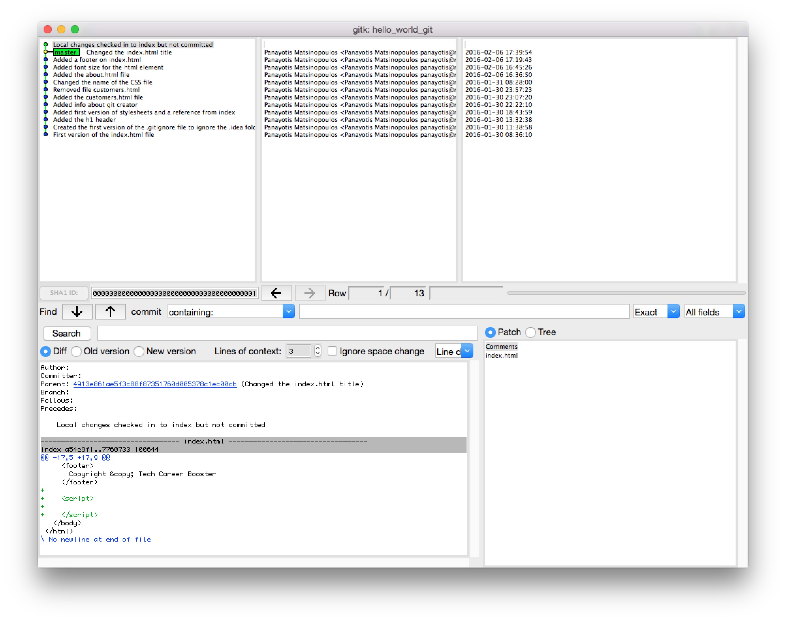

As you can see above, the red circle does not exist anymore. What we see is a green circle with the wording: `Local changes checked into index but not committed`. As you can 
understand the green circle corresponds to the staging bucket (which is also called index as we have already learned).

Compare this to the current `git status` output:

```
On branch master
Changes to be committed:
  (use "git reset HEAD <file>..." to unstage)

        modified:   index.html
```

As you can see, this one says `Changes to be committed:`, which means the same like the wording on the green circle above.

Finally, let's do the commit. This time we pick up the `git gui` tool to do that:

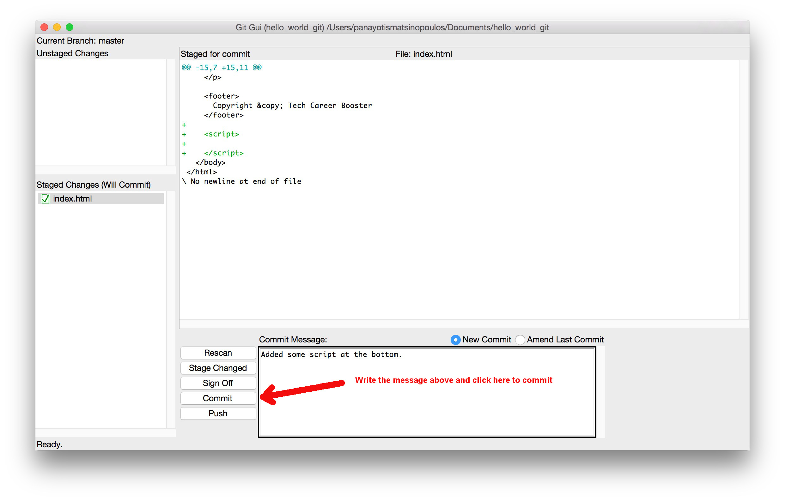

How does the commit change the picture of the commit tree in the `gitk` tool? Let's reload `gitk`. You will see this:


As you can see above, there is neither red nor green circle. So, no modification pending transfer to staging, neither staging changes pending commit. The last commit has the
color yellow and the message that we used to create it. The word "master" means that we are on the `master` branch of the tree, but this will be explained in the next chapter.

Every change you do with `git` command on the terminal, is reflected in `gitk` tree. It is very instructional to do the changes using the command line and then inspecting the
tree with `gitk`. Checking that everything is as expected and trying to be in position to explain anything that you see on the `gitk` tree representation.

We will use `gitk` a lot, in the next chapter, when we will be talking about branches.

### RubyMine and Git Integration

RubyMine has fantastic git integration. If it is not enabled by default on your project, you need to select the corresponding menu option from the "VCS" menu.
          
RubyMine has the most popular git commands on the "VCS -> Git" submenu:
          
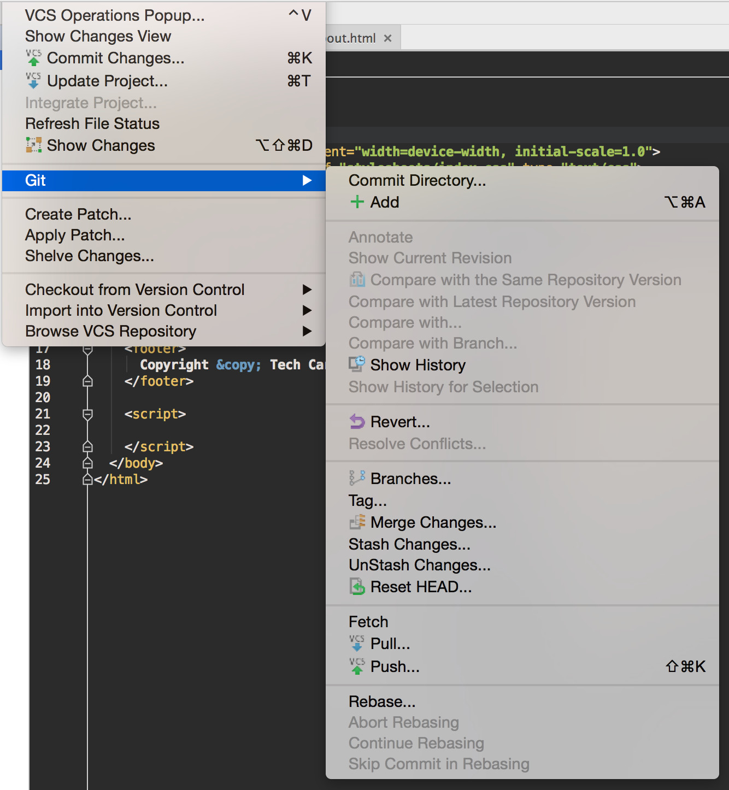

Also, when you right click on any file, you can have access to the Git submenu and execute context sensitive git related actions.
                    
Let's see some of the most common features of RubyMine that are related to Git:
                    
Let's suppose that we update the content of the `index.html` file so that it is as follows:
                  
``` html
<!DOCTYPE html>
<html>
  <head>
    <meta charset="utf-8">
    <meta name="viewport" content="width=device-width, initial-scale=1.0">
    <link rel="stylesheet" href="stylesheets/index.css" type="text/css">
    <title>Git - Version Control System</title>
  </head>

  <body>
    <h1>Git -  Version Control System</h1>

    <p>
      In 2005, the relationship between the community that developed the Linux kernel
      and the commercial company that developed BitKeeper broke down, and the tool’s
      free-of-charge status was revoked. This prompted the Linux development community
      (and in particular Linus Torvalds, the creator of Linux) to develop their own tool
      based on some of the lessons they learned while using BitKeeper. Some of the goals
      of the new system were as follows:
    </p>

    <footer>
      Copyright &copy; Tech Career Booster
    </footer>

    <script>

    </script>
  </body>
</html>
```
                  
As you can see above, we changed the content of the `p` element in the `body` of the page. RubyMine, assuming that you have enabled the VCS integration,
will highlight the lines that constitute the changes of this file as follows:
                  
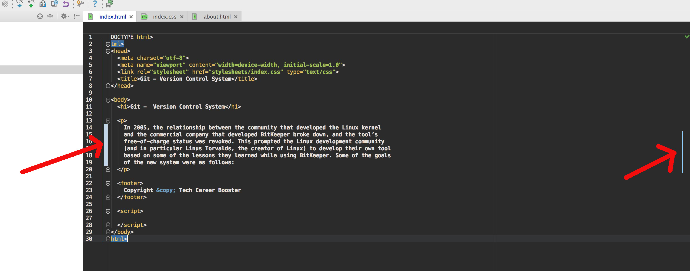
                  
The vertical bars, left and right, with the light blue color indicate the insertion of new lines.
                  
Next, let's do the following: Right click on the left side of the text area of the code and select `Annotate`. You will see this:


This information is very useful. For each one of the lines, it gives us the most recent commit that has contributed to its latest content. We can also see the author and
date. We can, also, mouse over and see the message of the commit. You can even click on a commit and have a dialog open to tell you which other changes and files this commit also included.
And you can right click and select copy, to get the hash commit to your clipboard.
                                                                  
Try to right click on a commit and experiment with all the commands available there:
                                                                  
1. Show Diff, will graphically shows you the changes this commit has introduced. It is compared to the previous commit state of the project.
2. Jump to the Git Log view, which graphically shows you the git log output.

Another useful feature is the comparison of the changes that you are currently applying vs the previous committed state of the code. If you click on the left, vertical,
light blue, thick bar, you will see this:
                                                               
                                                               

As you can see above, you have an inline overlaid view of the content as it was before you introduced the change. There is a small menu bar appearing too, that gives you the
option to rollback to the previous content, or copy the old content to your clipboard or visually see the differences side-by-side.

RubyMine has a lot of small features around git integration and makes developer life much more productive. We will see features of the RubyMine git integration in later chapters
too.

### Other Git Gui Tools

There are a lot of git gui tools in the market. Both free and paid ones. For example the [Sourcetree](https://www.sourcetreeapp.com/). If you are not satisfied with what
RubyMine offers, alongside with `git gui` and `gitk`, then you might want to investigate another tool to cover your needs.
                  
          


