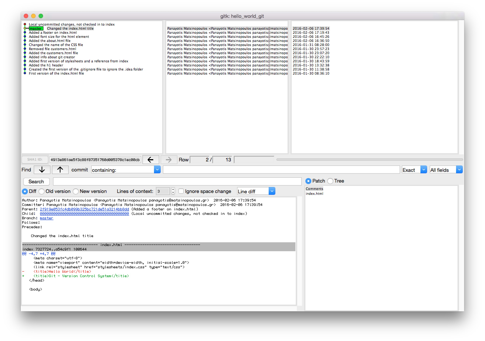
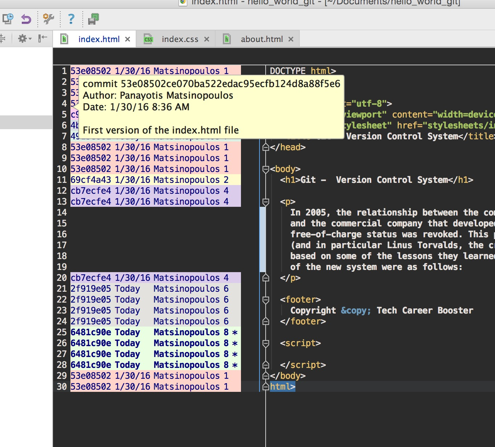

We have learned quite a lot of git commands used on the command line interface. These are very
useful to know and you need to master them sooner or later. However, you will also increase your
productivity if you have some GUI tools in your tool belt. These GUI tools will help you 
visualize your work with git.

In this chapter we will learn about `git gui`.

It is a tool that will allow us to visually execute various git commands.

Also, we will learn about the `gitk` tool.

It is a tool that will visualize the commit history of our project.

Finally, we will see how RubyMine does fantastic work on git integration. 

RubyMine has huge list of git integration features that will make you boost your productivity.
