In the previous chapters on `git`, you have learned how to keep track of the changes on your project files with all the basic
Git commands. You have also learned to work many features and fixes *in parallel*, using different branches and switching 
from one branch to the other according to the project development needs.

This is enough, as long as you are the only person working in the project and you are working on the same development machine
all the time. How does your Git workflow change when you cooperate with other developers on the same project? How does it
change when you decide to work on the same project from different workstations?
 
There has to be a way for your changes to be communicated to the other developers. This is done via the help of a
**remote** repository that you will have to make sure its up-to-date with the latest changes. The remote repository is used by
other developers, that work on their own workstations, to get your changes, as well as yourself to get theirs.

### Setting up the remote repository

Assuming that John is working, as a single member, on the new CRM of the company. He has already developed one feature, the "Add Account" feature.
Now he has started working on the new feature "Delete Account" when a new member joins the CRM project team. The new member is assigned his workstation
and he is ready to start working.


The team leader tells that the new member, Mike, needs to develop a new feature "Search Accounts". In order for Mike to start working on the CRM project, he,
without any doubt, needs to get the source code of the project. 

But the source code of the project resides on John's workstation. How will Mike take the source code? 

Both these two developers need to work using a central machine that will be acting as the "exchange-code-between-developers-machine". Let's call that machine "remote repository", for the
time being. John will be *pushing* his code to the remote repository and Mike will be *fetching* John's code from the remote repository. And vice versa. Mike will be pushing
his changes to remote repository and John will be fetching Mike's changes from the remote repository. 

Hence, we are talking about something like this:


How do we setup the remote repository in the first place? Undoubtedly, you need to have a server machine running 24x7 to host the remote repo. You need a Git server.
The Git server is responsible to serve more than one Git remote repositories.

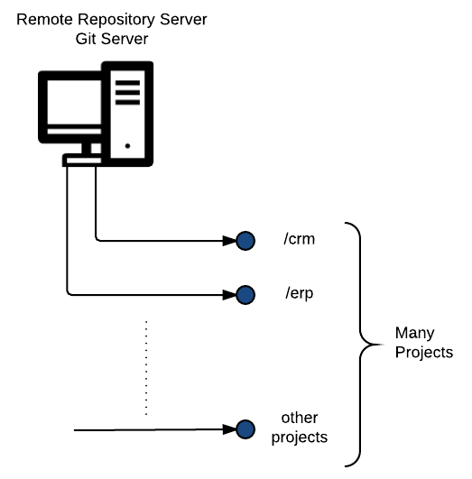

In order for a project developer to push *his first work* on a Git server, a remote repository needs to *be prepared* on the Git server. 

#### Prepare the Remote Repository on Git Server

These articles below explain how one can setup a remote repository on a Git server. Further explanation is beyond the scope of this course. 

1. [Git – setting up a remote repository and doing an initial push](https://maanasroyy.wordpress.com/2012/06/16/git-setting-up-a-remote-repository-and-doing-an-initial-push/)
2. [Create a new Git Remote Repository from some local files (or local Git repository)](http://qugstart.com/blog/ruby-and-rails/create-a-new-git-remote-repository-from-some-local-files-or-local-git-repository/)

You can find even more articles on this subject if you google about that.

#### Use a Git Server In the Cloud

Instead of setting up your own Git server, you can always use a server that somebody else has set up for you and it offers an easy interface for you to start pushing your project code.

Here is a list of some popular Git servers on the cloud:

1. [Github](https://github.com)
2. [BitBucket] (https://bitbucket.org)
3. [GitLab] (https://gitlab.com)

During this course, we are going to use `Github`. But, same principles apply to all the other online Git services.

#### Github Account

> *Note:* If you already have a Github account, you can skip this paragraph.

In order to use Github, you will have to create an account. Sign up and create an account. Use the free plan. The free plan allows you to create open source public projects.

You are now ready to use Github as your Git server to store your remote repositories.

#### Creating your Remote Repository on Github

> **Important:** Before you continue with this, make sure that your `hello_world_git` project current branch is `master`, with the following command: `git checkout master`

Creating your remote repository on Github is very easy. 

1. Select to create a repository:
If you didn't have an account before and you just created it, you need to click on the button to create a new repository as depicted here:

If you already had a Github account, then you need to create the new repository as in the following picture:

2. Give a name to your repository. Use `hello_world_git`, to be the same name like the one we are using in our course chapters for Git.
3. Give a description. Like: `Project to Learn and Practice Git`
4. Then click on `Create Repository` button.
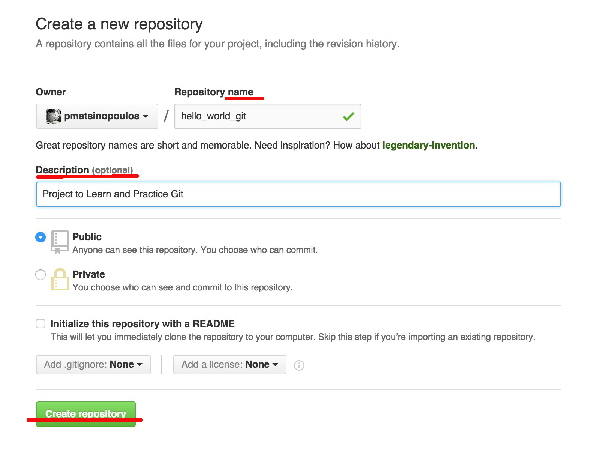

If everything goes ok, you will see this:
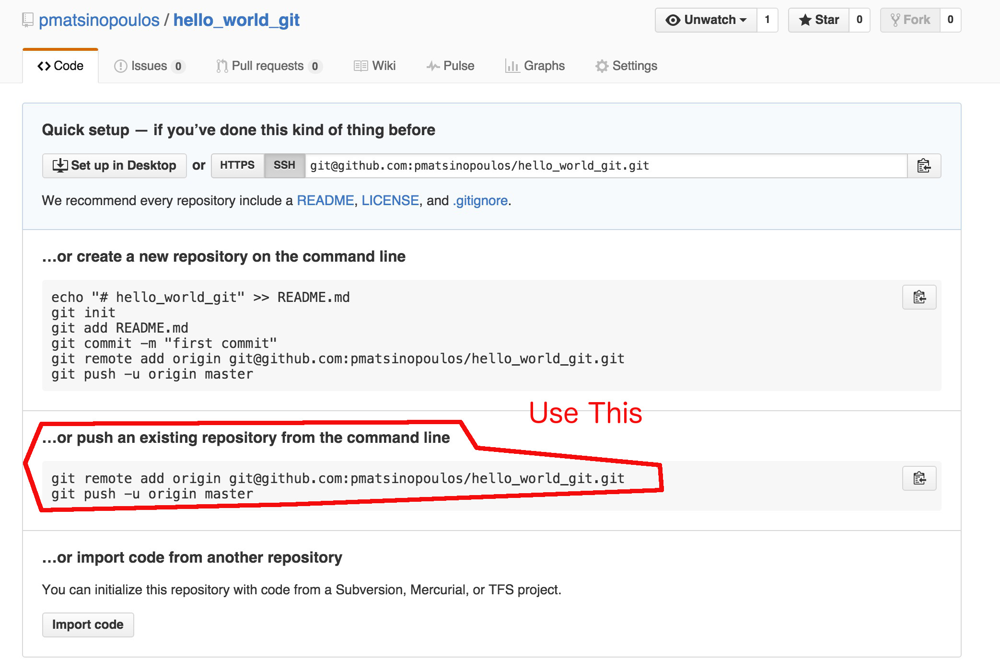

On the above screenshot, Github displays instructions on how you can link your local work to the remote repository. In other words, what needs to be done in order for your local Git to
know where your remote repository is. 

We will use the third block of setup instructions, which assumes that the local repository/project already exists. This is because our local repository already exists and already has
been initialized with Git. We only have to tell the `hello_world_git` local repository where is its remote counterpart. 

The first command that we need to execute is the following:

> **Important:** Do not execute the following command as exactly given below. The following command corresponds to my repository on Github. Not yours. You need to replace the remote/Github
user with your own Github username.

```
git remote add origin git@github.com:pmatsinopoulos/hello_world_git.git
```


 
This command registers `git@github.com:pmatsinopoulos/hello_world_git.git` as a remote repository of your project. If everything goes well, you will not see anything being output.
The command that is used is the `git remote add` command. This command is used to add remote repositories to your local project Git configuration. Note that one project can have
many different repositories. All of them should be added with the `git remote add` command. For the time being, our `hello_world_git` project only has one.

The `git remote add` command requires, first, to give the name of the repository, as it will be named from the local workstation. On the above command, we named it `origin`. This means
that everytime the local workstation wants to refer to the remote repository, will be using the name `origin`. The name `origin` is a standard convention for the first, and usually one,
repository of a project. However, you can use any name that you like. 

Then, after the name, the command `git remote add` requires that one gives the URL to the remote repository. Note that you should use whatever Github suggests on your case for the new
repository that you have created.

You can see the list of configured project remote repositories if you execute the following command. Go ahead:

```
git remote -v
```

You will get an output similar to the following:

```
origin  git@github.com:pmatsinopoulos/hello_world_git.git (fetch)
origin  git@github.com:pmatsinopoulos/hello_world_git.git (push)
```

As you can see from the above output, you just setup one remote with name `origin`. For this remote, there are 2 endpoints defined. One for the `fetch` stream and one for the `push` stream.
Those might have been different. If they were, this would have meant that you would fetch changes from a machine different from the machine you would push your changes to. But this is 
very rare to happen as a setup. Usually, both streams (fetch and push) match, meaning that you fetch your changes from the same repo which you push them to.

Perfect!. We have managed to tell our local Git database the location of the remote repository. We have also given a name (`origin`) to this remote repo.

Next thing that we have to do is to do our *first push* to remote repository. The command to do the first push to the remote repository is:

```
git push -u origin master
```

exactly as it is given by the Github instructions.


This is the command that you should use to create your first push, from your local repository to remote repository. The command requires that you define the remote repository by its name. 
This is `origin` in our case, because that was the name we used when we added the remote repo to our local references with the previous command (`git remote add origin...`).
The command also needs to know which branch of your code will be pushed to remote repository. In our case, we are instructing Git to push the branch `master`.

> *Note:* You can see, above, the switch `-u` that is suggested by Github for your first push command. This switch will not be generally used. But now, that it is used, it tells
Git that if argument-less Git commands are subsequently used for this project, they will assume `origin` remote if a remote repo is required by the command. For example, you 
will be able to do `git fetch` and that would assume `git fetch origin`, meaning that you would want to fetch from the remote with name `origin`.

Run the above command. What you will get is the following:

```
Counting objects: 81, done.
Delta compression using up to 8 threads.
Compressing objects: 100% (76/76), done.
Writing objects: 100% (81/81), 8.98 KiB | 0 bytes/s, done.
Total 81 (delta 40), reused 0 (delta 0)
To git@github.com:pmatsinopoulos/hello_world_git.git
 * [new branch]      master -> master
Branch master set up to track remote branch master from origin.
```

The above output informs you that a *new branch* has been created. But this branch was not created locally. It was created remotely, on the remote repository with name `origin`.
The remote branch name is called `master` too. Look at the last phrase of the previous output:

`Branch master set up to track remote branch master from origin.`

In other words, the local branch `master` is now linked to the remote branch `master` on the remote repository with name `origin`. This link is denoted with the word `track`.


Keep that in your mind because it will be used in the future to explain a lot of things that you will encounter with Git and its commands.

Now go and refresh the project Github page. What you will see, is something like this:


Well Done! You have just pushed your code to a remote Git server, a remote repository. Which means that:

1. You now have a backup of your code on another machine. So, you are safe. You will not ever loose your code, even if your development machine crashes and dies completely. So, make sure that
you push your code to remote repo every time its ready. (We will show you how to do your next pushes later on)
2. Other developers in your team can take the code and work on the same project as you are.

#### Branches and Remotes

Having linked your local repository to a remote repository and having created the remote branch can be verified also with the `git branch` command.

Run the following command:

```
git branch
```

This will print the following:

```
  feature-incoming-call
  feature-invoicing
  feature-low-stock-email-notification
  feature-sms-notification
* master
```

which is the list of the branches in your Git database. Actually, this is the list of the **local** branches. The branches that you have created.

Does the local Git database know about the remote branches. Yes it does. Give the following command:

```
git branch -r
```

This will print the following:

```
 origin/master
```
 
The `-r` switch on the `git branch` command stands for `remote` and gives the list of the remote repositories that your local Git database knows about.
It prints the name of the remote branch prefixing it with the name of the remote repository. In our case, the remote branch name is `master` and the remote repository
name is `origin`. Hence, the full remote branch name is `origin/master`.

Run the following command:

```
git branch -a
```

You will get this as output:

```
  feature-incoming-call
  feature-invoicing
  feature-low-stock-email-notification
  feature-sms-notification
* master
  remotes/origin/master
```

Switch `-a` stands for `all`. As you can see, the output first lists the local branches, and then lists the remote branches. The remote branches are all prefixed with the `remotes/` label
just to make sure that you distinguish them from the local ones.

### `git` Remote Commands

We would like here to give one more perspective to the current picture of your local and Github projects. 

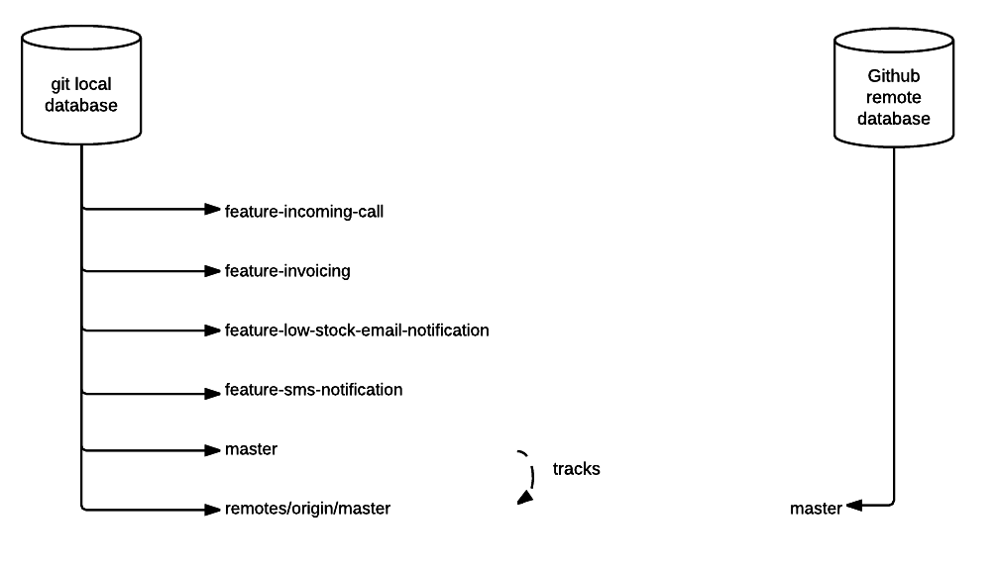

What does this above picture say is the following:

1. Local repositories that have not been pushed, they do not exist in the remote Github project database. You can verify that on Github too. 
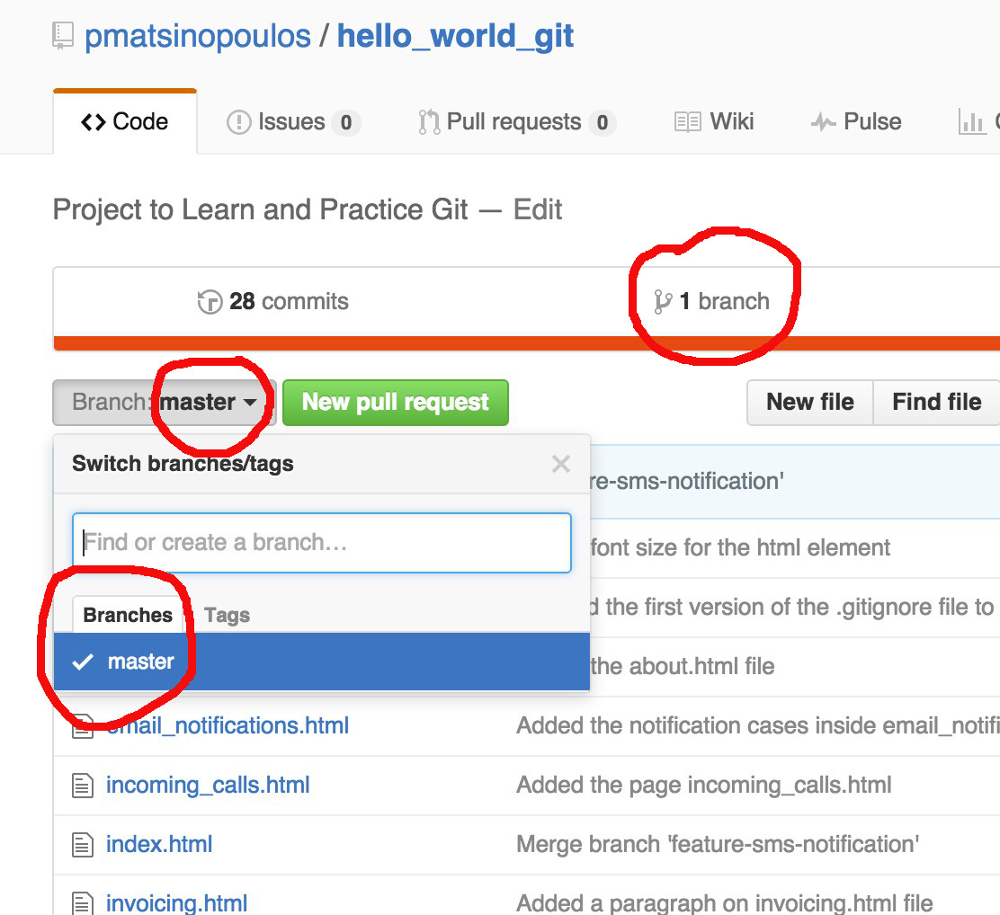
As you can see on the above screenshot, the `Branches` dropdown contains only 1 branch, the `master` branch. Also, the `branches` counter clearly mentions that there is only `1` branch.
2. Each remote branch has a local representation - copy, inside the local Git database. The local representation of a remote branch is a branch which is named with the pattern `<remote repository name>/<remote repository branch name>`.
Hence, the remote branch with name `master` that lives on the remote repository with name `origin` has a local copy inside the local Git database, and this local branch is
named `origin/master`. 
3. A local branch might be tracking, associated, with a local copy of a remote branch. In our case the local `master` branch is tracking the `origin/master`. This means that Git local
database, at any point in time, knows what are the differences, if any, between the `master` and the `origin/master`. 
4. The local `master` branch does not know anything about the `master` branch on the `origin` repository, other than whatever exists inside the `origin/master` local copy. In other words,
if another developer pushes changes to `master` branch on `origin` repository, these changes **are not automatically** known to `master` branch or `origin/master` branch 
on local machines of other developers. Other developers need to take actions in order to make the remote repo changes known to their local copies (`master` and `origin/master`). We will 
see how later on.

To further extend the information given on the last item above, you have to understand that your Git local database is **NOT automatically synced** with the Github (or other Git server)
remote Git database. The developers, need to take actions in order to make their local Git database know about changes that take place in remote repositories. And on the other direction too, 
i.e. if developers want to make their changes known to the remote Git database, then they have to take relevant actions.


There are only 3 Git commands that sync Git local and remote databases:

1. `git push`, which pushes changes from the local database to the remote database
2. `git fetch`, which fetches changes from the remote database and stores them in the local database
3. `git clone`, which downloads the whole remote database and creates a brand new local working directory for the project. This is only used once, by the developer that joins the 
project for the first time and wants to initialize his workstation to work with the project. After that, this command is not applicable.

Lets call the above commands, `git Remote Commands`. 

> *Note:* One might tell you that there is one more Git remote command, the `git pull`. This is not really true, because `git pull` is actually a wrapper around a `git fetch` and a `git merge`. Also, 
we are suggesting that you should not use the `git pull` command. You should use the `git fetch` command and then control the way you do your merge, with either `git merge` or with
`git merge --no-ff` or even with `git rebase`. It depends on the workflow that you decide to follow with the rest of the team. But, again, in any case, don't use `git pull`. 

All the other `git` commands are dealing with the local Git database only and
 
1. they do not affect in any way the remote Git database, neither
2. do they affect, in any way, the local database with information that exists in the remote database.

### `git clone`

Let's recap where we are now with the `hello_world_git` repository.

1. We have some local branches.
2. We have an account on Github.
3. We have set up one repository on Github with name `hello_world_git`.
4. We have named this remote repo `origin`.
5. We have pushed for the first time our local branch `master` to remote repo `origin`, which:
    1. created a remote branch named `master` on remote repo `origin`, on Github.
    2. created a local copy of the remote branch
    3. the local copy of the remote branch is named `origin/master` (and sometimes `remotes/origin/master`)

Can we see this picture visually?

Yes we can, with `gitk` again. Run `gitk` and you will get this picture:


The picture is not much different to what we had earlier, before the push to Github. It only has one more label, `remotes/origin/master` that is the label for the new branch in our Git
local database. This is the branch that is the local copy/representation of the remote branch `master` on the remote repo `origin`. This branch points to the same commit that 
the local `master` branch points to, too.

Now, let's ask another developer to work on the same project. In order to simulate that, we will create another account on Github. 

Hence, go ahead and create another account on Github. Make sure that you chose the free plan. And then verify the email address clicking on the link that Github will send you.
 
> *Note:* In order to create another account on Github, you will need a second email address or, if you have a GMail account, you can register an email address that has the same
mailbox owner but with a suffix that starts with the plus `+` sign. Doing that, GMail will eventually deliver any email sent to this new email address, to the mailbox without the
suffix. For example, if you have the GMail account `foo@gmail.com`, then you can register a new Github account with email `foo+github@gmail.com`, and any email sent to `foo+github@gmail.com`
will eventually be delivered to `foo@gmail.com`. 

> Let's assume that the new email account on Github has email `panosm@techcareerbooster.com` and username `panayotism`

After you create your new Github account, you will see something like this:

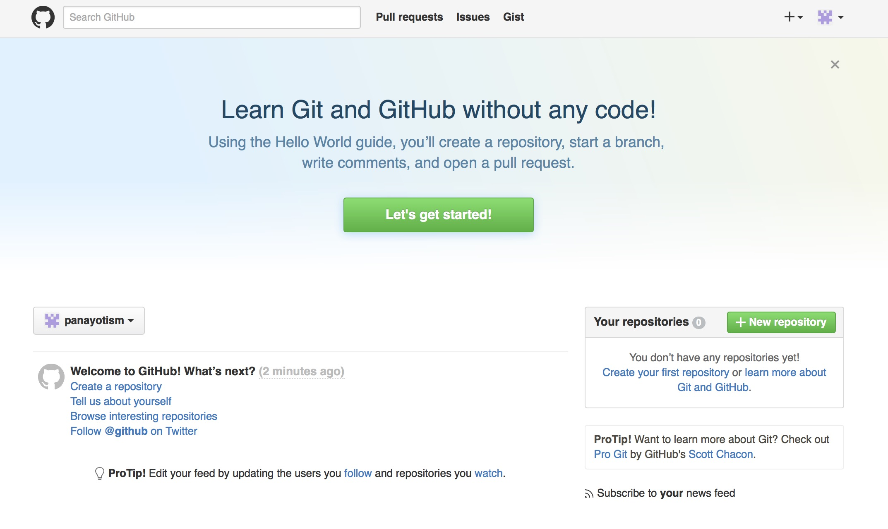

**Don't create a new repository** The new developer, `panosm@techcareerbooster.com` will not create his own remote repository. He will be working on the same remote repository like the
first developer does, the one created at the beginning of this chapter.

Now that the new developer has access to Github, he needs to have access to the remote repository that has been created at the beginning of this chapter. 

We have the first developer being Github user with username `pmatsinopoulos` and the new developer that wants to work on the same project. The new developer has username `panayotism`.
Substitute these (`pmatsinopoulos` and `panayotism` with your usernames for the first and second account respectively).
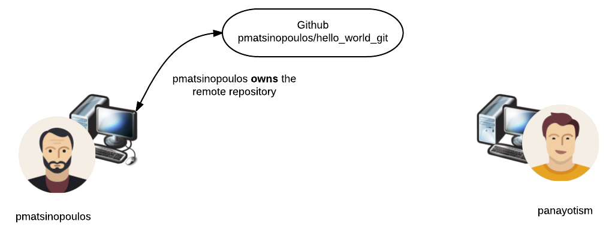
The user `pmatsinopoulos` has originally created the repository on his account. That's why he is considered to be the *owner* of the repo. In order for the other developer `panayotism` to be
able to work with this repo, `pmatsinopoulos` needs to give access to him. Let's do that:

Access Github with the original developer account, `pmatsinopoulos` and go to the project settings:

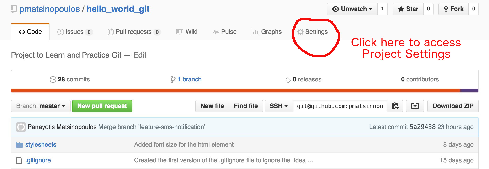

Then click the Collaborators:


When you do that, you may be asked to confirm your password. After this, you can search for the username `panayotism` (actually, the username of the second account that you have created),
and click on `Add collaborator`.


Having done so, you practically give your other developer (`panayotism` in my case) access to fetch and push from this repo.


Now, new developer is ready to access the remote repository. He has to take the action to initially copy the whole project from the remote repo to a brand new folder on his computer.

> *Note:* Since we are simulating the existence of another developer we need to be careful here. We will create a new folder `hello_world_git_2` that will store the copy of the
remote repository for the second developer to work.

1. Go to your terminal.
2. Make sure that you are on the folder where you create your projects. **Not** on the folder of your `hello_world_git` project. For example, make sure that you are on `Documents` 
folder, or on the parent folder of folder `hello_world_git`. 
3. Run the following command:
```
git clone <remote_repository_url> hello_world_git_2
```
by replacing the `remote_repository_url` with whatever the url of your remote repository is. You can get it from the address bar of your browser, **but make sure that you add the suffix `.git`**
at the end. Example `https://github.com/pmatsinopoulos/hello_world_git.git`.
I ran the command on my end. This is how it looked like:
```
panayotismatsinopoulos@~/Documents $ git clone https://github.com/pmatsinopoulos/hello_world_git.git hello_world_git_2
Cloning into 'hello_world_git_2'...
remote: Counting objects: 81, done.
remote: Compressing objects: 100% (36/36), done.
remote: Total 81 (delta 40), reused 81 (delta 40), pack-reused 0
Unpacking objects: 100% (81/81), done.
Checking connectivity... done.
panayotismatsinopoulos@~/Documents $ 
```
Do you see the `Cloning into 'hello_world_git_2'`? This verifies that cloning has taken place successfully.


### Confirm New Developer Status

New developer is ready to start working on the project `hello_world_git`, which he has stored locally, in his hard drive, in the folder `hello_world_git_2`. This new folder is a Git ready
folder that has everything that the Github remote repository had. Let's execute some Git commands on this repo to verify its status.

First make sure that you are on this new folder:

```
cd hello_world_git_2
```

> *Note:* whenever we cd into `hello_world_git_2` folder we simulate us being the second developer (`panayotism` on my case).


Execute the following command to get the `git status`:

```
git status
```

You will get the following:

```
On branch master
Your branch is up-to-date with 'origin/master'.
nothing to commit, working directory clean
```

This confirms that, you, as `panayotism`, the second developer, are currently working on the `master` branch. Or, in other words, your current branch is `master`. Also, it says that your
branch is up-to-date with the `origin/master` branch. `git` knows that your local `master` branch tracks the `remotes/origin/master` branch (which is the local copy of the 
remote `master` branch on repo `origin`) and compares these two and sees that they are equal. That's why it reports `Your branch is up-to-date with 'origin/master'`.

Let's get the list of all branches registered in the local Git database on the 2nd developer:

```
git branch -a
```

the output will be:

```
* master
  remotes/origin/HEAD -> origin/master
  remotes/origin/master
```

As you can see above, the second, just joined, developer only has 1 local branch, the `master` branch. It also has 1 remote branch, the `remotes/origin/master` branch.

> *Note:* You can see above a remote branch with name `HEAD` and a pointer `->` pointing to `origin/master`. This is not, actually, another branch. This entry is there to
just mention to you that the default branch on the remote with name `origin` is the `origin/master`. The `HEAD` denotes the default branch. In other words, the default branch
on the Github remote repo is the `master` branch. When a remote repo has a default branch will make sure that some of the Git commands will not have to specify the branch name,
and only the name of the remote would be enough.

The local branches that exist for the other developer (`feature-...`, e.t.c.) do not exist in the local Git database of the second developer. This is because the first developer
never pushed to Github remote repo any of the other branches. He only pushed the `master` branch.

The current picture as given by gitk for the second developer is the following:

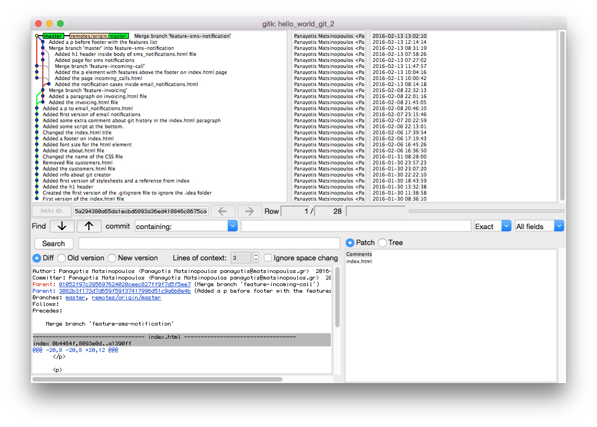

As you can see above, only the `master` and `remotes/origin/master` branches are displayed. 

Let's compare that to the picture we get from `gitk` on the first developer workspace.

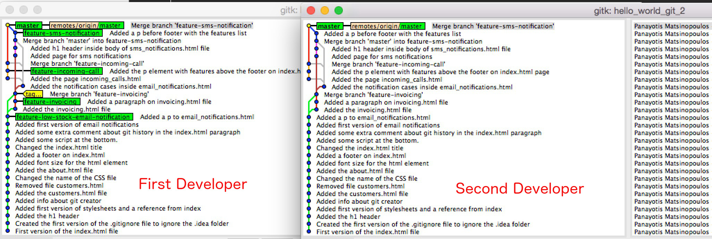

The above picture shows that the second developer has exactly the same commit tree like the first developer. What is missing is the information about the branches that the first developer
didn't push to remote repo. Otherwise, the commits are exactly the same. And this is so, because the `master` branch contains all the commits for all the branches, because all the
branches have been merged to `master` branch (see the previous chapters).

Another information that is missing from the second developer is the information of the tags. There is no tag appearing on the second developer gitk tree. On the other hand, there is
one tag on the gitk tree of the first developer.

Being on the second developer workspace (`hello_world_git_2`) execute the following command:

```
git tag --list
```

It will print nothing, which confirms that the second developer knows nothing about the tags that exist on the first developer local Git database. This happened because the tags
where not pushed to Github remote repo when the first developer did `git push -u origin master`. The fact that the remote repository does not have any tags, can also be confirmed
from the Github UI:


> *Note:* Click on `Branches` to get the list of branches and tags, and then click on `Tags` tab to access the above information.

### `git push` and `git fetch`

Let's see what we can do to push all the information that first developer has to remote repo. 

Make sure that you are on folder `hello_world_git` (which simulates the workspace of the first developer).

#### Push the local branches

We can get the list of the local branches that we have now, using the command:

```
git branch
```

which gives:

```
  feature-incoming-call
  feature-invoicing
  feature-low-stock-email-notification
  feature-sms-notification
* master
```

Let's push the branch `feature-incoming-call`. Run the following command

```
git push origin feature-incoming-call
```

You should see something along the following lines:

```
Total 0 (delta 0), reused 0 (delta 0)
To git@github.com:pmatsinopoulos/hello_world_git.git
 * [new branch]      feature-incoming-call -> feature-incoming-call
```

which verifies that the push has been done successfully. Let's confirm that in other ways too.

On Github UI, we can now see the new branch in the list of branches:

> *Note:* Make sure you refresh the project Github page

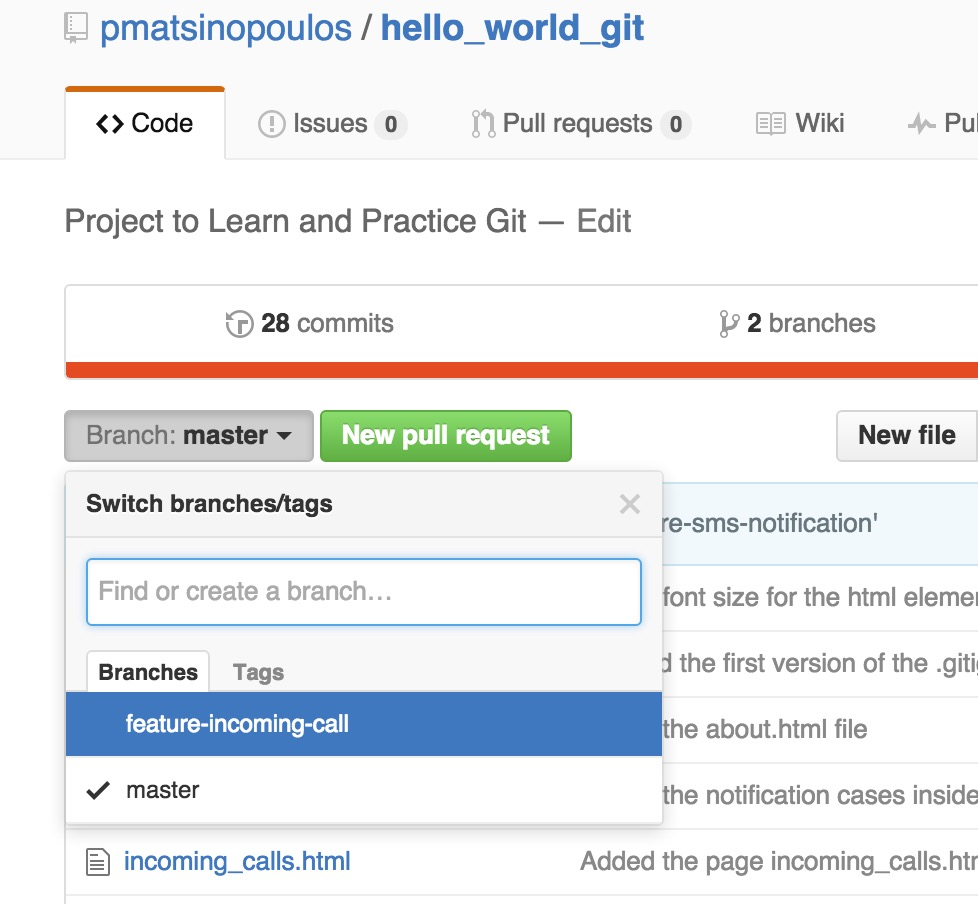

As you can see above, the new branch is displayed on remote. Also, if you do:

```
git branch -a
```
you will get this:

```
  feature-incoming-call
  feature-invoicing
  feature-low-stock-email-notification
  feature-sms-notification
* master
  remotes/origin/feature-incoming-call
  remotes/origin/master
```

Do you see the entry `remotes/origin/feature-incoming-call`? That's the new entry that has been added to the list of remote branches inside the `hello_world_git` repository.

And `gitk` can confim this:
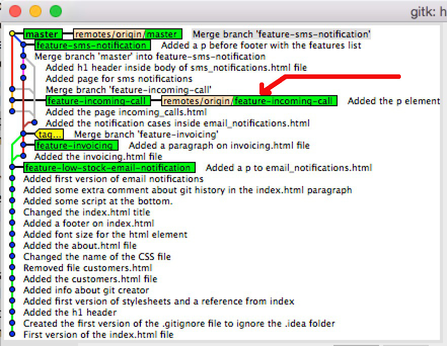

Nice! Having the branch `feature-incoming-call` pushed to the remote `origin`, this means that the second developer can get this change. Let's do that.
 
Switch to the folder `hello_world_git_2` (which simulates the workspace of the second developer).
 
The command to fetch remote changes is the following:
 
```
git fetch
```

You will get this output:

```
From https://github.com/pmatsinopoulos/hello_world_git
 * [new branch]      feature-incoming-call -> origin/feature-incoming-call
```

which verifies that the second developer has a new branch created in his local Git database. Let's execute the command to get all the branches:

```
git branch -a
```

You will get this:

```
* master
  remotes/origin/HEAD -> origin/master
  remotes/origin/feature-incoming-call
  remotes/origin/master
```

There is a new entry in the local Git database for the second developer. The entry is `remotes/origin/feature-incoming-call`. This is the copy of the branch `feature-incoming-call` in `origin`
repo. The `git fetch` command fetched that remote branch and stored, locally, a copy of this branch, and named it `remotes/origin/feature-incoming-all`. 

Note that second developer does not have working access to this copy. He can only see its commits and carry out other read-only operations. For example, he can see its position in the
tree, using the `gitk` command. Let's call that command:

```
gitk
```

The output is the following:

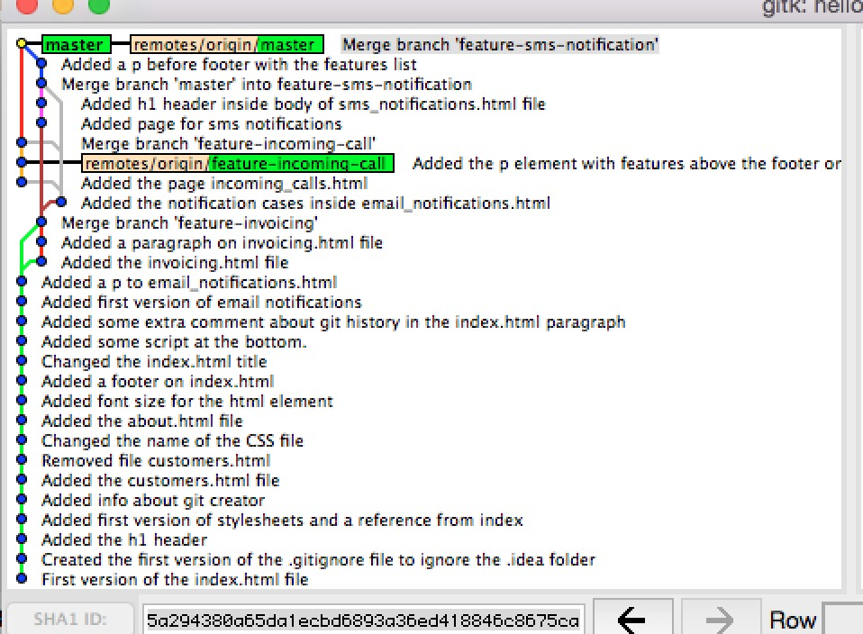

The second developer cannot change or work on the `feature-incoming-call` branch. And this is because there is no local branch that tracks the remote `remotes/origin/feature-incoming-call`
Both the above picture and the `git branch -a` command do not display any local branch with name `feature-incoming-call`. 
 
What if the second developer had to work on a remote branch? He would have to create a new local branch, on his set of local branches, that would track the remote branch. And how does one
create a new branch? He does it with the command `git checkout`. Do you remember that the command `git checkout -b <branch_name>` creates a new branch? In this case, it is a little bit
different. Because we also want to tell that the new branch should be tracking the existing remote branch with same name.

Try the following command:

```
git checkout -b feature-incoming-call -t origin/feature-incoming-call
```

You will get this output:

```
Branch feature-incoming-call set up to track remote branch feature-incoming-call from origin.
Switched to a new branch 'feature-incoming-call'
```

Great! Exactly what we wanted. We created a new local branch with name `feature-incoming-call` and set it to track the remote branch `feature-incoming-call` from `origin`.

Let's confirm that with

```
git branch --all
```

will give this:

```
* feature-incoming-call
  master
  remotes/origin/HEAD -> origin/master
  remotes/origin/feature-incoming-call
  remotes/origin/master
```
which indicates that we are now on the `feature-incoming-call`. Also, try

```
gitk
```


We have to say here that the command:

```
git checkout -b feature-incoming-call -t origin/feature-incoming-call
```

could have been simplified as:

```
git checkout feature-incoming-call
```

which tries to switch to the local branch `feature-incoming-call` and if this branch does not exist, but there is a same name remote branch, it creates it and sets it to track that remote branch.

Let's try that:

1) Switch to `master` branch (in order to be able to delete the newly created `feature-incoming-call` branch)
```
git checkout master
```

2) Delete the newly created branch:
```
git branch -d feature-incoming-call
```

3) Check the branches:
```
git branch -a
```
which gives:
```
* master
  remotes/origin/HEAD -> origin/master
  remotes/origin/feature-incoming-call
  remotes/origin/master
```
and confirms that the local branch `feature-incoming-call` has been deleted but the `origin/feature-incoming-call` is still here.

4) Create the local branch again and set it to track the remote branch, using the simplified version of `git checkout` command:
```
git checkout feature-incoming-call
```
which prints out:
```
Branch feature-incoming-call set up to track remote branch feature-incoming-call from origin.
Switched to a new branch 'feature-incoming-call'
```
and did exactly what the command `git checkout -b feature-incoming-call -t origin/feature-incoming-call` did earlier.

> *Note:* Hence, prefer the `git checkout <new branch name>` on this case, rather than the `git checkout -b <new branch name> -t <remote branch name>`. But still, it's good to know the
existence of the latter. You might need it in the rare case you want to create a local branch that would track a remote branch with different name.

We have shown here how the first developer pushes a local branch (other than master) to remote repo and how the second developer gets it locally. Also, how the second developer can 
switch to that new local branch and do work. 


However, we are still missing the tags on the second developer machine. The tag that has been created by the first developer is still on the first developer machine.

How do we push tags to remote repo?

Let's switch back to the workspace of the first developer (to folder `hello_world_git`) and get the list of the tags that exist there:

```
git tag --list
```
We get the following output:

```
production-release-201602082308
```

We can push that to remote with the following command:

```
git push --tags origin
```
You will get this output:
```
Total 0 (delta 0), reused 0 (delta 0)
To git@github.com:pmatsinopoulos/hello_world_git.git
 * [new tag]         production-release-201602082308 -> production-release-201602082308
```
Great! The output mentions that the tag has been created on remote repository.

This can be verified from the Github UI too:

> *Note:* Make sure that you refresh the Web page of the project.


Now that the tag is on the remote repository, does the second developer get it? 

Let's switch to the second developer workspace (`hello_world_git_2`)

The only command that we have learned so far and that it fetches data from remote repository is this. Try it:

```
git fetch
```
This will identify that there is a new tag on the remote and will bring the info to local Git database. This is what it is output:

```
From https://github.com/pmatsinopoulos/hello_world_git
 * [new tag]         production-release-201602082308 -> production-release-201602082308
```
Perfect, the new tag has been downloaded.

Try also the following command:

```
git tag --list
```
you will see that the new tag is listed. 

Also, load the `gitk` command. You will see this:

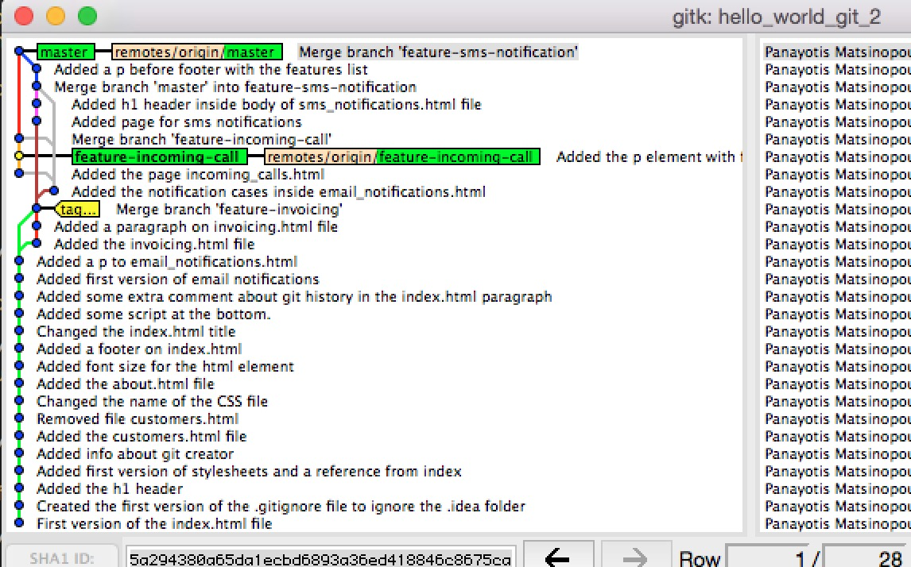

### Merge Conflicts

We have learned how the developers exchange their work with `git push` and `git fetch` commands. Let's try another scenario that is very common when two or more developers work on the 
same branch.

Switch to first developer workspace (`hello_world_git`).

Create a new feature branch with name: `feature-order-creation` that has to do with a new feature we want to create. 

```
git checkout -b feature-order-creation
```

We create the file `orders.html` and we insert the following content to it:

``` html
<!DOCTYPE html>
<html>
  <head>
    <meta charset="utf-8">
    <meta name="viewport" content="width=device-width, initial-scale=1">
    <title>Orders</title>
  </head>
  <body>
  </body>
</html>
```
Then we add and commit this change:
```
git add .
git commit -m "Added the file orders.html"
```
The first developer, `pmatsinopoulos` in my case, pushes his work to remote repository.

```
git push origin feature-order-creation
```

The branch is created as expected on the remote repository.

Now, the second developer fetches first developer work in order to start working on the same feature, in parallel with the first developer.

Switch to second developer workspace (`hello_world_git_2`).

Fetch first developer work:

```
git fetch
```
This is what the second developer gets as output from this command:

```
remote: Counting objects: 3, done.
remote: Compressing objects: 100% (2/2), done.
remote: Total 3 (delta 1), reused 3 (delta 1), pack-reused 0
Unpacking objects: 100% (3/3), done.
From https://github.com/pmatsinopoulos/hello_world_git
 * [new branch]      feature-order-creation -> origin/feature-order-creation
```

As you can see, second developer has downloaded / fetched the work of the first developer. It now lives in local copy of the remote branch `feature-order-creation`. The local copy
is under the name `remotes/origin/feature-order-creation`.

As we said earlier, in order for the second developer to start working on the same branch, he needs to create a local branch that tracks the remote. He cannot work on the remote
directly. Let's do that:

```
git checkout feature-order-creation
```

```
Branch feature-order-creation set up to track remote branch feature-order-creation from origin.
Switched to a new branch 'feature-order-creation'
```

Nice. Now second developer is ready to make changes to this feature. Let's change the `orders.html` file. Make it look like this:

``` html
<!DOCTYPE html>
<html>
  <head>
    <meta charset="utf-8">
    <meta name="viewport" content="width=device-width, initial-scale=1">
    <title>Orders</title>
  </head>
  <body>
    <h1>New Order</h1>
  </body>
</html>
```
What second developer did, was to add the element `h1` as first element in the `body` of the `orders.html` file. 

Happy with his change, he decides to push that to remote repo, in order to let first developer know that there is a new change from his side.

```
git add .
git commit -m "Added h1 in the body of the page 'orders.html'"
git push origin feature-order-creation
```

Perfect! Now the changes that second developer did, can be fetched by the first developer.

Let's switch to first developer workspace now (`hello_world_git`).

Still being on the branch `feature-order-creation`, first developer proceeds to a further change/development of the feature **without fetching the second developer work**.

Let's change the content of the file `orders.html` as follows:

``` html
<!DOCTYPE html>
<html>
  <head>
    <meta charset="utf-8">
    <meta name="viewport" content="width=device-width, initial-scale=1">
    <title>Orders</title>
  </head>
  <body>
    <h1>Order Creation</h1>
    <p>
      Place your order below:
    </p>
  </body>
</html>
```

First developer adds a header `h1` and a `p` element inside the `body` of the `orders.html` file. Note, once more, that first developer works on his version of the
`orders.html` file. Not the one that has been pushed by the second developer to remote.

First developer is happy with his change and wants to commit that in the feature branch:

```
git add .
git commit -m "Added an h1 and a p in the body of the orders.html file"
```

Now, he also wants to make his change known to the rest of the developers that work on the same feature. Hence he tries to push his change on remote.

Try that:

```
git push origin feature-order-creation
```

The output that is returned is the following:

```
To git@github.com:pmatsinopoulos/hello_world_git.git
 ! [rejected]        feature-order-creation -> feature-order-creation (fetch first)
error: failed to push some refs to 'git@github.com:pmatsinopoulos/hello_world_git.git'
hint: Updates were rejected because the remote contains work that you do
hint: not have locally. This is usually caused by another repository pushing
hint: to the same ref. You may want to first integrate the remote changes
hint: (e.g., 'git pull ...') before pushing again.
hint: See the 'Note about fast-forwards' in 'git push --help' for details.
```

The push of the local `feature-order-creation` branch to remote has been **rejected**. The output says that `remote contains work that you do not have locally`. 
Very clear, if we think that the second developer has pushed a change to `feature-order-creation` before first developer tries to do that too. In other words, there is, indeed, the
second developer change that has not been fetched locally by the first developer, and this, prevents first developer from pushing changes to the remote branch.

This is a protection setting by `git`. And sounds logical. Merging of the work cannot take place automatically, especially on remote repository, without inspection by the
developer. 

> *Note:* There are ways you can configure Git to do the merge automatically, if possible, when there is room for fast-forward merge. We do not suggest that you enable this
feature on the remote. The developers must control the merges on a case-by-case basis. 

> *Note:* The output above suggests that the developer first fetches the remote changes locally and find a way to integrate them, giving as an example the command `git pull`. As we
said earlier, the `git pull` command does a `git fetch` and a `git merge` and this is not a good practice. So, don't follow this advice as far as the actual command is concerned.

We will follow the advice of the output to integrate remote changes. How? Here it is how:

First we fetch the changes:

```
git fetch
```
The output confirms that we have downloaded changes from the remote repository and the remote `feature-order-creation` branch.
```
remote: Counting objects: 3, done.
remote: Compressing objects: 100% (1/1), done.
remote: Total 3 (delta 2), reused 3 (delta 2), pack-reused 0
Unpacking objects: 100% (3/3), done.
From github.com:pmatsinopoulos/hello_world_git
   8ac6ad6..19feaed  feature-order-creation -> origin/feature-order-creation
```

> **Important**: You need to make sure that you understand the following. The changes that you have fetched are stored in the local copy of the remote repository. i.e. they are 
stored inside `remotes/origin/feature-order-creation`. They have not been put (or worse merged) inside the local branch `feature-order-creation`.

Load the `gitk` command to see the actual status of your work. Remember that you are the first developer (workspace `hello_world_git`) and that you have just fetched work from
the second developer on the branch `feature-order-creation`. Run the following command:

```
gitk --all
```

> *Note:* Let's start to use the switch `--all` when using the `gitk` command from now on. The `gitk --all` (or `gitk -a` for short) shows all branches, locals, remotes and all tags. `gitk` might not display
everything that you are expecting to see (just to put it very simply).

This is the picture that you get:

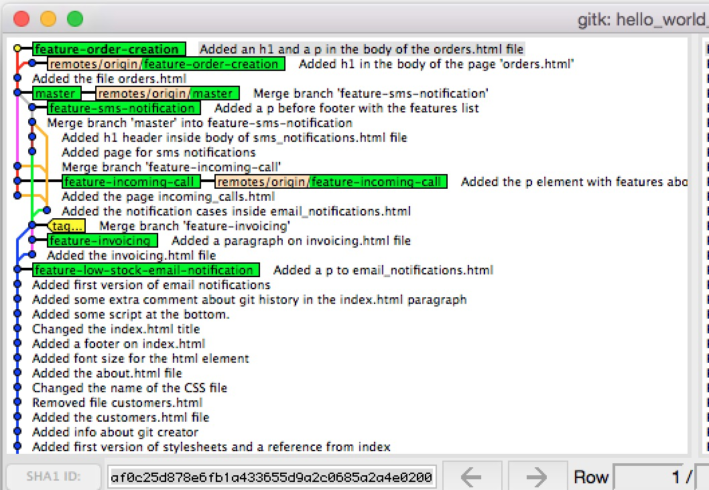

First developer has fetched the changes. Also, he has just read in the message, that there are changes in the remote repo that might conflict with his work on the `feature-order-creation` branch.
Can he preview what are those changes before actually trying to merge those into his work?

One thing that he can do is to execute a diff command that would compare the two branches.

```
git diff feature-order-creation..origin/feature-order-creation
```

This command prints the changes that the developer needs to do in order for the local `feature-order-creation` branch to become equal to the `origin/feature-order-creation` branch. 

The output that he gets is the following:

```
diff --git a/orders.html b/orders.html
index f1281f8..b31cdf6 100644
--- a/orders.html
+++ b/orders.html
@@ -6,9 +6,6 @@
     <title>Orders</title>
   </head>
   <body>
-    <h1>Order Creation</h1>
-    <p>
-      Place your order below:
-    </p>
+    <h1>New Order</h1>
   </body>
 </html>
```

If you read it carefully, it says that in order for the `feature-order-creation` to become equal to `origin/feature-order-creation`, it needs to have 4 lines deleted and 1 line added.


Of course, this might not be exactly how the conflict should be resolved on this particular case. However, this is a way for the developer to see the differences between the two branches
before actually merging the remote branch `origin/feature-order-creation` to `feature-order-creation`.

Another way the developer can inspect the change is by the help of RubyMine. RubyMine has the ability to compare a branch to another. See how in the following video:

<div id="media-title-video-compare-local-branch-to-remote-branch-with-rubymine.mp4-How you can compare branches using RubyMine">How you can compare branches using RubyMine</div>
<a href="https://player.vimeo.com/video/194252263"></a>
           
First developer, having investigated the differences of the new branches and what changes the remote branch is bringing in, he decides to proceed with merging the remote branch changes
in his local branch. He has already decided how to deal with the conflicts.

How do we merge one branch to another? We have learned about the `git merge` command. We should be on the merge destination branch, first, and then we can call the `git merge` command.

> *Note that:* we have also learned about the `git merge --no-ff` command that is suggested to be used when we try to merge a feature branch to master branch in order to not loose the
visual history of the commits. But this is not the case here. Here we are merging things from the same logical branch, i.e. the `feature-order-creation` branch.

So, let's try the `git merge origin/feature-order-creation`, which tells Git to merge the content of the branch `origin/feature-order-creation` to the current branch, which is the `feature-order-creation`
branch.

We are getting the expected output, something that we seen and learned to deal with in the previous chapter:

```
Auto-merging orders.html
CONFLICT (content): Merge conflict in orders.html
Automatic merge failed; fix conflicts and then commit the result.
```

`git` tells us that we have to fix the conflicts and then commit in order to finish with the merge. And, of course, this is not going to be a fast-forward merge. It will be a
non-fast-forward merge and will create a new extra *merge commit* as we call it.

Developer is facing the following inside the `orders.html` file:

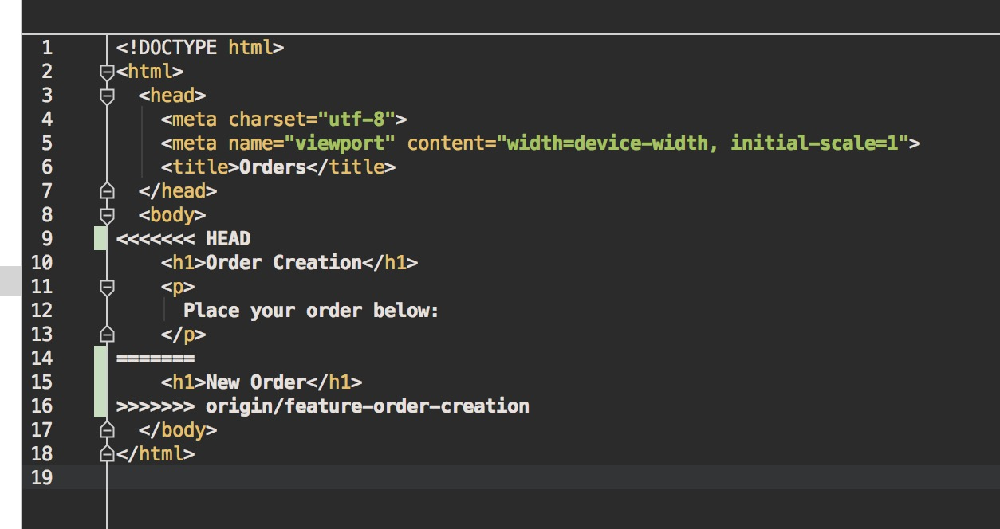

After some coordination with the other developer, they both decide how this file should be. Let's change the content of the `orders.html` file to be:

``` html
<!DOCTYPE html>
<html>
  <head>
    <meta charset="utf-8">
    <meta name="viewport" content="width=device-width, initial-scale=1">
    <title>Orders</title>
  </head>
  <body>
    <h1>New Order</h1>
    <p>
      Place your order below:
    </p>
  </body>
</html>
```

First developer is ready to commit his change. And he does the following:

```
git add orders.html
git commit
```
Since being in the middle of a merge, he just leaves the default merge commit message.

Nice! The first developer has managed to incorporate second developer changes to his changes. 

Load the `gitk` to see the new commit tree picture.

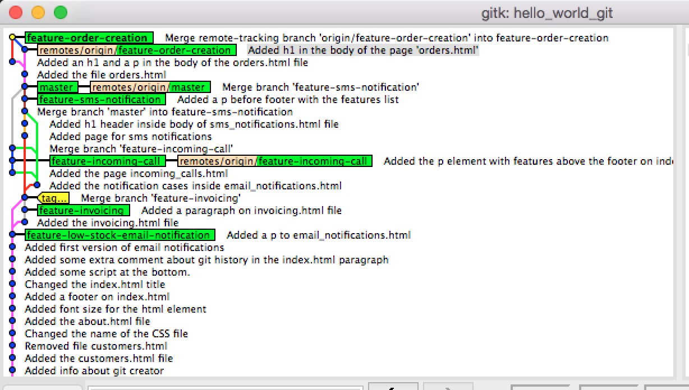

That is good. The tree shows the merging of the remote `feature-order-creation` branch into the local branch. 

### `git rebase`

The workflow that we saw above, is a frequent workflow to see on real projects. However, it has a small
disadvantage. It destroys the visual picture of the history of commits that belong to the same feature branch. It's not linear anymore. This makes it more difficult to read. It may
be acceptable or it may not. Depending on what you have agreed with the rest of the team. In order to avoid that, there is another technique that you can use as a workflow. You can follow
the rule that says: "If you merge changes from same name branches, local and remote ones, then try `git rebase` instead of `git merge`".

The `git rebase` command will
 
1. take all changes made by commits in the current branch (`feature-order-creation`) but are not in source branch (`origin/feature-order-creation`)
and save them in a temporary area.
2. Then it will make the current branch (`feature-order-creation`) equal to the source branch (`origin/feature-order-creation`).
3. Then it will take all the commits that were saved in the temporary area, one by one and in order and will try to apply them, hence building, essentially, the tree of the current
branch (`feature-order-creation`) on top of the source branch (`origin/feature-order-creation`).
4. While the commits are applied, there may be conflicts. In that case, the rebase stops and the developer needs to resolve the conflict, add the resolution to the staging area with
`git add <file resolved>` and then call `git rebase --continue` to continue the rebase and the application of the rest of the commits.

This technique will make sure that the tree of the feature remains linear and will not have merge commits. 

Let's make use of this technique now.

1) As the first developer (`hello_world_git`) do a change on the order.html file. Make sure it has the following content:
``` html
<!DOCTYPE html>
<html>
  <head>
    <meta charset="utf-8">
    <meta name="viewport" content="width=device-width, initial-scale=1">
    <title>Orders</title>
  </head>
  <body>
    <h1>New Order</h1>
    <p>
      Place your order below:
    </p>

    <footer>
    </footer>
  </body>
</html>
```

2) Commit and push these changes to remote repository:
```
git commit -am "Added a footer on orders.html page"
git push origin feature-order-creation
```

3) Switch to second developer workspace (`hello_world_git_2`)

4) Make a similar change to `orders.html` file. Make sure it has the content:
``` html
<!DOCTYPE html>
<html>
  <head>
    <meta charset="utf-8">
    <meta name="viewport" content="width=device-width, initial-scale=1">
    <title>Orders</title>
  </head>
  <body>
    <h1>New Order</h1>
    <footer>
      Copyright &copy; Tech Career Booster
    <footer>
  </body>
</html>
```
Second developer, adds a footer too, before actualy getting the changes of the first developer.

5) Commits his changes:
```
git commit -am "Added a footer on orders.html page with copyright notice"
```

6) Tries to push to remote repository:
```
git push origin feature-order-creation
```
and he gets a rejection, because he has not merged the changes of the first developer that pushed to remote before him.

7) Decides to fetch the remote changes:
```
git fetch
```

8) After inspecting the differences, he decides to proceed with the merge of the changes. But instead of doing a `git merge origin/feature-order-creation`, in order to avoid 
destroying the linear image of the commit tree, he decides to execute the merge with `git rebase`. This is what he does:
```
git rebase origin/feature-order-creation
```
and he gets the following output:
```
First, rewinding head to replay your work on top of it...
Applying: Added a footer on orders.html page with copyright notice
Using index info to reconstruct a base tree...
M       orders.html
Falling back to patching base and 3-way merge...
Auto-merging orders.html
CONFLICT (content): Merge conflict in orders.html
Failed to merge in the changes.
Patch failed at 0001 Added a footer on orders.html page with copyright notice
The copy of the patch that failed is found in:
   /Users/panayotismatsinopoulos/Documents/hello_world_git_2/.git/rebase-apply/patch

When you have resolved this problem, run "git rebase --continue".
If you prefer to skip this patch, run "git rebase --skip" instead.
To check out the original branch and stop rebasing, run "git rebase --abort".
```
which informs him that the rebase has stopped and that he has to resolve a conflict in the file `orders.html`. So, he inspects the conflicts which look like this:
``` html
<!DOCTYPE html>
<html>
  <head>
    <meta charset="utf-8">
    <meta name="viewport" content="width=device-width, initial-scale=1">
    <title>Orders</title>
  </head>
  <body>
    <h1>New Order</h1>
<<<<<<< 696ac5f99747f324a6eb69469a73ced82f3c1c98
    <p>
      Place your order below:
    </p>

    <footer>
    </footer>
=======
    <footer>
      Copyright &copy; Tech Career Booster
    <footer>
>>>>>>> Added a footer on orders.html page with copyright notice
  </body>
</html>
```

9) He finally decides that the correct content of the `orders.html` file should be the following. Update and save the content as follows:
``` html
<!DOCTYPE html>
<html>
  <head>
    <meta charset="utf-8">
    <meta name="viewport" content="width=device-width, initial-scale=1">
    <title>Orders</title>
  </head>
  <body>
    <h1>New Order</h1>
    <p>
      Place your order below:
    </p>

    <footer>
      Copyright &copy; Tech Career Booster
    <footer>
  </body>
</html>
```

10) Now that he is sure how the `orders.html` file should be, he adds his changes to staging area with:
```
git add orders.html
```
and

11) He continues the rebase with:
```
git rebase --continue
```
which applies the last commit
```
Applying: Added a footer on orders.html page with copyright notice
```
and finishes successfully.

Perfect! The second developer merged first developer work without `git merge` but with `git rebase` and made sure that no unnecessary merge commits are created.

Let's have a look at the picture of the tree with `gitk --all`:

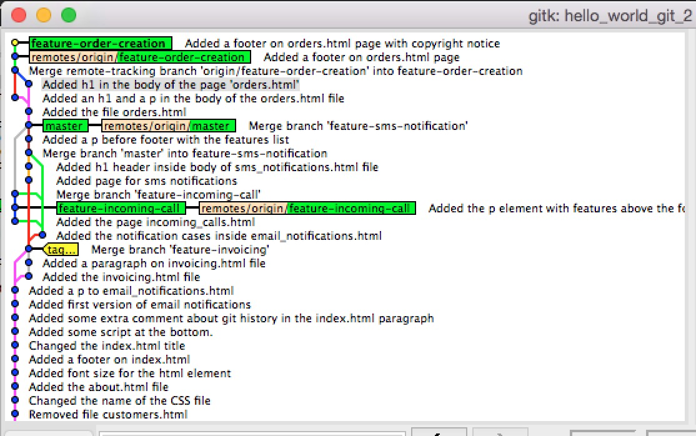

It's very clear that the work that the second developer did with `git rebase` didn't destroy the linear chain of the commits of the tree, like the `git merge` did by the first developer:


### Closing Note

We have gone a long journey with `git`. If you master all the information given to you in this section, you will definitely be very productive when working on a professional project and
being part of a team. `git` is extremely powerful tool and there is a lot more to learn.

Don't forget to.

1. Read the manual pages of `git` for every command that you do not remember how to use. For example, the `man git-tag` will give you the instructions of the `git tag` command.
2. Google for any question that you may have. 99% of the times the answer can be found on StackOverflow.
