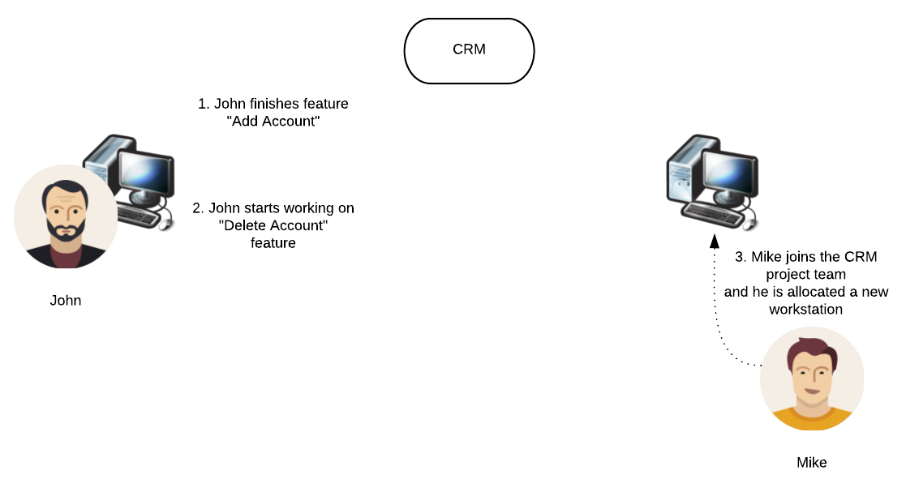
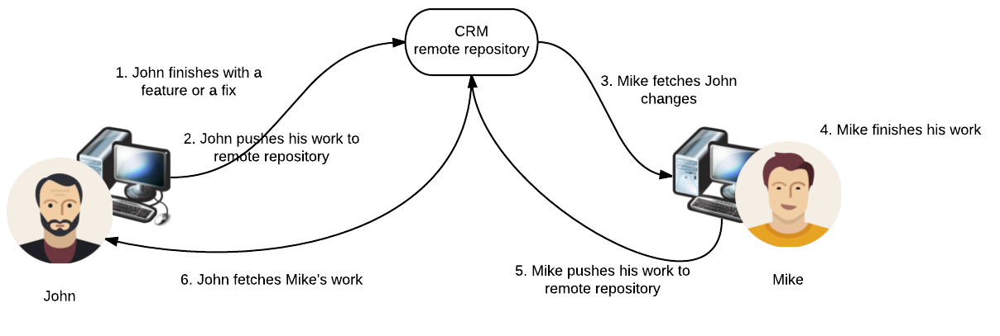
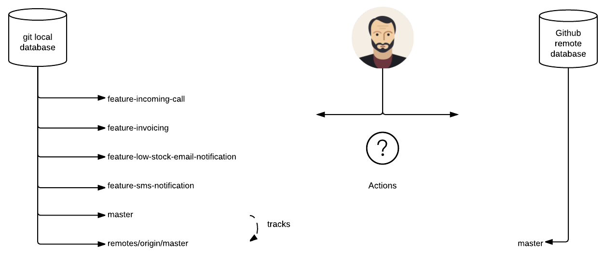
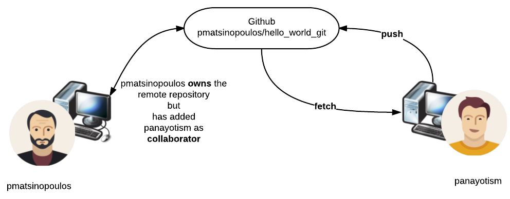

We have learned in the previous chapters all the commands that can make you a productive git user.
But, we have not taught you how you would have to use git in order to collaborate with other 
developers working on the same project.

This is the subject of this chapter.

You will learn how a new developer that joins the project will get the source code of the project and be
ready to work on that.

Also, you will learn the necessary commands that will allow you to exchange code with other developers working on the
same project.

You will create a new account on Github and then a new repository to host your project source code, and to let other
developers work on the same project with you:

You will understand how git helps your local work track the remote work.

And you will learn how the developers take action to synchronize the local with the remote git databases:

You will learn how a repository owner can add another developer as collaborator to his project.

You will finally find ways to resolve the conflicts

that may occur after merging the work of your colleagues. And, actually, you will learn about two techniques on that,
the `git merge` and the `git rebase`. Each one treating your commit tree differently.

