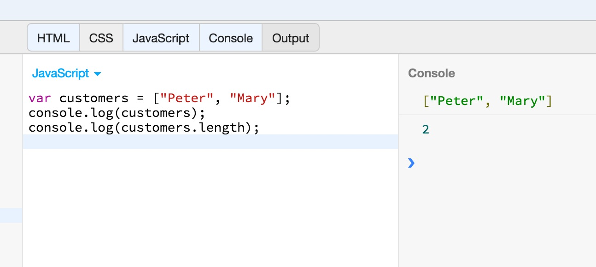
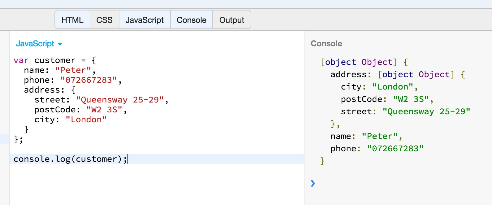
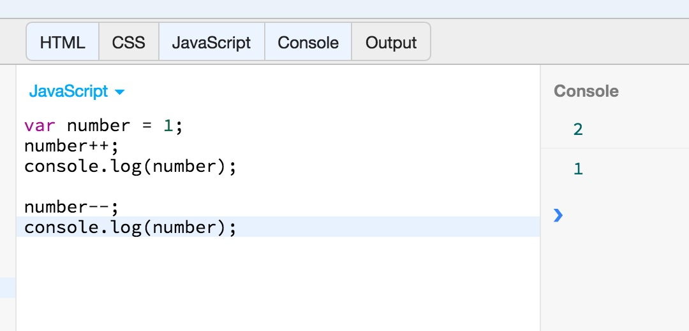
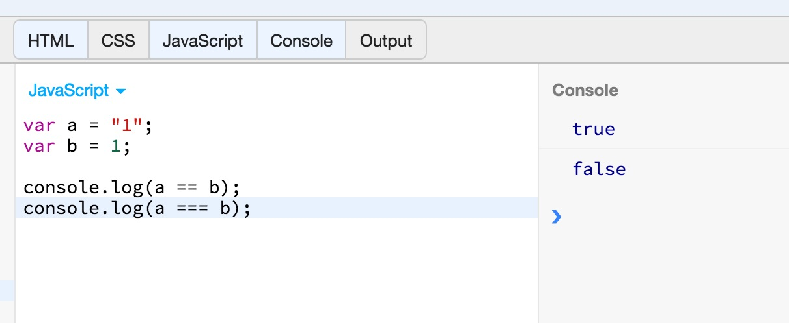
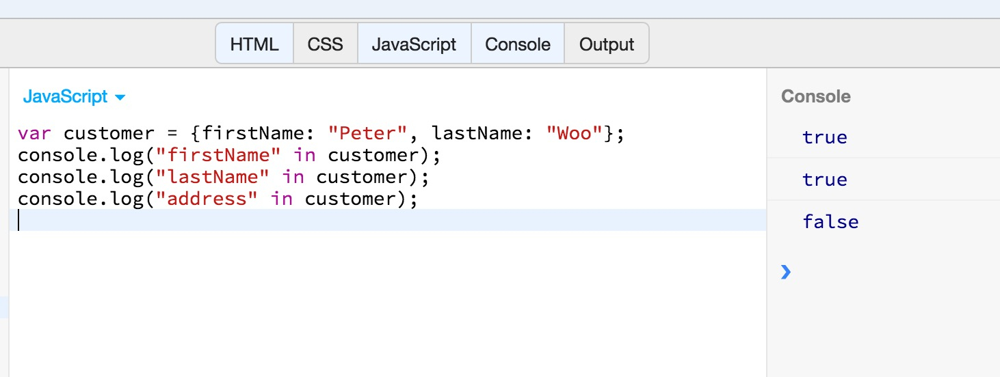

In this chapter we start understanding what a JavaScript expression is. We learn about simple and complex expressions.
Also, we start learning about the various operators. Unary, binary and ternary operators. How they act on their operands
and how they come back with a result of calculation.

For example, you will be in position to initialize an Array and calculate its length.

Or you will learn how to initialize an object with several properties:

Moreover, you will get a first encounter on function definitions and invocation.
 

You will have a first encounter with operators, like pre- and post-increment and decrement operators.

You will understand about the equality and strict equality operators, so that the following would make sense to you:

You will also learn how to compare operands using greater than, greater than or equal, less than or less than or equal operators. Also, you will learn to
check whether a property is part of the properties of an object.

You will also learn to use the boolean operators:

Finally, you will learn how to assign a value of a variable and applying an operator at the same time.

 
