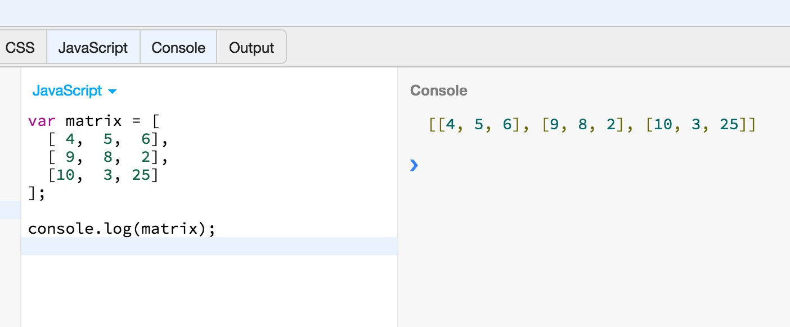
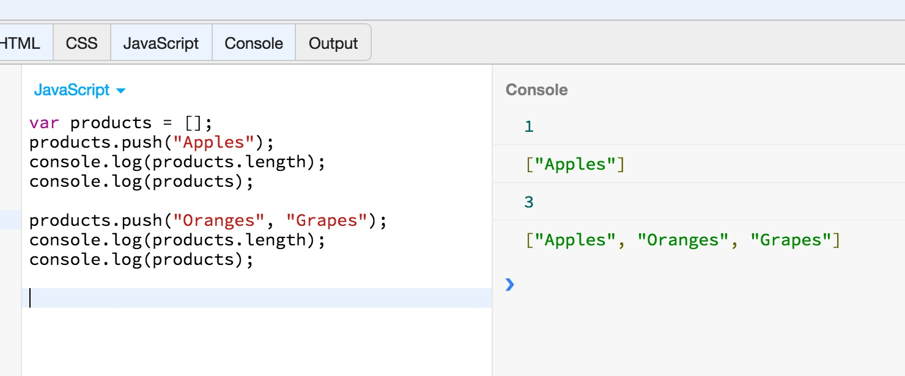

This chapter is going to teach you about one of the most popular programming constructs in JavaScript.
The `Array`. 

Arrays can hold a huge number of elements and JavaScript can be used to carry out operations on each one
of these elements with unconceivable speed. This is where programs and computers show their real power.

You are going to learn how to create arrays. You will also learn how to create multi-dimensional arrays.
An example of such an array is a matrix like this:

You will learn how to access the elements of an array using the `[]` operator.

Then you will learn about various techniques that you can use to add and delete elements from an array. Like, for example, with the use of the `push()` method.

Then you are going to learn about the most popular Array methods. Like, for example, the `slice()` method:

Finally, we are going to teach you how Strings are sometimes treated like Arrays.
