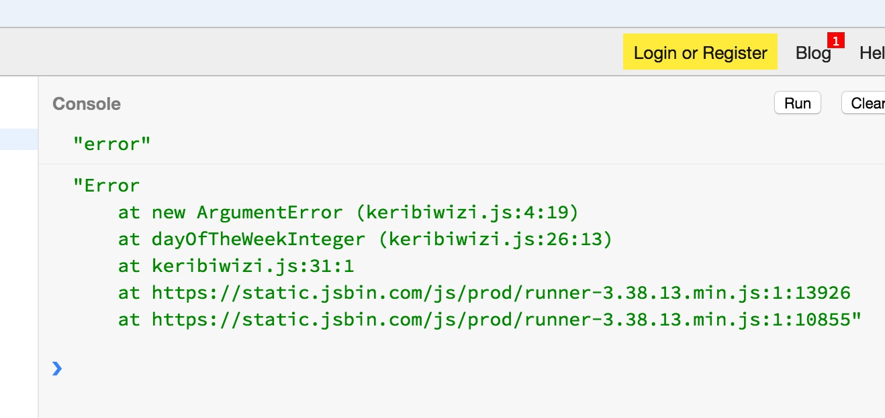

Functions are one very important code reuse tool in every programming language.
You write a piece of programming logic once, and then you can reuse it multiple times
in your program.

You will learn the various ways you can use to define a function and then invoke it.

You will also learn how to define 

* mandatory parameters
* optional parameters
* and variable number of parameters

You will also learn how to pass many arguments wrapping them into an object.

Next, you will learn about recursive functions and how they can be handy to write clean code.

Finally, you will learn how to

* throw errors
* catch errors, and
* throw custom errors like these:

