Methods defined as part of a class definition are being grouped with regards to their visibility or their scope.
In other words, with regards to which other objects can call those methods.

There are the following groups:

1. Public methods.
2. Private methods.
3. Protected methods.

## Public Methods

By default all the methods are public. This means that another object can call those methods without any restriction. See the example `visibility-1.rb` below:

``` ruby
 1. # File: visibility-1.rb
 2. #
 3. class Book
 4.   attr_accessor :title
 5.   
 6.   def initialize(title)
 7.     @title = title
 8.   end
 9. end
10. 
11. class BookStore
12.   def initialize
13.     @books = []
14.   end
15. 
16.   def add(book)
17.     @books << book
18.   end
19. 
20.   def print
21.     @books.each_with_index do |book, index|
22.       puts "(#{index + 1}) #{book.title}"
23.     end
24.   end
25. end
26. 
27. bookstore = BookStore.new
28. bookstore.add(Book.new('Of Mice and Men'))
29. bookstore.print
```

If you run the above program, you will see this:

``` bash
$ ruby visibility-1.rb
(1) Of Mice and Men
$
```

Here, we have two classes and four (basically) object instances.

The classes are:

1. `Book`
2. `BookStore`

The objects are:

1. `main`, which is the main top-level object automatically created by Ruby interpreter.
2. `bookstore`, which is instantiated on line 27.
3. `@books`, which is and `Array` instantiated on line 13.
4. `@books[0]`, which is a `Book` instance, instantiated on line 28 (and assigned to `@books[0]` using the `#add()` method)

The `Book` class has 3 public methods:

1. `#title`, which returns the title of the `Book` instance.
2. `#title=`, which can be used to set the title of a `Book` instance.
3. `#initialize`, which is used to instantiate a `Book` instance.

The `BookStore` class has 3 public methods too:

1. `#initialize`, which is used to instantiate a `BookStore` instance.
2. `#add`, which is used to add a book to the bookstore.
3. `#print`, which is used to print the contents of the bookstore.

The fact that classes have public methods means that other objects can call those methods. In the following diagram you can see
the public method definitions and corresponding public method invocations.


For example, the method `#add` is public and it is called by `main` object on line 28. The method `#print` is public and it is called by the `main` object on line 29.
The method `#title`, of class `Book`, it is public and it is called on line 22 by the object instance `bookstore`. 

## Private Methods

To the other end of the method visibility, one can define some methods of the class to be in the *private* group of methods. In that case, those methods
are only visible to the object instance itself.

Let's see an example (`visibility-2.rb`):

``` ruby
 1. # File: visibility-2.rb
 2. #
 3. class Book
 4.   attr_accessor :title
 5. 
 6.   def initialize(title)
 7.     @title = title
 8.   end
 9. end
10. 
11. class BookStore
12.   def initialize
13.     @books = []
14.   end
15. 
16.   def print
17.     @books.each_with_index do |book, index|
18.       puts "(#{index + 1}) #{book.title}"
19.     end
20.   end
21. 
22.   private
23. 
24.   def add(book)
25.     @books << book
26.   end
27. end
28. 
29. bookstore = BookStore.new
30. bookstore.add(Book.new('Of Mice and Men'))
31. bookstore.print
```

This is the same program as program `visibility-1.rb`. The only difference is that we have moved `#add` method to the
`private` block of methods. The `private` methods are being declared below the `private` statement.
Having the `#add` method being `private`, this means that it cannot longer be called by code that does not belong to this
object itself. Hence, line 30, which is an attempt of the `main` object to call `#add` method on a `BookStore` instance, will
fail. 

If you try to run the above program, you will get this:

``` bash
$ ruby visibility-2.rb
visibility-2.rb:30:in `<main>': private method `add' called for #<BookStore:0x007f9c1c824078 @books=[]> (NoMethodError)
$
```

You can read the error that is being raised. `private method 'add' called for ...`. It also mentions that the error was raised
on line 30. This is where we tried to call the private method `#add`.

## Why Do We Need Private Methods?

Generally, an object should expose only the methods that the users of that object find useful. These methods should be 
made public. All the other methods should become private. The other methods, the private ones, are usually there to ease the implementation
of the public ones. In other words, a complex public method implementation is broken down to smaller pieces, each one carrying out
a small piece of useful function, and implemented as a private function. All those private functions work together to deliver the
public method functionality.

``` ruby
 1. # File: visibility-3.rb
 2. #
 3. class User
 4.   attr_accessor :name, :email
 5. end
 6. 
 7. class UserCreationService
 8.   def initialize(user)
 9.     @user = user
10.   end
11. 
12.   def create
13.     create_on_ldap_db
14.     send_creation_email
15.   end
16. 
17.   private
18. 
19.   def create_on_ldap_db
20.     # ...
21.   end
22.   
23.   def send_creation_email
24.     # ...
25.   end
26. end
```

In the example above, we have broken down the user creation service into two tasks that need to be carried out. One to create the user inside the LDAP database.
The other to send them a creation email. Two tasks have been implemented with two corresponding private methods, but there is only one public method, the `#create` 
method. It may rely on the other two, but the actual implementation is of no concern to the code that will be using this service.

An example usage of this service might be the following piece of code:

``` ruby
user = User.new
user.name = 'Foo Bar'
user.email = 'foo@mailinator.com'

UserCreationService.new(user).create
```

As you can see, for the client code, it is enough to call the `#create` method. Client code does not need to know about the `#create_on_ldap_db` and `#send_creation_email` 
methods. That's why those methods have been grouped as `private`.

## Encapsulation

The idea of hiding the complex implementation details and exposing to client code only the interface, i.e. the methods necessary for the client code to
function and enjoy the services of an object, is called encapsulation.

In other words, an object may have a very complex implementation logic. However, a client code that uses this object only cares about giving some input and getting 
some output from that object.

Public and private methods are helpful tools to allow us apply encapsulation to our class designs. This is because we make sure that client code has access to 
object public methods only, without having direct access to its state, for example.

## Class Inheritance

Another very popular design tool in object oriented programming is class inheritance. Let's consider the following example (`class-inheritance-1.rb`):

``` ruby
 1. # File: class-inheritance-1.rb
 2. #
 3. canvas = Canvas.new(width: 300, height: 300)
 4. 
 5. # Add a circle to the canvas
 6. #
 7. circle = Circle.new(radius: 1.5, center: Point.new(10, 20))
 8. canvas.add(circle)
 9. 
10. # Add a square to the canvas
11. #
12. square = Square.new(top_left: Point.new(30, 100), bottom_right: Point.new(50, 80))
13. canvas.add(square)
14. 
15. # Add a triangle to the canvas
16. #
17. triangle = Triangle.new(first: Point.new(20, 30), second: Point.new(50, 10), third: Point.new(10, 5))
18. canvas.add(triangle)
```

If you try to run this program, you will get an error, because there are missing parts that have not been given to you yet. But, the good thing is that
we do have the client code and by reading it, we can decide how to implement the missing parts.

1. We will need a class `Canvas` that would have an initialize method with the width and height keywords.
2. We will need the three shape classes `Circle`, `Square`, `Triangle`. Each one needs to offer an initializer appropriate to initialize the
shape. 
3. Also, we can see that the `Canvas` class needs to offer a public `instance` method with name `#add` that would allow the client code to add a shape 
onto the canvas.
4. Note that we also need a helping class `Point`. This will allow us to model a Point using `x` and `y` coordinates.

Let's proceed now with the definition of the classes:

``` ruby
 1. # File: canvas.rb
 2. #
 3. class Canvas
 4.   def initialize(width:, height:)
 5.     @width = width
 6.     @height = height
 7.     @shapes = []
 8.   end
 9. 
10.   def add(shape)
11.     @shapes << shape
12.     shape.draw(width: width, height: height)
13.   end
14. 
15.   private
16. 
17.   attr_reader :width, :height
18. end 
```

This is how we model the canvas. Pay attention to its public interface. It is composed of the initializer and the method `#add`. Internally, it 
keeps track of all the shapes in the canvas with the help of an array `@shapes`. Note that `#add` implementation adds the shape given into the
array and then asks the shape to draw itself. Note that canvas does not really know which type of shape is added. All that it cares about
is that the shape exposes a public method `#draw` that takes two keyword arguments, `width` and `height`. Let's keep that until we will
be designing the classes of our shapes.

Note also how we have declared the getters for the two instance variables, `@width` and `@height` as private. This allows both the object
itself to use the getters, but, at the same time, prevents any other, outside world object to access those getters.

Let's proceed now with the implementation of the circle class:

``` ruby
 1. # File: circle.rb
 2. #
 3. class Circle
 4.   def initialize(radius:, center:)
 5.     @radius = radius
 6.     @center = center
 7.   end
 8. 
 9.   def draw(width:, height:)
10.     puts "I am a circle and I will draw myself within the area with width: #{width} and height #{height}"
11.     puts "My radius will be: #{radius} and my center will be: #{center}"
12.   end
13.   
14.   private
15.
16.   attr_reader :radius, :center
17. end
```

This is pretty straightforward. We have a `Circle` class with the initializer and the method `#draw` that takes two keyword arguments. Exactly like
canvas requires. 

Let's proceed with the implementation of the square class:

``` ruby
 1. # File: square.rb
 2. #
 3. class Square
 4.   def initialize(top_left:, bottom_right:)
 5.     @top_left = top_left
 6.     @bottom_right = bottom_right
 7.   end
 8. 
 9.   def draw(width:, height:)
10.     puts "I am a square and I will draw myself within the area with width: #{width} and height #{height}"
11.     puts "My top left corner is #{top_left} and my bottom right corner is #{bottom_right}"
12.   end
13. 
14.   private
15.
16.   attr_reader :top_left, :bottom_right
17. end
```

This does not differ too much from the `Circle` class. It has the public method `#draw` that takes the two arguments `width` and `height`.

And the `Triangle` class:

``` ruby
 1. # File: triangle.rb
 2. #
 3. class Triangle
 4.   def initialize(first:, second:, third:)
 5.     @first = first
 6.     @second = second
 7.     @third = third
 8.   end
 9.   
10.   def draw(width:, height:)
11.     puts "I am a triangle and I will draw myself within the area with width: #{width} and height #{height}"
12.     puts "My first point is #{first}, my second point is #{second} and my third point is #{third}"
13.   end
14.
14.   private
15.
16.   attr_reader :first, :second, :third
17. end
```

Similar implementation for the `Triangle` class.

Finally, the `Point` class.

``` ruby
 1. # File: point.rb
 2. #
 3. class Point
 4.   attr_accessor :x, :y
 5. 
 6.   def initialize(x, y)
 7.     @x = x
 8.     @y = y
 9.   end
10. end
```

Now, if we try to run the program `class-inheritance-1.rb` we will get this:

``` bash
$ ruby class-inheritance-1.rb
class-inheritance-1.rb:3:in `<main>': uninitialized constant Canvas (NameError)
$
```

which means that the program does not know about the `Canvas` class. Actually, the program does not know about any of the necessary classes. Let's add 
the `require` commands that will bring those definitions in (`class-inheritance-2.rb`):

``` ruby
 1. # File: class-inheritance-2.rb
 2. #
 3. $LOAD_PATH << '.'
 4. 
 5. require 'point'
 6. require 'circle'
 7. require 'square'
 8. require 'triangle'
 9. require 'canvas'
10. 
11. canvas = Canvas.new(width: 300, height: 300)
12. 
13. # Add a circle to the canvas
14. #
15. circle = Circle.new(radius: 1.5, center: Point.new(10, 20))
16. canvas.add(circle)
17. 
18. # Add a square to the canvas
19. #
20. square = Square.new(top_left: Point.new(30, 100), bottom_right: Point.new(50, 80))
21. canvas.add(square)
22. 
23. # Add a triangle to the canvas
24. #
25. triangle = Triangle.new(first: Point.new(20, 30), second: Point.new(50, 10), third: Point.new(10, 5))
26. canvas.add(triangle)
```

Now, if you run the program, it will run successfully:

``` bash
$ ruby class-inheritance-2.rb
I am a circle and I will draw myself within the area with width: 300 and height 300
My radius will be: 1.5 and my center will be: #<Point:0x007fbbd4037e28>
I am a square and I will draw myself within the area with width: 300 and height 300
My top left corner is #<Point:0x007fbbd40374a0> and my bottom right corner is #<Point:0x007fbbd4037450>
I am a triangle and I will draw myself within the area with width: 300 and height 300
My first point is #<Point:0x007fbbd4036dc0>, my second point is #<Point:0x007fbbd4036cf8> and my third point is #<Point:0x007fbbd4036c58>
$
```

Nice. So far so good. The point here is that our code has some duplication that we wouldn't like to be there. Look at the `#draw` methods
on all shapes. The first thing that they do is that they all print a similar message. This is their type and the area dimensions:

The `Circle`:

``` ruby
puts "I am a circle and I will draw myself within the area with width: #{width} and height #{height}"
```

The `Square`:

``` ruby
puts "I am a square and I will draw myself within the area with width: #{width} and height #{height}"
```

The `Triangle`:

``` ruby
puts "I am a triangle and I will draw myself within the area with width: #{width} and height #{height}"
```

Here is where inheritance comes into play. We can factor out this piece of code into a method that would be implemented only once, inside
a common class. Then we will tell that our shapes, `Circle`, `Square` and `Triangle` will take this functionality ready from that class
with the technique of the inheritance.

Let's call that class `Shape`. We will make our concrete shape classes to be *sub-classes* of that `Shape` class. Or, in other words,
we will make `Shape` be the super-class of our concrete classes. This is how we draw this relationship:


> *Information*: Watch out for the hollow arrow end pointing the super-class. This is how we draw inheritance in [UML](http://www.uml.org/)
 
Again, we are going to put inside the `Shape` class the common functionality. This is going to be extracted from the concrete shape classes. Let's do it:

``` ruby
1. # File: shape.rb
2. #
3. class Shape
4.   def draw_type_and_dimensions(width:, height:)
5.    puts "I am a circle and I will draw myself within the area with width: #{width} and height #{height}"
6.  end
7. end
```

And the concrete shape classes are now as follows:

The `Circle`:

``` ruby
 1. # File: circle.rb
 2. #
 3. class Circle < Shape
 4.   def initialize(radius:, center:)
 5.     @radius = radius
 6.     @center = center
 7.   end
 8. 
 9.   def draw(width:, height:)
10.     draw_type_and_dimensions(width: width, height: height)
11.     puts "My radius will be: #{radius} and my center will be: #{center}"
12.   end
13. 
14.   private
15.
16.   attr_reader :radius, :center
17. end
```

What are the differences to the original `circle.rb` file? The main difference is the `class Circle < Shape` on line 3. This is the way to tell
that `Circle` class is now a sub-class of `Shape`. Hence, it derives all the attributes and methods of the `Shape`. Having done that, this means
that `Circle` now has an instance method `#draw_type_and_dimensions` inherited from the `Shape` class. That's why it can invoke this method on
line 10.


Similarly, we change the implementation of the other concrete shapes:

The `Square`:

``` ruby
 1. # File: square.rb
 2. #
 3. class Square < Shape
 4.   def initialize(top_left:, bottom_right:)
 5.     @top_left = top_left
 6.     @bottom_right = bottom_right
 7.   end
 8. 
 9.   def draw(width:, height:)
10.     draw_type_and_dimensions(width: width, height: height)
11.     puts "My top left corner is #{top_left} and my bottom right corner is #{bottom_right}"
12.   end
13. 
14.   private
15.
16.   attr_reader :top_left, :bottom_right
17. end
```

And the `Triangle`:

``` ruby
 1. # File: triangle.rb
 2. #
 3. class Triangle < Shape
 4.   def initialize(first:, second:, third:)
 5.     @first = first
 6.     @second = second
 7.     @third = third
 8.   end
 9. 
10.   def draw(width:, height:)
11.     draw_type_and_dimensions(width: width, height: height)
12.     puts "My first point is #{first}, my second point is #{second} and my third point is #{third}"
13.   end
14. 
15.   private
16.
17.   attr_reader :first, :second, :third
18. end
```

We need to make sure, though, that `shape.rb` file is required by the main file. This is the version `class-inheritance-3.rb`:

``` ruby
 1. # File: class-inheritance-3.rb
 2. #
 3. $LOAD_PATH << '.'
 4. 
 5. require 'point'
 6. require 'shape'
 7. require 'circle'
 8. require 'square'
 9. require 'triangle'
10. require 'canvas'
11. 
12. canvas = Canvas.new(width: 300, height: 300)
13. 
14. # Add a circle to the canvas
15. #
16. circle = Circle.new(radius: 1.5, center: Point.new(10, 20))
17. canvas.add(circle)
18. 
19. # Add a square to the canvas
20. #
21. square = Square.new(top_left: Point.new(30, 100), bottom_right: Point.new(50, 80))
22. canvas.add(square)
23. 
24. # Add a triangle to the canvas
25. #
26. triangle = Triangle.new(first: Point.new(20, 30), second: Point.new(50, 10), third: Point.new(10, 5))
27. canvas.add(triangle)
```

You can now see that on line 6 we require the file `shape.rb`. Let's run this version of the program now:

``` bash
$ ruby class-inheritance-3.rb
I am a circle and I will draw myself within the area with width: 300 and height 300
My radius will be: 1.5 and my center will be: #<Point:0x007fdcd282ea40>
I am a circle and I will draw myself within the area with width: 300 and height 300
My top left corner is #<Point:0x007fdcd282e0b8> and my bottom right corner is #<Point:0x007fdcd282e040>
I am a circle and I will draw myself within the area with width: 300 and height 300
My first point is #<Point:0x007fdcd282d190>, my second point is #<Point:0x007fdcd282d000> and my third point is #<Point:0x007fdcd282cfb0>
$
```

Everything seems to be almost correct. There is a small problem. The problem is that each shape tells that it is a circle! Do you see that?
```
I am a circle and I ...
```
3 times printed.

This is because the command that prints this line of output is now inside the `Shape` class, copied from the original `circle.rb` file.
This needs to be changed and customized differently for each one of the shapes. How can we do that?

One way we can do that is to have a method on each concrete shape telling us its type. Then, inside `Shape` we would call that method.
In other words, we want the `Shape` class to be like this:

``` ruby
1. # File: shape.rb
2. #
3. class Shape
4.   def draw_type_and_dimensions(width:, height:)
5.     puts "I am a #{what_am_i} and I will draw myself within the area with width: #{width} and height #{height}"
6.   end
7. end
```

Do you see the small change on line 5? Instead of hard coding a type, we are calling a method with name `what_am_i`. We expect this method
to return back the actual type of each shape. The class `Shape` does not implement this method. But we don't really care about it. We will 
never call method `#draw_type_and_dimensions` on a `Shape` instance, and, by consequence, neither `#what_am_i`. We always call 
`#draw_type_and_dimensions` on instances of concrete shapes, i.e. `Circle` or `Square` or `Triangle` instances. So, it is these classes that
need to have the `#what_am_i` method implemented. 

First, let's enhance the `Circle` method to have this method:
 
``` ruby
 1. # File: circle.rb
 2. #
 3. class Circle < Shape
 4.   def initialize(radius:, center:)
 5.     @radius = radius
 6.     @center = center
 7.   end
 8. 
 9.   def draw(width:, height:)
10.     draw_type_and_dimensions(width: width, height: height)
11.     puts "My radius will be: #{radius} and my center will be: #{center}"
12.   end
13. 
14.   def what_am_i
15.     'Circle'
16.   end
17. 
18.   private
19. 
20.   attr_reader :radius, :center
21. end
```

The new version of `circle.rb` has the method `#what_am_i` implemented. It returns the type of the instance, or, in other words, the class name of the instance, i.e. `"Circle"`. 

Let's do the similar enhancement on the other two shapes:

The `Square`:

``` ruby
 1. # File: square.rb
 2. #
 3. class Square < Shape
 4.   def initialize(top_left:, bottom_right:)
 5.     @top_left = top_left
 6.     @bottom_right = bottom_right
 7.   end
 8. 
 9.   def draw(width:, height:)
10.     draw_type_and_dimensions(width: width, height: height)
11.     puts "My top left corner is #{top_left} and my bottom right corner is #{bottom_right}"
12.   end
13. 
14.   def what_am_i
15.     'Square'
16.   end
17.   
18.   private
19. 
20.   attr_reader :top_left, :bottom_right
21. end
```

And the `Triangle`:

``` ruby
 1. # File: triangle.rb
 2. #
 3. class Triangle < Shape
 4.   def initialize(first:, second:, third:)
 5.     @first = first
 6.     @second = second
 7.     @third = third
 8.   end
 9. 
10.   def draw(width:, height:)
11.     draw_type_and_dimensions(width: width, height: height)
12.     puts "My first point is #{first}, my second point is #{second} and my third point is #{third}"
13.   end
14. 
15.   def what_am_i
16.     'Triangle'
17.   end
18.   
19.   private
20.   
21.   attr_reader :first, :second, :third
22. end
```

If we save this and we run the program `class-inheritance-3.rb`, then we will get this:

``` bash
$ ruby class-inheritance-3.rb
I am a Circle and I will draw myself within the area with width: 300 and height 300
My radius will be: 1.5 and my center will be: #<Point:0x007fa0db827610>
I am a Square and I will draw myself within the area with width: 300 and height 300
My top left corner is #<Point:0x007fa0db826e40> and my bottom right corner is #<Point:0x007fa0db826df0>
I am a Triangle and I will draw myself within the area with width: 300 and height 300
My first point is #<Point:0x007fa0db826468>, my second point is #<Point:0x007fa0db826378> and my third point is #<Point:0x007fa0db826260>
$
```

Bingo! Now each shape prints the correct message. `I am a Circle and ...` for the `Circle` instance, `I am a Square and ...` for the `Square` 
instance and so on.

What we have done here is that we have applied the *polymorphism* technique. This essentially means that the actual implementation of a method is
not known at the time that we actually write the code that calls a method, but it is known only at the moment the actual call will take place,
and it might be different according to the actual receiver/object instance this method is called on.

## `self.class`

Let's do one more improvement to our shapes program above. We can notice that the `#what_am_i` methods return the class name of the object
instance they are called on. Ruby provides an easy way we can do that. This is the method `#class` that one can call on `self`. So, let's
change the implementation of `#what_am_i` methods to be implemented using this property of `self`.

If we go to all three concrete shape classes, `Circle`, `Square` and `Triangle` and replace the `#what_am_i` implementation with this:

``` ruby
def what_am_i
  self.class
end
```

then we will end up with all the concrete classes to have the same implementation. This means that we can move that to the parent, super-class.
Let's do that then. We will remove the `#what_am_i` implementations from the concrete classes and we will add one in the `Shape` class. This will
be inherited to the sub-classes thanks to the inheritance.

Hence, we have, the latest version of `Circle` to be:

``` ruby
 1. # File: circle.rb
 2. #
 3. class Circle < Shape
 4.   def initialize(radius:, center:)
 5.     @radius = radius
 6.     @center = center
 7.   end
 8. 
 9.   def draw(width:, height:)
10.     draw_type_and_dimensions(width: width, height: height)
11.     puts "My radius will be: #{radius} and my center will be: #{center}"
12.   end
13. 
14.   private
15. 
16.   attr_reader :radius, :center
17. end
```

The `Square`:

``` ruby
 1. # File: square.rb
 2. #
 3. class Square < Shape
 4.   def initialize(top_left:, bottom_right:)
 5.     @top_left = top_left
 6.     @bottom_right = bottom_right
 7.   end
 8. 
 9.   def draw(width:, height:)
10.     draw_type_and_dimensions(width: width, height: height)
11.     puts "My top left corner is #{top_left} and my bottom right corner is #{bottom_right}"
12.   end
13. 
14.   private
15. 
16.   attr_reader :top_left, :bottom_right
17. end
```

The `Triangle`:

``` ruby
 1. # File: triangle.rb
 2. #
 3. class Triangle < Shape
 4.   def initialize(first:, second:, third:)
 5.     @first = first
 6.     @second = second
 7.     @third = third
 8.   end
 9. 
10.   def draw(width:, height:)
11.     draw_type_and_dimensions(width: width, height: height)
12.     puts "My first point is #{first}, my second point is #{second} and my third point is #{third}"
13.   end
14. 
15.   private
16. 
17.   attr_reader :first, :second, :third
18. end
```

and the `Shape` which now has the `#what_am_i`:

``` ruby
 1. # File: shape.rb
 2. #
 3. class Shape
 4.   def draw_type_and_dimensions(width:, height:)
 5.     puts "I am a #{what_am_i} and I will draw myself within the area with width: #{width} and height #{height}"
 6.   end
 7. 
 8.   def what_am_i
 9.     self.class
10.   end
11. end
```

Now, if you run the program `class-inheritance-3.rb` you will get exactly the same results:

``` bash
$ ruby class-inheritance-3.rb
I am a Circle and I will draw myself within the area with width: 300 and height 300
My radius will be: 1.5 and my center will be: #<Point:0x007faa0b02c788>
I am a Square and I will draw myself within the area with width: 300 and height 300
My top left corner is #<Point:0x007faa0b02ee20> and my bottom right corner is #<Point:0x007faa0b02f398>
I am a Triangle and I will draw myself within the area with width: 300 and height 300
My first point is #<Point:0x007faa0b027530>, my second point is #<Point:0x007faa0b0274e0> and my third point is #<Point:0x007faa0b027490>
$
```

## `#to_s`

So far so good. Another thing that we can improve here is how a `Point` instance is being printed on the console output. Currently, we get something like this:

``` bash
#<Point:0x007faa0b02c788>
```

This is the object id, i.e. a unique number for the object allocated in RAM for the particular `Point` instance. Instead, we would like to see the actual point 
coordinates, `x` and `y` values. How can we do that?

Look for example how the `Circle` prints the message:

``` ruby
puts "My radius will be: #{radius} and my center will be: #{center}"
```

The `#{center}` string interpolation is responsible for printing the center point. We could change that to `#{center.inspect}` instead. Try that and run
the `class-inheritance-3.rb` program again. You will get this for the circle:

``` bash
...
My radius will be: 1.5 and my center will be: #<Point:0x007fa1e082ca88 @x=10, @y=20>
...
```
which is much better than before. But, it still has the verbosity that we wouldn't like to see here. Also, it requires to add the `#inspect` method every time
we want to interpolate the point representation into a string. If we go with that, we will have to add this call to `#inspect` to every point that we print,
inside the `Square` and inside the `Triangle` too. 

Is there a way to avoid that? To just tell `Point` class that whenever we want to print a `Point` instance to be converted to a nice human readable string
representation? 

Yes, there is and it is called `#to_s`. We need to implement the public instance method `#to_s` at the `Point` level and define it to return the string
representation that we want.

``` ruby
 1. # File: point.rb
 2. #
 3. class Point
 4.   attr_accessor :x, :y
 5. 
 6.   def initialize(x, y)
 7.     @x = x
 8.     @y = y
 9.   end
10. 
11.   def to_s
12.     "(x = #{x}, y = #{y})"
13.   end
14. end
```

As you can read on the code above, on line 11, we define the instance method `#to_s`. This is automatically called by Ruby interpreter when interpolating a variable
inside a double quoted string. **You don't have to call it** explicitly (although it will not harm).

Now, if you run the `class-inheritance-3.rb` program, you will get this:

``` bash
$ ruby class-inheritance-3.rb
I am a Circle and I will draw myself within the area with width: 300 and height 300
My radius will be: 1.5 and my center will be: (x = 10, y = 20)
I am a Square and I will draw myself within the area with width: 300 and height 300
My top left corner is (x = 30, y = 100) and my bottom right corner is (x = 50, y = 80)
I am a Triangle and I will draw myself within the area with width: 300 and height 300
My first point is (x = 20, y = 30), my second point is (x = 50, y = 10) and my third point is (x = 10, y = 5)
$
```

Great! With a method definition inside the `Point` class with name `#to_s`, all the points in our program are interpolated with the same
format. E.g. `(x = 10, y = 20)`.

## Tune Visibility

Back to the visibility of methods subject, I believe that we need to tweak the visibility of some methods.
In fact, in `Shape` class we have defined two methods as `public`:

1. `draw_type_and_dimensions`
2. `what_am_i`

Do they have to be public? No, they don't. There is not external object calling these methods on a `Shape` (or sub-class) object.
We can flag them as private. This is the new version of the `Shape` class:

``` ruby
 1. # File: shape.rb
 2. #
 3. class Shape
 4.   private
 5.   
 6.   def draw_type_and_dimensions(width:, height:)
 7.     puts "I am a #{what_am_i} and I will draw myself within the area with width: #{width} and height #{height}"
 8.   end
 9. 
10.   def what_am_i
11.     self.class
12.   end
13. end
```

That's it. Now, if you run the program `class-inheritance-3.rb`, you will get again the same results.

## `super` and method overriding

Let's proceed to another idea that is related to classes and inheritance. Have a look at the `#draw` implementation of the
`Circle` class:
 
``` ruby
def draw(width:, height:)
  draw_type_and_dimensions(width: width, height: height)
  puts "My radius will be: #{radius} and my center will be: #{center}"
end 
```

If you look more carefully, the method signature of `#draw` is the same as the method signature of `#draw_type_and_dimensions`.
They both take two keyword arguments, `width` and `height`. In that case, we can save some typing by doing the following:

1. We will rename the `Shape#draw_type_and_dimensions` method to have the name `#draw`.
2. The `Circle#draw` method will call the `#draw` method on the super class definition, i.e. on the `Shape` class definition.

Here is the new version of `Shape`:

``` ruby
 1. # File: shape.rb
 2. #
 3. class Shape
 4.   private
 5. 
 6.   def draw(width:, height:)
 7.     puts "I am a #{what_am_i} and I will draw myself within the area with width: #{width} and height #{height}"
 8.   end
 9. 
10.   def what_am_i
11.     self.class
12.   end
13. end
```

The only difference being the rename of the `#draw_type_and_dimensions` method to `#draw` method.

And this is the new version of `Circle` class:

``` ruby
 1. # File: circle.rb
 2. #
 3. class Circle < Shape
 4.   def initialize(radius:, center:)
 5.     @radius = radius
 6.     @center = center
 7.   end
 8. 
 9.   def draw(width:, height:)
10.     super
11.     puts "My radius will be: #{radius} and my center will be: #{center}"
12.   end
13. 
14.   private
15. 
16.   attr_reader :radius, :center
17. end
```

As you can see, the difference being on line 10. Instead of calling a method that we inherit from the super class `Shape`, we
are calling the method `super`. The `super` calls the current method but with the superclass implementation. Hence, `super` on
line 10 calls the method `#draw` but with the superclass, i.e. the `Shape` class implementation.

Before we try to run the program again, we will need to carry out the same change to the other two shapes, i.e. to `Square` and
to `Triangle`. 

This is the `Square`:

``` ruby
 1. # File: square.rb
 2. #
 3. class Square < Shape
 4.   def initialize(top_left:, bottom_right:)
 5.     @top_left = top_left
 6.     @bottom_right = bottom_right
 7.   end
 8. 
 9.   def draw(width:, height:)
10.     super
11.     puts "My top left corner is #{top_left} and my bottom right corner is #{bottom_right}"
12.   end
13. 
14.   private
15. 
16.   attr_reader :top_left, :bottom_right
17. end
```

This is the `Triangle`:

``` ruby
 1. # File: triangle.rb
 2. #
 3. class Triangle < Shape
 4.   def initialize(first:, second:, third:)
 5.     @first = first
 6.     @second = second
 7.     @third = third
 8.   end
 9. 
10.   def draw(width:, height:)
11.     super
12.     puts "My first point is #{first}, my second point is #{second} and my third point is #{third}"
13.   end
14. 
15.   private
16. 
17.   attr_reader :first, :second, :third
18. end
```

If you now run the same program again, `class-inheritance-3.rb` you will get exactly the same results.


### Calling `super()`

When calling `super` you need to be aware of the following:

1. When you just call `super` with no arguments, all the arguments that were sent to the calling method are being sent to `super` call to.
2. When you call `super()`, i.e. `super` with empty curved braces, then you are calling the super class same name method without giving any arguments. This is
necessary if the super class method does not take arguments, whereas the subclass method does.
3. You can definitely call `super(....)` giving arguments and then this will call the same method on the super class passing the arguments that you give.
This is necessary if the superclass method takes different arguments from the current method.

This is an example of the 2nd case above (`super-with-no-arguments.rb`):

``` ruby
 1. # File: super-with-no-arguments.rb
 2. #
 3. class MyClass
 4.   def foo
 5.     'Hello'
 6.   end
 7. end
 8. 
 9. class MySubClass < MyClass
10.   def foo(name)
11.     "#{super()} #{name}"
12.   end
13. end
14. 
15. my_sub_class = MySubClass.new
16. puts my_sub_class.foo('John')
```

If you run this program, you will see this:

``` bash
$ ruby super-with-no-arguments.rb
Hello John
$
```

You can see that on line 11, it calls `super()`. If you remove the `()` suffix and try to run the program, you will get this:

``` ruby
super-with-no-arguments.rb:4:in `foo': wrong number of arguments (1 for 0) (ArgumentError)
        from super-with-no-arguments.rb:11:in `foo'
        from super-with-no-arguments.rb:16:in `<main>'
```
This is because with missing `()`, the `super` is calling the superclass method implementation, giving as argument the `name`, i.e.
the same argument as the actual current method `foo` was called with. But this is wrong, because the superclass method implementation
does not accept any argument.

The following example is an example of the 3rd case above (`super-with-arguments.rb`):

``` ruby
 1. # File: super-with-arguments.rb
 2. #
 3. class MyClass
 4.   def foo(first_name, last_name)
 5.     "Hello #{first_name} #{last_name}"
 6.   end
 7. end
 8. 
 9. class MySubClass < MyClass
10.   def foo(name)
11.     first_name, last_name = name.split
12.     "#{super(first_name, last_name)}"
13.   end
14. end
15. 
16. my_sub_class = MySubClass.new
17. puts my_sub_class.foo('John Smith')
```

As you can see, on line 12, we are calling the `#foo` defined in the superclass. That `#foo` takes two arguments, whereas the `#foo` in
subclass takes one argument. 

## Shapes: UML Class Diagram

Returning back to the shapes model, let's visually see what we have done so far:

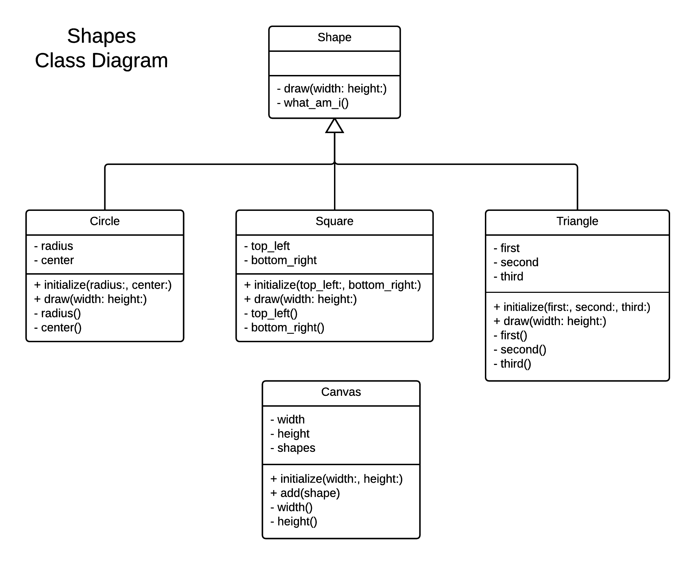

The above is the [UML](http://www.uml.org) *class diagram* for the Shapes program that we have developed above. Class diagrams show the static model of your
application. Here are some details that you may want to pay attention too.

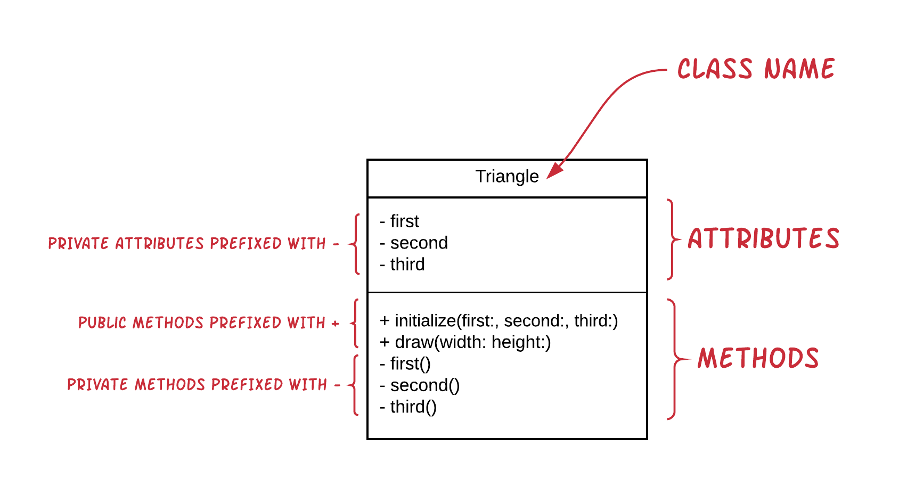

As you can see from the above picture:

* The class box is divided into three parts. The top one contains the class name. The next is the part that contains the attributes and the last one is the one that contains the methods.
* The private attributes and methods are prefixed with the symbol `-`, whereas the public ones are prefixed with the symbol `+`

Something that is not depicted on this example above has to do with the class variables/attributes and class methods. If a class has such properties, these are 
recorded on the corresponding box using an underlined font. Here is an example (`Square` class) that includes both instance and class level properties:

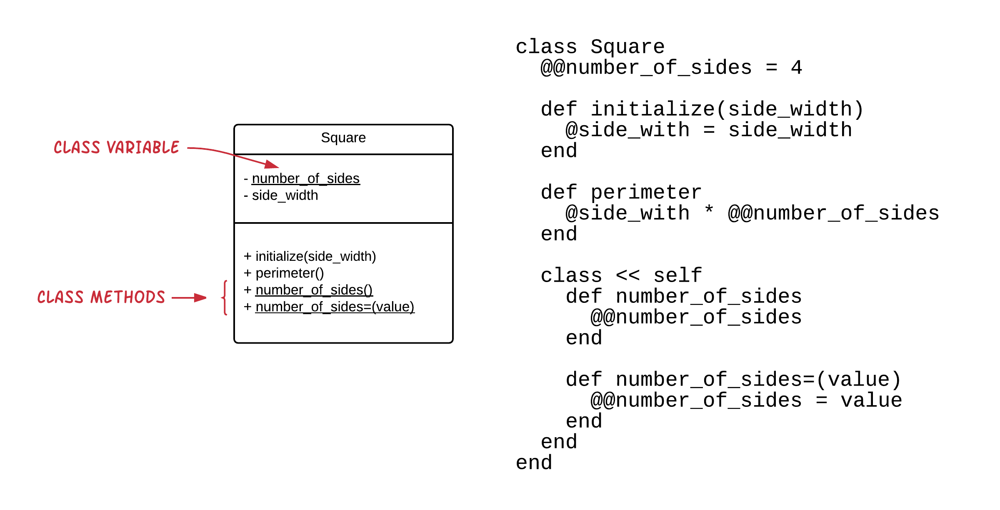

You can see, on the above picture, how the class-level properties are denoted with an underline font. 

## Shapes: UML Sequence Diagram

Another very useful UML diagram, is the sequence diagram. It shows a more dynamic view of your design, since it depicts the interaction of your objects and which
messages are being exchanged.

Here is the sequence of messages exchanged in the `class-inheritance-3.rb` program (up to the point where the `circle` is added to the canvas). 

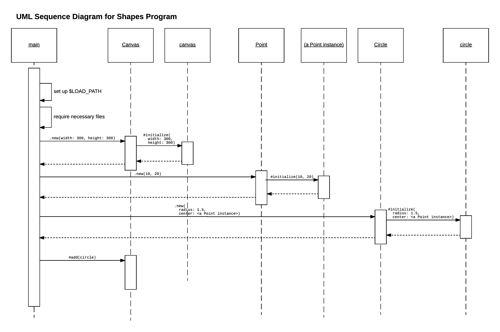

You need to be comfortable both building and reading such diagrams. They will be very useful to your software engineering career. Here are some
details that you need to pay attention to:

(1) This diagram shows method calls. You can see the caller object and the called object.

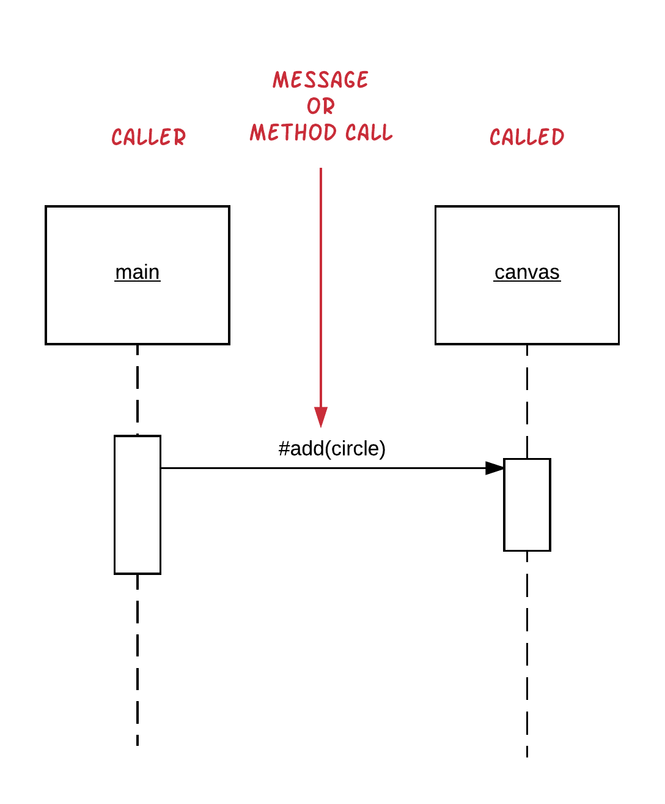

(2) When the caller is interested in the return value of a method call, and is using that to next calls, we indicate that with a dotted arrow going back from the 
called to the caller object.


There are other artefacts that you can use on UML sequence diagrams, but these are out of the scope of this chapter. We will delve into UML in another chapter later on.

## Inheriting from a Sub-Class

The inheritance of a class from another is not limited only on one level of inheritance. This means that a class may inherit from another class that inherits from
another class too.

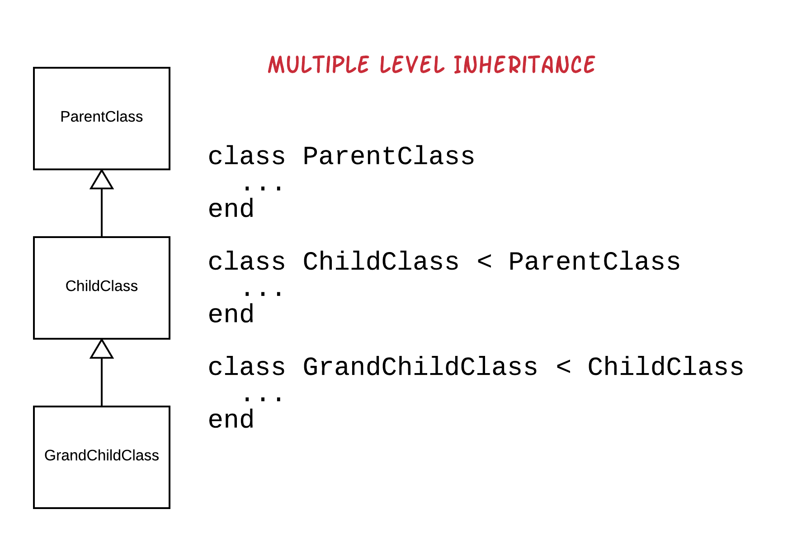

Look at the picture above. class `GrandChildClass` derives from `ChildClass` and, `ChildClass` derives from `ParentClass`. 

This of course means that a method defined inside `ParentClass` is inherited to `ChildClass` and to `GrandChildClass`.

Let's now see some methods that Ruby provides and give us information about our object instance classes. Look at the following example (`inheriting-from-subclass.rb`):
 
``` ruby
 1. # File: inheriting-from-subclass.rb
 2. #
 3. class Parent
 4. end
 5. 
 6. class Child < Parent
 7. end
 8. 
 9. class GrandChild < Child
10. end
11. 
12. parent = Parent.new
13. child = Child.new
14. grand_child = GrandChild.new
15. 
16. [parent, child, grand_child].each do |instance|
17.   puts "Information about #{instance.class} instance: "
18.   puts "...class: #{instance.class}"
19.   puts "...superclass: #{instance.class.superclass}"
20.   puts "...is_a?(Parent): #{instance.is_a?(Parent)}"
21.   puts "...is_a?(Child): #{instance.is_a?(Child)}"
22.   puts "...is_a?(GrandChild): #{instance.is_a?(GrandChild)}"
23.   puts "..."
24.   puts "...kind_of?(Parent): #{instance.kind_of?(Parent)}"
25.   puts "...kind_of?(Child): #{instance.kind_of?(Child)}"
26.   puts "...kind_of?(GrandChild): #{instance.kind_of?(GrandChild)}"
27.   puts "..."
28.   puts "...instance_of?(Parent): #{instance.instance_of?(Parent)}"
29.   puts "...instance_of?(Child): #{instance.instance_of?(Child)}"
30.   puts "...instance_of?(GrandChild): #{instance.instance_of?(GrandChild)}"
31. end
```
Let's run this program, first, before we actually study what are its Ruby statements that we need to be aware for:

``` bash
$ ruby inheriting-from-subclass.rb
 1. Information about Parent instance: 
 2. ...class: Parent
 3. ...superclass: Object
 4. ...is_a?(Parent): true
 5. ...is_a?(Child): false
 6. ...is_a?(GrandChild): false
 7. ...
 8. ...kind_of?(Parent): true
 9. ...kind_of?(Child): false
10. ...kind_of?(GrandChild): false
11. ...
12. ...instance_of?(Parent): true
13. ...instance_of?(Child): false
14. ...instance_of?(GrandChild): false
15. Information about Child instance: 
16. ...class: Child
17. ...superclass: Parent
18. ...is_a?(Parent): true
19. ...is_a?(Child): true
20. ...is_a?(GrandChild): false
21. ...
22. ...kind_of?(Parent): true
23. ...kind_of?(Child): true
24. ...kind_of?(GrandChild): false
25. ...
26. ...instance_of?(Parent): false
27. ...instance_of?(Child): true
28. ...instance_of?(GrandChild): false
29. Information about GrandChild instance: 
30. ...class: GrandChild
31. ...superclass: Child
32. ...is_a?(Parent): true
33. ...is_a?(Child): true
34. ...is_a?(GrandChild): true
35. ...
36. ...kind_of?(Parent): true
37. ...kind_of?(Child): true
38. ...kind_of?(GrandChild): true
39. ...
40. ...instance_of?(Parent): false
41. ...instance_of?(Child): false
42. ...instance_of?(GrandChild): true
$
```

This program is using the following methods that are of interest to us in the current context:
 
(1) `#class`. This is called on an object and returns the class this object is instance of. We are calling this method on lines 17 and 18.
And you can see the output on lines 1, 2, 15, 16 and 29, 30 of the output.

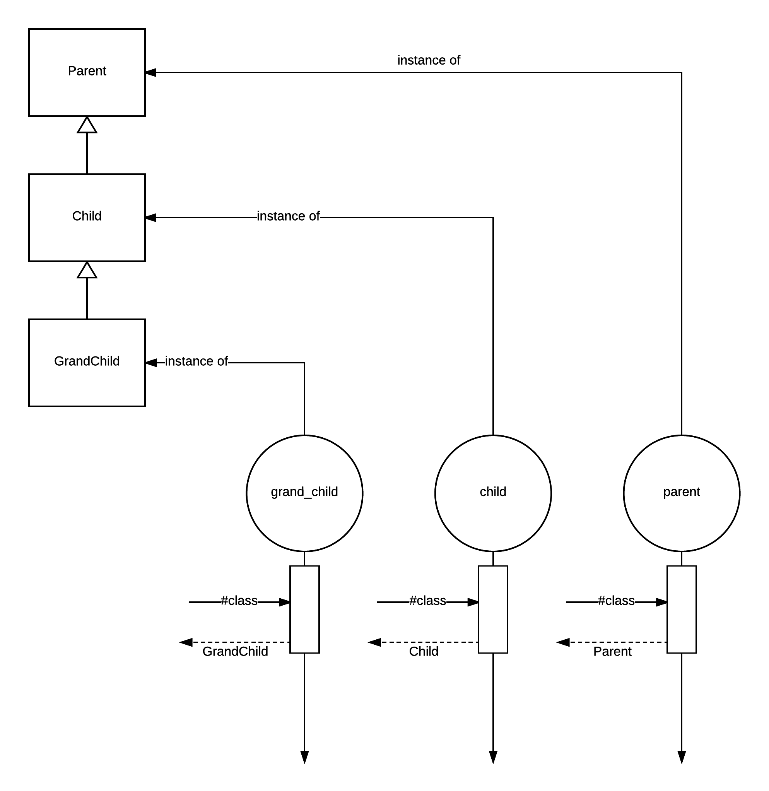
 
<br/>
 
(2) `.superclass`. This is called on a class and returns the class that this class derives from. You can see the call on line 19 and
the corresponding outputs on lines 3, 17 and 31.

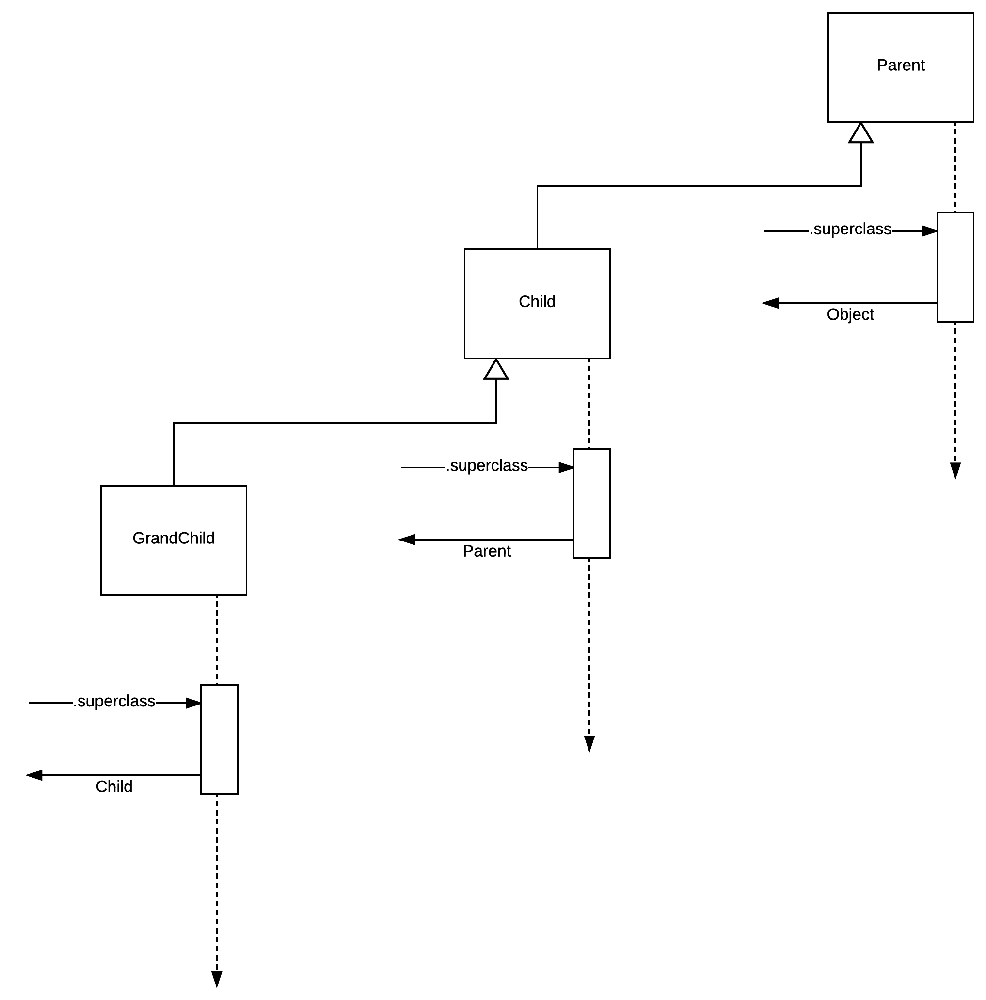

Note that the `.superclass` of `Parent`, and any class that does not derive from another, is the class `Object`. This is a class that comes with
Ruby, in the core library and provides all classes with default functionality. Hence, every class in Ruby derives from `Object` class. We will talk about this
in a later chapter called `Everything is an Object`.

<br/>

(3) `#is_a?(<a class>)`. This is called on an object and tells us whether this object is an instance of the class given
as argument or of a class which is sub-class of the class given as argument. You can see that being called on lines 20, 21 and 22.
Study the results. For example, you can see from the output lines 32, 33 and 34, that the `grand_child` instance is considered to
be both a `Parent` and a `Child` and a `GrandChild`. This is because it exposes all the methods of all these classes. On the other hand,
you can see that the `child` instance is not a `GrandChild`, because `GrandChild` instances might have methods that the `child` instance
does not respond to.
 
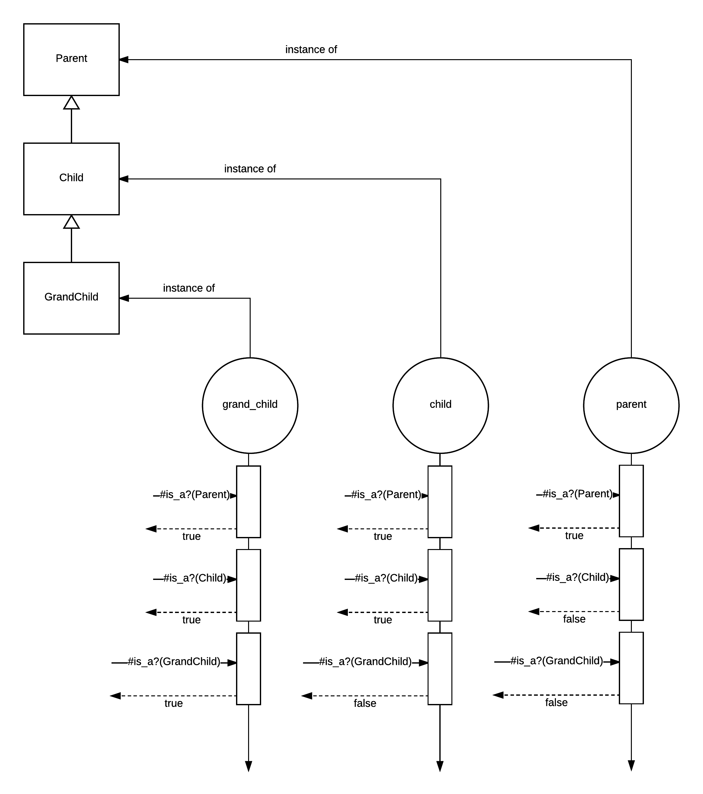

<br/>
 
> *Note:* When an object returns `true` when calling `#is_a?<other class>` on it, then we say that object is of **type** *<other class>*.
Hence, on the previous example, the `grand_child` object is of type `Parent`, `Child` and `GrandChild`.

(4) `#kind_of?(<a class>)`. It is the same as the `#is_a?`
 
<br/>
 
(5) `#instance_of?(<a class>)`. It compares the result of `#class` to the given argument and returns either `true` or `false` accordingly.
Hence, `#instance_of?` returns `true` if the object instance is an exact instance of the class given as argument.

## Protected Methods

Let's go now to another, the third and last one, visibility attribute for methods, the `protected` methods. I am going to explain that with an example (`protected-example-1.rb`):

``` ruby
 1. # File: protected-example-1.rb
 2. #
 3. class MyClass
 4.   def public_foo
 5.     puts 'public foo'
 6.   end
 7. 
 8.   private
 9. 
10.   def private_foo
11.     puts 'private_foo'
12.   end
13. end
14. 
15. a = MyClass.new
16. a.public_foo
17. a.private_foo
```

If you run the above program, you will get this error:

``` bash
$ ruby protected-example-1.rb
public foo
protected-example-1.rb:17:in `<main>': private method `private_foo' called for #<MyClass:0x007fb7920c0fc0> (NoMethodError)
$
```

This is expected, according to what we have learned so far. The object `main` does not have the right to call the private methods
of the object `a` which is an instance of `MyClass`.


Let's try another example (`protected-example-2.rb`):

``` ruby
 1. # File: protected-example-2.rb
 2. #
 3. class MyClass
 4.   def public_foo
 5.     puts 'public foo'
 6.   end
 7. 
 8.   private
 9. 
10.   def private_foo
11.     puts 'private_foo'
12.   end
13. end
14. 
15. class MySubClass < MyClass
16.   def public_sub_class_foo
17.     a = MyClass.new
18.     a.public_foo
19.     a.private_foo
20.   end
21. end
22. 
23. aa = MySubClass.new
24. aa.public_sub_class_foo
```

This is not much different to the `protected-example-1.rb` program. Instead of having `main` call the methods of `MyClass` instance,
we have another instance `MySubClass.new` calling the methods `#public_foo` and `#private_foo` on a `MyClass` instance. Hence,
the behaviour of the program `ruby protected-example-2.rb` is almost the same as before. Line 18 succeeds, but line 19 fails:

``` bash
$ ruby protected-example-2.rb
public foo
protected-example-2.rb:19:in `public_sub_class_foo': private method `private_foo' called for #<MyClass:0x007fa4912551b0> (NoMethodError)
        from protected-example-2.rb:24:in `<main>'
$
```

Line 19 fails because the method `#private_foo` is private and other object instances cannot call it.


Let's see another example now (`protected-example-3.rb`):

``` ruby
 1. # File: protected-example-3.rb
 2. #
 3. class MyClass
 4.   def public_foo
 5.     puts 'public foo'
 6.   end
 7. 
 8.   protected
 9. 
10.   def protected_foo
11.     puts 'protected_foo'
12.   end
13. 
14.   private
15. 
16.   def private_foo
17.     puts 'private_foo'
18.   end
19. end
20. 
21. class MySubClass < MyClass
22.   def public_sub_class_foo
23.     a = MyClass.new
24.     a.public_foo
25.     a.protected_foo
26.     a.private_foo
27.   end
28. end
29. 
30. aa = MySubClass.new
31. aa.public_sub_class_foo
```

This new version of our program, has added one more method to `MyClass`, the `#protected_foo`. And not only that, it has
flagged it as `protected` (rather than `public` or `private`). If we run this program:
 
``` bash
$ ruby protected-example-3.rb
public foo
protected_foo
protected-example-3.rb:26:in `public_sub_class_foo': private method `private_foo' called for #<MyClass:0x007fa890a00e48> (NoMethodError)
        from protected-example-3.rb:31:in `<main>'
$
```

it will raise an error, again, for the `#private_foo` call on line 26, but it will not raise error for the protected method.
Let's keep that. `protected` methods are allowed to be called by other objects as long as the other objects are of the
same type to the type of the object the methods are called on. Hence, the caller needs to respond with `true` when we call `#is_a?(<class of called object>)`
on it.

In other words, if the caller is `foo` and the called object is `bar`, then `foo.is_a?(bar.class)` should return `true`. Under this condition,
the protected methods of `bar` can be called.

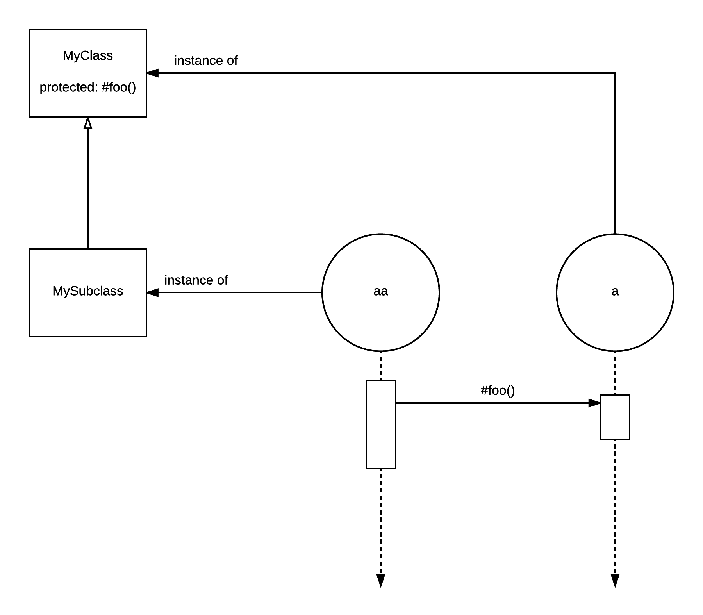

Nevertheless, calling protected methods from an object, which is not a sub-class instance of the class of the target object, is not allowed. In the following
program, `protected-example-4.rb`, the `main` object fails to call the `#protected_foo` method:

``` ruby
 1. # File: protected-example-4.rb
 2. #
 3. class MyClass
 4.   def public_foo
 5.     puts 'public foo'
 6.   end
 7. 
 8.   protected
 9. 
10.   def protected_foo
11.     puts 'protected_foo'
12.   end
13. end
14. 
15. a = MyClass.new
16. a.public_foo
17. a.protected_foo
```

That was the idea behind `protected` methods. They are not `public`, neither `private`. They can be called by objects which are
considered *friends* of the target object.

## Multiple Inheritance

This is another concept in the object oriented programming supported by many object oriented languages. It allows a class to have
many super classes at the same time. 

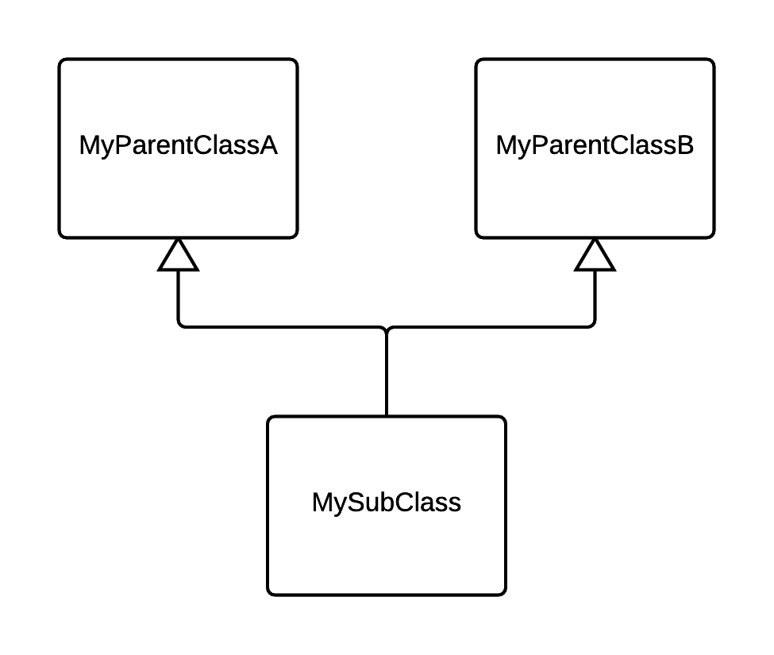

However, this is not allowed in Ruby. Only 1 class can be the superclass of another. Ruby has the concept of mix-ins that allows 
the developer to combine different pieces of software modules into one class, but this is not the same like the multiple inheritance.

> *Note:* The concept of mix-ins will be discussed in the modules chapter.

Other languages support multiple inheritance. This is an example from the C++ language:

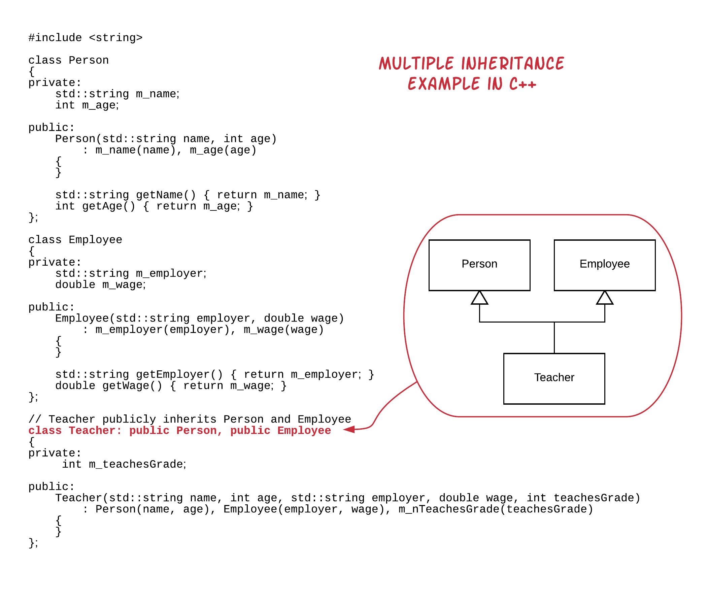

## Calling `private` Methods

Ruby is a language that trusts the developer. It gives them all the tools to make them as powerful as possible. Relies on them
to make good and responsible use of these tools.

This is where the `#send` method appears to be in. A method that you can use to override the visibility constraints. In other words,
you can use `#send` method to call protected and private methods. 

This is an example `send-example.rb`:

``` ruby
 1. # File: send-example.rb
 2. #
 3. class MyClass
 4.   def public_foo
 5.     puts 'public foo'
 6.   end
 7. 
 8.   private
 9. 
10.   def private_foo
11.     puts 'private_foo'
12.   end
13. 
14.   protected 
15
16.   def hello(name)
17.     puts "(protected) Hello #{name}"
18.   end
19. end
20. 
21. a = MyClass.new
22. a.public_foo
23. a.send(:private_foo)
24. a.send(:hello, 'John')
```

If you run this program, you will get this:

``` bash
$ ruby send-example.rb
public foo
private_foo
(protected) Hello John
$
```

Which proves that `#send` can be used to call any-visibility method. The call needs to take as first argument the name of the method
in symbol format. Then optionally, needs to take the arguments which this target method requires.

Now that you know that you can overcome the visibility restriction of a method, using the `#send` tool, we should warn you that
this should not normally be done. Unless you know what you are doing. It is a very bad design to not follow the rules of the
object that you are trying to use. 

There are going to be cases in which you will need the `#send`, but they will not be often. 

Note also that you can call public methods using `#send`, although, in that case, we would recommend that you called
the `#public_send` method instead. This latter method protects you by making sure that, even if you use a meta method (i.e. `#public_send`) to call a method,
this will only call the target method if it is public. 

Here is an example of a program that uses `#public_send` and a good example of when this kind of meta-programming is useful:

``` ruby
 1. # File: calculator.rb
 2. #
 3. class Calculator
 4.   def initialize(a, b)
 5.     @a = a
 6.     @b = b
 7.   end
 8. 
 9.   def add
10.     @a + @b
11.   end
12. 
13.   def subtract
14.     @a - @b
15.   end
16. 
17.   def divide
18.     @a / @b
19.   end
20. 
21.   def multiply
22.     @a * @b
23.   end
24. end
25. 
26. print 'Give me the first number: '
27. a = gets.to_f
28. print 'Give me the second number: '
29. b = gets.to_f
30. print 'Let me know which mathematical operation to carry out (1 for add, 2 for subtract, 3 for divide, 4 for multiply): '
31. operation = gets.to_i
32. 
33. case operation
34.   when 1
35.     operation = :add
36.   when 2
37.     operation = :subtract
38.   when 3
39.     operation = :divide
40.   when 4
41.     operation = :multiply
42.   else
43.     puts "ERROR: You didn't give the correct operation"
44.     exit(1)
45. end
46. 
47. calculator = Calculator.new(a, b)
48. result = calculator.public_send(operation)
49. 
50. puts "Result is: #{result}"
```

The program above defines the class `Calculator` with four public methods, one for each mathematical operation. Then it asks the
user to give two numbers and also tell which operation they would like to have a result for. Then, program uses `#public_send` to call
the correct method on the `Calculator` instance `calculator`.

## Closing Note

This ends our encounter with methods, their visibility and the class inheritance. You will get more familiar with that as long as you 
practice and start thinking about objects from now on.
