Debugging tools are very useful while you are doing your development. Their main feature is that they can pause the execution
of your Ruby program at specific line of code and allow you to inspect the value of the variables. So, they give you a clear context
your next Ruby statement is executed on and you can find out whether something is wrong and how to fix it.

We will see two tools widely used to debug a Ruby application.

1. The [DEBUGGER__](http://ruby-doc.org/stdlib-2.3.3/libdoc/debug/rdoc/DEBUGGER__.html) library that comes with standard Ruby library.
2. The RubyMine Integrated Debugger.

## A Program with a Bug

Let's suppose that we have the program `polynomial-1.rb`:

``` ruby
 1. # File: polynomial-1.rb
 2. #
 3. def power_of(a, b)
 4.   a * b
 5. end
 6.
 7. def polynomial(a, b, c, x)
 8.   a * power_of(x, 2) + b * x + c
 9. end
10.
11. if ARGV.size != 4
12.   $stderr.puts "Wrong number of arguments. You need to call like this: ruby #{$0} <a> <b> <c> <x>"
13.   $stderr.puts "...you will get back the result of 'a * x ^ 2 + b * x + c'"
14.   exit 1
15. end
16.
17. a, b, c, x = ARGV.map(&:to_f)
18. ARGV.clear
19.
20. result = polynomial(a, b, c, x)
21.
22. puts result
```

This looks to be a simple Ruby program. It is supposed to be calculating the second degree polynomial:


If you run this program, it will go start to finish without any problem:

``` bash
$ ruby polynomial-1.rb 5 6 3 6
99.0
$
```

Great! But this program has a bug &#9786; The result should have been `219.0` and not `99.0`. Where is the bug?
I understand that you may be able to find it by reading the code. But, this will not be that easy on large Ruby applications
with plenty of files and lines of code.

Let's see how we can debug this program using a debugger. The techniques that we will use here can be applied to, more or less, any Ruby program.

## `DEBUGGER__`

Ruby standard library comes with a ready to use debugger. How is it used? You will have to add the line `require 'debug'` at the point you want your
program to pause for the first time. This is going to be your first breakpoint. When the program pauses there, then you can inspect the variable content and,
possibly, progress the execution of the rest of the program, step-by-step. Also, you can fire the continuation of the execution until the end of the
program or until the execution reaches the next breakpoint. Note that after your program pauses for the first time (thanks to the `require 'debug'`),
then, in order to set further breakpoints, you will have to use the `b` command from within the Ruby debugger prompt.

For the particular `polynomial-1.rb` program, we are going to put some breakpoints at the following lines:

1. After we read the arguments above line 18. This is going to be the first breakpoint. We will set this with the `require 'debug'` command.
2. Inside method `polynomial` to make sure that we call the statement on line 8 with expected values. This will be set with the
break (`b`) command, while we are at the Ruby debugger prompt.

This is the new version of the program with the first breakpoint inserted (`polynomial-2.rb`):

``` ruby
 1. # File: polynomial-2.rb
 2. #
 3. def power_of(a, b)
 4.   a * b
 5. end
 6.
 7. def polynomial(a, b, c, x)
 8.   a * power_of(x, 2) + b * x + c
 9. end
10.
11. if ARGV.size != 4
12.   $stderr.puts "Wrong number of arguments. You need to call like this: ruby #{$0} <a> <b> <c> <x>"
13.   $stderr.puts "...you will get back the result of 'a * x ^ 2 + b * x + c'"
14.   exit 1
15. end
16.
17. a, b, c, x = ARGV.map(&:to_f)
18. require 'debug'
19. ARGV.clear
20.
21. result = polynomial(a, b, c, x)
22.
23. puts result
```

So, with the first breakpoint in place, let's run the program again (`polynomial-2.rb`):

``` bash
$ ruby polynomial-2.rb 5 6 3 6
Debug.rb
Emacs support available.

polynomial-2.rb:19:ARGV.clear
(rdb:1)
```

As you can see, you are now getting a prompt `(rdb:1) `, which is the Ruby Debugger prompt. It allows you to give debugger commands. It has also displayed the
next line of code ready to be executed, as long as you ask the debugger to progress. Hence, we see that the next statement is `ARGV.clear` on line 19 of the file
polynomial-2.rb (`polynomial-2.rb:19:ARGV.clear`).

Before we progress to the next line, lets inspect the values of our local variables. Did we successfully parse the `ARGV` and build the values for `a`, `b`, `c` and
`x`? In order to print the content of a variable, you can use the Ruby debugger command `p` which takes as input argument the variable name you want your contents
printed on the screen.

Let's do that for our `a`, `b`, `c`, `x` variables:

``` ruby
(rdb:1) p a
5.0
(rdb:1) p b
6.0
(rdb:1) p c
3.0
(rdb:1) p x
6.0
(rdb:1)
```

Or, you can even use the command `v l` which prints the contents of all your local variables:

``` ruby
(rdb:1) v l
  a => 5.0
  b => 6.0
  c => 3.0
  result => nil
  x => 6.0
(rdb:1)
```

Nice! It seems that our variables have the correct values. So, we can ask the debugger to continue the execution of the program, until the next breakpoint.
But, before we do that, we need to set the next breakpoint first.

As we've said earlier, we want the next breakpoint to be set on line 8, inside our `polynomial` function. We want it there in order to inspect the
function local variables and possibly check whether the call to `power_of(x, 2)` brings the expected result.

Let's put a breakpoint on line 8.

``` ruby
(rdb:1) b 8
Set breakpoint 1 at polynomial-2.rb:8
(rdb:1)
```

Nice. Ruby debugger confirmed that we have set the breakpoint on line 8. Let's now fire the continuation of the execution of the program. We are now sure that
the program will run until its next breakpoint (or until something goes wrong before that). This is done with the `c` or `cont` command.

``` ruby
(rdb:1) c
Breakpoint 1, polynomial at polynomial-2.rb:8
polynomial-2.rb:8:  a * power_of(x, 2) + b * x + c
(rdb:1)
```

Well done! Our program execution has now stopped on line 8. Ruby debugger prints the content of this line: `polynomial-2.rb:8:  a * power_of(x, 2) + b * x + c` for
us. Let's print the contents of the local variables:

``` ruby
(rdb:1) v l
  a => 5.0
  b => 6.0
  c => 3.0
  x => 6.0
(rdb:1)
```

It seems that the local variables have correct values. Can we execute the statement of line 8 without actually progressing the execution of the program?
Yes, we can just type in on Ruby Debugger prompt any valid Ruby expression. This will be evaluated. The actual Ruby program does not progress its execution.

``` ruby
(rdb:1) a * power_of(x, 2) + b * x + c
99.0
(rdb:1)
```

This confirms that the implementation of `polynomial` function returns the wrong result. But looking at the mathematical expression, we don't see any
obvious mistake. Maybe the program is inside `power_of` method. What does it return for the current values? We can try that on the Ruby Debugger prompt.

``` ruby
(rdb:1) power_of(x, 2)
12.0
(rdb:1) x
6.0
(rdb:1)
```

Hmmmmmm. So, `x` is `6.0` and the result of raising `x` to the power of `2` returns `12.0` instead of `36.0`. That's good. We have located that the
bug should be in the implementation of the method `power_of`.

Let's step into this method with the command `s`:

``` ruby
(rdb:1) s
polynomial-2.rb:4:  a * b
(rdb:1)
```

The `s` (step) Ruby Debugger command got us **inside** the next level down to the call stack, inside the method `power_of`. Ruby Debugger confirms that
the next line of code to be executed is the statement on line 4, `a * b`.

Let's inspect the local variables again:

``` ruby
(rdb:1) v l
  a => 6.0
  b => 2
(rdb:1)
```

Local variables have the correct values. And now `power_of` should be calculating `6.0` raised to the power of `2`. But it does not. And this is because
the statement `a * b` should have actually been `a ** b`.

Bingo! We have used the Ruby Debugger to troubleshoot the bug. Since we don't need the debugger any more, we can quit.

``` ruby
(rdb:1) quit
Really quit? (y/n) y
$
```

Then you need to go and remove the `require 'debug'` statement. **Don't forget that.** Otherwise, you will ship your Ruby application with a
breakpoint! You really don't want that.

## Starting Debugging Sessions Without Altering Source Code

As we saw above, with the explicit `require 'debug'` statement inside our source code, there is a small gotcha. We need to remember to remove
it as soon as we finish our session. There is another alternative, much better actually. You can start your Ruby program with the Ruby debugger
invoked, without actually changing your source code. You only have to require the file `debug` when you invoke your Ruby program script.

Let's do that. We will invoke `polynomial-1.rb`, that does not have any `require 'debug'` embedded, like this:

``` bash
$ ruby -r debug polynomial-1.rb 5 6 3 5
Debug.rb
Emacs support available.

polynomial-1.rb:3:def power_of(a, b)
(rdb:1) 
```

Bingo! We have managed to start an interactive Ruby debug session for our `polynomial-1.rb` program without inserting any `require 'debug'` statements.
Now, we are free to insert our breakpoint to which ever line we want.

> *Information:* The `-r <ruby file script>` does the `require <ruby file script>` before actually executing any of the statements of the invoking script. You can use thi
option to require any file while you invoke the start of your application with the `ruby` program.

## Getting list of Ruby Debugger commands

Finally, while you are on Ruby Debugger prompt, you can get a list of the Ruby Debugger commands that you can use. This is done with the `h` command:

``` ruby
(rdb:1) h
Debugger help v.-0.002b
Commands
  b[reak] [file:|class:]<line|method>
  b[reak] [class.]<line|method>
                             set breakpoint to some position
  wat[ch] <expression>       set watchpoint to some expression
  cat[ch] (<exception>|off)  set catchpoint to an exception
  b[reak]                    list breakpoints
  cat[ch]                    show catchpoint
  del[ete][ nnn]             delete some or all breakpoints
  disp[lay] <expression>     add expression into display expression list
  undisp[lay][ nnn]          delete one particular or all display expressions
  c[ont]                     run until program ends or hit breakpoint
  s[tep][ nnn]               step (into methods) one line or till line nnn
  n[ext][ nnn]               go over one line or till line nnn
  w[here]                    display frames
  f[rame]                    alias for where
  l[ist][ (-|nn-mm)]         list program, - lists backwards
                             nn-mm lists given lines
  up[ nn]                    move to higher frame
  down[ nn]                  move to lower frame
  fin[ish]                   return to outer frame
  tr[ace] (on|off)           set trace mode of current thread
  tr[ace] (on|off) all       set trace mode of all threads
  q[uit]                     exit from debugger
  v[ar] g[lobal]             show global variables
  v[ar] l[ocal]              show local variables
  v[ar] i[nstance] <object>  show instance variables of object
  v[ar] c[onst] <object>     show constants of object
  m[ethod] i[nstance] <obj>  show methods of object
  m[ethod] <class|module>    show instance methods of class or module
  th[read] l[ist]            list all threads
  th[read] c[ur[rent]]       show current thread
  th[read] [sw[itch]] <nnn>  switch thread context to nnn
  th[read] stop <nnn>        stop thread nnn
  th[read] resume <nnn>      resume thread nnn
  pp expression              evaluate expression and pretty_print its value
  p expression               evaluate expression and print its value
  r[estart]                  restart program
  h[elp]                     print this help
  <everything else>          evaluate
(rdb:1)
```

As you can see, Ruby Debugger is quite rich in features. Experiment with the commands and you can also read the documentation
on the [Ruby Standard Library](http://ruby-doc.org/stdlib-2.3.3/libdoc/debug/rdoc/DEBUGGER__.html).

## RubyMine Integrated Debugger

RubyMine is one of the best IDE with huge number of features that they deal with all aspects of Web development. And it comes
with an integrated debugger. Let's see how we can carry out the same debugging process that we did earlier with `DEBUGGER__` for the `polynomial-1.rb`
program.

(1) Make sure that you create a RubyMine project for your Ruby Program.


(2) Flag the lines that you want to have a breakpoint on, by clicking to the left of the line with your mouse pointer.

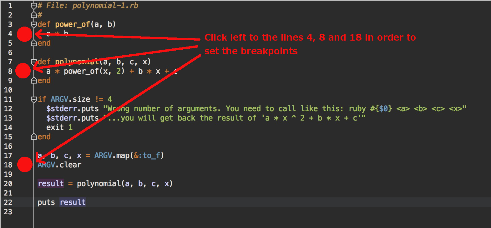

After you click to set the breakpoints, your editor should be looking like this:

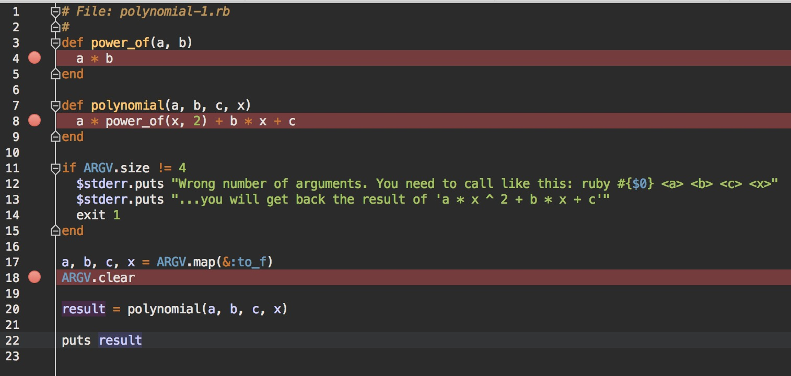

(3) Then right-click your mouse pointer on the main project file (i.e. the `polynomial-1.rb`) and select `Debug polynomial-1`

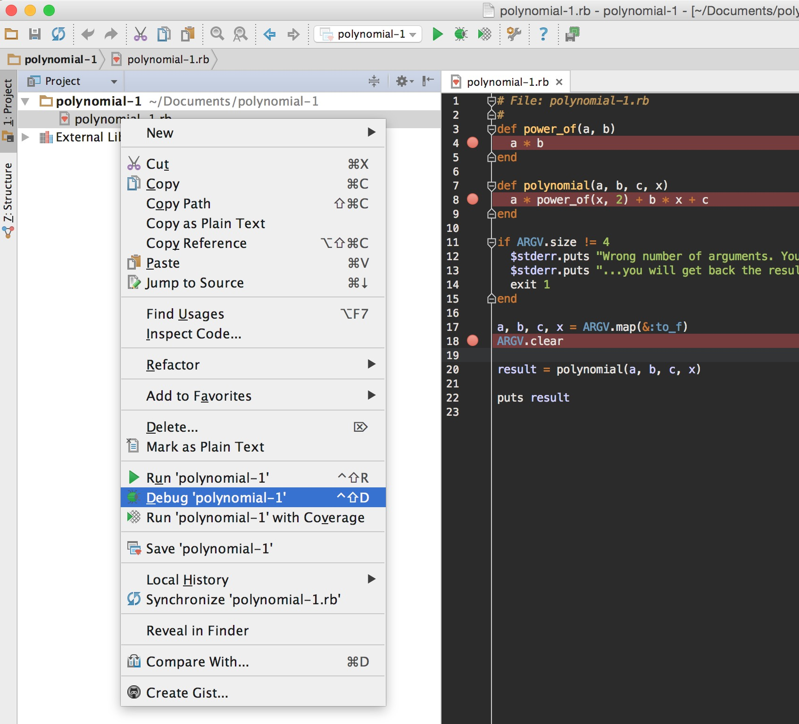

(4) When you do that, you will probably see a dialog popping up, asking you to confirm whether you want `ruby-debug-ide` to be installed. Like this:

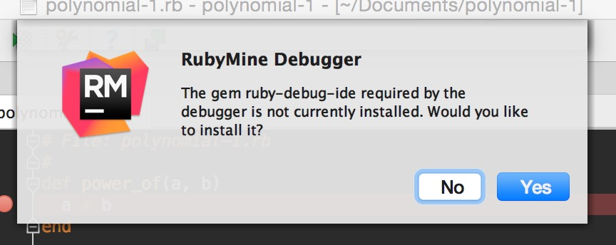

You need to select **Yes** on that.

(5) This will start the process of installing the `ruby-debug-ide` and you will see something like this:


(6) After the installation, debugger will run your program, but it will sadly fail &#9785;


This is expected, actually. This is how program has been designed. It is because you have started the program without giving the run-time arguments.
The program has been designed to exit with code 1 and print the error message telling that it needs to be called with run-time arguments.

(7) So, you need to edit the RubyMine run-time configuration for this program and give the script run-time arguments. Open the run-time configuration
editor by clicking next to the run-time name and selecting `Edit Configurations`:

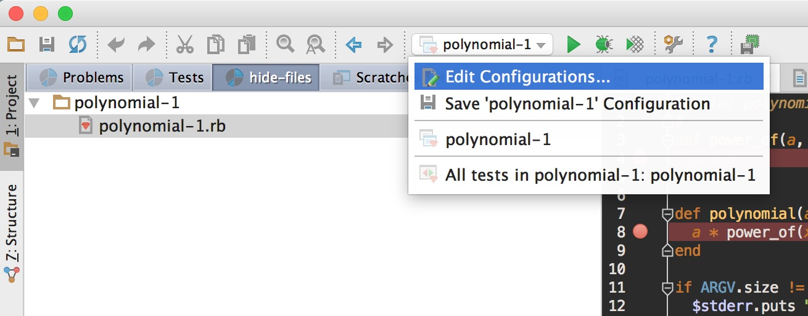

(8) This will give you the chance to specify the run-time arguments for the particular (`polynomial-1.rb`) run-time configuration.


(9) Now your run configuration is ready. Let's run the program again with debugger on. Like you did earlier, right-click on the `polynomial-1.rb` program
and select `Debug 'polynomial-1'`. You should now see this:


(10) As you can see, the information that the GUI, RubyMine debugger brings in front of your eyes is awesome. Makes you feel much more productive.

* The local variables are there, with their values
* The call stack is displayed on the left
* You can add *watch expressions*

And many-many more features at your hands, with easy to use interface. You only need to spend some time to get familiar with the buttons. And it will then
be very easy for you to use it in your programs.

We can see that our variables, `a`, `b`, `c` and `x`, they have the correct values. Which means that they have been parsed correctly from the run-time arguments.

(11) Let's now kick the execution of the program again and let it run till the next breakpoint (the equivalent of `cont` that we used in the Ruby debugger section earlier).
In order to ask the debugger to continue, you need to click the green right-pointing arrow:


(12) When you do that, you will see program being paused at the next breakpoint:


Here, you can still see that the variables reach the formula calculation line 8 with correct values.

(13) Before we ask debugger to continue, we want to calculate what the `power_of(x, 2)` will return back as a result. We suspect that the
problem is probably inside the implementation of this method. So, we start an `Evaluate Expression` session. We do that by highlighting the
expression that we want to be evaluated, right-clicking on it and then selecting `Evaluate Expression`. 


(14) When you do that, you will be presented with the following dialog box.


* The expression is already inside an input area.
* You can click on the `Evaluate` button to evaluate it.

(15) Clicking the `Evaluate` button will trigger the evaluation of the expression and you will be presented with the result.

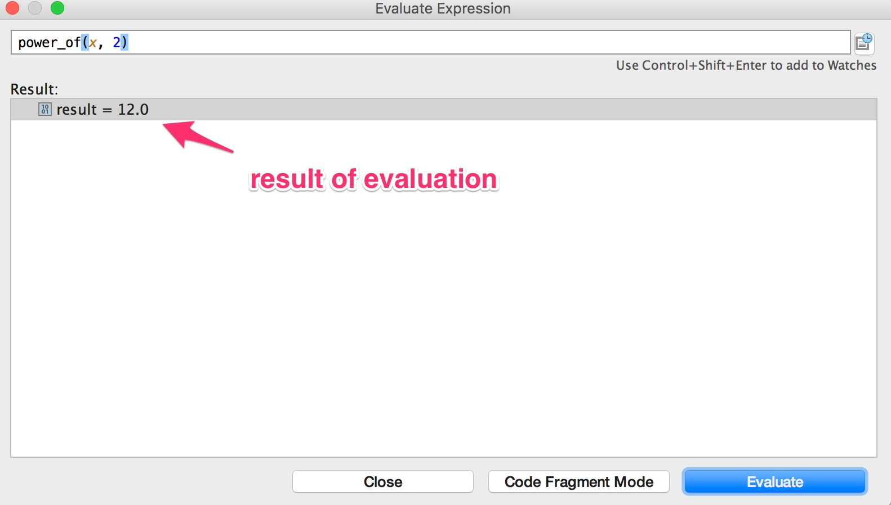

We see that raising `6.0` to the power of `2.0` returns back `12.0`, which is obviously wrong. So, we assume that the bug is inside the `power_of` implementation.

(16) We hit the right-pointing arrow to resume execution of the program until it pauses again on the next breakpoint.
We don't have to close the evaluation dialog box, if we don't want to. We may want to evaluate again soon. So, some times we leave that open.


This is were we see that the implementation of `power_of` is wrong, and instead of being `a ** b`, it is `a * b`. 

And this ends our RubyMine debugging session. As you have experienced it is much more comfortable if compared to the Ruby debugger and its console interface.

> *Information:* You don't have to set all your breakpoints beforehand. You may set a new breakpoint at any time while you are in the debugging session.
Also, you may remove any breakpoint while your program is being debugged, buy just clicking on that specific breakpoint that you want to remove.

## RubyMine and Debugging Interactive Ruby Console Programs

Before we close this chapter on debugging, we would like to draw your attention when it comes to debugging Ruby programs that expect user to give some input from
the keyboard. And in particular, when you debug those programs from within RubyMine IDE.

Let's try the program `ask-name.rb`, a very simple Ruby program that asks user to give their name and then prints a greeting message.

``` ruby
1. # File: ask-name.rb
2. #
3. print "What's your name? "
4. name = gets.chomp
5. if name.empty?
6.   $stderr.puts "You didn't tell me your name. Bye!"
7.   exit 1
8. end
9. puts "Hello #{name}"
```

(1) Create project for that file in RubyMine.

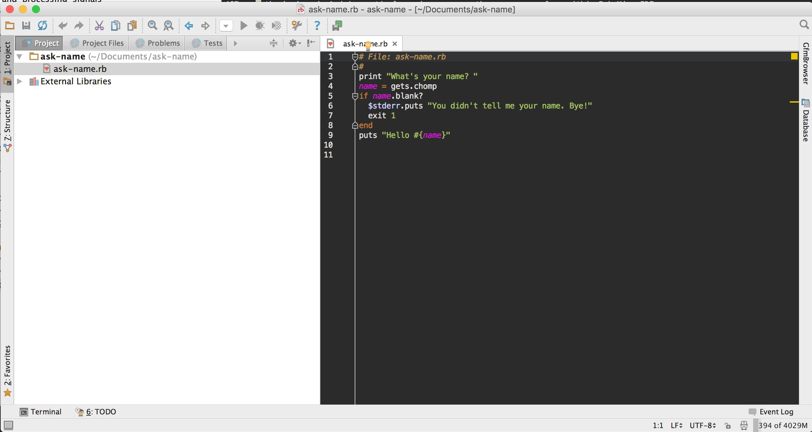

(2) Right-click on project main file and select `Debug 'ask-name'`. 

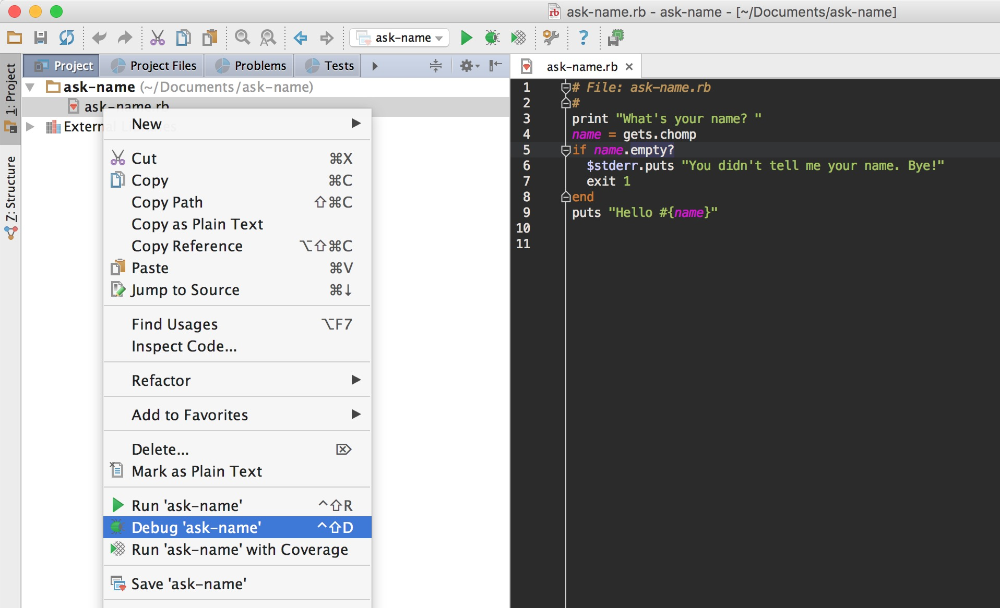

(You may be asked to install `ruby-debug-ide` again.)

(3) You will see that a console output opens at the bottom of your RubyMine window. This prints the message `What's your name? ` and waits for you to enter your
input. 

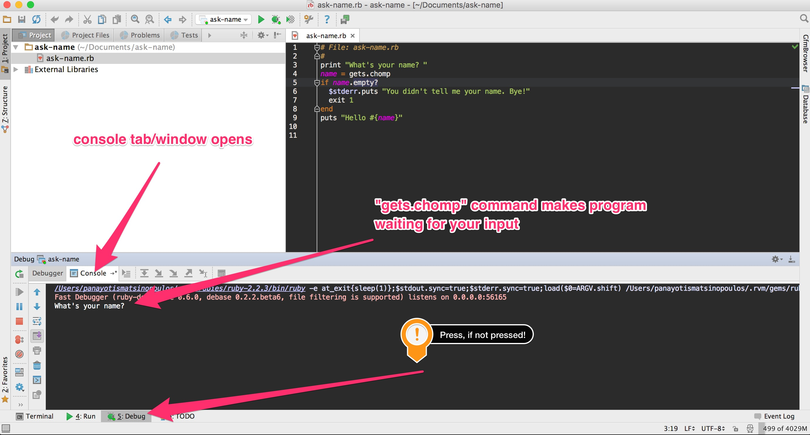

(4) You will probably be able to type in your name: 

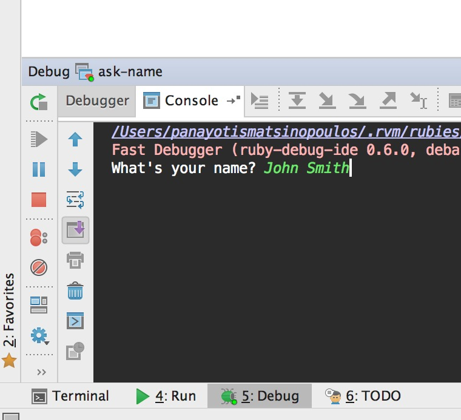

**But**, you may equally **not** be able to do that. This will be the case in which your console window will be looking more or less like this instead:

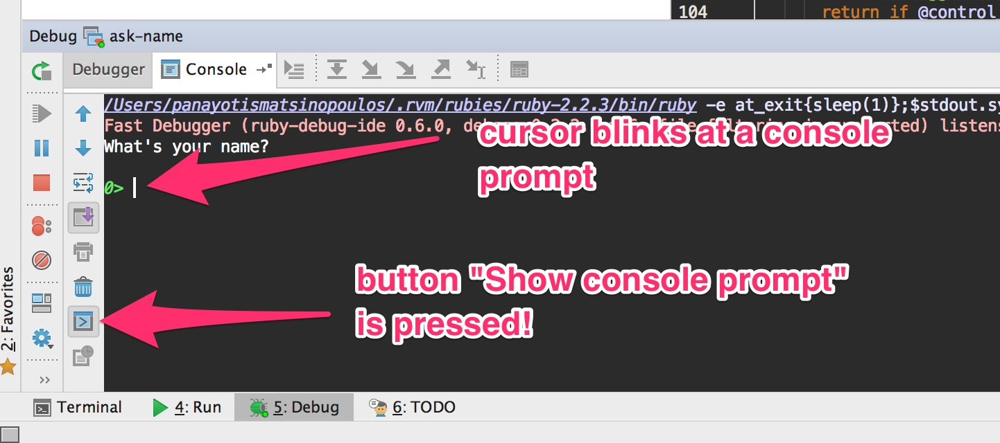

In order to *unblock* your situation and be able to give your input as a response to the `gets` command, next to the `What's your name? ` prompt, you will have to click on the 
`Show console prompt` button and make sure it is not pressed. Then you click next to the `What's your name? ` prompt, and you continue the execution of the program, by
actually typing your input.

## Closing Note

We are now ready to close the chapter of debugging. We believe that these two tools presented are enough for your debugging needs. However,
you may also want to have a look at

1) [PRY Debugger](https://github.com/nixme/pry-debugger) which is very popular too, and
2) [byebug]() gem.

The above two work in a similar way to `DEBUGGER__`. So, they open a prompt for you to give your debugging commands.
