Ruby gems is the Ruby mechanism to bundle a set of reusable Ruby code into a software module that can be reused among different Ruby projects
and possibly from different developers. Ruby developers create code, that can be shared in the Ruby community, on a daily basis (if not more
frequently than that). They package their code into what we call *gems* and they publish them onto a public gems repository. The most frequently-used
public repository of gems is [RubyGems](https://rubygems.org/).

Later on, when we will start the next chapters on TDD/BDD we will start using third-party gems hosted on this public repository. For that reason,
we need to understand the basics behind the gems technology.

## Visit RubyGems

Open your browser and visit the [RubyGems](https://rubygems.org) web site. You will see something like this:


This is the site on which most of the Ruby developers publish their gems. The central area of this page is occupied by a search
box. Let's use this search feature. Assume that we are looking for the gem with name `money`.

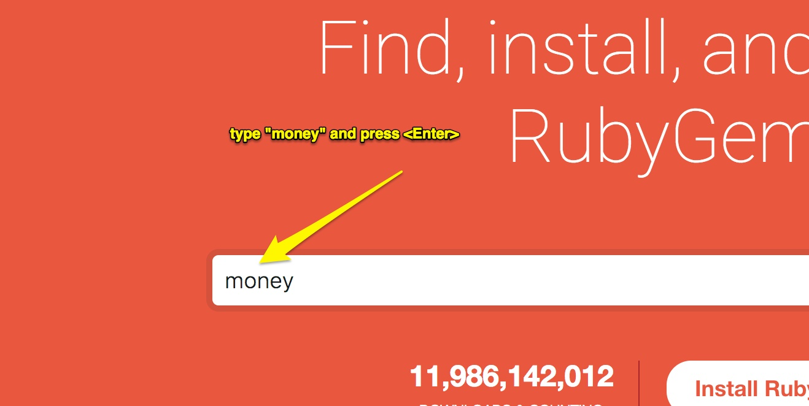

The results page will be something like this:


As you can see above, we have a gem that has the exact name to the keyword we used for searching. Also, there are some other gems that
have similar names.

Note the number of downloads of the `money` gem. At the moment we took this screenshot, it was over 6.7 million downloads. This means that this particular
gem has been downloaded by developers all over the world more than 6.7 million times since the first time it has been uploaded to RubyGems.
This is a big number, but, there are other gems that have much higher numbers. For example, search for the gem `rails` and see how many downloads
does it have.

> *Information:* The gem `rails` is the Ruby on Rails framework that we will extensively study at the corresponding section.

## Visit a Gem Page

Let's now visit the gem page for the `money` gem in particular. Click on *money* link like it is shown on the screenshot below

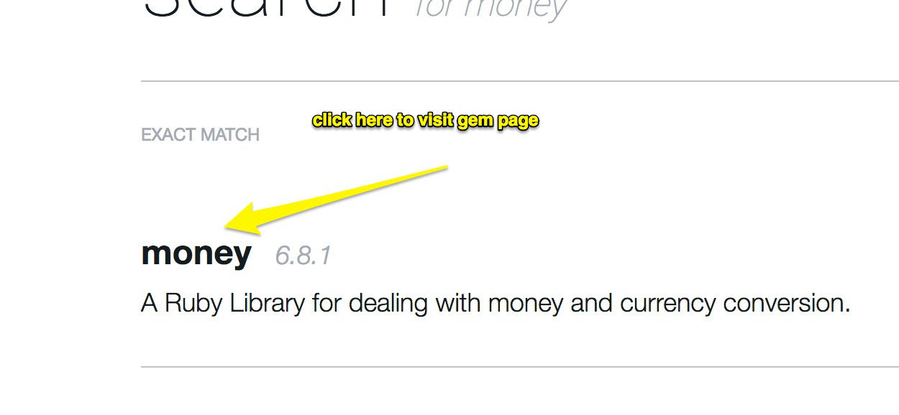

When you do that, you will land on the `money` specific web page, like the following:


The most important information that one can point on this page is:


1. The latest version of the gem. At the time of this writing, the latest version was `6.8.1`. Note that most of the gems developers follow the
   [Semantic Versioning](http://semver.org/) strategy to give version numbers to the different versions of their gems. The first number being the *major* version number,
   the second being the *minor* version number and the last one being the *patch* number.
2. The runtime dependencies. It lists other gems this gem depends on. This, basically, means that if you install `money` gem on your machine in order to use it, then you
   will have to install all of its dependencies too (luckily, there are tools that help with this dependency tree and make sure that all necessary gems are
   installed on your machine).
3. The three most important links that take you to the home, source code and documentation pages. Note that usually, the source code and the documentation reside
   on the same Github repository (but this is not a hard rule).

Below, you can see the home and documentation page of the `money` gem:


And here is the source code page of that gem. A source code page on Github:


## Installing a Gem

In order to be able to use a gem, you will have to install it. One way you can install that is using the *rubygems* program. Which means,
of course, that you first need to install this *rubygems* program.

### Installing RubyGems

**This may not be necessary** If you have Ruby installed, you probably have rubygems program installed too. Try the following on your
operating system terminal:

``` bash
$ gem --version
...
$
```
If it runs successfully and displays the version of the rubygems program (`gem` is the main binary of rubygems), then you are all set.

Otherwise, continue reading the next paragraphs:

This is the [page that explains how you can download and install rubygems](https://rubygems.org/pages/download).

But if you are on Mac OSX, you may want to use `brew` to do that: `brew install ruby` which also installs rubygems program.

Test that you have rubygems installed by running the following command on your terminal window:

``` bash
$ gem --version
2.6.8
$
```

which will run the rubygems program and print its current version (possibly later than the one on my machine at the time of this writing).

### List installed gems

With the command `gem list`, you can see the gems installed on your machine:

``` bash
$ gem list
panayotismatsinopoulos@~ $ gem list

*** LOCAL GEMS ***

bundler-unload (1.0.2)
did_you_mean (default: 1.0.1)
executable-hooks (1.3.2)
gem-wrappers (1.2.7)
jar-dependencies (default: 0.3.9)
jruby-launcher (1.1.1 java)
jruby-openssl (0.9.19 java, 0.9.18 java)
jruby-readline (1.1.1 java)
json (1.8.3 java)
minitest (default: 5.4.1)
net-telnet (default: 0.1.1)
power_assert (default: 0.2.3)
psych (2.2.2 java)
racc (1.4.14 java)
rake (12.0.0, default: 10.4.2)
rdoc (default: 4.2.0)
rubygems-bundler (1.4.4)
rvm (1.11.3.9)
test-unit (default: 3.1.1)
panayotismatsinopoulos@~ $ 
$
```

The `money` gem is not listed.

We can also verify that `money` is not installed by trying to use `Money` class (which is defined by this gem). Open an `irb` console
and try to initialize a `Money` instance.

``` ruby
$ irb
2.2.3 :001 > money = Money.new(1000, 'USD')
NameError: uninitialized constant Money
        from (irb):1
        from /Users/panayotismatsinopoulos/.rvm/rubies/ruby-2.2.3/bin/irb:15:in `<main>'
2.2.3 :002 > 
$
```

The `Money` class is not there. Then try to require the `money` initialization file:

``` ruby
2.2.3 :002 > require 'money'
LoadError: cannot load such file -- money
        from /Users/panayotismatsinopoulos/.../kernel_require.rb:54:in `require'
        from /Users/panayotismatsinopoulos/.../kernel_require.rb:54:in `require'
        from (irb):2
        from /Users/panayotismatsinopoulos/.../irb:15:in `<main>'
2.2.3 :003 > 
```

you can see that this file cannot be located.

You will see how these errors will go away after we install `money` gem and we require the correct file.

### Use `gem` to install gems

Having the rubygems (`gem`) program installed, we can now use it to install any gem that we like.

Let's run the gem installation command on the terminal:

``` bash
$ gem install money
panayotismatsinopoulos@~ $ gem install money
Fetching: i18n-0.7.0.gem (100%)
Successfully installed i18n-0.7.0
Fetching: sixarm_ruby_unaccent-1.1.1.gem (100%)
Successfully installed sixarm_ruby_unaccent-1.1.1
Fetching: money-6.8.1.gem (100%)
Successfully installed money-6.8.1
3 gems installed
$
```

The command `gem install money` tells rubygems to install the gem `money` from the RugyGems public repository.

Note that the last message printed, after the installation is `3 gems installed`. Also, the installation process printed
the names of the gems that have been installed alongside the gem `money`. These are the extra 2 gems that are the
runtime dependencies of `money` gem (i.e. `i18n` and `sixarm_ruby_unaccent`). Moreover, the installation messages
display the exact versions of the gems that have been installed.

> *Note:* A gem might be dependent on a version of another gem that is not necessarily its latest one.

Now, let's do `gem list` again

``` bash
$ gem list

*** LOCAL GEMS ***

bundler-unload (1.0.2)
did_you_mean (default: 1.0.1)
executable-hooks (1.3.2)
gem-wrappers (1.2.7)
i18n (0.7.0)
jar-dependencies (default: 0.3.9)
jruby-launcher (1.1.1 java)
jruby-openssl (0.9.19 java, 0.9.18 java)
jruby-readline (1.1.1 java)
json (1.8.3 java)
minitest (default: 5.4.1)
money (6.8.1) <<<<<<<<<<<<<<<<<<<<<<<<<<<<<<<<<<<<<<<<<<<<<<<<<<<<<<<<<<<
net-telnet (default: 0.1.1)
power_assert (default: 0.2.3)
psych (2.2.2 java)
racc (1.4.14 java)
rake (12.0.0, default: 10.4.2)
rdoc (default: 4.2.0)
rubygems-bundler (1.4.4)
rvm (1.11.3.9)
sixarm_ruby_unaccent (1.1.1)
test-unit (default: 3.1.1)
$
 ```

You can now see that the `money` gem is installed on your machine. Also, you can see that the version installed is the version `6.8.1`.

## Listing Specific gem

If you want to limit the output of `gem list` to the gem that you are interested in, you can give its name as second argument to the command.
Try this:

``` bash
$ gem list money

*** LOCAL GEMS ***

money (6.8.1)
$
```

you will see the installed gem and its version.

## Double Check on `irb`

We can now start `irb` again and give some Ruby commands that would confirm the presence of the proper installation of the `money` gem.

``` ruby
$ irb
2.2.3 :001 > require 'money'
 => true 
2.2.3 :002 > m = Money.new(100, 'USD')
 => #<Money fractional:100 currency:USD> 
2.2.3 :003 > 
```

Both these commands have now succeeded. The class `Money` is available after we first required the `money` file (which is the main file
of the gem).

## Find Where a gem is installed

Let's start irb and require `money` in order to load the `money` gem into our application.

``` ruby
2.2.1 :001 > require 'money'
 => true 
2.2.1 :002 > 
```

Then give the Ruby command `Gem.datadir` as follows:

``` ruby
2.2.1 :002 > Gem.datadir 'money'
 => "/Users/panayotismatsinopoulos/.rvm/gems/ruby-2.2.1/gems/money-6.8.1/data/money" 
2.2.1 :003 > 
```

The `Gem.datadir` takes as argument the name of the gem and returns the directory, in your local machine, that this gem
is installed in. The output, of course, will not be exactly like the one above, but it will be something like that.
It will definitely reveal the version of the `money` gem loaded too: `...gems/money-6.8.1/...`.

## Installing Multiple Versions of a gem

Let's `quit` the `irb` console.

On the shell command prompt, now, we will install the `money` gem again. But, we will ask rubygems to install an older version
of the gem, the version `6.0.1` for example. Let's do that:

``` bash
$ gem install money --version=6.0.1
Fetching: i18n-0.6.11.gem (100%)
Successfully installed i18n-0.6.11
Fetching: monetize-0.1.4.gem (100%)
Successfully installed monetize-0.1.4
Fetching: money-6.0.1.gem (100%)
Please note the following API changes in Money version 6

 - Money#amount, Money#dollars methods now return instances of BigDecimal (rather than Float).

Please read the migration notes at https://github.com/RubyMoney/money#migration-notes
and choose the migration that best suits your application.

Test responsibly :-)
Successfully installed money-6.0.1
Parsing documentation for i18n-0.6.11
Installing ri documentation for i18n-0.6.11
Parsing documentation for monetize-0.1.4
Installing ri documentation for monetize-0.1.4
Parsing documentation for money-6.0.1
Installing ri documentation for money-6.0.1
Done installing documentation for i18n, monetize, money after 1 seconds
3 gems installed
$
```

As you can see from the above, when we want to download a specific version of a gem, we have to specify its version using
the `--version` option (`gem install money --version=6.0.1`).

Now we have two versions of the same gem installed on our local repository. Try the following in order to confirm that:

``` bash
$ gem list money

*** LOCAL GEMS ***

money (6.8.1, 6.0.1)
$
```

You can see in parentheses, the two versions installed.

However, now that we have two versions of the gem installed locally, things are getting complicated with regards to which
version of the two our Ruby application is going to use.

## Default Version

Now that we have two versions installed, let's start our Ruby application, `irb` again and see which version is used by default:

``` ruby
$ irb
2.2.1 :001 > require 'money'
 => true 
2.2.1 :002 > Gem.datadir 'money'
 => "/Users/panayotismatsinopoulos/.rvm/gems/ruby-2.2.1/gems/money-6.8.1/data/money" 
2.2.1 :003 > 
```

As you can see, although we have two versions of the gem installed on our local repository, when we do `require 'money'`,
the latest version gem code is loaded.

## Using Older Version

Let's exit `irb`:

``` ruby
2.2.1 :003 > exit
$
```

We saw that, by default, our Ruby application is using the latest version of a gem that has multiple versions installed in
our local repository. Can we ask our application to use another version? Not the latest one?

There are plenty of ways we can do that. Let's see one.

We start our application:

``` ruby
$ irb
2.2.1 :001 > 
```

Then we call the Ruby command `gem 'money', '6.0.1'` that will tell Ruby to now point to the version `6.0.1` of the gem 'money'.

``` ruby
2.2.1 :001 > gem 'money', '6.0.1'
 => true 
2.2.1 :002 > 
```

Then we require the main file of the gem, which is 'money' file and we instantiate the `Money` class:

``` ruby
2.2.1 :002 > require 'money'
 => true 
2.2.1 :003 > Gem.datadir 'money'
 => "/Users/panayotismatsinopoulos/.rvm/gems/ruby-2.2.1/gems/money-6.0.1/data/money" 
2.2.1 :004 > m = Money.new(100, 'USD')
 => #<Money fractional:100 currency:USD> 
2.2.1 :005 > 
```

See how the `Gem.datadir 'money'` command confirms that we are using the version `6.0.1` of the gem.

## Ask Bundler Help

Imagine now that you have different projects using different versions of multiple gems. In that case, you would have
various versions of multiple gems installed on your local repository. You need an easy way to execute the correct
commands to have your Ruby applications point to the correct gems and correct versions.

Having done all this introduction about gems and different versions, we are now going to introduce you to a tool that is called *bundler*.
Bundler helps you manage the dependencies of your Ruby application and especially to lock down the versions of the gems your application depends on.

Bundler comes packaged as a gem. Let's locate its page on RubyGems.org Web site:

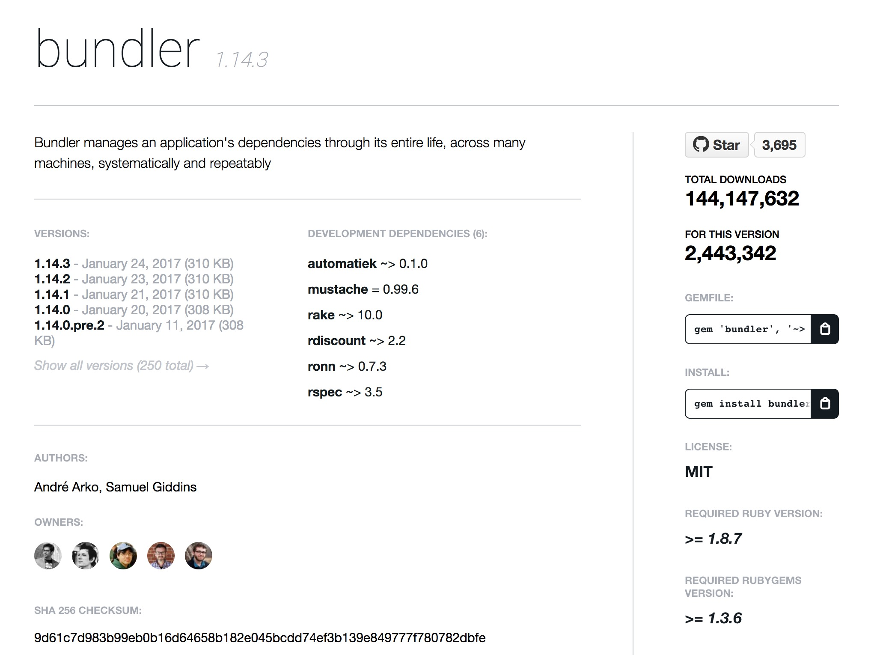

As you can see, it is one of the most downloaded gems.

## Let's Install Bundler

In order to install `bundler` you need to follow the installation process: `gem install bundler`.

Please, do so.

``` bash
$ gem install bundler
Fetching: bundler-1.14.3.gem (100%)
Successfully installed bundler-1.14.3
Parsing documentation for bundler-1.14.3
Installing ri documentation for bundler-1.14.3
Done installing documentation for bundler after 4 seconds
1 gem installed
$
```

Then you can do `gem list bundler`:

``` bash
$ gem list bundler

*** LOCAL GEMS ***

bundler (1.14.3)
bundler-unload (1.0.2)
rubygems-bundler (1.4.4)
$
```

you will get the list of gems that include the bundler word and that are installed on your local repository. One of them is `bundler`.

## `bundle`

`bundler` gem comes with an executable file which is called `bundle`. The `bundle` command is the one that you will be using to carry out
all `bundler` related tasks.

## Getting Bundler Version

You can get the bundler version via the `bundle` executable too:

``` bash
$ bundle --version
Bundler version 1.14.3
$
```

## `Gemfile`

In order to use the main functionality of bundler, you will need to have a `Gemfile` in the root folder of your project. The `Gemfile`
will be including the dependencies of your Ruby project, your Ruby application.

The `Gemfile` needs to declare the gems that your Ruby project depends on. Then, the `bundle` command will use this `Gemfile` and will
download all these gems, from RubyGems repository to your local repository. Except from the gems declared into your `Gemfile` it will
also download all the dependent gems and the dependencies of them. The whole dependency tree will be downloaded. Hence, all the gems
required by your application, directly or indirectly, will be present.

After downloading all the gems, `bundle` will create the file `Gemfile.lock` and will record there all the dependency tree alongside
with their versions. This is very useful, because the `bundle` command now knows which versions of the gems your Ruby project depends
on and will use only those. It will use them, of course, only if you start your Ruby application using the `bundle` command.

Let's see all this in practice.

We start a new Ruby project (named `test_bundler`) using RubyMine and we create a new file called `Gemfile` at the root folder of our project.

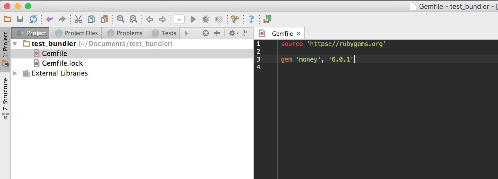

The content of the Gemfile should be the following:

``` ruby
1. source 'https://rubygems.org'
2.
3. gem 'money', '6.0.1'
```

The 1st line tells bundler where the gems should be retrieved from. Then, on the subsequent lines, we tell bundler which gems our application
depends on. We can see that on our example, we tell bundler that our application depends on `money` gem version `6.0.1`. If we didn't specify
the version, then it would be assumed the latest one.

This is it.

## `bundle` and `Gemfile.lock`

Now that we have told bundler which are the gems we depend on, we need to actually tell bundler to download and install those gems on our local
repository. Note that if bundler finds that those gems are already installed, it will not install them again.

In order to tell bundler to install gems according to the `Gemfile` specifications, we run the command `bundle` at the shell prompt of the root
folder of our project, where the `Gemfile` resides.

Open a terminal from within your RubyMine project. This will give you a shell prompt at the root folder of your project. Then give the command `bundle`.


If everything goes ok, you will see something like what is displayed on the above screenshot. Or you may see something like the following if the gems are already installed:

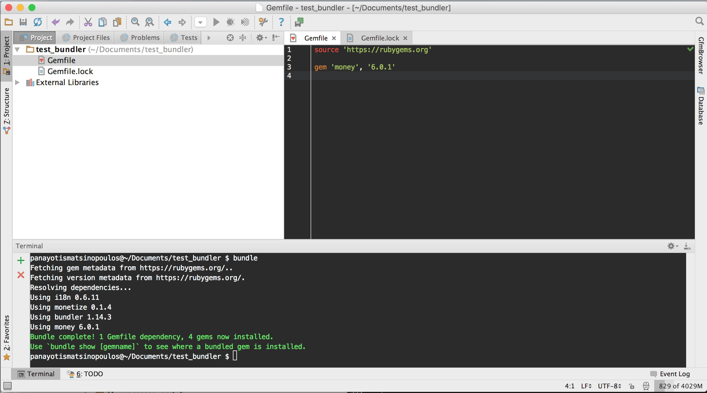

But the most important thing is the generation of the file `Gemfile.lock`.

Have a look at its contents:

``` ruby
 1. GEM
 2.   remote: https://rubygems.org/
 3.   specs:
 4.     i18n (0.6.11)
 5.     monetize (0.1.4)
 6.     money (6.0.1)
 7.       i18n (~> 0.6.4)
 8.       monetize (~> 0.1.3)
 9. 
10. PLATFORMS
11.   ruby
12. 
13. DEPENDENCIES
14.   money (= 6.0.1)
15. 
16. BUNDLED WITH
17.    1.14.3
```

You should not edit this file. You should only be using `bundle` command to create or update this file. Its contents have the dependency gem tree
of your Ruby application. It will be used by `bundle` to run your Ruby application.

## Which Gems `bundle` Bundles

You can have a look at the gems that bundle bundles with your `Gemfile`, using the command `bundle show`:

``` bash
$ bundle show
Gems included by the bundle:
  * bundler (1.13.3)
  * i18n (0.6.11)
  * monetize (0.1.4)
  * money (6.0.1)
$
```

As you can see, you get a list of all the gems that your application depends on, alongside their versions.

You can also ask for a specific gem with the command `bundle show <gem name>`:

``` bash
$ bundle show money
/Users/panayotismatsinopoulos/.rvm/gems/ruby-1.9.3-p551/gems/money-6.0.1
$
```

which prints the whole path to the gem you asked for. You can understand now, that this executes, internally, the `Gem.datadir` Ruby command.

## Launch Application with Bundler

Now let's use the bundler to start our application. `bundle` has an internal command which is called `exec` and basically
executes an executable after having loaded the gems that are specified in the `Gemfile.lock`. This means that if you
do `bundle exec irb` it will start the `irb` executable and bind to it the gems defined in the `Gemfile.lock`, even if the
local repository might contain many other gems and many other versions of them. Only the gems and its specific versions, as
specified inside the `Gemfile.lock` will be visible to the executable.

Let's try that:

``` ruby
$ bundle exec irb
2.2.1 :001 > 
```

Now, the `irb` executable has been started by bundler (with the `bundle exec` command). This means that only the gems specified in the `Gemfile.lock`
have been loaded and are now available. So, if we try to use the `Money` class, it will be with the version `6.0.1` without us having
to do `gem 'money', '6.0.1'` first (like we did when we didn't use bundler):

``` ruby
2.2.1 :001 > require 'money'
 => true 
2.2.1 :002 > Gem.datadir 'money'
 => "/Users/panayotismatsinopoulos/.rvm/gems/ruby-2.2.1/gems/money-6.0.1/data/money" 
2.2.1 :003 > m = Money.new(100, 'USD')
 => #<Money fractional:100 currency:USD> 
2.2.1 :004 > 
```

Let's quit the `irb` and then start it again without bundler, you will see that the latest version, not the one specified inside the `Gemfile.lock`,
is used:

``` ruby
$ irb
2.2.1 :001 > require 'money'
 => true 
2.2.1 :002 > Gem.datadir 'money'
 => "/Users/panayotismatsinopoulos/.rvm/gems/ruby-2.2.1/gems/money-6.8.1/data/money" 
2.2.1 :003 > 
```

Do you see that it loads the `6.8.1` version?

This proves how `bundle exec` command useful is.

## Ruby Version Manager

So far so good. We have 1 local repository that can hold multiple gems with multiple versions each. And this is not a problem for our Ruby application.
Because we can use bundler and specify inside the `Gemfile` which gems our application is bound to and which versions of it.

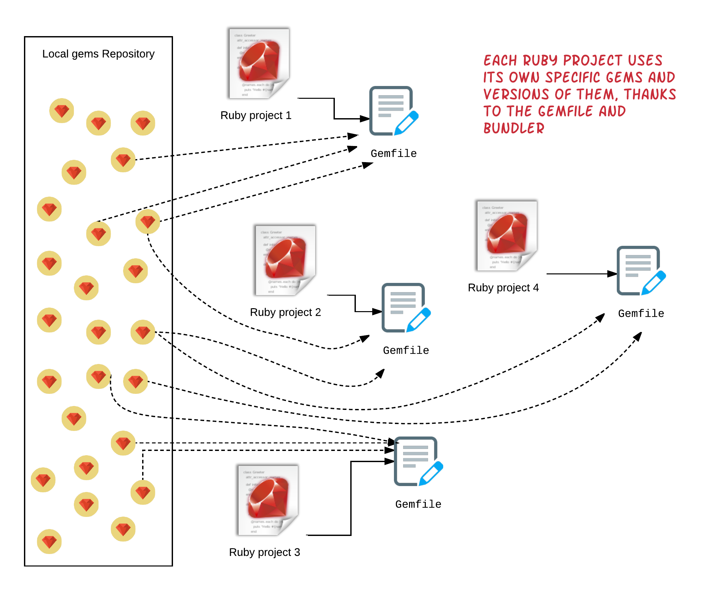

And this is all good, until we realize that all of our projects are obliged to use the same Ruby version. There is one 1 version installed and
our current setup does now allow different Ruby projects to use different Ruby versions.

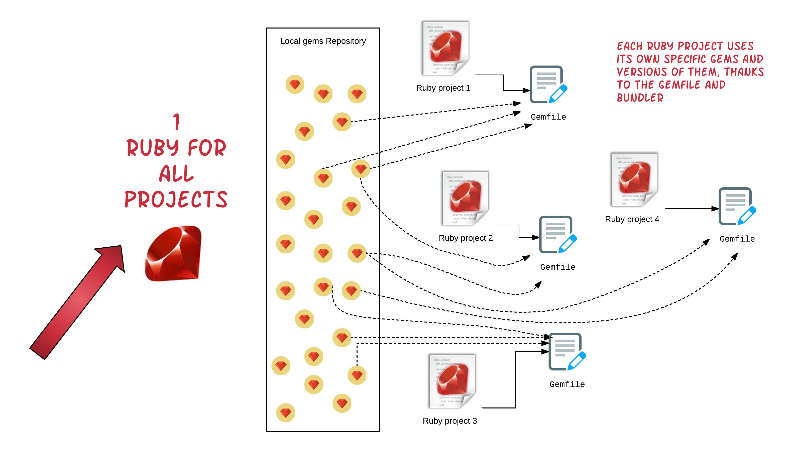

Do we need that? Do we need our Ruby projects to be bound to specific Ruby versions?

YES! Definitely! When we start a project that starts when Ruby is at version `2.2.1` for example and after 6 months we want to start a new Ruby project,
we might want to use the latest version for the new project, e.g. `2.3`, without risking a break on the old Ruby project that was developed and tested
with the old version `2.2.1`. Or, in other cases, we might want to deploy on a production server two projects, one developed and tested with Ruby version `2.2`
and another which was developed and tested with Ruby version `2.3`.

Is there an easy way for us to have multiple Ruby versions installed and tell our Ruby projects to use a specific version?

Yes there is and it is called `rvm`, [Ruby Version Manager - RVM](https://rvm.io/).

## Multiple Rubies

RVM allows you to have multiple rubies at your disposal.

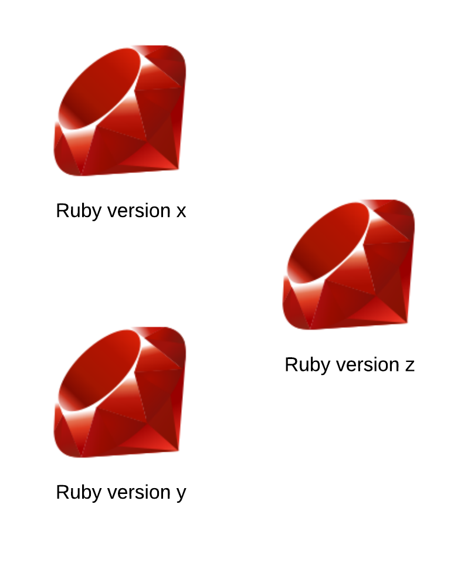

## Multiple Gemsets per Ruby

RVM allows you multiple gem repositories, called `gemsets`.

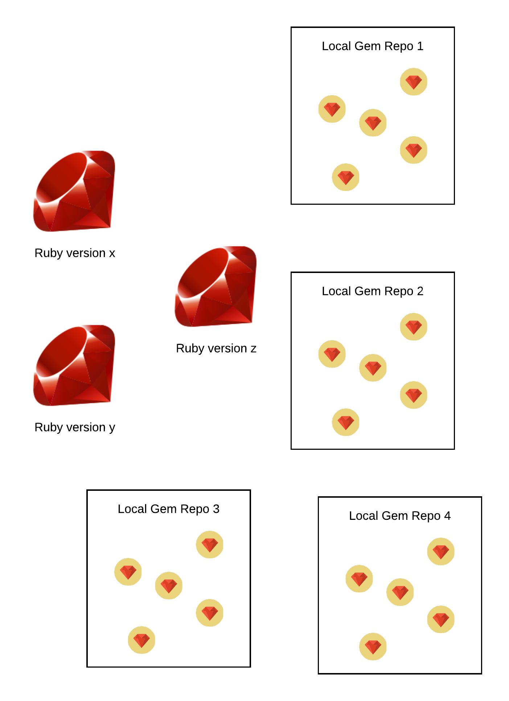

## Gemsets Belong To Rubies

And in fact, the RVM gemsets are created within the scope of a Ruby. In other words, 1 Ruby can have multiple different gemsets
and the user can have mutliple Rubies. Two gemsets belonging to the same Ruby cannot have the same name. Usually, the gemsets are
named after the project name.

This is an example organization that one can have with RVM:


## Ruby SDK or Ruby Project Set of Gems

Having organized our gems into gemsets, which, in turn, are organized into Rubies, our Ruby project picks up one gemset to work
with. This gemset is sometimes called the Ruby project SDK (Software Development Kit).

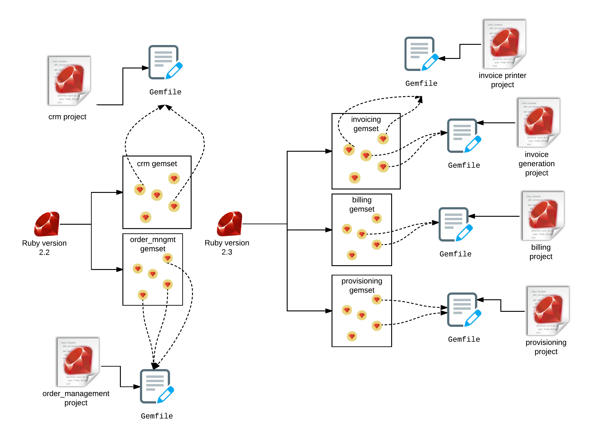

As you can see above, a Ruby project is attached to a specific gemset. It can only be attached to 1 gemset. However, different projects
may be attached to the same gemset, like for example the two projects on the above picture that are attached to the *Ruby Version 2.3 Invoicing* gemset.

But how does a Ruby project tell RVM which gemset should be attached to? This is done with the help of two hidden files, `.ruby-version` and `.ruby-gemset`.
These files need to be at the root project of the folder, and they have to contain only one line each. The first, `.ruby-version` should contain the
Ruby version the gemset will belong to, i.e. the Ruby version your project will be using. The second, `.ruby-gemset` should contain the name of the gemset
your project will be bound to.

Having said that, assuming that

1. you have RVM installed (see later on how)
2. you have the version of Ruby your project needs (see later on, we will install the Ruby using RVM)
3. you have created the gemset inside the Ruby (see later on)

Three files are very important for your Ruby project and all these need to exist at the root folder of your project.


## Installing RVM

The official page for RVM is [here](https://rvm.io/). The first bullet on this page gives you the two commands that you will need in order to install
RVM:

``` bash
$ gpg --keyserver hkp://keys.gnupg.net --recv-keys 409B6B1796C275462A1703113804BB82D39DC0E3
$ \curl -sSL https://get.rvm.io | bash -s stable
$
```

Watch out the following video that demonstrates the installation of RVM on an Ubuntu box. Similar process should be followed for Linux and OS X systems.

<div id="media-container-video-Installing RVM on Ubuntu Machine>
    <div id="media-title-video-ruby-Installing RVM on Ubuntu Machine">Installing RVM on Ubuntu Machine</div>
    <a href="https://player.vimeo.com/video/203583917"></a>
</div>    

## Listing the Rubies that RVM Knows About

After having installed RVM, you should execute the command to get the list of Rubies that your RVM installation knows about. This command will
print a long list of Rubies that RVM supports. The list contains both the main Ruby and its versions.

``` rvm
$ rvm list known
# MRI Rubies
[ruby-]1.8.6[-p420]
[ruby-]1.8.7[-head] # security released on head
[ruby-]1.9.1[-p431]
[ruby-]1.9.2[-p330]
[ruby-]1.9.3[-p551]
[ruby-]2.0.0[-p648]
[ruby-]2.1[.10]
[ruby-]2.2[.6]
[ruby-]2.3[.3]
[ruby-]2.4[.0]
ruby-head

# for forks use: rvm install ruby-head-<name> --url https://github.com/github/ruby.git --branch 2.2

# JRuby
jruby-1.6[.8]
jruby-1.7[.26]
jruby[-9.1.7.0]
jruby-head

# Rubinius
rbx-1[.4.3]
rbx-2.3[.0]
rbx-2.4[.1]
rbx-2[.5.8]
rbx[-3.70]
rbx-head

# Opal
opal

# Minimalistic ruby implementation - ISO 30170:2012
mruby-1.0.0
mruby-1.1.0
mruby-1[.2.0]
mruby[-head]

# Ruby Enterprise Edition
ree-1.8.6
ree[-1.8.7][-2012.02]

# Topaz
topaz

# MagLev
maglev[-head]
maglev-1.0.0

# Mac OS X Snow Leopard Or Newer
macruby-0.10
macruby-0.11
macruby[-0.12]
macruby-nightly
macruby-head

# IronRuby
ironruby[-1.1.3]
ironruby-head
$
```

The above is a sample output at the point of this writing. In this course we work with MRI Ruby. So any version that
is listed on the corresponding block would do.

## List the Installed Rubies

The previous command gave you the list of Rubies that are known by RVM. There is a similar command that lists the Rubies that
are installed on your machine. This command is `rvm list`:

``` bash
$ rvm list

rvm rubies

   jruby-9.0.5.0 [ x86_64 ]
   jruby-9.1.7.0 [ x86_64 ]
   ruby-1.9.3-p547 [ x86_64 ]
 * ruby-1.9.3-p551 [ x86_64 ]
   ruby-2.1.2 [ x86_64 ]
   ruby-2.1.3 [ x86_64 ]
   ruby-2.1.4 [ x86_64 ]
   ruby-2.2.0 [ x86_64 ]
   ruby-2.2.1 [ x86_64 ]
   ruby-2.2.2 [ x86_64 ]
=> ruby-2.2.3 [ x86_64 ]
   ruby-2.2.4 [ x86_64 ]
   ruby-2.3.0 [ x86_64 ]
   ruby-2.3.1 [ x86_64 ]

# => - current
# =* - current && default
#  * - default

$
```

The above is the output on my machine at the time of this writing. As you can see, I have installed 14 versions of Ruby, 2 of them are jRuby and
the rest of them, 12, are MRI Rubies. The `=>` points to the version that is currently selected (we will see how we switch to other versions). Whereas
the `*` points to the default Ruby. If current points to the default, then you will see the symbol `=*` as a prefix to that Ruby entry.

## Installing a Ruby Version

Now that you have RVM installed, you should be working with RVM to install and uninstall Rubies on your machine. In order to install a
specific version of Ruby, you have to give the command `rvm install ruby-x.y.z` where `ruby-x.y.z` is the Ruby version that you want to install.

The following example, will install Ruby 2.0.0 (which is not installed on my machine at the moment, but it is listed by the `rvm list known` command
as a known-to-rvm Ruby).

``` bash
$ rvm install ruby-2.0.0
...
```

The following video is about installing ruby 2.4 on an Ubuntu machine that does not have any Ruby installed.

<div id="media-container-video-Installing Ruby 2.4 on an Ubuntu machine>
    <div id="media-title-video-ruby-Installing Ruby 2.4 on an Ubuntu machine">Installing Ruby 2.4 on an Ubuntu machine</div>
    <a href="https://player.vimeo.com/video/203591537"></a>
</div>    

## Switching Current Ruby

Having multiple Rubies installed on your machine, the command `rvm use <ruby-version>` allows you to switch the current
Ruby version to the one given as argument `<ruby-version>`.

For example, the following command will switch the current Ruby to `ruby-2.1.4`:

``` bash
$ rvm use ruby-2.1.4
Using /Users/panayotismatsinopoulos/.rvm/gems/ruby-2.1.4
$
```

Then giving `rvm list`, the `=>` symbol will be pointing to `ruby-2.1.4`:

``` bash
$ rvm list

rvm rubies

   jruby-9.0.5.0 [ x86_64 ]
   jruby-9.1.7.0 [ x86_64 ]
   ruby-1.9.3-p547 [ x86_64 ]
 * ruby-1.9.3-p551 [ x86_64 ]
   ruby-2.1.2 [ x86_64 ]
   ruby-2.1.3 [ x86_64 ]
=> ruby-2.1.4 [ x86_64 ]
   ruby-2.2.0 [ x86_64 ]
   ruby-2.2.1 [ x86_64 ]
   ruby-2.2.2 [ x86_64 ]
   ruby-2.2.3 [ x86_64 ]
   ruby-2.2.4 [ x86_64 ]
   ruby-2.3.0 [ x86_64 ]
   ruby-2.3.1 [ x86_64 ]

# => - current
# =* - current && default
#  * - default

$
```

## Listing Gemsets of Current Ruby

If you are on a Ruby version, you can see the list of gemsets created on this Ruby version with the command `rvm gemset list`.
See the following examples on my machine:

``` bash
$ rvm current
ruby-2.1.4
$ rvm gemset list

gemsets for ruby-2.1.4 (found in /Users/panayotismatsinopoulos/.rvm/gems/ruby-2.1.4)
=> (default)
   bookandtable
   cucumber-ruby
   global
   web-app

$
```

As you can see above, the `rvm current` tells me that I am on the `ruby-2.1.4` Ruby and the `rvm gemset list` prints the
list of gemsets defined for this Ruby. You can also see that the `=>` points me to the current `gemset`, that being the gemset
with name `(default)`. Note that the gemset `global` is always present and created by RVM for every Ruby installed. It includes
the gems that are used by all gemsets. In other words, it contains gems that are used by all gemsets. So, if a gem is installed
only in the `global` gemset it is still available for any other gemset.

## Creating a New Gemset

Being on the Ruby that you want to work with, you need to create the gemset that you will use for your project. For example,
if your project has the name *Invoicing*, and you want to work with Ruby 2.1.4, then you will have to create the gemset `invoicing`
inside the Ruby `ruby-2.1.4`:

(1) Make sure that you are on the correct Ruby:

``` bash
$ rvm use ruby-2.1.4
Using /Users/panayotismatsinopoulos/.rvm/gems/ruby-2.1.4
$
```

(2) Then create the gemset `invoicing`:

``` bash
$ rvm gemset create invoicing
ruby-2.1.4 - #gemset created /Users/panayotismatsinopoulos/.rvm/gems/ruby-2.1.4@invoicing
ruby-2.1.4 - #generating invoicing wrappers........
$
```

(3) Make sure that you switch your current gemset to the new one created:

``` bash
$ rvm use @invoicing
Using /Users/panayotismatsinopoulos/.rvm/gems/ruby-2.1.4 with gemset invoicing
$
```

(4) Double check that your current gemset is the one that you want, i.e. Ruby 2.1.4 and gemset `invoicing`:

``` bash
$ rvm current
ruby-2.1.4@invoicing
$
```

Perfect!

## Bind Your Project To The Correct Gemset

We have learned how we create gemsets inside Rubies and how we switch from gemset to gemset. Being on a gemset means that any gem we install
will be installed on the particular gemset only. But do we have to do `rvm use <ruby>@<gemset>` every time we open a shell terminal at the root
folder of our project in order to make sure that our project is using the correct Ruby and gemset? That is an alternative, but
there is another one, much better.

We can create two files at the root folder of our project, the `.ruby-version` and the `.ruby-gemset` and that would allow RVM to switch to that
gemset automatically everytime you shell out to the root folder of your project. Moreover, with the presence of these two files, RubyMine knows
which Ruby and which gemset your project is bound to.

Assuming that we want our project to be working with Ruby 2.1.4 and gemset `invoicing`. Go ahead and create these two files at the root folder of
your project:

``` bash
$ echo 'ruby-2.1.4' > .ruby-version
$ echo 'invocing' > .ruby-gemset
$ cat .ruby-version
ruby-2.1.4
$ cat .ruby-gemset
invoicing
$ 
```

Now, every time you `cd` to this directory, or every time you create a shell to that directory, RVM will be switching your current Ruby and gemset
automatically to the ones defined by these two files.

On the following video, you can see how the user has two projects and switching the current folder from the root folder to the other RVM switches
their current Ruby and gemset automatically.

> *Information:* The command `rvm use <ruby-version>@<gemset> --create` creates the gemset, if it is not already there, and uses it at the same time,
i.e. it switches your current gemset to that gemset immediately

<div id="media-container-video-Switching Gemsets When Switching Projects>
  <div id="media-title-video-ruby-Switching Gemsets When Switching Projects">Switching Gemsets When Switching Projects</div>
  <a href="https://player.vimeo.com/video/203595706"></a>
</div>    

## Gems Isolated In Gemsets

So, now, every time we use `gem install <gem>` command, or whenever `bundle` command reads the `Gemfile` of a project and installs the gems for that project,
the gems are installed only inside the gemsets of the project and they are not shared between projects.

The following shows how the user of the two projects, "invoicing" and "billing" installs different gems on each project and how these gems are only
installed on the corresponding gemsets.

<div id="media-container-video-Each Project Installs Its Gems In Its Own Gemset>
  <div id="media-title-video-Each Project Installs Its Gems In Its Own Gemset">Each Project Installs Its Gems In Its Own Gemset</div>
  <a href="https://player.vimeo.com/video/203602285"></a>
</div>    

## Create Account on Rubygems

Continuing our encounter with the world of gems, I would like to ask you, now, to create an account on Rubygems.org. This
will allow you to publish your own gems later on in this chapter.

**Go ahead and create an account on [RubyGems](https://rubygems.org)**

## Create Your Own Gem

We have learned about Rubygems, gems, bundler and RVM. Before we finish this chapter we will now create our own simple gem. This will introduce you
to the workflow of creating gems and publishing them to Rubygems for other developers in the world to benefit from your work.

### Create the Gem Template

We will use bundler to generate a template for a gem. Then we will fill in the missing parts. Let's do it.

Run the following command on your shell terminal. Remember to replace `tcb` with your own identifying word. This will make
sure that we create unique gems and we will be able to publish them on rubygems without name conflicts.

``` bash
$ bundle gem tcb_letter_spacing
Creating gem 'tcb_letter_spacing'...
MIT License enabled in config
Code of conduct enabled in config
      create  tcb_letter_spacing/Gemfile
      create  tcb_letter_spacing/.gitignore
      create  tcb_letter_spacing/lib/tcb_letter_spacing.rb
      create  tcb_letter_spacing/lib/tcb_letter_spacing/version.rb
      create  tcb_letter_spacing/tcb_letter_spacing.gemspec
      create  tcb_letter_spacing/Rakefile
      create  tcb_letter_spacing/README.md
      create  tcb_letter_spacing/bin/console
      create  tcb_letter_spacing/bin/setup
      create  tcb_letter_spacing/.travis.yml
      create  tcb_letter_spacing/.rspec
      create  tcb_letter_spacing/spec/spec_helper.rb
      create  tcb_letter_spacing/spec/tcb_letter_spacing_spec.rb
      create  tcb_letter_spacing/LICENSE.txt
      create  tcb_letter_spacing/CODE_OF_CONDUCT.md
Initializing git repo in /Users/panay...tcb_letter_spacing
$
```

Great! `bundle` command generated all the necessary files and folders in order for you to create you own gem. Everything
has been generated inside a folder with the name as your gem name, in our case `tcb_letter_spacing`.

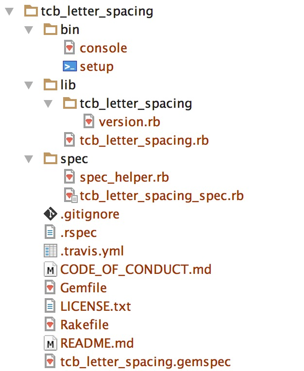

The most important items of this structure are:

1. The `tcb_letter_spacing.gemspec` file. We will edit this file and define the specification details of the gem.
2. The `README.md` file. It needs to be updated so that our readers know what this gem is about.
3. The `spec` folder is important, but we will not deal with that now. It is part of the test automation, subject of the next course section.
4. The `lib/tcb_letter_spacing.rb` file will contain our Ruby code, the one that we like to expose to the outside world.
4. The `lib/tcb_letter_spacing/version.rb` file will contain the version number of our gem. Each new version starts with version `0.1.0`. Every time you
   want to publish changes to your gem code, you need to update the version number before publishing the new version to Rubygems.

Note that the `tcb_letter_spacing` folder that has been prepared by bundler, is `git` ready. This means that it has been initialized with `git init`.

### Bind Project To Gemset

First thing that we have to do is to bind our project to desired Ruby version and gemset. We `cd` to the project folder `tcb_letter_spacing`
and we create the gemset `tcb_letter_spacing` in Ruby `2.2.3` (use your own gemset name and any Ruby 2.x that you like/have installed):

``` bash
$ cd tcb_letter_spacing
$ rvm use ruby-2.2.3@tcb_letter_spacing --create
ruby-2.2.3 - #gemset created /Users/panayotismatsinopoulos/.rvm/gems/ruby-2.2.3@tcb_letter_spacing
ruby-2.2.3 - #generating tcb_letter_spacing wrappers..........
Using /Users/panayotismatsinopoulos/.rvm/gems/ruby-2.2.3 with gemset tcb_letter_spacing
$
```

Then create the binding files `.ruby-version` and `.ruby-gemset`.

``` bash
$ echo 'ruby-2.2.3' > .ruby-version
$ echo 'tcb_letter_spacing' > .ruby-gemset
$
```

Double check that RVM is now using `ruby-2.2.3@tcb_letter_spacing`:

``` bash
$ rvm current
ruby-2.2.3@tcb_letter_spacing
$
```

Perfect! We are using the correct Ruby version and the correct gemset.

### Create a RubyMine Project for your Gem

Start a new RubyMine project and point it to the root folder of your project `tcb_letter_spacing`. Make sure when you start it,
that you specify the correct folder and the correct Ruby SDK, the one that corresponds the correct Ruby version and the correct gemset:


This should be, more or less, the image on RubyMine after you first create the project:

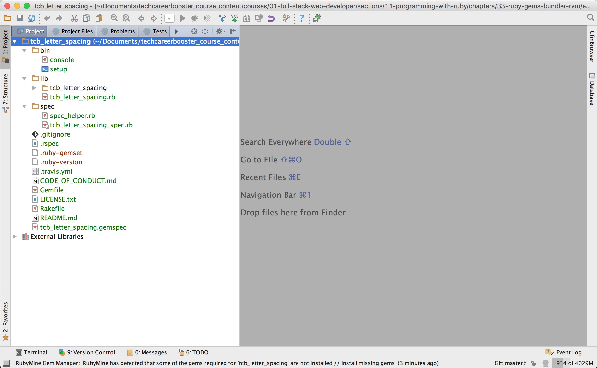

### Implementation

Let's now open the file `lib/tcb_letter_spacing.rb` and add the following content:

``` ruby
 1. # File: lib/tcb_letter_spacing.rb
 2. #
 3. require "tcb_letter_spacing/version"
 4. 
 5. module TcbLetterSpacing
 6.   class Formatter
 7.     def initialize(string)
 8.       @string = string
 9.     end
10. 
11.     def format
12.       @string.gsub(/(?<char>.)/, '\k<char> ') # A word like "foo" becomes "f o o"
13.     end
14.   end
15. end
```

This is the implementation of a very simple class. The instances of this class are initialized with a string value. Then one can call
the instance method `TcbLetterSpacing::Formatter#format` and it will display the string with a space in between the letters.

Let's now create a new file named `bin/test_formatter.rb`. This will be inside the folder `bin` and we will use it as an example
run of the formatter.

``` ruby
1. # File: bin/test_formatter.rb
2. #
3. formatter = TcbLetterSpacing::Formatter.new('foo')
4. puts formatter.format
```

### Install All The Required Gems

Before you can continue with the development of your gem, you need to make sure that you have all the required
gems installed locally:

Let's run `bundle`:

> *Information:* If `bundle` is not found, you may want to install bundler first (`gem install bundler --no-ri --no-rdoc`)

``` bash
$ bundle
Fetching gem metadata from https://rubygems.org/..........
Fetching version metadata from https://rubygems.org/.
Resolving dependencies...
Installing rake 10.5.0
Using bundler 1.14.3
Installing diff-lcs 1.3
Installing rspec-support 3.5.0
Using tcb_letter_spacing 0.1.0 from source at `.`
Installing rspec-core 3.5.4
Installing rspec-expectations 3.5.0
Installing rspec-mocks 3.5.0
Installing rspec 3.5.0
Bundle complete! 4 Gemfile dependencies, 9 gems now installed.
Use `bundle show [gemname]` to see where a bundled gem is installed.
$
```

### Test the Program

Now, if you run the program `bin/test_formatter.rb`, you will see the program returning `f o o`:

``` bash
$ bundle exec ruby bin/test_formatter.rb
f o o
$
```

Perfect! Our code seems to be working ok (although, we will officially start learning the serious test coverage for our code in the
next section of this course).

### Ignore `.idea` folder

Make sure that you git ignore the `.idea` folder. Open the `.gitignore` file in the root folder of your project and add the `.idea` entry
there.

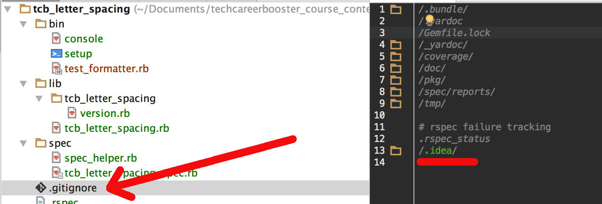

### First Commit

Let's do our first commit now:

``` bash
$ git add .
$ git commit -m "Initial Commit. Code seems to be working ok"
[master (root-commit) b826f2f] Initial Commit. Code seems to be working ok
 18 files changed, 280 insertions(+)
...
$
```

### Edit the `README.md`

We have finished with the code of our gem. Let's edit the `README.md` file. Make sure that it has content more or less
like this:

<pre>
# TcbLetterSpacing

This gem takes a string and returns it with one space after each letter. For example, the string `foo` becomes `f o o`.

## Installation

Add this line to your application's Gemfile:

```ruby
gem 'tcb_letter_spacing'
```

And then execute:

    $ bundle

Or install it yourself as:

    $ gem install tcb_letter_spacing

## Usage

Example:

``` ruby
formatter = TcbLetterSpacing::Formatter.new('foo')
puts formatter.format
```

## Development

After checking out the repo, run `bin/setup` to install dependencies. Then, run `rake spec` to run the tests. You can also run `bin/console` for an interactive prompt that will allow you to experiment.

To install this gem onto your local machine, run `bundle exec rake install`. To release a new version, update the version number in `version.rb`, and then run `bundle exec rake release`, which will create a git tag for the version, push git commits and tags, and push the `.gem` file to [rubygems.org](https://rubygems.org).

## Contributing

Bug reports and pull requests are welcome on GitHub at https://github.com/Panayotis Matsinopoulos/tcb_letter_spacing. This project is intended to be a safe, welcoming space for collaboration, and contributors are expected to adhere to the [Contributor Covenant](http://contributor-covenant.org) code of conduct.


## License

The gem is available as open source under the terms of the [MIT License](http://opensource.org/licenses/MIT).

</pre>

### One More Commit

``` bash
$ git add .
$ git commit -m "Updated README.md"
[master 07adfa5] Updated README.md
 1 file changed, 7 insertions(+), 4 deletions(-)
$
```

### Updating Gemspec

Before we finish the work of development of our gem, we need to update the `tcb_letter_spacing.gemspec` file, i.e. the Gem specifications.

Make sure you have `tcb_letter_spacing.gemspec` with the following content. Use your name as author and any other personal details need
to be adapted accordingly.

``` ruby
 1. # coding: utf-8
 2. lib = File.expand_path('../lib', __FILE__)
 3. $LOAD_PATH.unshift(lib) unless $LOAD_PATH.include?(lib)
 4. require 'tcb_letter_spacing/version'
 5. 
 6. Gem::Specification.new do |spec|
 7.   spec.name          = "tcb_letter_spacing"
 8.   spec.version       = TcbLetterSpacing::VERSION
 9.   spec.authors       = ["Panos Matsinopoulos"]
10.   spec.email         = ["Panos Matsinopoulos <panosm@techcareerbooster.com>"]
11. 
12.   spec.summary       = %q{Returns a string with the letters having a blank in between}
13.   spec.description   = %q{Returns a string with the letters having a blank in between}
14.   spec.homepage      = "https://www.techcareerbooster.com"
15.   spec.license       = "MIT"
16. 
17.   spec.files         = `git ls-files -z`.split("\x0").reject do |f|
18.     f.match(%r{^(test|spec|features)/})
19.   end
20.   spec.bindir        = "bin"
21.   spec.executables   = spec.files.grep(%r{^exe/}) { |f| File.basename(f) }
22.   spec.require_paths = ["lib"]
23. 
24.   spec.add_development_dependency "bundler", "~> 1.14"
25.   spec.add_development_dependency "rake", "~> 10.0"
26.   spec.add_development_dependency "rspec", "~> 3.0"
27. end
```

### Commit Gemspec Changes

Let's commit our changes again:

``` bash
$ git add .
$ git commit -m "Updated the gemspec"
[master 0f1324c] Updated the gemspec
 1 file changed, 6 insertions(+), 15 deletions(-)
$
```

### Create A Github Repository And Push Your Changes

Let's create a new Github repository for the gem and push the updates to this repo.

(1) Create the Github Repo.

(2) Execute locally the commands to bind your local `.git` repo to the Github repo.

``` bash
$ git remote add origin git@github.com:pmatsinopoulos/tcb_letter_spacing.git
(master) $
```

(3) Push your code to Github

``` bash
$ git push -u origin master
Counting objects: 30, done.
Delta compression using up to 8 threads.
Compressing objects: 100% (25/25), done.
Writing objects: 100% (30/30), 7.07 KiB | 0 bytes/s, done.
Total 30 (delta 6), reused 0 (delta 0)
remote: Resolving deltas: 100% (6/6), done.
To github.com:pmatsinopoulos/tcb_letter_spacing.git
 * [new branch]      master -> master
Branch master set up to track remote branch master from origin.
$
```

### Check the Publication Commands

Now, we can run a command to see the list of commands that we can use to publish our gem to Rubygems:

``` bash
$ bundle exec rake -T
rake build            # Build tcb_letter_spacing-0.1.0.gem into the pkg directory
rake clean            # Remove any temporary products
rake clobber          # Remove any generated files
rake install          # Build and install tcb_letter_spacing-0.1.0.gem into system gems
rake install:local    # Build and install tcb_letter_spacing-0.1.0.gem into system gems without network access
rake release[remote]  # Create tag v0.1.0 and build and push tcb_letter_spacing-0.1.0.gem to Rubygems
rake spec             # Run RSpec code examples
$
```

> *Side Note:* The `rake` command is explained in the next chapter.

### Build Gem Package

The first think that you have to do is to use the command `bundle exec rake build` to build the `*.gem` file that
is the package of your gem. Let's do that:

``` bash
$ bundle exec rake build
tcb_letter_spacing 0.1.0 built to pkg/tcb_letter_spacing-0.1.0.gem.
$
```

As the command output tells you, the file `pkg/tcb_letter_spacing-0.1.0.gem` (after the name fo the gem and its version) has
been created.

### Ready to Push to Rubygems.org

> *Important:* This step assumes that you have an account on Rubygems.org. If you don't have one, then
you will have to create first, before you try to push to Rubygems.org

Now that you know that your gem is built correctly, the command that you can use is `bundle exec rake release`. This will
release your gem to Rubygems.org

``` bash
$ bundle exec rake release
tcb_letter_spacing 0.1.0 built to pkg/tcb_letter_spacing-0.1.0.gem.
Tagged v0.1.0.
Pushed git commits and tags.
rake aborted!
Your rubygems.org credentials aren't set. Run `gem push` to set them.
/Users/panayotismatsinopoulos/.rvm/gems/ruby-2.2.3@tcb_letter_spacing/gems/bundler-1.14.3/lib/bundler/gem_helper.rb:102:in `rubygem_push'
/Users/panayotismatsinopoulos/.rvm/gems/ruby-2.2.3@tcb_letter_spacing/gems/bundler-1.14.3/lib/bundler/gem_helper.rb:68:in `block in install'
/Users/panayotismatsinopoulos/.rvm/gems/ruby-2.2.3@tcb_letter_spacing/bin/ruby_executable_hooks:15:in `eval'
/Users/panayotismatsinopoulos/.rvm/gems/ruby-2.2.3@tcb_letter_spacing/bin/ruby_executable_hooks:15:in `<main>'
Tasks: TOP => release => release:rubygem_push
(See full trace by running task with --trace)
$
```

The first time you do that, you will get an error that your Rubygems credentials have not been set. This command looks for the
file `~/.gem/credentials` that would hold your credentials for the command to push to Rubygems. This file is created the first
time you run the command `gem push <gem package file>`.

Let's run this command then:

``` 
$ gem push pkg/tcb_letter_spacing-0.1.0.gem 
Enter your RubyGems.org credentials.
Don't have an account yet? Create one at https://rubygems.org/sign_up
   Email:   panosm@techcareerbooster.com
Password:   

Signed in.
Pushing gem to https://rubygems.org...
Successfully registered gem: tcb_letter_spacing (0.1.0)
$
```

Bingo! Our gem has been pushed to Rubygems and `gem push` command has also created the file `~/.gem/credentials` with the encrypted
credentials that this command (or the command `bundle exec rake release`) can use in order to push to Rubygems later versions
of our gem.

> *Side Note* You may have multiple accounts to Rubygems.org. Read the documentation of `gem push` command by running
`gem push --help` and find out how you can specify multiple keys inside your `~/.gem/credentials` file and supply the
key you want while calling `gem push` command. You may also ask your mentor about it.

Let's now confirm that our gem is on Rubygems, by searching for it on Rubygems site or visiting the dashboard page of
our account.

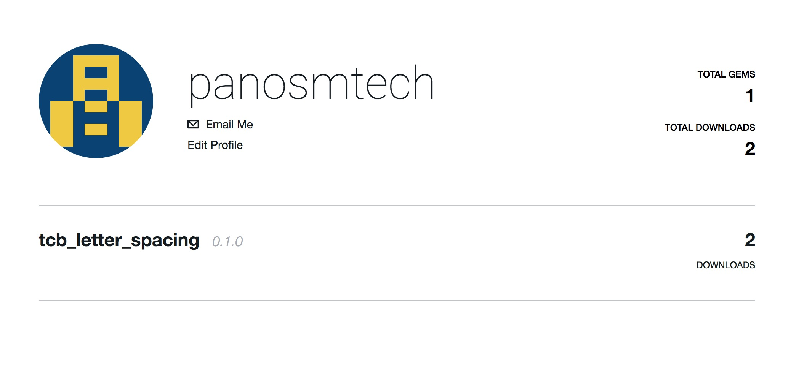

And this is the actual page of my new gem:

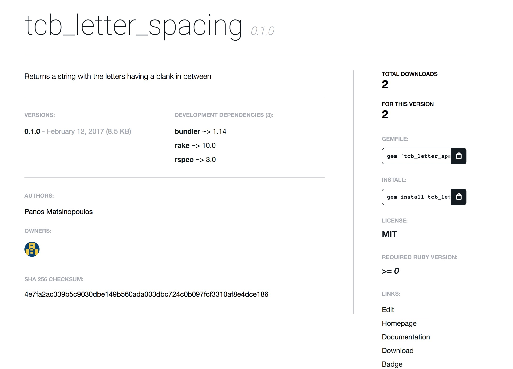

## Using Your Own Gem

Let's now write a small Ruby program that will be using our own new gem, the gem that we have just published on Rubygems.

Open a shell terminal at your working space folder and prepare your new project RVM settings:

``` bash
$ mkdir billing
$ cd billing
$ rvm use ruby-2.2.3@billing --create
ruby-2.2.3 - #gemset created /Users/panayotismatsinopoulos/.rvm/gems/ruby-2.2.3@billing
ruby-2.2.3 - #generating billing wrappers..........
Using /Users/panayotismatsinopoulos/.rvm/gems/ruby-2.2.3 with gemset billing
$ echo 'ruby-2.2.3' > .ruby-version
$ echo 'billing' > .ruby-gemset
$ cd .
$ rvm current
ruby-2.2.3@billing
$
```

Now we are on the folder `billing` and we have prepared our project to use `ruby-2.2.3@billing` gemset.

Does that gemset include the gem `tcb_letter_spacing`?

``` bash
$ gem list tcb_letter_spacing
  
  *** LOCAL GEMS ***
  
  
$
```

Definitely not.

Let's create the new project on RubyMine, pointing its source to this new `billing` project:

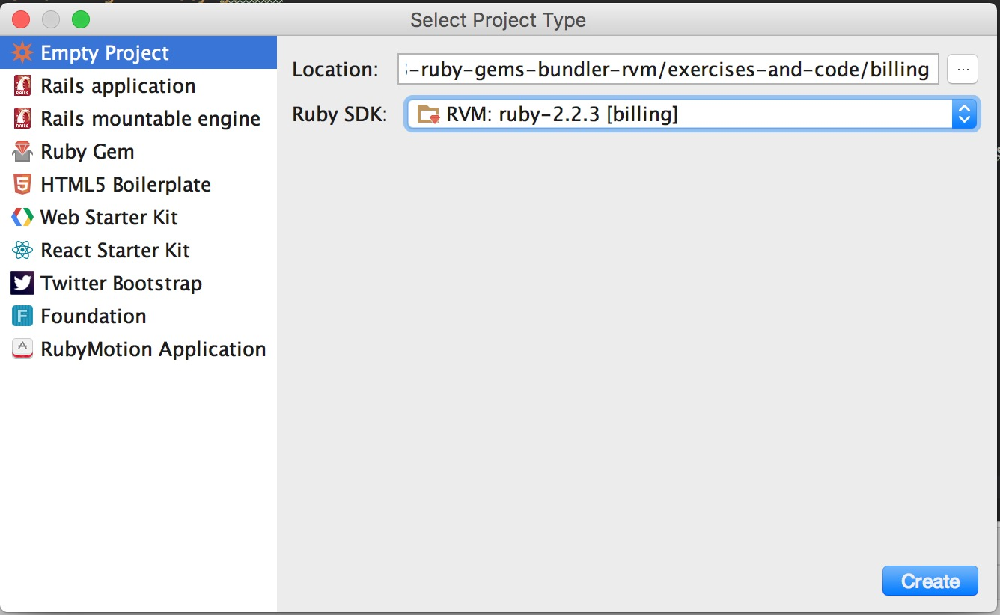

We now need to create the `Gemfile` and specify that our new project needs to use the `tcb_letter_spacing` gem:

``` ruby
1. # File: Gemfile for billing project
2. #
3. source "https://rubygems.org"
4. 
5. gem 'tcb_letter_spacing'
```

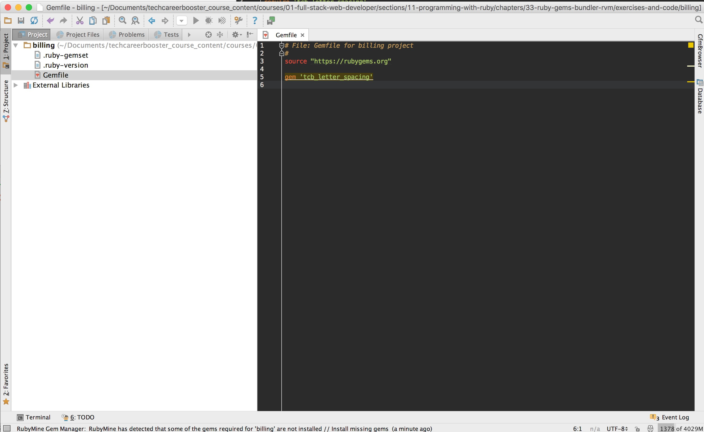

Now open a terminal from within your RubyMine project (which opens at the root folder of your project and loads the correct RVM binding files) and run the
command `bundle`:

``` bash
$ bundle
bash: bundle: command not found
$
```

The `bundle` command is not found. I guess you know why.

Let's install `bundler` gem:

``` bash
$ gem install bundler --no-ri --no-rdoc
Fetching: bundler-1.14.3.gem (100%)
Successfully installed bundler-1.14.3
1 gem installed
$
```

And now that bundler is installed, let's run `bundle` again:

``` bash
$ bundle
Fetching gem metadata from https://rubygems.org/.
Fetching version metadata from https://rubygems.org/
Resolving dependencies...
Installing tcb_letter_spacing 0.1.0
Using bundler 1.14.3
Bundle complete! 1 Gemfile dependency, 2 gems now installed.
Use `bundle show [gemname]` to see where a bundled gem is installed.
$
```

Awesome! Do you see the `Installing tcb_letter_spacing 0.1.0`. Bundler, having read your `Gemfile` requirement for the gem `tcb_letter_spacing`, it installed it
and it is now ready for your Ruby project to use it!

Let's now use the gem functionality inside the `billing` project. Create the file `billing.rb` as follows:

``` ruby
1. # File: billing.rb
2. #
3. require 'tcb_letter_spacing'
4. 
5. formatter = TcbLetterSpacing::Formatter.new('awesome')
6. puts formatter.format
```

You can see how the `billing.rb` file, in `billing` project, requires the `tcb_letter_spacing` file and then uses its features.

Try to run this program on the shell terminal of `billing` project:

``` bash
$ bundle exec ruby billing.rb
a w e s o m e 
$
```

Fantastic!

We have demonstrated how another project can use our own gem.

And this closes the first simple encounter with the gem development. Gem development has many more aspects for you to learn. Much can be found
at RubyGems documentation online.

## Github Is Gem Repository

Sometimes we may not want to publish our gem to Rubygems. In that case, how can we make our gem available to other projects. We may do it via the
Github repository of the gem. The difference being how we reference from the other project the gem instance in the Github repository.

Here it is how:

Instead of having the reference `gem 'tcb_letter_spacing'` you need to have:

`gem 'tcb_letter_spacing', git: 'git://github.com/pmatsinopoulos/tcb_letter_spacing.git'`

For the particular gem, bundler will not try to fetch it from RubyGems, but, it will fetch it from the Github repository.


## Private Gem Repositories

Besides RubyGems and Github, you may want to publish your gem to a private repository. Firstly, you need to know that Github offers you the
ability to have your repo being private. Another alternative is [Bitbucket](https://bitbucket.org/), which offers both public and private repositories.
Or [Gitlab](https://gitlab.com). Or you may want to deploy your own, in your enterprise, [gem server](http://guides.rubygems.org/run-your-own-gem-server/).
Also, have a look at [Gemfury](https://gemfury.com/) too.

## Closing Note

We would like to reference here another very popular Ruby version manager. It is called `rbenv` and you can find more about it [here](https://github.com/rbenv/rbenv).

The following video is about rubygems and bundler. You can watch it as an additional source of learning on these two subjects, covered at the beginning of this
chapter.

[RubyGems And Bundler](https://player.vimeo.com/video/203571640)
