Ruby on Rails is a Web framework that will help you develop a Web application quickly and using the latest
Web technologies. It is written in Ruby, of course, and for that reason it requires that you understand and practice Ruby.

Rails is an opinionated software. This means that it has taken some decisions before you do and believes that if you
follows things Rails suggests, then you will be hugely productive and happy. This also means that some of the practices
that you may used to from other languages or frameworks might not be applicable in Rails world.

Rails favours DRY (Do not Repeat Yourself) and Convention over Configuration. DRY is important because when you keep
things without code duplication, the maintenance effort is hugely decreased. On the other hand, if you have the same code
repeated again and again, a small change might be carried over in multiple places in your code. With regards to Convention
over Configuration, Rails believes that we should not rely on huge configuration files (see other frameworks that use XML
configuration) that would tell us how Web application should be configured, but we should rely on conventions. Developing
using conventions means that you get things for free without having to change or set up anything. In this chapter and in the
chapters that follow, it will become very obvious to you, how conventions in Rails help you do things very quickly with
minimum typing.

> **Important**: In this chapter we will not build the perfect Rails application. Many things that we will show you can 
be done much easier with Rails. But we want you to learn what happens behind the scenes so that you can understand the magic
that comes with Rails.

## Main Parts of a Ruby on Rails Web Application

Before we start our first project with Rails, let's see what are the main parts of Rails Web Applications.

### Rails server

The Rails server is the executable that will bring an HTTP Server on, at a specific port ready to accept and serve connections from
a client, usually a browser. We saw a similar thing with Rack and Sinatra in the *Introduction to Web Development* course.

We will see later on how we start Rails Server

### RDBMS

Rails is designed to work with an RDBMS (Relational Database Management System). It integrates with many RDBMS products, out of the box.
The following is a list of known RDBMS systems that integrate with Rails out of the box:

* MySQL
* Oracle
* PostgreSQL
* SQlite3
* FrontBase
* IBM DB
* MS SQL Server
* and many databases that support JDBC.

In order to build a Web application you will need to decide on your RDBMS product<sup>*</sup>. For the purposes of this course
we will use SQLite3 and PostgreSQL.

> *Your SQL Knowledge:* If you don't know the basics of SQL you will have problem developing Web applications with Ruby on Rails.
> You can learn the basics if you take the section *Relational Database Management Systems - SQL*.

<sup>*</sup> Rails integrates with NoSQL database products too, like MongoDB and Neo4J. These will be presented in next sections
of this course.

## Hello Rails!

Let's create the classic *Hello World* project. In fact, it will be *Hello Rails*. This will quickly set everything for you to create 
bare minimum Ruby on Rails application.

### Set `rvm`

We will not start a RubyMine project yet. We will first set the `rvm` gemset for our new project. Create a gemset with name
`hello_rails` and Ruby `2.X`. This is how I did that:

``` bash
$ rvm use 2.3.3@hello_rails --create
ruby-2.3.3 - #gemset created /Users/panayotismatsinopoulos/.rvm/gems/ruby-2.3.3@hello_rails
ruby-2.3.3 - #generating hello_rails wrappers..........
Using /Users/.../.rvm/gems/ruby-2.3.3 with gemset hello_rails
$
```

Then, double check that your current `rvm` is the one just created:

``` bash
$ rvm current
ruby-2.3.3@hello_rails
$
```

### Install `rails`

Rails will be installed as a gem. It will be installed in your gemset with the following command:
 
``` bash
$ gem install rails --no-ri --no-rdoc
Fetching: i18n-0.8.1.gem (100%)
Successfully installed i18n-0.8.1
Fetching: thread_safe-0.3.6.gem (100%)
Successfully installed thread_safe-0.3.6
Fetching: tzinfo-1.2.3.gem (100%)
Successfully installed tzinfo-1.2.3
Fetching: concurrent-ruby-1.0.5.gem (100%)
Successfully installed concurrent-ruby-1.0.5
Fetching: activesupport-5.1.1.gem (100%)
...
Successfully installed sprockets-rails-3.2.0
Fetching: rails-5.1.1.gem (100%)
Successfully installed rails-5.1.1
36 gems installed
$
```

When you run the above command, `gem install rails --no-ri --no-rdoc`, you will see a huge list of gems that are installed alongside with `rails`. 
Rails gem depends on many other gems. One of the dependencies is `bundler` gem, which is also installed.

Having done the installation as above, let's confirm that we have the `rails` executable ready to be invoked:

``` bash
$ rails --version
Rails 5.1.1
$
```

Great! At the time of this writing, Rails was on version 5.1.1. The above command confirms that we can invoke the `rails` executable.

### Ask Rails to Create Your Application

Now that we have `rails` installed, lets ask Rails to create the folder of our application. This is how we should do that:

``` bash
$ rails new hello_rails
      create  
      create  README.md
      create  Rakefile
      create  config.ru
      create  .gitignore
      create  Gemfile
         run  git init from "."
Initialized empty Git repository in /Users/.../hello_rails/.git/
      create  app
      create  app/assets/config/manifest.js
      create  app/assets/javascripts/application.js
...
      create  package.json
      remove  config/initializers/cors.rb
      remove  config/initializers/new_framework_defaults_5_1.rb
         run  bundle install
...
Fetching gem metadata from https://rubygems.org/.............
Fetching version metadata from https://rubygems.org/...
Fetching dependency metadata from https://rubygems.org/..
Resolving dependencies...
Installing rake 12.0.0
Using concurrent-ruby 1.0.5
...
Using rails 5.1.1
Installing sass-rails 5.0.6
Bundle complete! 16 Gemfile dependencies, 70 gems now installed.
Use `bundle show [gemname]` to see where a bundled gem is installed.
         run  bundle exec spring binstub --all
* bin/rake: spring inserted
* bin/rails: spring inserted
$
```

The command `rails new hello_rails` did a lot of things. 

1. Firstly, it created the folder `hello_rails` and a big number of files and folders inside it.
1. One of the files that it has created inside the `hello_rails` folder was the `Gemfile`. It put inside it all the
gems that your application will be relying on, besides the `rails` gem.
1. Moreover, with the `Gemfile` in place, it ran `bundle install` and installed all the gems inside your gemset.
1. Also, it initialized your application to be `git` ready, by having executed the command `git init`. Moreover
it created some files that are `git` related. The `.gitignore` files tell `git` which files will be ignored.
1. Finally, it altered the `bin/rake` and `bin/rails` scripts to be integrated with `spring`. `spring` is a files pre-loader
that is very useful while doing test driven development, because it pre-loads your application files and your tests
run faster.

### Switch To Your Application Folder

With `rails` having done the hard work to set up your application folder, you can now change directory to this new folder that has
been created.

``` bash
$ cd hello_rails
hello_rails $
```

### Freeze `rvm` Settings

Before we continue let's make sure that we have frozen the `rvm` settings, by creating the two files that integrate our project with `rvm`.

``` bash
hello_rails $ echo '2.3.3' > .ruby-version
hello_rails $ echo 'hello_rails' > .ruby-gemset
hello_rails $ cd .
hello_rails $ rvm current
ruby-2.3.3@hello_rails
```

### Do your first Commit

Also, let's integrate with `git`:

> **Important:** Before you add and commit, make sure that you update the `.gitignore` file to not include the `.idea` folder that is used by RubyMine.

``` bash
hello_rails $ git add .
hello_rails $ git commit -m "Initial Commit after rails app initialization"
[master (root-commit) 85c3dac] Initial commit after Rails app initialization
 78 files changed, 1194 insertions(+)
 create mode 100644 .gitignore
 create mode 100644 .ruby-gemset
...
 create mode 100644 test/test_helper.rb
 create mode 100644 tmp/.keep
 create mode 100644 vendor/.keep
hello_rails $
```

### Integrate with Github

Then create a new repository in your Github account and make sure that you add the Github remote. This is how I have added the Github remote
to my project:

``` bash
hello_rails $ git remote add origin git@github.com:pmatsinopoulos/hello_rails.git
hello_rails $ git push -u origin master
Counting objects: 86, done.
Delta compression using up to 8 threads.
Compressing objects: 100% (70/70), done.
Writing objects: 100% (86/86), 20.74 KiB | 0 bytes/s, done.
Total 86 (delta 2), reused 0 (delta 0)
remote: Resolving deltas: 100% (2/2), done.
To github.com:pmatsinopoulos/hello_rails.git
 * [new branch]      master -> master
Branch master set up to track remote branch master from origin.
hello_rails $
```

Now my project has a git remote. This can be confirmed with:

``` bash
hello_rails $ git remote -v
origin  git@github.com:pmatsinopoulos/hello_rails.git (fetch)
origin  git@github.com:pmatsinopoulos/hello_rails.git (push)
hello_rails $
```

### Start and Navigate To Your Application

We are ready to start our Rails server:

``` bash
hello_rails $ bin/rails server
=> Booting Puma
=> Rails 5.1.1 application starting in development on http://localhost:3000
=> Run `rails server -h` for more startup options
Puma starting in single mode...
* Version 3.8.2 (ruby 2.3.3-p222), codename: Sassy Salamander
* Min threads: 5, max threads: 5
* Environment: development
* Listening on tcp://0.0.0.0:3000
Use Ctrl-C to stop

```

You can see that your Rails server is now listening on port `3000`. Also, it tells you that you can stop your Rails server
if you click on <kbd>Ctrl+C</kbd>.

Also, you can see that the Web server that is hosting our Web application is `Puma` and the environment is `development`. We will talk
more about environments later on, but if you took the *Sinatra* chapter, environments work more or less in a similar manner.

With the Rails server up and running, let's visit the page [http://localhost:3000](http://localhost:3000). You will see this:

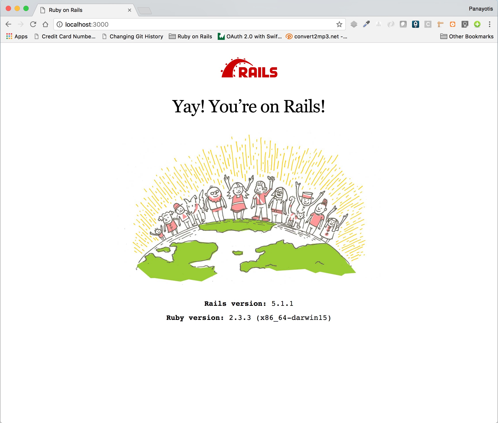

Bingo! You have just sent a request to Ruby on Rails server, to your Web application server.

If you see the messages printed at the Rails terminal, you will see these lines added:

```
Started GET "/" for 127.0.0.1 at 2017-05-14 08:45:18 +0300
Processing by Rails::WelcomeController#index as HTML
  Rendering .../.rvm/gems/ruby-2.3.3@hello_rails/gems/railties-5.1.1/lib/rails/templates/rails/welcome/index.html.erb
  Rendered .../.rvm/gems/ruby-2.3.3@hello_rails/gems/railties-5.1.1/lib/rails/templates/rails/welcome/index.html.erb (5.3ms)
Completed 200 OK in 220ms (Views: 11.3ms)
```

You can tell from the first line that the `GET "/"` has been served and some other information that we will talk you about in the
next chapters.

### Change the Welcome Page

Rails uses a default welcome page for newly created applications. How can we change this?

We will let you know here what actions you will need to take to change this. Then we will expand in explaining how this one works.

1. Open the file `config/routes.rb` and make sure the content is as follows:

 ``` ruby
 1. # File: config/routes.rb
 2. #
 3. Rails.application.routes.draw do
 4.   root 'welcome#index'
 5. end
 ```
2. Create the file `app/controllers/welcome_controller.rb`. Watch out, it is the file `welcome_controller.rb` inside
the folder `controllers` which is a folder inside the `app` folder.

 ``` ruby
 1. # File: app/controllers/welcome_controller.rb
 2. #
 3. class WelcomeController < ApplicationController
 4. end
 ```
3. Create the file `app/views/welcome` and the file `app/views/welcome/index.html.erb` with the following content:

 ``` html
 <% # File: app/views/index.html.erb %>
 <h1>Hello Rails!</h1>
 ```

Now you are ready to go. Visit the [http://localhost:3000](http://localhost:3000) page again.

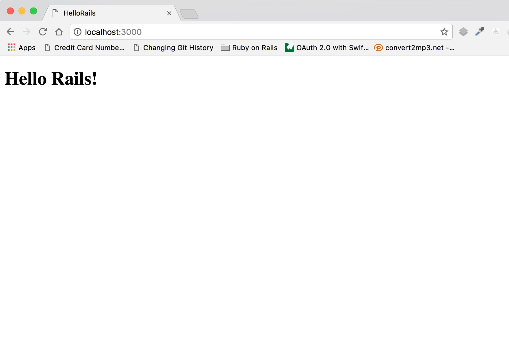

## Rails is an MVC Framework

Rails is an MVC ([Model View Controller](https://en.wikipedia.org/wiki/Model%E2%80%93view%E2%80%93controller)) Web framework.
 
1. The Views reside inside the folder tree `app/views`. The view is an HTML-like file. It is a file with extension `.html.erb`.
This means that it is a template file that uses the ERB (Embedded Ruby) language.
1. The controllers reside inside the folder tree `app/controllers`.
1. The models reside inside the folder tree `app/models`.

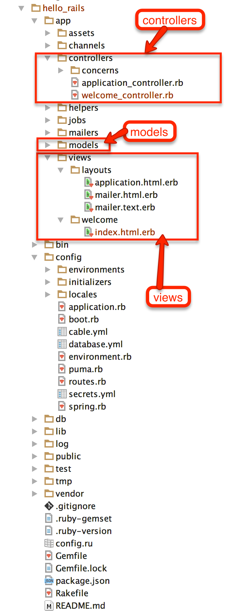

## HTTP Request Processing

Each HTTP request is being processed by a group of pieces of code that include at least controllers and views. Usually, processing
includes models too. However, there is also a very important piece of code too that is called *routing*. It is whatever we put inside the
`config/routes.rb` file:

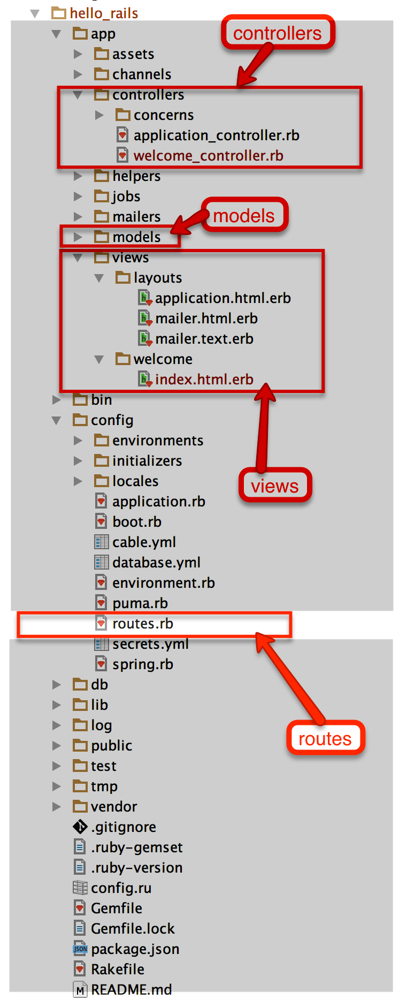

Let's see how the `GET /` for the `http://localhost:3000` *hello_rails* application has been processed. 

### Match a Route Entry

Firstly, Rails will try to match the incoming HTTP verb + path combination to a route entry. Since, when we load the page `http://localhost:3000/`, the path is `/` and the
HTTP verb is `GET`, we need to match `GET '/'` to a routes entry.


Currently our routes are defined as such:

``` ruby
1. # File: config/routes.rb
2. #
3. Rails.application.routes.draw do
4.   root 'welcome#index'
5. end
```

There is only one entry. Does it match to `GET '/'`? Yes it does. This is what the `root` method call corresponds to.

And if you want to get the actual routes that your application supports, and the ones that are actually and magically created
by the `config/routes.rb` file above, you can do this: Open a terminal at the root folder of your project and type the following
command:

``` bash
hello_rails $ bin/rake routes
Running via Spring preloader in process 4449
Prefix Verb URI Pattern Controller#Action
  root GET  /           welcome#index
hello_rails $
```

You can see that the `GET` verb alongside the `/` URI Pattern, it has only one entry in the routes table. 

### Route Entry Matches to A Controller

The routes need to tell Rails which controller will handle the incoming request.


The entry `root GET / welcome#index` tells that the `GET '/'` should be handled by the `welcome` controller. The welcome controller
should exist and should be implemented as a class `WelcomeController`. It should exist inside the `app/controllers` folder within the
file `app/controllers/welcome_controller.rb`. 


### Route Entry Matches to An Action Too

Identifying the controller from the route entry is not enough. Rails needs to identify the action too. 


The action `index` is specified by the entry `root GET / welcome#index`. The action is specified in the scope of the controller. In other words, the `welcome#index` tells
that the request should be handled by the action `index` of the `welcome` controller.

### Actions are The Public Methods of Controller

The actions are the public methods of controller. 


Since our route specifies that the request should be handled by the `index` action, then `WelcomeController` class needs to have a 
public method that has the name `index`. 

Although this is what usually happens, the action is optional. If missing the controller handles the request using a default behaviour. Nevertheless, all the
controllers derive from the `ApplicationController` class (file `app/controllers/application_controller.rb`) which, in turn, derives
from the `ActionController::Base`. In other words, `WelcomeController` bears a lot of default behaviour inherited from the Rails framework classes, one
of which is `ActionController::Base`.

If the action is missing, the controller goes directly to render the corresponding view. Otherwise, it executes the Ruby statements inside the
action implementation and then renders the corresponding view.

### After Controller, It is the View

After the execution of the Ruby statements inside the action (public method) of the Controller, Rails renders the corresponding view. What is the 
corresponding view for the Controller with name `welcome` and action `index`? 

* Rails looks inside the `app/views` sub-folders for a folder with same name as the controller name, i.e. with name `welcome`. 
* Then, inside the found folder, it tries to locate the file with same name as the action name, i.e. with name `index`. The file name extension should
be something that allows Rails to render an HTML content. By default, `.html.erb`. This means it is a file that is a view template,
that uses the template language ERB (Embedded Ruby). The ERB template language allows us to generate dynamic content within the view.

> *ERB and Dynamic Content*: This idea has been explained thoroughly in the Sinatra chapter, section *Introduction to Web Development*.

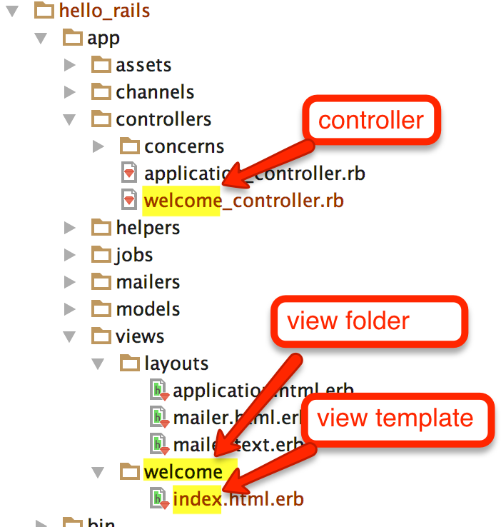

### View Embedded In Layout

If one looks carefully the content of the `app/views/welcome/index.html.erb`, they will see that this is not a proper HTML page.
It is only an HTML snippet. How does Rails view renderer know how to return back to the requesting client a proper HTML page?

It uses the *layouts*. The layout is a special view template file that resides inside the `app/views/layouts` folder.

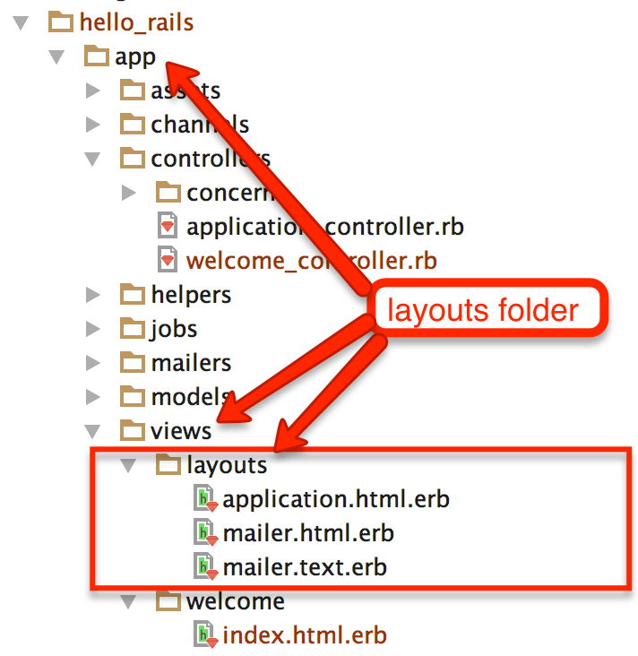

You can have more than one layout. However, the default behavior Rails has in order to pick up the layout is 

1. Tries to find the layout file with same name as the controller name. Hence, it tries to find inside the `app/views/layouts` folder
the file with name `welcome.html.erb`. 
1. If this does not exist, it tries to find a layout with the name equal to the parent of the `welcome` controller. Since the parent
class of `WelcomeController` is the class `ApplicationController`, it tries to locate the file `app/views/layouts/application.html.erb`.

In our example, the `app/views/layouts/application.html.erb` file exists and has the following content:

``` html
 1. <!DOCTYPE html>
 2. <html>
 3.   <head>
 4.     <title>HelloRails</title>
 5.     <%= csrf_meta_tags %>
 6. 
 7.     <%= stylesheet_link_tag    'application', media: 'all', 'data-turbolinks-track': 'reload' %>
 8.     <%= javascript_include_tag 'application', 'data-turbolinks-track': 'reload' %>
 9.   </head>
10. 
11.   <body>
12.     <%= yield %>
13.   </body>
14. </html>
```

This looks more like a proper HTML file. It does have embedded Ruby code that dynamically contributes to the final HTML content,
but, nevertheless, if you study that, you will identify the parts that make this a proper HTML document.

Besides the other parts of the layout that you can see in the above file, the one that is related to embedding the view
inside the layout, is the line 12, with the `<%= yield %>` command. This is the point of the layout that will be
replaced with the corresponding view template code.


### Convention Over Configuration

That was an overview of the HTTP request processing by Rails framework and your Web application that sits on top of it. Also, the whole explanation
above might have rung a bell to you about what Rails considers *convention* (over configuration).

You just experienced convention as follows:

1. Controllers live inside the `app/views/controllers` folder. E.g. `app/views/controllers/welcome_controller.rb`.
1. Actions of controllers that handle incoming requests are public methods.
1. View files that correspond to actions of controllers live in the `app/views` folder tree, and in particular inside a sub-folder that has
same name as the name of the controller. E.g. `app/views/welcome`.
1. The view files themselves, they have the same name as the action that they correspond to. E.g. `app/views/welcome/index.html.erb`.
1. Views are embedded inside a layout. The layout lives inside the folder `app/views/layouts`. It has the same name as the controller, e.g.
`app/views/layouts/welcome.html.erb` or a name equal to the name of a parent class of the controller that handles the incoming request, e.g.
`app/views/layouts/application.html.erb`.

Rails is full of conventions and the above were only some examples of this idea. Learning and following these conventions will make you 
a much happier developer.

### Double Check with Logs

While you are sending requests from your browser to your Rails server, server prints useful information on the terminal that it has
been started on. Also, it writes those logs inside the `log` folder. Look for the file `development.log`, which is the file in which logs are written
while we are in *development* environment.

For example, look what it is printed when you go to the page [http://localhost:3000](http://localhost:3000):

```
1. Started GET "/" for 127.0.0.1 at 2017-05-14 17:59:52 +0300
2. Processing by WelcomeController#index as HTML
3.   Rendering welcome/index.html.erb within layouts/application
4.   Rendered welcome/index.html.erb within layouts/application (0.3ms)
5. Completed 200 OK in 19ms (Views: 16.3ms)
```

1. It tells you that the `GET "/"` is handled by the controller `WelcomeController` and its action `index`. 
1. It tells you that it renders the view template `welcome/index.html.erb` within the layout `layouts/application.html.erb`. 
1. It tells you that it returns the HTTP response status code `200 OK`.
1. It also gives you some numbers with regards to how long it spent processing the request. In the example above, it was 19ms
out of which 16.3ms was spent in rendering the view.

Get into the habit to read the logs frequently. Logs will give you insight on how Rails works and how it processes requests.
You will be able to troubleshoot and understand the behaviour of your application.

## Another Application Example - A Blog 

We will continue our initial familiarization with Rails by developing a Blog application.

### `rvm` gemset

Firstly, we will initialize `rvm` for the `blog` Rails application. Move to the root folder in which you usually create your projects.
Then create the necessary `rvm` gemset. This is what I did:

``` bash
$ rvm use 2.3.3@blog --create
ruby-2.3.3 - #gemset created /Users/.../.rvm/gems/ruby-2.3.3@blog
ruby-2.3.3 - #generating blog wrappers..........
Using /Users/.../.rvm/gems/ruby-2.3.3 with gemset blog
$ rvm current
ruby-2.3.3@blog
```

### Install `rails`
 
Being in the correct gemset, we install `rails`.

``` bash
$ gem install rails --no-ri --no-rdoc
...
Successfully installed rails-5.1.1
36 gems installed
$
```

### Initialize `blog` with `rails`

Now that we have Rails installed, let's initialize our `blog` application.

``` bash
$ rails new blog
      create  
      create  README.md
      create  Rakefile
      create  config.ru
      create  .gitignore
      create  Gemfile
         run  git init from "."
...
Using sass-rails 5.0.6
Bundle complete! 16 Gemfile dependencies, 70 gems now installed.
Use `bundle show [gemname]` to see where a bundled gem is installed.
         run  bundle exec spring binstub --all
* bin/rake: spring inserted
* bin/rails: spring inserted
$
```

This will create the folder `blog` with all the necessary folders and files in order for you to start your blog application
development in Rails.

### Freeze `rvm` Settings

Now we `cd` to our new application folder, `blog`, and we create the files necessary for `rvm` to freeze Ruby version and gemset.

``` bash
$ cd blog
blog $ echo '2.3.3' > .ruby-version
blog $ echo 'blog' > .ruby-gemset
blog $ rvm current
ruby-2.3.3@blog
blog $
```

### Integration With `Git`

> **Important:** Before you add and commit files, make sure that the file `.gitignore` has one entry for `.idea` so that your `git` 
command line ignores the folder with the files that are generated and managed by RubyMine.

You can now do `git add .` and then `git commit ...` to create your first commit with all the files of your application in.

``` bash
blog $ git add .
blog $ git commit -m "Initial Commit"
[master (root-commit) 53c7d76] Initial Commit
 78 files changed, 1194 insertions(+)
 create mode 100644 .gitignore
 create mode 100644 .ruby-gemset
 create mode 100644 .ruby-version
...
 create mode 100644 test/system/.keep
 create mode 100644 test/test_helper.rb
 create mode 100644 tmp/.keep
 create mode 100644 vendor/.keep
blog $
```

### Integrate with Github

Create a new Github repository and add a new remote to your local git configuration. This is how I did that:

``` bash
blog $ git remote add origin git@github.com:pmatsinopoulos/blog.git
```

Then push your first commit to remote:

``` bash
blog $ git push -u origin master
```

### Resources

Rails is heavily based around *resources*. A *resource* is a set of similar things. For example in our blog application
a resource is the *Article*. A *resource* is something that is being managed by the Web application. When we say *managed*
we mean *created*, *retrieved*, *updated* and *deleted* (CRUD).

> **RESTful Services**: Since we have just talked about resources, you may want to have a look at *REST* and what it is
really about. One of the properties of REST APIs is that they are *resource-based*. We have found [this reference here](http://www.restapitutorial.com/lessons/whatisrest.html) 
being quite accurate and worth watching.

### CRUD and HTTP API
 
Our Web application is a server application that has to talk HTTP to the clients connected. If we want to follow the
principles of RESTful architectures, we need our Web application to expose an HTTP API that is resource-based. Let's see what
we really mean with this, by assuming that our blog application needs to *manage* an *Article* resource.

#### Create - (C)
 
User should be able to create an Article. Usually, when a user wants to create an Article, first, they need to be presented with a 
page that would allow them to enter and submit the details of an Article. In fact, the interaction of the user browser to the 
Web application is more or less this:

1. Browser asks Web application to return back the page that will allow the user to enter and submit the Article details.
2. Browser submits the Article details to the endpoint that the page specifies.
3. Web application takes the details of the Article and creates the new Article.
4. Web application returns back to the browser the content of a new page that informs the user that the Article has been created.

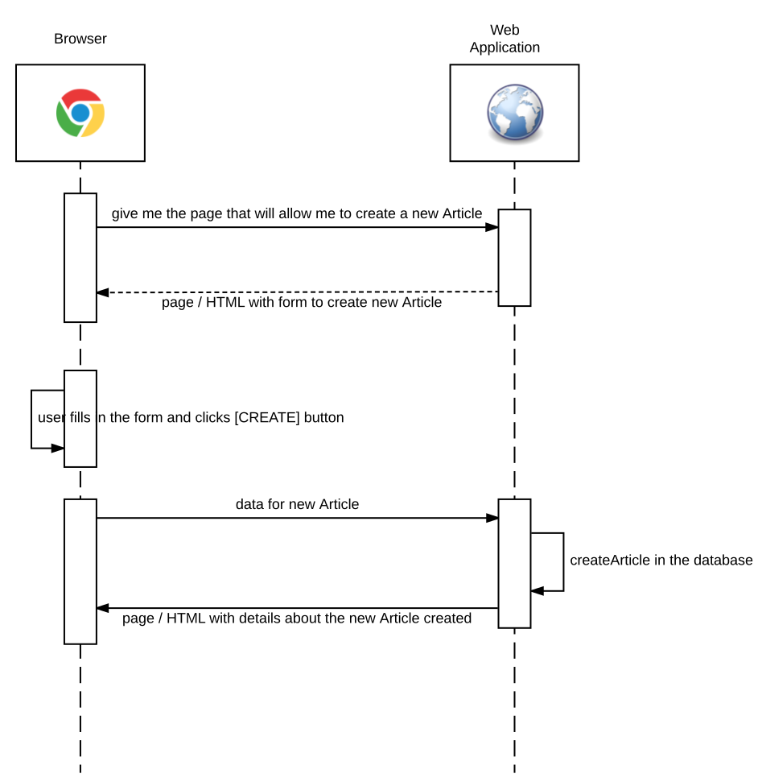

##### Getting Page With Article Creation Form

As you can see above, the first thing a browser does is to ask Web application to return back the page that will allow the user
to enter and submit details of the new Article. How is this request, `give me the page that will allow me to create a new Article`, translated
to technical terms?

It is an HTTP request. Correct? And all HTTP requests need to include an HTTP Verb and a URI that will identify the resource the verb will act upon.

What about this?

`./images/new`

We use the verb `GET` because we want to retrieve a page. We do not want to change the state of the resource. We use the `/articles/new` to tell
our Web application that we want to create a new Article. As simple as that!


How is this translated to Rails terms? We need to create the correct *route* inside the `config/routes.rb` file. This is how we declare the endpoints
and the controllers + actions to handle the HTTP requests.

Let's do it. This is the new version of the `config/routes.rb` file in your `blog` project:

``` ruby
1. # File: config/routes.rb
2. #
3. Rails.application.routes.draw do
4.   get 'articles/new'
5. end
```

I guess that the line `get 'articles/new'` is quite self-explanatory now. 

Let's run the command that prints the current routes of our Web application so that we understand which endpoints are being served by which
controllers and actions:

``` bash
blog $ bin/rake routes
Running via Spring preloader in process 12870
      Prefix Verb URI Pattern             Controller#Action
articles_new GET  /articles/new(.:format) articles#new
blog $
```

Rails was clever enough to tell from the `config/routes.rb` entry that we have added, which is going to be the controller and its action to
handle this request.

If you start your Rails server now ....

``` bash
blog $ bin/rails server
=> Booting Puma
=> Rails 5.1.1 application starting in development on http://localhost:3000
=> Run `rails server -h` for more startup options
Puma starting in single mode...
* Version 3.8.2 (ruby 2.3.3-p222), codename: Sassy Salamander
* Min threads: 5, max threads: 5
* Environment: development
* Listening on tcp://0.0.0.0:3000
Use Ctrl-C to stop

```

and then visit the page [http://localhost:3000/articles/new](http://localhost:3000/articles/new), you will certainly get an error page like this:


That was expected, because we have not defined our controller, the `ArticlesController` class.

Let's do that. Create the file `app/controllers/articles_controller.rb` in your `blog` application, with the following content:

``` ruby
1. # File: app/controllers/articles_controller.rb
2. #
3. class ArticlesController < ApplicationController
4. end
```

When you do that, then reload the page on your browser. You will get this error:


That was expected too. We don't have any `new` action defined in the `ArticlesController`. 

Let's create the action. The action is going to be a public method in the `ArticlesController`:

``` ruby
1. # File: app/controllers/articles_controller.rb
2. #
3. class ArticlesController < ApplicationController
4.   def new
5.   end
6. end
```

Lines 4 and 5, above, define the `new` action inside the `ArticlesController`. We currently have this as an empty action.

Let's reload the page on our browser. This is what we will see:


That was expected too. Remember that we need a view template in order to build an HTTP response with HTML content.

Let's create the view template now. Create the folder `app/views/articles` and then the file `app/views/articles/new.html.erb` with the following content:

``` html
 1. <% # File: app/views/articles/new.html.erb %>
 2. 
 3. <h1>Create a New Article</h1>
 4. <form>
 5.   <div>
 6.     <label for="title">Title:</label>
 7.     <input type="text" id="title" name="title" placeholder="Give Title of Article"/>
 8.   </div>
 9. 
10.   <div>
11.     <label for="text">Text:</label>
12.     <textarea id="text" name="text" placeholder="Type in the text of the Article"></textarea>
13.   </div>
14. 
15.   <div>
16.     <button type="submit">Create Article</button>
17.   </div>
18. </form>
```

This is pretty straightforward. Save the above and reload the page on your browser. You will see something like this:

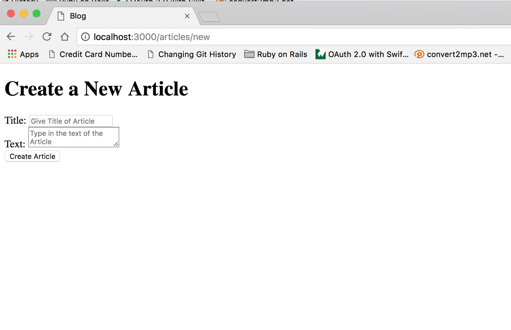

And this is the point at which we have implemented the first version of the Web application response to the `./images/new` request:


##### Submitting the Form

But, the form is missing stuff. It cannot be used for submission like this. Two things that are necessary are the `method` and the `action`.
The `method` needs to be the HTTP verb that will tell Web application that data submitted should be used for the *creation* of a new Article.
`action` needs to be the URI that would tell us which resource the HTTP request refers to. 

Let's enhance our form to be as follows:

``` html
 1. <% # File: app/views/articles/new.html.erb %>
 2. 
 3. <h1>Create a New Article</h1>
 4. <form method="post" action="/articles">
 5.   <div>
 6.     <label for="title">Title:</label>
 7.     <input type="text" id="title" name="title" placeholder="Give Title of Article"/>
 8.   </div>
 9. 
10.   <div>
11.     <label for="text">Text:</label>
12.     <textarea id="text" name="text" placeholder="Type in the text of the Article"></textarea>
13.   </div>
14. 
15.   <div>
16.     <button type="submit">Create Article</button>
17.   </div>
18. </form>
```

Currently, the only change is on line 4, where we specify the `method` being `post` and the `action` being `/articles`. We have
learned that the HTTP verb for creating resources is `POST` and that is why we have set `method` to have the value `post`.
The `/articles` is a good resource URI that, with the HTTP verb combined, can clearly tell Web server that we want to create
a new Article. In other words, `POST /articles` is the endpoint at which we are going to post the data of the form.

With the above file saved, fill in the form with some data, for example `Ruby Hashes` for `title` and `This is an article for Ruby Hashes` in the
`text`, and click on the button `Create Article`. This is what you will get:

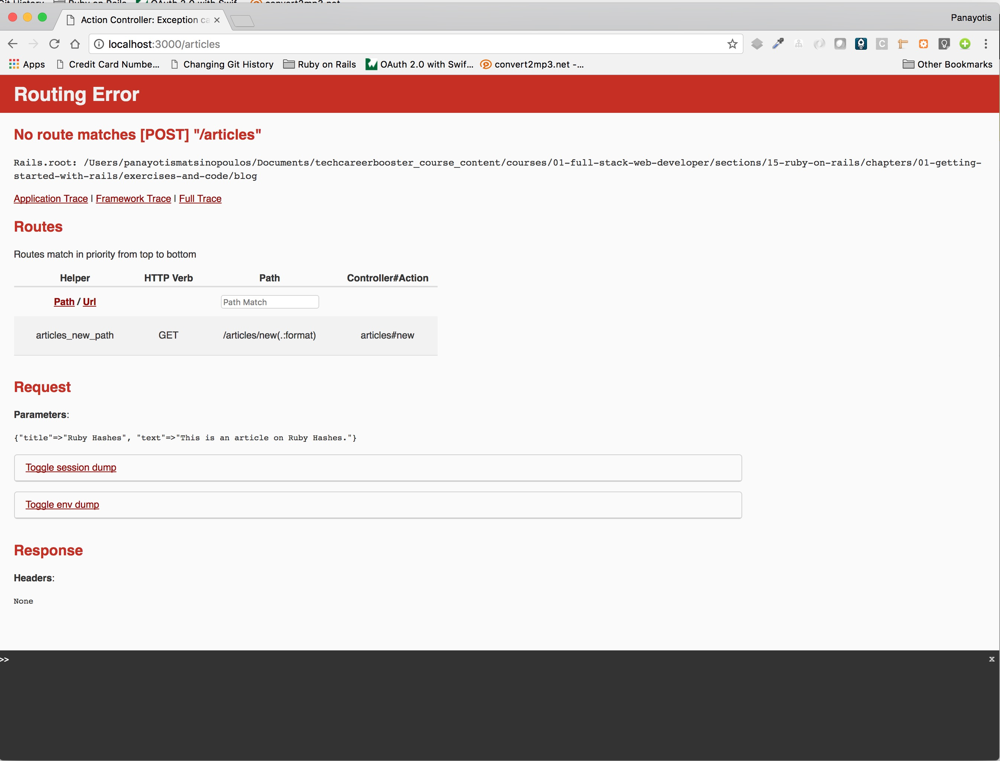

Expected! Our routes does not include any entry to handle the `POST /articles` HTTP request. Let's create one:

``` ruby
1. # File: config/routes.rb
2. #
3. Rails.application.routes.draw do
4.   get 'articles/new'
5.   post 'articles', to: 'articles#create'
6. end
```

The new entry here is the line 5, `post 'articles', to: 'articles#create'`. Note that although line 4 was enough for Rails to 
derive the controller and the action, line 5 `post 'articles'` was not enough. That's why we had to add the `to: 'articles#create'`
argument too.

Now, if you run the tool to get the list of currently defined routes, you will get this:

``` bash
blog $ bin/rake routes
Running via Spring preloader in process 21312
      Prefix Verb URI Pattern             Controller#Action
articles_new GET  /articles/new(.:format) articles#new
    articles POST /articles(.:format)     articles#create
blog $
```

Perfect! It seems that we now have the endpoint `POST /articles` covered. It will be handled by `articles` controller `create` action.

Of course, resubmitting the form, will raise another error, that of the `create` action missing. Let's add this too.

``` bash
1. # File: app/controllers/articles_controller.rb
2. #
3. class ArticlesController < ApplicationController
4.   def new
5.   end
6.   
7.   def create
8.   end
9. end
```

Submitting the form will raise an error again. Is it that the `create` action is missing a corresponding view template file.
The truth is that this is not the case yet.

Let's try to submit the form. Note that the view template is still missing.


Hmmm! `./images/Invalid Authenticity Token`. This is raised by the Rails framework. When Rails receives a POST request, it makes sure that 
this is coming from your site, i.e. from the site that actually loaded the form, by checking for the *authenticity token* submitted
alongside your data. The authenticity token needs to be a hidden field in your form and needs to have the same value like the
one that is carefully hidden inside the *session* that Rails has started with your browser.

But how can we fill in this hidden field with the correct value?


There is a method that you can call that will generate the correct authenticity token value. It is the `form_authenticity_token` method. Let's change our
view that generates the form to have this hidden field with the correct value in, generated by this method call:

``` ruby
 1. <% # File: app/views/articles/new.html.erb %>
 2. 
 3. <h1>Create a New Article</h1>
 4. <form method="post" action="/articles">
 5.   <input type="hidden" id="authenticity-token" name="authenticity_token" value="<%= form_authenticity_token %>"/>
 6.   <div>
 7.     <label for="title">Title:</label>
 8.     <input type="text" id="title" name="title" placeholder="Give Title of Article"/>
 9.   </div>
10. 
11.   <div>
12.     <label for="text">Text:</label>
13.     <textarea id="text" name="text" placeholder="Type in the text of the Article"></textarea>
14.   </div>
15. 
16.   <div>
17.     <button type="submit">Create Article</button>
18.   </div>
19. </form>
```

Do you see line 5? We have amended it so that the value for the `authenticity_token` is generated at the server-side using the
method `form_authenticity_token`.

Now, if you submit the form, you will not actually see the error, but, yet, you will not see anything changing. You will see again
the same form rendered with the values that you have keyed in intact. So, what did actually happen?

If you look carefully at the Rails server logs, you will see something like this:

```
Started POST "/articles" for 127.0.0.1 at 2017-05-18 22:50:58 +0300
Processing by ArticlesController#create as HTML
  Parameters: {"authenticity_token"=>"jSW02x6mO4jXUDOgzey5BY0GCISC9YyMYFX6mJhpsAO1EPuOZLKXBd/lhkRd+DVBhewMQNmZ4SQuPdcD1YColg==", "title"=>"Ruby Hashes", "text"=>"Ruby Hash is a bucket with key value store."}
No template found for ArticlesController#create, rendering head :no_content
Completed 204 No Content in 76ms
```

What we can tell from the above is the following:

1. Rails server didn't find any view template to render for the `create` action. Which is true, because we have not created any.
2. In the absence of this view template, Rails server decided to respond with the HTTP status code `204` with response reason `No Content`.
3. The HTTP response didn't have any body that could be used for rendering. See the `head` call? It means that it returned an
HTTP response with no response body.

> *HTTP Status Codes*: We have talked a lot about [these](https://en.wikipedia.org/wiki/List_of_HTTP_status_codes). Look for the `204` code.

However, we could have had a view template for `create` action. Let's do that. Let's create the file `app/views/articles/create.html.erb` with 
the following content:

``` html
1. <% # File: app/views/articles/create.html.erb %>
2. 
3. <h1>The new Article has been created.</h1>
4. <a href="/articles/new">Create Another One</a>
```

Now, if you submit your form, you will then be presented with the following page:

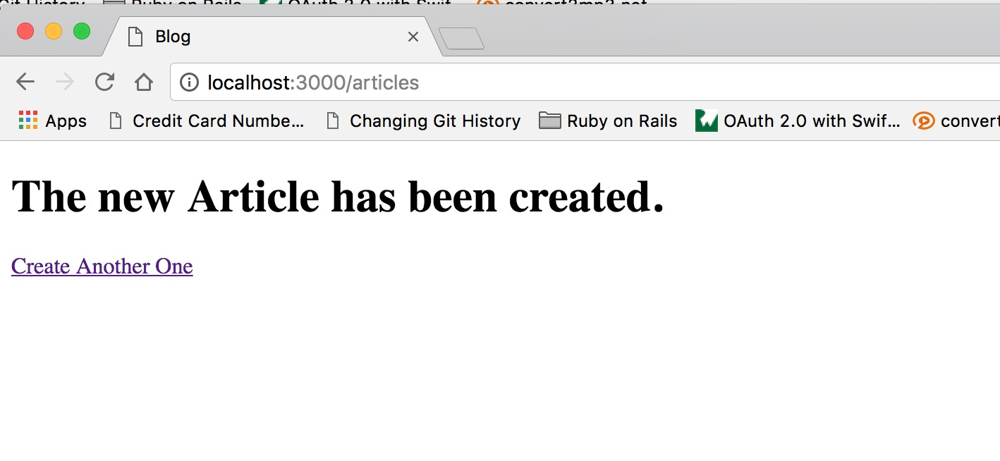

Nice! This is much more informative that our `create` action succeeded. Also, you can see the corresponding logs that now look like this:

```
Started POST "/articles" for 127.0.0.1 at 2017-05-18 23:10:43 +0300
Processing by ArticlesController#create as HTML
  Parameters: {"authenticity_token"=>"jSW02x6mO4jXUDOgzey5BY0GCISC9YyMYFX6mJhpsAO1EPuOZLKXBd/lhkRd+DVBhewMQNmZ4SQuPdcD1YColg==", "title"=>"Ruby Hashes", "text"=>"Ruby Hash is a bucket with key value store."}
  Rendering articles/create.html.erb within layouts/application
  Rendered articles/create.html.erb within layouts/application (0.5ms)
Completed 200 OK in 21ms (Views: 19.2ms)
```

The HTTP response was `200 OK` and we have rendered `articles/create.html.erb` within the layout `layouts/application.html.erb`.

We have finally closed the loop and we have implemented the `POST /articles` and the response back to browser:


##### Article Creation in Database Is Missing

Our Web application informs user that the Article has been created. But was it indeed created? Where was it created?

It's about time to bring the part of the *database* into the loop. No, the new Article was not created, because we have not 
bound the controller action `create` to any database creation actions. 

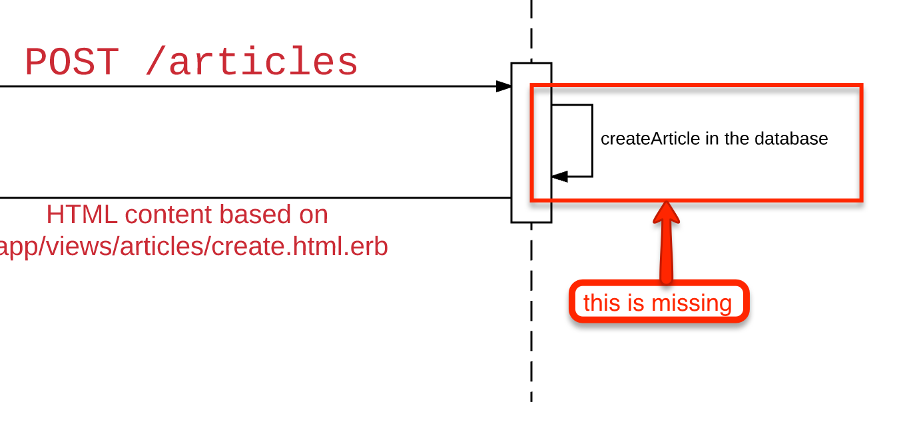

##### Initialize Database

Before our Web application can use the database, we need to `create` it. Let's issue the following command:

``` bash
blog $ bin/rake db:create
Running via Spring preloader in process 27043
Created database 'db/development.sqlite3'
Created database 'db/test.sqlite3'
blog $
```

You can see that this command created two SQLite3 databases. One in `db/development.sqlite3` and one in `db/test.sqlite3`. 

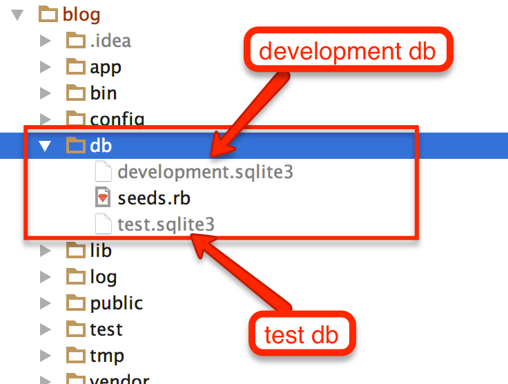

Please, pay attention to the following. Our blog application was initialized with the command `rails new blog`. This assumed that your
database was going to be an SQLite3 database. That is why now, that we start our integration with database, the `bin/rake db:create` command
created two SQLite3 databases. Also, the SQLite3 databases are files that reside in the folder tree of our Web application and they are not
managed by a remote database management system. If you want to read more about SQLite3 visit the page [SQLite](https://www.sqlite.org/).
In this course, we will work with SQLite, MySQL and PostgreSQL databases.

##### Create Table

Before you can save Articles into the database, you will have to create the corresponding table. Rails allows us to create tables in the
database with a mechanism which is called *schema migrations*. We will spend a lot of time on these later on. For the time being, let's create
a schema migration that will allow us to create the table `articles` that will be holding the Articles created by our Web application.

Run the following command on your terminal prompt:

``` bash
blog $ bin/rails generate migration create_articles
Running via Spring preloader in process 27331
      invoke  active_record
      create    db/migrate/20170519062431_create_articles.rb
blog $      
```

This command does not do anything to your database. But it creates a file that will allow us to tell how our `articles` table needs
to be. The file that was created was `db/migrate/20170519062431_create_articles.rb`. Note that in your case, the timestamp is going
to be different. The schema migration file is a Ruby file with the following contents:

``` ruby
1. # File: db/migrate/20170519062431_create_articles.rb
2. #
3. class CreateArticles < ActiveRecord::Migration[5.1]
4.   def change
5.     create_table :articles do |t|
6.     end
7.   end
8. end
```

Our obligation now is to fill in the body of the block given to `create_table`, lines 5 to 6. We will add some Ruby statements
that will tell Rails how our table needs to be.

Update the contents of the above file to be as follows:

``` ruby
 1. # File: db/migrate/20170519062431_create_articles.rb
 2. #
 3. class CreateArticles < ActiveRecord::Migration[5.1]
 4.   def change
 5.     create_table :articles do |t|
 6.       t.string :title
 7.       t.text   :text
 8. 
 9.       t.timestamps
10.     end
11.   end
12. end
```

You can see that we have added lines 6 till 9. These lines tell Rails that we want the table to have:

1. One column with name `title` and of type `string`.
1. One column with name `text` and of type `text`.
1. Two columns to work as create and update timestamps. The command `t.timestamps` is translated to the creation of two
columns, one with name `created_at` and another one with name `updated_at` that would be automatically updated whenever
the row is created and/or updated. It is a good practice to add these columns on every table that you create.

Something else that is not obvious from the above code is that Rails creates one more column in the `articles` table. It is the
`id` column which is going to be the primary key of the table.

Now that we have told Rails how we want our `articles` table to be, let's ask Rails to create this table. We are going to use
another `rake` task for this:

``` bash
blog $ bin/rake db:migrate
== 20170519062431 CreateArticles: migrating ===================================
-- create_table(:articles)
   -> 0.0020s
== 20170519062431 CreateArticles: migrated (0.0020s) ==========================
blog $
```

If everything goes ok, you will see something like the above. The schema migration has been executed and it has created the
table `articles`. 

We can confirm that by starting an SQLite command line interface to our `db/development.sqlite3` database. This is how you can
do that. Start the SQLite command line interface by giving the following command on your project root terminal:

``` bash
blog $ sqlite3 db/development.sqlite3
SQLite version 3.8.10.2 2015-05-20 18:17:19
Enter ".help" for usage hints.
sqlite> 
```

Then issue the following command to count the number of articles in your database:

``` sqlite
sqlite> select count(*) from articles;
0
sqlite>
```

Perfect! You can leave this terminal open until we create some articles. We will use it to confirm the proper creation.

##### Create Model

But tables are constructs in the RDBMS world. We need to map those constructs to Ruby objects and be able to manipulate the
database (create, retrieve, update, delete) using the Ruby objects instead of direct SQL. Rails offers the library which
is called `ActiveRecord` which, besides many other things, it allows us to bind a Ruby class to an SQL table.

Here is where we start using the idea of the *Model*. Let's create the file `app/models/article.rb` with the following content:

``` ruby
1. # File: app/models/article.rb
2. #
3. class Article < ApplicationRecord
4. end
```

A simple class, called `Article` that derives from another class that it is already in our project, the `ApplicationRecord` (living
in the file `app/models/application_record.rb`). All `ApplicationRecord` instances will derive from `ActiveRecord::Base` which
gives, for free, a lot of functionality, including ability to create, retrieve, update and delete records from the corresponding table.

##### Amend `create` Action

With the table and the model in place, we can now amend the `create` action to actually create the Article that the user wants
to create with the submission of the form. Here is the new version of the `create` public method of the `ArticlesController`:

``` ruby
 1. # File: app/controllers/articles_controller.rb
 2. #
 3. class ArticlesController < ApplicationController
 4.   def new
 5.   end
 6. 
 7.   def create
 8.     article = Article.new
 9.     article.title = params[:title]
10.     article.text = params[:text]
11. 
12.     article.save
13.   end
14. end
```

Look how we have implemented the `create` method. It is very simple.

1. On line 8 we instantiate an `Article` instance.
2. On lines 9 and 10 we set its properties with the corresponding values coming in from `params`. Note that `params` hold the parameters
that are coming from the HTTP request.
3. On line 12, we just call `#save` and the instance is created into the database.

> **Important**: This is a very simplified version of a create implementation. This should not go to production like this and we will later 
on learn how we should write proper, production-ready, create methods.

Look also at the Rails server logs that were output when we submitted the form:

``` bash
Started POST "/articles" for 127.0.0.1 at 2017-05-19 14:20:19 +0300
Processing by ArticlesController#create as HTML
  Parameters: {"authenticity_token"=>"eTJy3aH5khdU5zMwrVJnB2xovhSMZhsQepuX4aHbNtNBBz2I2+0+mlxShtQ9RutDZIK60NcKdrg087p67DIuRg==", "title"=>"Ruby Hashes", "text"=>"Ruby Hash is a key/value bucket store."}
   (0.1ms)  begin transaction
  SQL (0.8ms)  INSERT INTO "articles" ("title", "text", "created_at", "updated_at") VALUES (?, ?, ?, ?)  [["title", "Ruby Hashes"], ["text", "Ruby Hashes"], ["created_at", "2017-05-19 11:20:19.789470"], ["updated_at", "2017-05-19 11:20:19.789470"]]
   (0.4ms)  commit transaction
  Rendering articles/create.html.erb within layouts/application
  Rendered articles/create.html.erb within layouts/application (0.6ms)
Completed 200 OK in 39ms (Views: 19.5ms | ActiveRecord: 1.9ms)
```

1. Do you see the `Hash` with the parameters? The hash you see logged is the one that you can access with the `params` method. Do you see that it has the `title` and `text` keys
with the values being the values we used to fill in the form for Article creation?
1. Do you see the SQL statement that was automatically generated and executed? `INSERT INTO "articles" ....`. This is the magic of `ActiveRecord`. 

Note that on lines 9 and 10 in the `create` method we access the columns of the table `articles` with corresponding setter methods in the `Article` model.
Even if we have not declared these setter methods, `ActiveRecord` does this for us automatically by inspecting on the table `articles` definition. 
Looking into its definition it can find out which are the columns and allow us to use the corresponding setter and getter methods.

##### Confirm on SQLite Command Line

And we can now confirm that the article has been created into the database, using the SQLite command line interface:

``` sql
sqlite> select count(*) from articles;
1
sqlite> select * from articles;
1|Ruby Hashes|Ruby Hashes|2017-05-19 11:20:19.789470|2017-05-19 11:20:19.789470
sqlite> 
```

> *Side Note:* Earlier we have used two of the most popular commands in Rails development:
>
> 1. `bin/rake ....`
> 2. `bin/rails generate ....`
>
> Many batch type commands are provided by Rake tasks and you can see all the available rake tasks if you run `bin/rake --tasks`.
> On the other hand, the `bin/rails generate` is another type of commands that usually generate Ruby code for you. You can invoke the
> command `bin/rails generate` in order to get the list of all the available generators. We have used the `migration` one.

#### Retrieve - (R)

The above closes the Create part of the *management* of a resource, like the `Article`. Now that we have an Article created, another 
management action that we need to have a look at is the *retrieve (R)* action.

With the retrieve, we want to fetch a particular resource and display its information to the user. This is what we usually do when
we fetch a Web page, and as you can imagine, we are talking here about another `GET` case.

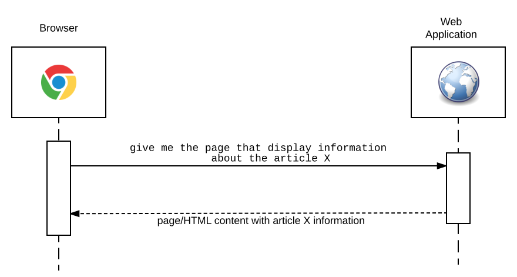

##### Routes

First thing that we have to do is to amend our routes in order to expose an endpoint that would refer to a specific article. Here is how
we do that:

``` ruby
1. # File: config/routes.rb
2. #
3. Rails.application.routes.draw do
4.   get 'articles/new'
5.   post 'articles', to: 'articles#create'
6.   get 'articles/:id', to: 'articles#show'
7. end
```

Look at line number 6. `get 'articles/:id', to: 'articles#show'`. The `:id` is a placeholder that would be used to refer to a specific
article. It is the responsibility of the `show` action that will handle the request, to take the actual value and fetch the correct
article from the database. In other words, if the user requests `/articles/15`, then the `show` action will have to retrieve the
article with id `15` and make sure it returns back a page that displays the information for this particular article. If the user requests
`/articles/1`, then `show` will fetch details for article with id `1`, and so on.

You can confirm the routes table if you run:

``` bash
blog $ bin/rake routes
Running via Spring preloader in process 32096
      Prefix Verb URI Pattern             Controller#Action
articles_new GET  /articles/new(.:format) articles#new
    articles POST /articles(.:format)     articles#create
             GET  /articles/:id(.:format) articles#show
blog $
```

You can see the last `GET /articles/:id` entry that takes us to the `articles` controller `show` action.

##### Show Action

With the above routes in place, let's visit the URL of an article. If you see the contents of the table `articles`, you
will see that the single article in, it has the id with value `1`:

``` sql
sqlite> select * from articles;
1|Ruby Hashes|Ruby Hashes|2017-05-19 11:20:19.789470|2017-05-19 11:20:19.789470
sqlite> 
```

Look at the first column. But if your article has another id, then use that one instead.
 
Visit the page [http://localhost:3000/articles/1](http://localhost:3000/articles/1). What do you see? You get an error that the `show` action
does not exist in the Articles controller. Which was expected.

Let's implement the `show` action. This is the new version of the `ArticlesController`:

``` ruby
 1. # File: app/controllers/articles_controller.rb
 2. #
 3. class ArticlesController < ApplicationController
 4.   def new
 5.   end
 6. 
 7.   def create
 8.     article = Article.new
 9.     article.title = params[:title]
10.     article.text = params[:text]
11. 
12.     article.save
13.   end
14. 
15.   def show
16.     @article = Article.find(params[:id])
17.   end
18. end
```

You can see the new lines, 15 till 17. The implementation is very simply. We are using the `ActiveRecord` `#find` method, which
takes as input an id and tries to locate the row with the given id in the database. See how `params` is holding the value of
the `:id` part of the URI path, which is pretty cool!

Note also that we save the result into an instance variable `@article`. This is necessary because we will use the instance variable
to fill in the dynamic information of the corresponding view later on. We used the same technique when we worked with Sinatra in the Sinatra
chapter.

##### Show View

If we refresh the page [http://localhost:3000/articles/1](http://localhost:3000/articles/1), we will now get the error that the `show` action
is missing a view template. Let's create the file `app/views/articles/show.html.erb`.

``` html
 1. <% # File: app/views/articles/show.html.erb %>
 2. 
 3. <div>
 4.   <strong>ID:</strong> <%= @article.id %>
 5. </div>
 6. 
 7. <div>
 8.   <strong>Title:</strong> <%= @article.title %>
 9. </div>
10. 
11. <hr/>
12. 
13. <div><strong>Text:</strong></div>
14. <div>
15.   <%= @article.text %>
16. </div>
```

This is pretty simple. Do you see the dynamic parts? These are the parts that are built with the help of ERB code. Inside the ERB blocks,
we use the instance variable `@article` as this is the variable that has been instantiated by the `show` action of the `ArticlesController`.
So, `@article.id` is used to print the id of the Article, `@article.title` is used to print the title of the Article and, finally, `@article.text`
is used to print the text of the article.

Now, if you refresh the page on your browser, you will get something like this:


Nice! And this closes the loop for the retrieve (R) management action.

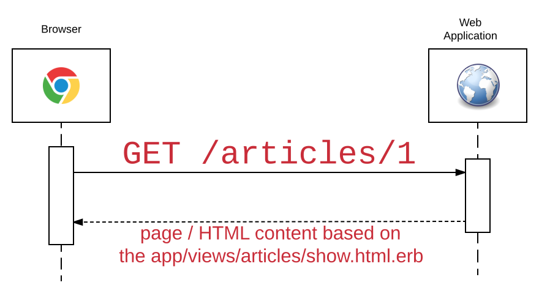

#### Retrieve Many

But, besides the action to retrieve 1 specific resource, we may equally well want to retrieve many resources of the same type. For example, we might want
to retrieve all the Articles in our database.


##### Routes

Obviously, we need a `GET` request again. But what is going to be the URI to refer to all articles. This is very easy: `/articles`. Let's
add this endpoint inside our routes file.

``` ruby
1. # File: config/routes.rb
2. #
3. Rails.application.routes.draw do
4.   get 'articles/new'
5.   post 'articles', to: 'articles#create'
6.   get 'articles/:id', to: 'articles#show'
7.   get 'articles', to: 'articles#index'
8. end
```

It is the line 7 that we have added. The `get 'articles'` HTTP endpoint will be handled by the `articles` controller and its action `index`. This is
the Rails convention for this kind of endpoints. 

##### Implement `index` Action

Let's now implement the `index` action.

``` ruby
 1. # File: app/controllers/articles_controller.rb
 2. #
 3. class ArticlesController < ApplicationController
 4.   def new
 5.   end
 6. 
 7.   def create
 8.     article = Article.new
 9.     article.title = params[:title]
10.     article.text = params[:text]
11. 
12.     article.save
13.   end
14. 
15.   def show
16.     @article = Article.find(params[:id])
17.   end
18. 
19.   def index
20.     @articles = Article.all
21.   end
22. end
```

We have added lines 19 to 21. The implementation is very simple. We call `Article.all`, which is a way to access all the
Articles in the database and we save the result into an instance variable with name `@articles`. Again, we need the instance
variable in order to use it in the corresponding `index` view that will build the HTML content for the response back to the
client browser. 

##### View Template for `index` Action

Let's now add the view template for the `index` action of the articles controller. Create the file `app/views/articles/index.html.erb`
with the following content:

``` html
 1. <% # File: app/views/articles/index.html.erb %>
 2. 
 3. <h1>List Of Articles</h1>
 4. 
 5. <table>
 6.   <thead>
 7.     <tr><th>ID</th><th>Title</th><th>Text</th></tr>
 8.   </thead>
 9.   <tbody>
10.     <% @articles.each do |article| %>
11.       <tr><td><%= article.id %></td><td><%= article.title %></td><td><%= article.text %></td></tr>
12.     <% end %>
13.   </tbody>
14. </table>
```

Using the instance variable `@articles`, we use ERB to iterate over the collection of articles. For each one of the articles,
which is referenced by the block variable `article`, we print an HTML table row `<tr>...</tr>` with the details of the
article. See how we use snippets of ERB to print the id, the title and the text of the article at hand, as content in the
corresponding table `<td>...</td>` HTML elements.

And this closes the loop for the retrieve many resources interaction.


#### Add some Links To Help Navigation

Before we go to the next management action, the *update*, let's add one link to the `index` view that would allow us to create
a new article.

Let's add the following at the end of the `app/views/articles/index.html.erb` file:

``` html
...
<div>
  <a href="/articles/new">Create Another Article</a>
</div>
```

If you load the list of articles page, [http://localhost:3000/articles](http://localhost:3000/articles), you will see this:

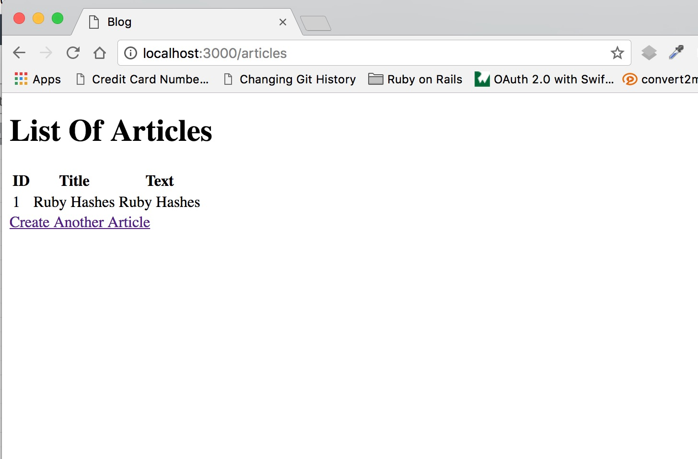

You can see the `Create Another Article` link that would allow you to create more Articles.

Also, add a link to list of articles from the `create` view:

``` html
1. <% # File: app/views/articles/create.html.erb %>
2. 
3. <h1>The new Article has been created.</h1>
4. <a href="/articles/new">Create Another One</a>
5. <div>
6.   <a href="/articles">List of Articles</a>
7. </div>
```

Do you see lines 5 till 7? This is a new link that would take you to the list of Articles.

Add the same link inside the page that renders the form to add a new Article:

``` html
 1. <% # File: app/views/articles/new.html.erb %>
 2. 
 3. <h1>Create a New Article</h1>
 4. <form method="post" action="/articles">
 5.   <input type="hidden" id="authenticity-token" name="authenticity_token" value="<%= form_authenticity_token %>"/>
 6.   <div>
 7.     <label for="title">Title:</label>
 8.     <input type="text" id="title" name="title" placeholder="Give Title of Article"/>
 9.   </div>
10. 
11.   <div>
12.     <label for="text">Text:</label>
13.     <textarea id="text" name="text" placeholder="Type in the text of the Article"></textarea>
14.   </div>
15. 
16.   <div>
17.     <button type="submit">Create Article</button>
18.   </div>
19. </form>
20. 
21. <div>
22.   <a href="/articles">List of Articles</a>
23. </div>
```

Also, add a link to the show page on each Article entry in the `index` view:

``` ruby
 1. <% # File: app/views/articles/index.html.erb %>
 2. 
 3. <h1>List Of Articles</h1>
 4. 
 5. <table>
 6.   <thead>
 7.     <tr><th>ID</th><th>Title</th><th>Text</th><th></th></tr>
 8.   </thead>
 9.   <tbody>
10.     <% @articles.each do |article| %>
11.       <tr><td><%= article.id %></td><td><%= article.title %></td><td><%= article.text %></td><td><a href="/articles/<%= article.id%>">Show</a></td></tr>
12.     <% end %>
13.   </tbody>
14. </table>
15. <div>
16.   <a href="/articles/new">Create Another Article</a>
17. </div>
```

Look how we have added the new cell content on line 11:
 
```
<td><a href="/articles/<%= article.id%>">Show</a></td>
```
We use the `article.id` and ERB to create the href dynamically.

Now, if you load the list of articles page, you will see a <u style="color: blue;">Show</u> link on every row on every Article. Clicking on this link will take you to the
corresponding show page.

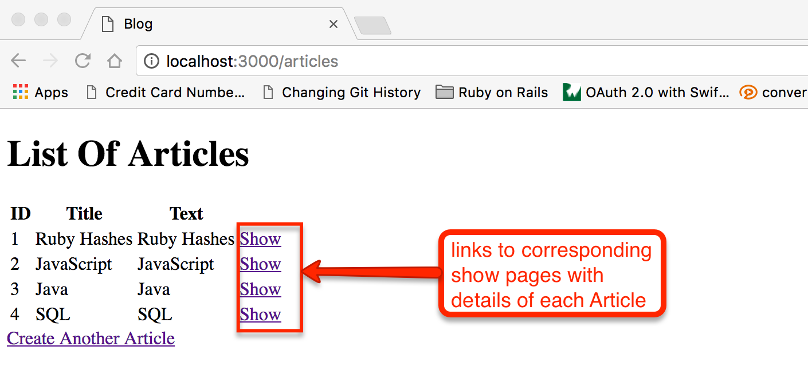

Finally, add two links inside the show view template. One that would take you to the create new article page and one that would take 
you to the list of articles page:

``` ruby
 1. <% # File: app/views/articles/show.html.erb %>
 2. 
 3. <div>
 4.   <strong>ID:</strong> <%= @article.id %>
 5. </div>
 6. 
 7. <div>
 8.   <strong>Title:</strong> <%= @article.title %>
 9. </div>
10. 
11. <hr/>
12. 
13. <div><strong>Text:</strong></div>
14. <div>
15.   <%= @article.text %>
16. </div>
17. 
18. <div>
19.   <a href="/articles/new">Create New Article</a>
20. </div>
21. 
22. <div>
23.   <a href="/articles">List of Articles</a>
24. </div>
```

Now, visiting a show page will look like this:


Now our application has the basic navigation links that are related to the functionality that we have already added, i.e. create, retrieve and retrieve many.

#### Update (U)

Now it's about time to allow for updates of the resources, i.e. for an update of a particular article. Updates work similar to create:

1. We need a page with a form. This form will display the details of the Article we are updating. It will allow us to update
those details and submit the changes in order for the Article to be updated into the database.
2. We need a page that will display a confirmation that the update has been executed successfully.


##### Routes

As earlier, we need to specify an endpoint that will allow us to fetch the page with the form to edit a specific resource, i.e.
a specific Article. What about `GET /articles/:id/edit`? It specifies the verb as `GET` since this request is only fetching
from server and does not change any of the state of the resource. Also, it has a placeholder for the specification of the 
id of the Article that we want to edit. And finally, the `edit` suffix in the path is necessary in order to avoid confusion
with the show endpoint (`GET /articles/:id` is used for displaying the details of an Article).

Let's add the entry in the routes.

``` ruby
1. # File: config/routes.rb
2. #
3. Rails.application.routes.draw do
4.   get 'articles/new'
5.   get 'articles/:id/edit', to: 'articles#edit'
6.   get 'articles/:id', to: 'articles#show'
7.   get 'articles', to: 'articles#index'
8.   post 'articles', to: 'articles#create'
9. end
```

The new line that we have added is line 5: `get 'articles/:id/edit', to: 'articles#edit'`. Let's run the command that will print the routes:

``` bash
blog $ bin/rake routes
Running via Spring preloader in process 42038
      Prefix Verb URI Pattern                  Controller#Action
articles_new GET  /articles/new(.:format)      articles#new
             GET  /articles/:id/edit(.:format) articles#edit
             GET  /articles/:id(.:format)      articles#show
    articles GET  /articles(.:format)          articles#index
             POST /articles(.:format)          articles#create
blog $
```

You can now see the entry `GET  /articles/:id/edit(.:format) articles#edit` which is the result of the line that we have just added.

##### `edit` Action

The `edit` action needs to return back the content for the user to edit the details of the article specified. Let's implement this action.

``` ruby
 1. # File: app/controllers/articles_controller.rb
 2. #
 3. class ArticlesController < ApplicationController
 4.   def new
 5.   end
 6. 
 7.   def create
 8.     article = Article.new
 9.     article.title = params[:title]
10.     article.text = params[:text]
11. 
12.     article.save
13.   end
14. 
15.   def show
16.     @article = Article.find(params[:id])
17.   end
18. 
19.   def index
20.     @articles = Article.all
21.   end
22. 
23.   def edit
24.     @article = Article.find(params[:id])
25.   end
26. end
```

We have added the lines 23 to 25. It is a very simple implementation. Like in the `show` action we just locate the Article given
its id. We instantiate the `@article` instance variable that will be used in the corresponding view template for the `edit` action.

##### `edit` View Template

Now, we have already learned that we need an `edit` view template. Let's create the file `app/views/articles/edit.html.erb` with the
following content:

``` ruby
 1. <% # File: app/views/articles/edit.html.erb %>
 2. 
 3. <h1>Update Article with ID: <%= @article.id %></h1>
 4. 
 5. <form method="post" action="/articles/<%= @article.id %>">
 6.   <input type="hidden" id="authenticity-token" name="authenticity_token" value="<%= form_authenticity_token %>"/>
 7.   <input type="hidden" name="_method" value="put"/>
 8.   <div>
 9.     <label for="title">Title:</label>
10.     <input type="text" id="title" name="title" placeholder="Give Title of Article" value="<%= @article.title %>"/>
11.   </div>
12. 
13.   <div>
14.     <label for="text">Text:</label>
15.     <textarea id="text" name="text" placeholder="Type in the text of the Article"><%= @article.text %></textarea>
16.   </div>
17. 
18.   <div>
19.     <button type="submit">Update Article</button>
20.   </div>
21. </form>
22. 
23. <div>
24.   <a href="/articles">List of Articles</a>
25. </div>
```

The above, is almost the same like the `new.html.erb` view template. However, there are some things that you need to be careful with.

1. Although the method declared at the `form` level is `post`, we use a `hidden` input field with name `_method` and value `put`. This is
to tell Rails that we want our `POST /articles/:id` request to be handled by the `PUT /articles/:id` endpoint instead. Why did we do that?
Why don't we just put `method="put"` at the form HTML tag? This is because the `method="put"` is not supported by all browsers and if we use it
the browser just sends a `GET` request and not a `PUT` request. In order to ask the browser to send form data to Rails server and still
handle the HTTP request as a `PUT` request, we use this trick with the `hidden` input field.
2. The `action` has the value `/articles/:id` because we need to tell Rails server which article we are interested to update.
3. The input fields now have values that they start with (line 10 and line 15). The values are taken from the values of the properties of the `@article` instance
variable that the `edit` action instantiates.

Cool! Try visiting the URL [http://localhost:3000/articles/1/edit](http://localhost:3000/articles/1/edit). Thus will open the page:

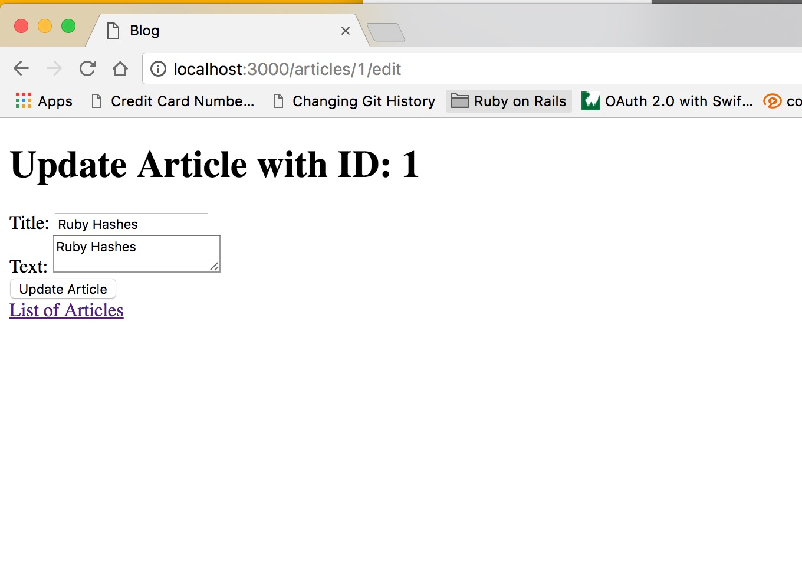

And this closes the first part of the update feature. It is the request for the page to fill in the new details of a specific article.

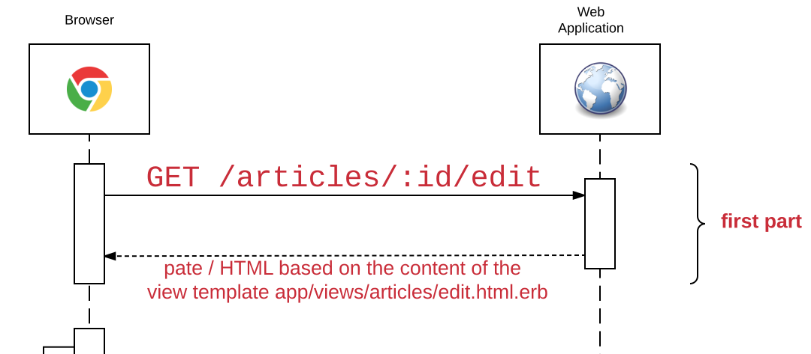

##### Let's Add Links To Edit Page

Before we continue with the second part of the page, let's add some links that will help us navigate to the edit pages of the articles.

Firstly, let's add edit links next to each <u style="color: blue;">Show</u> link in the page with the list of all articles. Here is the new version of the page:

``` html
 1. <% # File: app/views/articles/index.html.erb %>
 2. 
 3. <h1>List Of Articles</h1>
 4. 
 5. <table>
 6.   <thead>
 7.     <tr><th>ID</th><th>Title</th><th>Text</th><th></th></tr>
 8.   </thead>
 9.   <tbody>
10.     <% @articles.each do |article| %>
11.       <tr>
12.         <td><%= article.id %></td>
13.         <td><%= article.title %></td>
14.         <td><%= article.text %></td>
15.         <td>
16.           <a href="/articles/<%= article.id%>">Show</a>&nbsp;&nbsp;
17.           <a href="/articles/<%= article.id%>/edit">Edit</a>
18.         </td>
19.       </tr>
20.     <% end %>
21.   </tbody>
22. </table>
23. <div>
24.   <a href="/articles/new">Create Another Article</a>
25. </div>
```

Besides some code styling changes, the only new entry is on line 17. There is a new anchor that points to the edit page of the
corresponding Article. Hence, if you load the list of Articles page with some articles already in, you will see something like this:


Secondly, let's put an edit link inside the show page of each Article. Here is the new version of the `app/views/articles/show.html.erb`:

``` html
 1. <% # File: app/views/articles/show.html.erb %>
 2. 
 3. <div>
 4.   <strong>ID:</strong> <%= @article.id %>
 5. </div>
 6. 
 7. <div>
 8.   <strong>Title:</strong> <%= @article.title %>
 9. </div>
10. 
11. <hr/>
12. 
13. <div><strong>Text:</strong></div>
14. <div>
15.   <%= @article.text %>
16. </div>
17. 
18. <div>
19.   <a href="/articles/<%= @article.id %>/edit">Edit Article</a>
20. </div>
21. 
22. <div>
23.   <a href="/articles/new">Create New Article</a>
24. </div>
25. 
26. <div>
27.   <a href="/articles">List of Articles</a>
28. </div>
```

You can see the new link inserted in lines 18 to 20. 

Now, if you load the show page of an Article, you can see that it has a link to take you to its corresponding edit page:

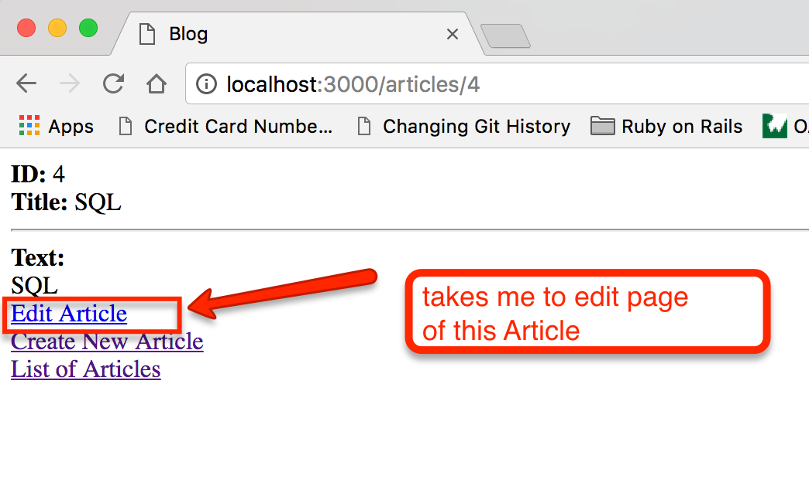

##### Submit Data For Update

With the navigation links in place, let us now implement the second part of the update. We need to send the form data of the edit page back to the Rails server.
And the Rails server needs to process it and return back the update confirmation page.

Do we have the correct endpoint set up? The route? We said that the form in edit view template will send a request to `/articles/:id`. Let's add the
correct entry in `config/routes.rb` file:

``` ruby
 1. # File: config/routes.rb
 2. #
 3. Rails.application.routes.draw do
 4.   get 'articles/new'
 5.   get 'articles/:id/edit', to: 'articles#edit'
 6.   get 'articles/:id', to: 'articles#show'
 7.   get 'articles', to: 'articles#index'
 8.   post 'articles', to: 'articles#create'
 9.   put 'articles/:id', to: 'articles#update'
10. end
```

It is the last line that we have added, line 9. It will be the endpoint for `PUT /articles/:id` and it will be handled by the `update` action of the
Articles controller. Let's run the command that will print all the routes that we now have in our configuration.

``` bash
blog $ bin/rake routes
Running via Spring preloader in process 6313
      Prefix Verb URI Pattern                  Controller#Action
articles_new GET  /articles/new(.:format)      articles#new
             GET  /articles/:id/edit(.:format) articles#edit
             GET  /articles/:id(.:format)      articles#show
    articles GET  /articles(.:format)          articles#index
             POST /articles(.:format)          articles#create
             PUT  /articles/:id(.:format)      articles#update
blog $
```

Do you see the last line printed? It is the one generated by the `config/routes.rb` line that we have just added.

##### `update` Action

Let's now implement the `update` action in Articles controller:

``` ruby
 1. # File: app/controllers/articles_controller.rb
 2. #
 3. class ArticlesController < ApplicationController
 4.   def new
 5.   end
 6. 
 7.   def create
 8.     article = Article.new
 9.     article.title = params[:title]
10.     article.text = params[:text]
11. 
12.     article.save
13.   end
14. 
15.   def show
16.     @article = Article.find(params[:id])
17.   end
18. 
19.   def index
20.     @articles = Article.all
21.   end
22. 
23.   def edit
24.     @article = Article.find(params[:id])
25.   end
26. 
27.   def update
28.     @article = Article.find(params[:id])
29.     @article.title = params[:title]
30.     @article.text = params[:text]
31. 
32.     @article.save
33.   end
34. end
```

Look at the lines 27 to 33. This is the implementation of the `update` action. It is pretty simple. It locates the article
specified by the `:id` parameter and then updates its properties according to the values of the parameters `:title` and `:text`.

Before we try this on our browser, let's also add the `app/views/articles/update.html.erb` file that will be the confirmation
page that the update has been completed.

##### `update` View Template

Create the file `app/views/articles/update.html.erb` with the following content:

``` html
 1. <% # File: app/views/articles/update.html.erb %>
 2. 
 3. <h1>Article with ID <%= @article.id %> has been updated</h1>
 4. 
 5. <div>
 6.   <a href="/articles/<%= @article.id %>">View Article Details</a>
 7. </div>
 8. 
 9. <div>
10.   <a href="/articles">List Of Articles</a>
11. </div>
```

This is a very simple page that informs us that the update has been carried out. Also, it has a link to visit the show page of the
article that has been updated. And another link to visit the list of articles page.

Now, all the functionality to update is there. We have implemented the second part too:


Try it on your browser. Make sure that you also watch the Rails server logs. You will learn a lot by just reading the logs.

The following video shows, in action, the whole functionality, that we have built so far.

<div id="media-container-video-Blog Demo Articles Management First Part">
  <a href="https://player.vimeo.com/video/218288893"></a>
</div>

#### Delete (D)

There is a last action that we need to implement. That of the deletion of an Article. 

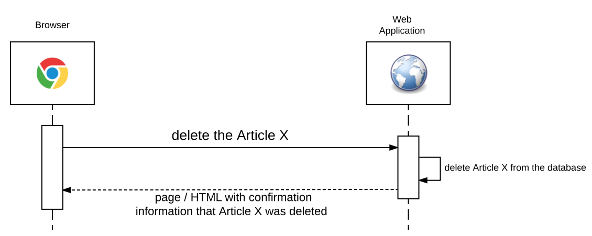

The client, i.e. browser, will need to send a request to Rails server specifying that they want a specific Article to be deleted. Then, Rails Server
will delete the article and return back a Web page with confirmation on deletion.

##### Route

Firstly, we need to specify the endpoint that Rails will accept Article deletion requests. Let's update our routes file:
 
``` ruby
 1. # File: config/routes.rb
 2. #
 3. Rails.application.routes.draw do
 4.   get 'articles/new'
 5.   get 'articles/:id/edit', to: 'articles#edit'
 6.   get 'articles/:id', to: 'articles#show'
 7.   get 'articles', to: 'articles#index'
 8.   post 'articles', to: 'articles#create'
 9.   put 'articles/:id', to: 'articles#update'
10.   delete 'articles/:id', to: 'articles#destroy'
11. end
```

It is line 10 that we have added. We tell Rails to accept HTTP verb `DELETE` on `/articles/:id` URI. We also tell it to handle this
HTTP request with the action `destroy` of the Articles controller. Why `destroy` and not `delete` This is a convention that Rails uses
for public controller actions that delete a resource.

##### `destroy` Action

So, let's now implement the `destroy` action in the Articles controller:

``` ruby
 1. # File: app/controllers/articles_controller.rb
 2. #
 3. class ArticlesController < ApplicationController
 4.   def new
 5.   end
 6. 
 7.   def create
 8.     article = Article.new
 9.     article.title = params[:title]
10.     article.text = params[:text]
11. 
12.     article.save
13.   end
14. 
15.   def show
16.     @article = Article.find(params[:id])
17.   end
18. 
19.   def index
20.     @articles = Article.all
21.   end
22. 
23.   def edit
24.     @article = Article.find(params[:id])
25.   end
26. 
27.   def update
28.     @article = Article.find(params[:id])
29.     @article.title = params[:title]
30.     @article.text = params[:text]
31. 
32.     @article.save
33.   end
34.   
35.   def destroy
36.     article = Article.find(params[:id])
37.     article.destroy
38.   end
39. end
```

The implementation of the `destroy` action, lines 35 to 38, is very simple. We locate the Article to delete from the database, and then
we call the method `#destroy` on that particular instance. This is the proper way to delete a record from the database and we will
explain more about this `ActiveRecord` statement in a later chapter that will deal with `ActiveRecord` API.

##### `destroy` View Template

Having implemented the `destroy` action, let's now implement the corresponding view template. This is the content of the file
`app/views/articles/destroy.html.erb` that you need to implement:

``` html
 1. <% # File: app/views/articles/destroy.html.erb %>
 2. 
 3. <h1>Article Has Been Deleted</h1>
 4. 
 5. <div>
 6.   <a href="/articles">List of Articles</a>
 7. </div>
 8. 
 9. <div>
10.   <a href="/articles/new">Create a New Article</a>
11. </div>
```

This is very simple. It only has the confirmation message that the Article has been deleted, and two links to ease your navigation in the application.

##### UI to Delete Article

We are almost ready to close the loop of the functionality to delete the Article, but we have not given user the way to actually invoke the deletion.
We will do that by adding this functionality next to the <u style="color: blue;">Show</u> and <u style="color: blue;">Edit</u> links in the list of articles page. So, basically, what we will build will
be this:

)
Let's do that. This is the new version of the `app/views/articles/index.html.erb` view template:

``` ruby
 1. <% # File: app/views/articles/index.html.erb %>
 2. 
 3. <h1>List Of Articles</h1>
 4. 
 5. <table>
 6.   <thead>
 7.     <tr><th>ID</th><th>Title</th><th>Text</th><th></th></tr>
 8.   </thead>
 9.   <tbody>
10.     <% @articles.each do |article| %>
11.       <tr>
12.         <td><%= article.id %></td>
13.         <td><%= article.title %></td>
14.         <td><%= article.text %></td>
15.         <td>
16.           <a href="/articles/<%= article.id%>">Show</a>&nbsp;&nbsp;
17.           <a href="/articles/<%= article.id%>/edit">Edit</a> &nbsp;&nbsp;
18.           <form method="post" action="/articles/<%= article.id %>" style="display: inline;">
19.             <input type="hidden" name="_method" value="delete"/>
20.             <input type="hidden" name="authenticity_token" value="<%= form_authenticity_token %>"/>
21.             <button type="submit">Delete</button>
22.           </form>
23.         </td>
24.       </tr>
25.     <% end %>
26.   </tbody>
27. </table>
28. <div>
29.   <a href="/articles/new">Create Another Article</a>
30. </div>
```

The new lines here are lines 18 to 22. For each row, i.e. for each Article in the table with Articles, we have
added a form that will issue a `POST` request to `/articles/:id`. However, we use the trick of the hidden field with name `_method` and
value `delete` to tell Rails to handle it as a `DELETE` request. Also, dont' forget that we need to make sure we
include a hidden field with an authenticity token, which makes sure that our page will not have any security issues. The button `Delete`
will post the data to the server.

Perfect! We have now closed the loop of the delete functionality too:


The following video demonstrates the delete feature:

<div id="media-container-video-Blog Demo Articles Management First Part">
  <a href="https://player.vimeo.com/video/218327416"></a>
</div>

## Integrate Twitter Bootstrap

We have gone through all the basic components of Rails by building these two sample applications. The `hello_rails` and the `blog` with Articles application.
Before, we continue, let's see how we can make this blog application look a little bit nicer. We will integrate it with Twitter Bootstrap.

### Twitter Bootstrap Integration Gem

The easiest way that you can take to integrate Twitter Bootstrap with Rails is via the gem [bootstrap-sass](https://github.com/twbs/bootstrap-sass).

1. Open your Gemfile and add the following two gems into your gem dependencies:

 ``` ruby
 gem 'jquery-rails'
 gem 'bootstrap-sass'
 ```
preferably before `gem 'sass-rails'` line. 
1. Run `bundle`.
1. Rename the file `app/assets/stylesheets/application.css` to `app/assets/stylesheets/application.scss`. In other words, you turn this file
from a CSS file to a SCSS file that can now include SASS commands.
1. Update the content of the `app/assets/stylesheets/application.scss` file to be as follows:
    
 ``` scss
 1. // File: app/assets/stylesheets/application.scss
 2. //
 3. @import "bootstrap-sprockets";
 4. @import "bootstrap";
 ```
1. Open file `app/assets/javascripts/application.js` and add the following lines: 

 ``` javascript
 //= require jquery
 //= require bootstrap-sprockets
 ``` 
so that your final `application.js` file needs to be something like this:
 
 ``` javascript
 //= require jquery
 //= require bootstrap-sprockets
 //= require rails-ujs
 //= require turbolinks
 //= require_tree .
 ```
1. Restart your server, with `bin/rails server`. This will take into account the changes you did above.
 
Now that you have restarted you server, visit the page [http://localhost:3000/articles](http://localhost:3000/articles). Do you see any difference
in style? It is the Twitter Bootstrap default style applied.


Now, go ahead and apply your Twitter Bootstrap knowledge to make this project, the `blog`, looking nice and good. For example, this is how my list of articles takes
advantage of Twitter Bootstrap tables:

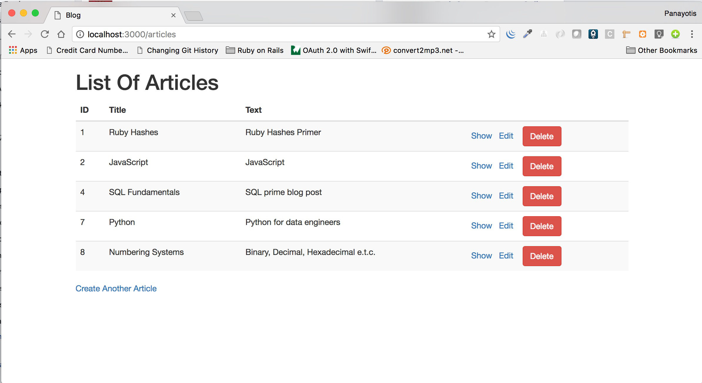

And this is the form to create a new Article, enhanced with the Twitter Bootstrap form related classes:

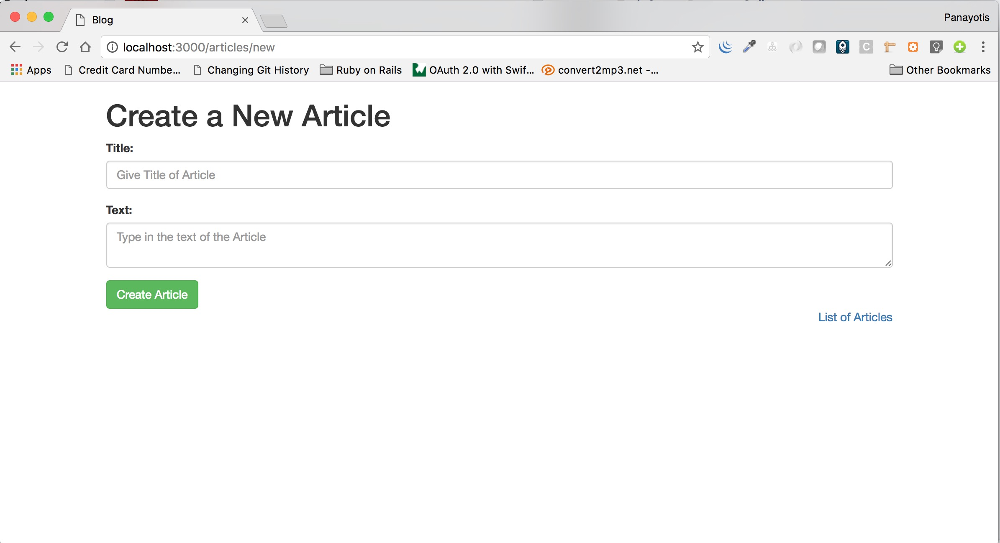

## Reminder for Github

Don't forget to commit all your work and push it to your remote Github repository.

## Deploy to Heroku
 
So far so good. We have our first Rails application that can run locally and it is integrated with Twitter Bootstrap. How can we deploy that to a public Web server?
Here is where [Heroku](heroku.com) comes into the picture.

Let's see how we can install our blog into Heroku.

### Heroku Login

Run the command `heroku login` and give your heroku credentials. This will allow your local machine to have a login status to your Heroku account.

### Add PostgreSQL Support

Heroku does not support SQLite database. It supports PostgreSQL and for that reason, we will need to install the corresponding gem so that we can
have PostgreSQL support in our application.

Hence, go ahead and add the following lines to your `Gemfile`:

``` ruby
gem 'pg', group: :production
```

Also, alter the `Gemfile` that refers to `sqlite3` to be included only in `development` and `test` environments:

``` ruby
gem 'sqlite3', group: [:development, :test]
```

Then, run `bundle` to bring in the `pg` (postgres gem) in. We have told Rails that the gem `pg`, for PostgreSQL support, will only be used for the
`production` environment and not for development. This is necessary for Heroku deployment.

> **Important:** Our recommendation is that you install PostgreSQL on your local machine too and do your development against PostgreSQL too.
So that your development and production environments match as much as possible. In the next chapter we will show you how you can 
remove the integration with SQLite and PostgreSQL for your local machine too.

Next, you will need to edit your `config/database.yml` file to have the correct settings for the `production` environment:

``` yml
 1. # SQLite version 3.x
 2. #   gem install sqlite3
 3. #
 4. #   Ensure the SQLite 3 gem is defined in your Gemfile
 5. #   gem 'sqlite3'
 6. #
 7. default: &default
 8.   adapter: sqlite3
 9.   pool: <%= ENV.fetch("RAILS_MAX_THREADS") { 5 } %>
10.   timeout: 5000
11. 
12. development:
13.   <<: *default
14.   database: db/development.sqlite3
15. 
16. # Warning: The database defined as "test" will be erased and
17. # re-generated from your development database when you run "rake".
18. # Do not set this db to the same as development or production.
19. test:
20.   <<: *default
21.   database: db/test.sqlite3
22. 
23. production:
24.   <<: *default
25.   adapter: postgresql
26.   encoding: unicode
27.   database: blog_production
28.   username: blog
29.   password: <%= ENV['BLOG_DATABASE_PASSWORD'] %>
```

Watch out for the lines that deal with the `production`, lines 23 to 29. These are the necessary settings for your blog application
to run on Heroku production environment.

### Specify Ruby Version In Your Gemfile

Heroku needs to know which version your application will be using in production. It does that by reading the corresponding
statement inside the `Gemfile`. Add the following, at the end of your `Gemfile`:

``` ruby
ruby '2.3.3'
```

### Commit All Your Changes

Commit all your changes. 

### Create Heroku Application

Create your Heroku application. Use a unique name for your application. This is what I did:

``` bash
blog $ heroku create panosm-blog
Creating ⬢ panosm-blog... done
https://panosm-blog.herokuapp.com/ | https://git.heroku.com/panosm-blog.git
blog $
```

### Confirm Remote

Run the following command to confirm that a new remote has been added to your project:

``` bash
blog $ git remote -v
heroku  https://git.heroku.com/panosm-blog.git (fetch)
heroku  https://git.heroku.com/panosm-blog.git (push)
origin  git@github.com:pmatsinopoulos/blog.git (fetch)
origin  git@github.com:pmatsinopoulos/blog.git (push)
blog $
```

Do you see the `heroku` remote. This is where you will be pushing your code whenever you will be deploying to production. This is the next step:

### Deploy Your Application

Deploy your application. Heroku is heavily integrated with `git` and this is how you deploy your application to Heroku:

``` bash
blog $ git push heroku master
Counting objects: 133, done.
Delta compression using up to 8 threads.
Compressing objects: 100% (116/116), done.
Writing objects: 100% (133/133), 26.75 KiB | 0 bytes/s, done.
Total 133 (delta 24), reused 0 (delta 0)
remote: Compressing source files... done.
remote: Building source:
remote: 
remote:  !     Warning: Multiple default buildpacks reported the ability to handle this app. The first buildpack in the list below will be used.
remote:                         Detected buildpacks: Ruby,Node.js
remote:                         See https://devcenter.heroku.com/articles/buildpacks#buildpack-detect-order
remote: -----> Ruby app detected
remote: -----> Compiling Ruby/Rails
remote: -----> Using Ruby version: ruby-2.3.3
remote: -----> Installing dependencies using bundler 1.13.7
remote:        Running: bundle install --without development:test --path vendor/bundle --binstubs vendor/bundle/bin -j4 --deployment
remote:        Warning: the running version of Bundler (1.13.7) is older than the version that created the lockfile (1.14.6). We suggest you upgrade to the latest version of Bundler by running `gem install bundler`.
remote:        Fetching gem metadata from https://rubygems.org/.........
remote:        Fetching version metadata from https://rubygems.org/..
remote:        Fetching dependency metadata from https://rubygems.org/.
remote:        Installing rake 12.0.0
remote:        Installing i18n 0.8.1
remote:        Installing concurrent-ruby 1.0.5
remote:        Installing minitest 5.10.2
remote:        Installing thread_safe 0.3.6
remote:        Installing builder 3.2.3
remote:        Installing erubi 1.6.0
remote:        Installing mini_portile2 2.1.0
remote:        Installing websocket-extensions 0.1.2
remote:        Installing nio4r 2.0.0 with native extensions
remote:        Installing rack 2.0.2
remote:        Installing mime-types-data 3.2016.0521
remote:        Installing arel 8.0.0
remote:        Installing execjs 2.7.0
remote:        Installing coffee-script-source 1.12.2
remote:        Installing sass 3.4.23
remote:        Installing method_source 0.8.2
remote:        Installing thor 0.19.4
remote:        Installing multi_json 1.12.1
remote:        Installing pg 0.20.0 with native extensions
remote:        Installing puma 3.8.2 with native extensions
remote:        Using bundler 1.13.7
remote:        Installing tilt 2.0.7
remote:        Installing turbolinks-source 5.0.3
remote:        Installing nokogiri 1.7.2 with native extensions
remote:        Installing tzinfo 1.2.3
remote:        Installing websocket-driver 0.6.5 with native extensions
remote:        Installing mime-types 3.1
remote:        Installing rack-test 0.6.3
remote:        Installing sprockets 3.7.1
remote:        Installing autoprefixer-rails 7.1.1
remote:        Installing uglifier 3.2.0
remote:        Installing coffee-script 2.4.1
remote:        Installing turbolinks 5.0.1
remote:        Installing activesupport 5.1.1
remote:        Installing mail 2.6.5
remote:        Installing bootstrap-sass 3.3.7
remote:        Installing globalid 0.4.0
remote:        Installing activemodel 5.1.1
remote:        Installing jbuilder 2.6.4
remote:        Installing activejob 5.1.1
remote:        Installing activerecord 5.1.1
remote:        Installing rails-dom-testing 2.0.3
remote:        Installing loofah 2.0.3
remote:        Installing rails-html-sanitizer 1.0.3
remote:        Installing actionview 5.1.1
remote:        Installing actionpack 5.1.1
remote:        Installing actionmailer 5.1.1
remote:        Installing actioncable 5.1.1
remote:        Installing railties 5.1.1
remote:        Installing sprockets-rails 3.2.0
remote:        Installing coffee-rails 4.2.1
remote:        Installing rails 5.1.1
remote:        Installing sass-rails 5.0.6
remote:        Installing jquery-rails 4.3.1
remote:        Bundle complete! 19 Gemfile dependencies, 55 gems now installed.
remote:        Gems in the groups development and test were not installed.
remote:        Bundled gems are installed into ./vendor/bundle.
remote:        Bundle completed (23.36s)
remote:        Cleaning up the bundler cache.
remote:        Warning: the running version of Bundler (1.13.7) is older than the version that created the lockfile (1.14.6). We suggest you upgrade to the latest version of Bundler by running `gem install bundler`.
remote: -----> Installing node-v6.10.0-linux-x64
remote: -----> Detecting rake tasks
remote: -----> Preparing app for Rails asset pipeline
remote:        Running: rake assets:precompile
remote:        Yarn executable was not detected in the system.
remote:        Download Yarn at https://yarnpkg.com/en/docs/install
remote:        I, [2017-05-21T17:12:41.325166 #1262]  INFO -- : Writing /tmp/build_00ec1f5ac143f2da5c3d6a880f37a9af/public/assets/application-902d5dce6d9085afdce5ebe97998082799250ff7a4dc426f1236cf2f13795551.js
remote:        I, [2017-05-21T17:12:41.325793 #1262]  INFO -- : Writing /tmp/build_00ec1f5ac143f2da5c3d6a880f37a9af/public/assets/application-902d5dce6d9085afdce5ebe97998082799250ff7a4dc426f1236cf2f13795551.js.gz
remote:        I, [2017-05-21T17:12:48.473756 #1262]  INFO -- : Writing /tmp/build_00ec1f5ac143f2da5c3d6a880f37a9af/public/assets/application-895ae8ca2b3268d6153266e6779a6d89796096e2da27247f1558a72aa570cff9.css
remote:        I, [2017-05-21T17:12:48.474431 #1262]  INFO -- : Writing /tmp/build_00ec1f5ac143f2da5c3d6a880f37a9af/public/assets/application-895ae8ca2b3268d6153266e6779a6d89796096e2da27247f1558a72aa570cff9.css.gz
remote:        I, [2017-05-21T17:12:48.474934 #1262]  INFO -- : Writing /tmp/build_00ec1f5ac143f2da5c3d6a880f37a9af/public/assets/bootstrap/glyphicons-halflings-regular-13634da87d9e23f8c3ed9108ce1724d183a39ad072e73e1b3d8cbf646d2d0407.eot
remote:        I, [2017-05-21T17:12:48.475451 #1262]  INFO -- : Writing /tmp/build_00ec1f5ac143f2da5c3d6a880f37a9af/public/assets/bootstrap/glyphicons-halflings-regular-13634da87d9e23f8c3ed9108ce1724d183a39ad072e73e1b3d8cbf646d2d0407.eot.gz
remote:        I, [2017-05-21T17:12:48.476327 #1262]  INFO -- : Writing /tmp/build_00ec1f5ac143f2da5c3d6a880f37a9af/public/assets/bootstrap/glyphicons-halflings-regular-fe185d11a49676890d47bb783312a0cda5a44c4039214094e7957b4c040ef11c.woff2
remote:        I, [2017-05-21T17:12:48.477181 #1262]  INFO -- : Writing /tmp/build_00ec1f5ac143f2da5c3d6a880f37a9af/public/assets/bootstrap/glyphicons-halflings-regular-a26394f7ede100ca118eff2eda08596275a9839b959c226e15439557a5a80742.woff
remote:        I, [2017-05-21T17:12:48.477940 #1262]  INFO -- : Writing /tmp/build_00ec1f5ac143f2da5c3d6a880f37a9af/public/assets/bootstrap/glyphicons-halflings-regular-e395044093757d82afcb138957d06a1ea9361bdcf0b442d06a18a8051af57456.ttf
remote:        I, [2017-05-21T17:12:48.478416 #1262]  INFO -- : Writing /tmp/build_00ec1f5ac143f2da5c3d6a880f37a9af/public/assets/bootstrap/glyphicons-halflings-regular-e395044093757d82afcb138957d06a1ea9361bdcf0b442d06a18a8051af57456.ttf.gz
remote:        I, [2017-05-21T17:12:48.479191 #1262]  INFO -- : Writing /tmp/build_00ec1f5ac143f2da5c3d6a880f37a9af/public/assets/bootstrap/glyphicons-halflings-regular-42f60659d265c1a3c30f9fa42abcbb56bd4a53af4d83d316d6dd7a36903c43e5.svg
remote:        I, [2017-05-21T17:12:48.479659 #1262]  INFO -- : Writing /tmp/build_00ec1f5ac143f2da5c3d6a880f37a9af/public/assets/bootstrap/glyphicons-halflings-regular-42f60659d265c1a3c30f9fa42abcbb56bd4a53af4d83d316d6dd7a36903c43e5.svg.gz
remote:        Asset precompilation completed (13.25s)
remote:        Cleaning assets
remote:        Running: rake assets:clean
remote: 
remote: ###### WARNING:
remote:        No Procfile detected, using the default web server.
remote:        We recommend explicitly declaring how to boot your server process via a Procfile.
remote:        https://devcenter.heroku.com/articles/ruby-default-web-server
remote: 
remote: -----> Discovering process types
remote:        Procfile declares types     -> (none)
remote:        Default types for buildpack -> console, rake, web, worker
remote: 
remote: -----> Compressing...
remote:        Done: 36.4M
remote: -----> Launching...
remote:        Released v5
remote:        https://panosm-blog.herokuapp.com/ deployed to Heroku
remote: 
remote: Verifying deploy... done.
To https://git.heroku.com/panosm-blog.git
 * [new branch]      master -> master
blog $
```

The above is the output of the deployment, but your deployment is missing the creation and initialization of the database.

### Initialize Database

Run the following command to initialize your database on production:

``` bash
blog $ heroku run rake db:migrate --app panosm-blog
Running rake db:migrate on ⬢ panosm-blog... up, run.2256 (Free)
D, [2017-05-21T17:15:31.313580 #4] DEBUG -- :    (14.4ms)  CREATE TABLE "schema_migrations" ("version" character varying NOT NULL PRIMARY KEY)
D, [2017-05-21T17:15:31.329135 #4] DEBUG -- :    (11.7ms)  CREATE TABLE "ar_internal_metadata" ("key" character varying NOT NULL PRIMARY KEY, "value" character varying, "created_at" timestamp NOT NULL, "updated_at" timestamp NOT NULL)
D, [2017-05-21T17:15:31.331039 #4] DEBUG -- :    (0.8ms)  SELECT pg_try_advisory_lock(7544364894950660595);
D, [2017-05-21T17:15:31.348311 #4] DEBUG -- :    (1.0ms)  SELECT "schema_migrations"."version" FROM "schema_migrations" ORDER BY "schema_migrations"."version" ASC
I, [2017-05-21T17:15:31.349801 #4]  INFO -- : Migrating to CreateArticles (20170519062431)
D, [2017-05-21T17:15:31.352642 #4] DEBUG -- :    (0.6ms)  BEGIN
== 20170519062431 CreateArticles: migrating ===================================
-- create_table(:articles)
D, [2017-05-21T17:15:31.361801 #4] DEBUG -- :    (7.4ms)  CREATE TABLE "articles" ("id" bigserial primary key, "title" character varying, "text" text, "created_at" timestamp NOT NULL, "updated_at" timestamp NOT NULL)
   -> 0.0090s
== 20170519062431 CreateArticles: migrated (0.0091s) ==========================

D, [2017-05-21T17:15:31.367788 #4] DEBUG -- :   SQL (1.0ms)  INSERT INTO "schema_migrations" ("version") VALUES ($1) RETURNING "version"  [["version", "20170519062431"]]
D, [2017-05-21T17:15:31.371033 #4] DEBUG -- :    (2.9ms)  COMMIT
D, [2017-05-21T17:15:31.377678 #4] DEBUG -- :   ActiveRecord::InternalMetadata Load (0.8ms)  SELECT  "ar_internal_metadata".* FROM "ar_internal_metadata" WHERE "ar_internal_metadata"."key" = $1 LIMIT $2  [["key", "environment"], ["LIMIT", 1]]
D, [2017-05-21T17:15:31.386638 #4] DEBUG -- :    (0.5ms)  BEGIN
D, [2017-05-21T17:15:31.388712 #4] DEBUG -- :   SQL (0.8ms)  INSERT INTO "ar_internal_metadata" ("key", "value", "created_at", "updated_at") VALUES ($1, $2, $3, $4) RETURNING "key"  [["key", "environment"], ["value", "production"], ["created_at", "2017-05-21 17:15:31.386938"], ["updated_at", "2017-05-21 17:15:31.386938"]]
D, [2017-05-21T17:15:31.390494 #4] DEBUG -- :    (1.4ms)  COMMIT
D, [2017-05-21T17:15:31.391476 #4] DEBUG -- :    (0.7ms)  SELECT pg_advisory_unlock(7544364894950660595)
blog $
```

The above confirms that you have initialized the database successfully.

### Restart Your Web Server

Now restart your Web server on production so that it takes the changes in the database:

``` bash
blog $ heroku ps:restart --app panosm-blog
Restarting dynos on ⬢ panosm-blog... done
```

### Visit Web App and Create Articles

Now visit the Web application URL and create some articles. Note that your production database does not include the articles that you have
created locally.

Note that opening the root page of your Web application it fails, because we have not created a welcome page (like we did for `hello_rails` application).
The creation of the welcome page is going to be part of your task for this chapter. But, until then, you can visit the `/articles` path to see the list
of Articles and click on create to create new Articles.

This is how my production application looks like:

<div id="media-container-video-Blog Demo Articles Management First Part">
  <a href="https://player.vimeo.com/video/218375919"></a>
</div>

## Closing Note

That was a walk through the main components of Rails and how you can develop a very basic application with Rails. In the next chapter we will polish it
and make it be more *Railsish*, i.e. to follow better practices for Rails. 
